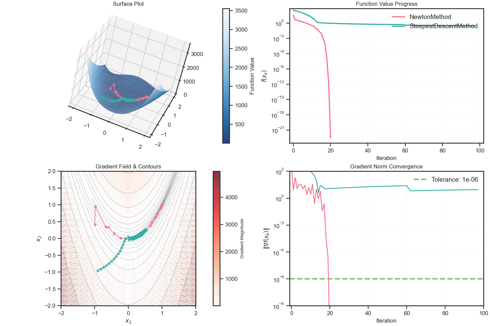
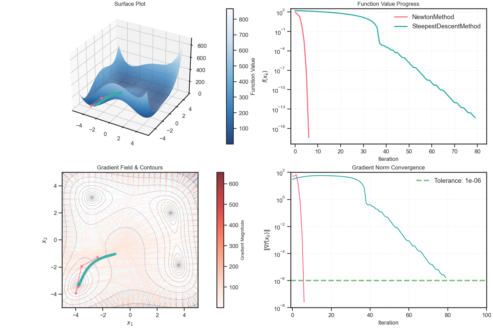
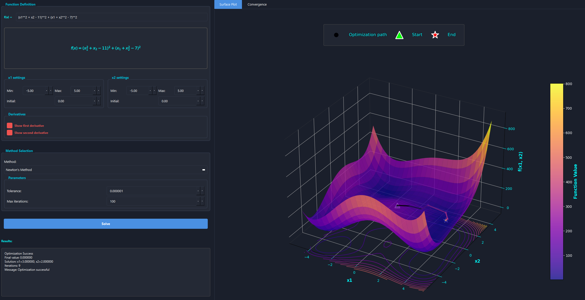

# Numerical Optimization Methods

A Python implementation of numerical optimization and root-finding algorithms with interactive visualizations.




## Quick Start

```bash
# Install dependencies
pip install -r requirements.txt

# Run optimization example
python minimize.py --methods newton steepest --function himmelblau --x0 -1.0 -1.0

# Run root finding example
python find_roots.py --methods newton secant --function quadratic --x0 1.5
```

## Project Structure

```
numerical_optimization/
├── algorithms/    # Implementation of numerical methods
├── configs/       # Configuration files for custom runs
├── plot/          # Visualization utilities
├── tests/         # Unit tests
├── ui/            # UI components (in-progress)
└── utils/         # Helper functions and utilities
```

### Optimization

```bash
# Compare multiple methods
python minimize.py --methods newton bfgs steepest --function rosenbrock --x0 -1.0 -1.0

# Use configuration file
python minimize.py --config configs/optimization.yaml

# Save results to Excel
python minimize.py --methods newton steepest --function himmelblau --x0 -1.0 -1.0 --save results/
```

Example output for Rosenbrock function:
```
Optimization Results Summary:
--------------------------------------------------
Newton's Method:
  Iterations: 21
  Final x: [1.00000000, 1.00000000]
  Final f(x): 2.67616120e-23
  Final |∇f(x)|: 1.75e-11
  Converged: True

Steepest Descent Method:
  Iterations: 100
  Final x: [0.52740776, 0.26087755]
  Final f(x): 2.53208078e-01
  Final |∇f(x)|: 4.39e+00
  Converged: True
```

Example output for Himmelblau function:
```
Running optimizations...
Newton's Method: Converged
Steepest Descent Method: Converged

Optimization Results Summary:
--------------------------------------------------
Newton's Method:
  Iterations: 7
  Final x: [-3.77931025, -3.28318599]
  Final f(x): 3.95260010e-18
  Final |∇f(x)|: 2.54e-08
  Converged: True

Steepest Descent Method:
  Iterations: 82
  Final x: [-3.77931025, -3.28318599]
  Final f(x): 1.69009245e-15
  Final |∇f(x)|: 6.72e-07
  Converged: True
```

Optimization UI:



To run the UI, use the following command:

```bash
python ui.py
```

> [!WARNING]
> The UI is currently in-progress and may not work as expected.


### Root Finding

```bash
# Compare root finding methods
python find_roots.py --methods newton secant --function quadratic --x0 1.5

# Use all available methods
python find_roots.py --all --function cubic --x0 1.0
```

## Visualization

The package provides interactive visualizations for both optimization and root-finding:
- Function surface/contour plots
- Optimization paths
- Convergence analysis
- Error tracking

## Contributing

Contributions are welcome! Please see [CONTRIBUTING.md](CONTRIBUTING.md) for guidelines.

## License

MIT License - see [LICENSE](LICENSE) for details.