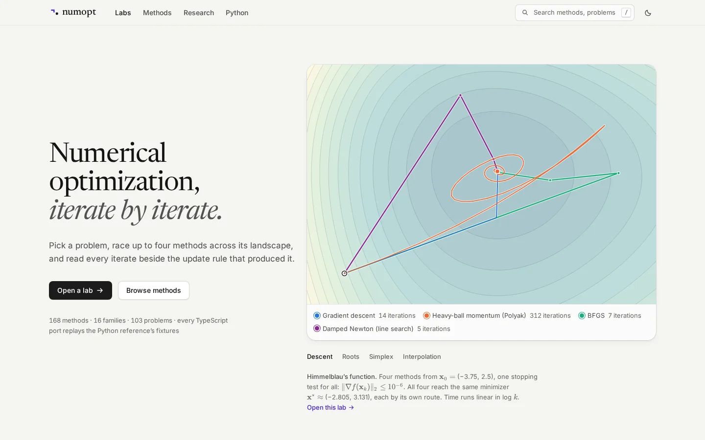
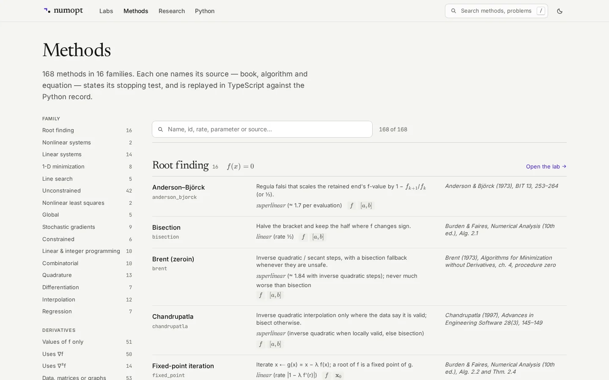
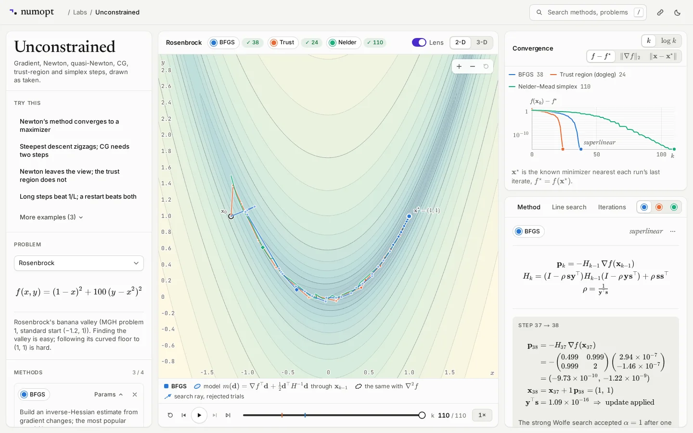
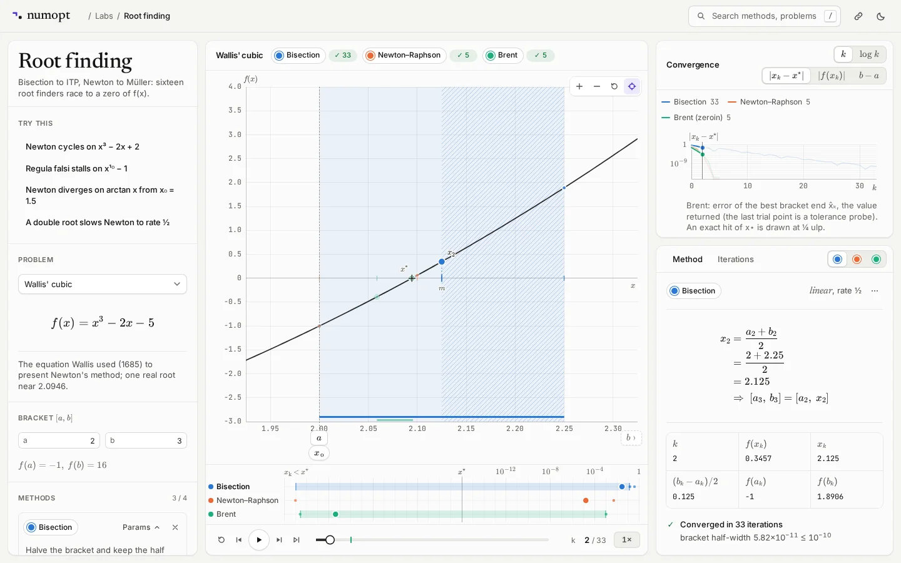
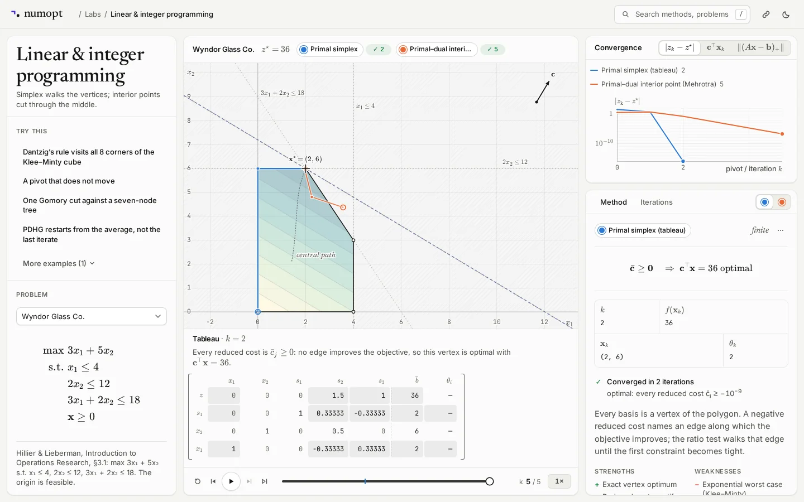
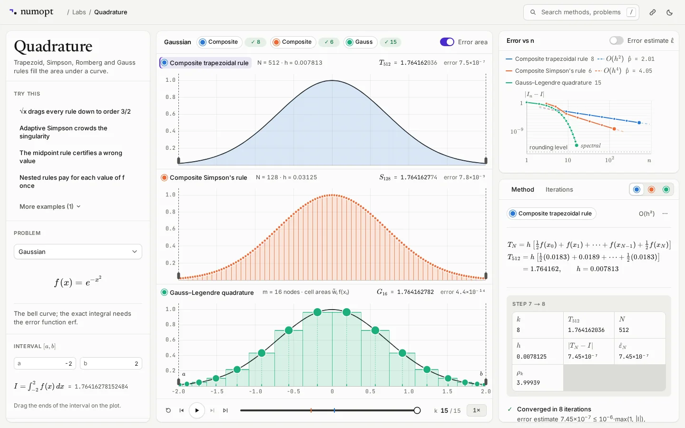
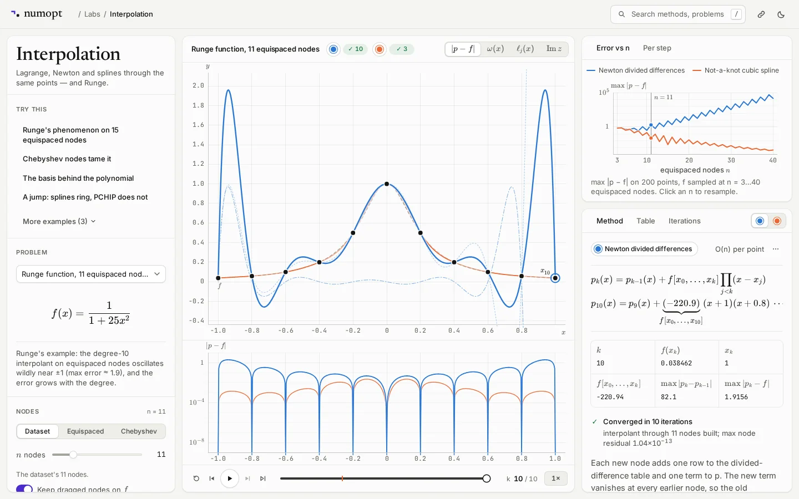
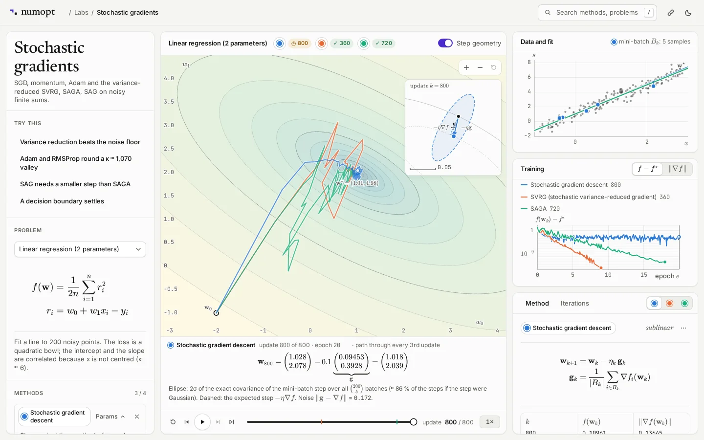

> [!IMPORTANT]
> **This repository has moved to [ML-Dev-Hub/numopt](https://github.com/ML-Dev-Hub/numopt).**
>
> This copy is archived and read-only. It is kept for reference and existing citations, and receives
> no further updates. Please open issues, pull requests and discussions in the new repository, and
> install from there:
>
> ```bash
> pip install git+https://github.com/ML-Dev-Hub/numopt
> git remote set-url origin https://github.com/ML-Dev-Hub/numopt.git   # update an existing clone
> ```

<p align="center">
  <picture>
    <source media="(prefers-color-scheme: dark)" srcset="docs/brand/logo/wordmark-dark.svg">
    
  </picture>
</p>

<p align="center"><em>Numerical optimization, iterate by iterate.</em></p>

<p align="center">
  <a href="https://github.com/saeedahmadicp/numopt/actions/workflows/ci.yml"></a>
  
  
  
  <a href="CITATION.cff"></a>
</p>

<p align="center">
  <a href="https://saeedahmadicp.github.io/numopt/">Interactive labs</a> ·
  <a href="#quick-start">Quick start</a> ·
  <a href="#whats-inside">Methods</a> ·
  <a href="#gallery">Gallery</a> ·
  <a href="#research">Research</a> ·
  <a href="docs/architecture.md">Architecture</a> ·
  <a href="#citing">Cite</a>
</p>

<p align="center">
  <picture>
    <source media="(max-width: 640px) and (prefers-color-scheme: dark)" srcset="docs/brand/readme-hero/hero-stacked-animated-dark.svg">
    <source media="(max-width: 640px)" srcset="docs/brand/readme-hero/hero-stacked-animated-light.svg">
    <source media="(prefers-color-scheme: dark)" srcset="docs/brand/readme-hero/hero-animated-dark.svg">
    
  </picture>
</p>
<p align="center"><sub>Real traces from <code>numopt.run</code>. One stopping test for all four methods:
the first iterate with ‖∇<i>f</i>(<b>x</b><sub>k</sub>)‖₂ ≤ 10⁻⁸, within a 20,000-iteration budget;
every other parameter is the registered default. ◆ marks <b>x</b><sub>k</sub> at <i>k</i> = 10, 10², 10³, 10⁴ ·
<a href="docs/brand/scripts/make_hero.py">reproduce this figure</a></sub></p>

<p align="center"><b><a href="https://saeedahmadicp.github.io/numopt/">Open the interactive labs →</a></b></p>

**numopt** — 168 numerical methods, each cited to its algorithm and equation, tested against an
oracle, and replayable iterate by iterate in the browser.

From bisection to SQP and from Simpson's rule to SAGA, every method states its stopping test,
counts every function, gradient and Hessian evaluation, and records each iterate in a trace that
you can inspect, plot or replay. The Python package is the reference. The web portal holds 16
interactive labs, one per family, and a TypeScript port of every method that reproduces the Python
fixtures iterate by iterate. Nine research studies test newer methods against the classics on the
same problems and budgets.

## Quick start

```bash
pip install git+https://github.com/saeedahmadicp/numopt
```

> [!NOTE]
> Install from git. The name `numopt` on PyPI belongs to a different project (NumOpt 0.0.7, an
> engineering-design package), so `pip install numopt` installs the wrong package. This package
> still imports as `import numopt`.

```python
import numopt

res = numopt.run("bfgs", numopt.problems.get("rosenbrock"), x0=[-1.2, 1.0])
print(res.converged, res.n_iter, res.message)
```

```text
True 38 ‖∇f‖∞ = 1.31e-11 ≤ gtol
```

The same run from the command line, with every iterate:

```bash
numopt run bfgs rosenbrock --trace     # one row per iterate, k = 0 … 38
numopt list --family roots             # the 16 root finders and their convergence orders
numopt problems --kind lp              # the 10 linear programs in the problem library
```

The labs run locally from [`web/`](web/) (Node 24; no Python needed to browse):

```bash
cd web && npm install && npm run dev   # http://localhost:5173
```

<details>
<summary><b>Compare methods on equal terms</b></summary>

Give each method the same tolerance and read the counts from the `Result`:

```python
import numopt

p = numopt.problems.get("rosenbrock")
print(f"{'method':18} {'iterations':>10}  {'f(x)':>9}  stop")
for m, budget in [
    ("gradient_descent", 20_000),
    ("momentum", 20_000),
    ("bfgs", 500),
    ("pure_newton", 100),
]:
    r = numopt.run(m, p, x0=[-1.2, 1.0], gtol=1e-8, max_iter=budget)
    print(f"{m:18} {r.n_iter:>10,}  {r.fun:9.1e}  {'converged' if r.converged else 'budget'}")
```

```text
method             iterations       f(x)  stop
gradient_descent       15,231    1.2e-16  converged
momentum                4,128    1.2e-16  converged
bfgs                       38    4.7e-24  converged
pure_newton                 6    3.4e-20  converged
```

`gtol` tests ‖∇f‖₂ in the first-order methods and ‖∇f‖∞ in BFGS and Newton; on this problem both
tests stop at the same iterate, which is why these counts match the hero figure. At the registered
defaults (a 5,000-iteration budget), `numopt compare rosenbrock gradient_descent bfgs` reports that
gradient descent did **not** converge: ‖∇f(x)‖ = 0.00117 > gtol.

</details>

## What's inside

**168 methods in 16 families, 103 test problems.** `numopt list` prints every method with its
convergence order; `numopt problems` lists the 103 test problems. Each family has a lab:

| Family | Methods | Examples | Lab |
|:--|--:|:--|:--|
| Root finding | 16 | Bisection, Newton–Raphson, Secant, Brent (zeroin), ITP, Halley, +10 more | [open](https://saeedahmadicp.github.io/numopt/#/lab/roots) |
| Nonlinear systems | 2 | Newton's method for systems, Broyden's method (good Broyden) | [open](https://saeedahmadicp.github.io/numopt/#/lab/systems) |
| Linear systems | 14 | Gaussian elimination, LU, Cholesky, QR (Householder), Jacobi, SOR, conjugate gradient, GMRES, +6 more | [open](https://saeedahmadicp.github.io/numopt/#/lab/linalg) |
| 1-D minimization | 8 | Golden-section search, Fibonacci search, Brent's method (minimization), +5 more | [open](https://saeedahmadicp.github.io/numopt/#/lab/scalar) |
| Line search | 5 | Backtracking (Armijo), Strong Wolfe (bracket + zoom), Goldstein (bisection), +2 more | [open](https://saeedahmadicp.github.io/numopt/#/lab/line-search) |
| Unconstrained | 42 | Gradient descent, Nesterov accelerated gradient, Adam, BFGS, L-BFGS, trust region (Steihaug–Toint CG), ARC, OGM, +34 more | [open](https://saeedahmadicp.github.io/numopt/#/lab/unconstrained) |
| Nonlinear least squares | 2 | Gauss–Newton, Levenberg–Marquardt | [open](https://saeedahmadicp.github.io/numopt/#/lab/least-squares) |
| Global | 5 | CMA-ES, Differential evolution, Basin hopping, Particle swarm, Simulated annealing | [open](https://saeedahmadicp.github.io/numopt/#/lab/global) |
| Stochastic gradients | 9 | SGD, SVRG, SAGA, SAG, Adam, +4 more | [open](https://saeedahmadicp.github.io/numopt/#/lab/stochastic) |
| Constrained | 6 | SQP (line search, BFGS), Augmented Lagrangian, Log-barrier interior point, Frank–Wolfe, +2 more | [open](https://saeedahmadicp.github.io/numopt/#/lab/constrained) |
| Linear & integer programming | 10 | Primal simplex, Revised simplex (LU), Primal–dual interior point (Mehrotra), Restarted PDHG, Branch and bound, +5 more | [open](https://saeedahmadicp.github.io/numopt/#/lab/lp) |
| Combinatorial | 10 | Knapsack dynamic programming, Held–Karp, 2-opt, Ant System, +6 more | [open](https://saeedahmadicp.github.io/numopt/#/lab/combinatorial) |
| Quadrature | 13 | Composite Simpson, Romberg, Gauss–Legendre, Clenshaw–Curtis, Adaptive Simpson, +8 more | [open](https://saeedahmadicp.github.io/numopt/#/lab/integration) |
| Differentiation | 7 | Central difference, Five-point stencil, Richardson extrapolation, Complex-step derivative, +3 more | [open](https://saeedahmadicp.github.io/numopt/#/lab/differentiation) |
| Interpolation | 12 | Lagrange, Newton divided differences, Chebyshev, cubic splines (natural, clamped, not-a-knot), PCHIP, AAA, Floater–Hormann, +3 more | [open](https://saeedahmadicp.github.io/numopt/#/lab/interpolation) |
| Regression | 7 | Linear regression (OLS), Ridge, Huber (IRLS), Least absolute deviations (IRLS), Theil–Sen, +2 more | [open](https://saeedahmadicp.github.io/numopt/#/lab/regression) |
| **Total** | **168** | across 16 families | |

Each method is one function, `fn(problem, *, x0=None, **params) -> Result`, registered with its
parameters (default, range, help text), the derivatives it needs, its convergence order and its
references. A `Result` holds `x`, `fun`, `converged`, a plain-language `message`, the exact
`n_fev` / `n_gev` / `n_hev` counts and the `trace`: one `Step` per iteration, with the geometry the
method used in `Step.info` (`bracket`, `direction`, `alpha`, `trials`, `simplex`, `radius`,
`tableau`, …). For BFGS on Rosenbrock, `res.trace[1].info["alpha"]` is 0.00135, the step length
that the strong-Wolfe search accepted at k = 1.

## Gallery

Screenshots of the portal (light theme, 1440 × 900). Each lab runs the TypeScript ports live in the
browser; nothing in these pictures is pre-rendered.

<table>
  <tr>
    <td width="50%" valign="top">
      
      <br><sub><b>Home.</b> The hero replays four lab scenes. Here: four methods on Himmelblau's function under one stopping test, ‖∇<i>f</i>(<b>x</b><sub>k</sub>)‖₂ ≤ 10⁻⁶.</sub>
    </td>
    <td width="50%" valign="top">
      
      <br><sub><b>Methods.</b> All 168 methods with their source, convergence order and derivatives; each opens a page with a live run and its parity replay.</sub>
    </td>
  </tr>
  <tr>
    <td width="50%" valign="top">
      
      <br><sub><b><a href="https://saeedahmadicp.github.io/numopt/#/lab/unconstrained">Unconstrained</a>.</b> BFGS, dogleg trust region and Nelder–Mead on Rosenbrock (38, 24 and 110 iterations), with the BFGS update written out at the last step.</sub>
    </td>
    <td width="50%" valign="top">
      
      <br><sub><b><a href="https://saeedahmadicp.github.io/numopt/#/lab/roots">Root finding</a>.</b> Bisection, Newton–Raphson and Brent on Wallis' cubic at <i>k</i> = 2; the hatched half of the bracket is discarded.</sub>
    </td>
  </tr>
  <tr>
    <td width="50%" valign="top">
      
      <br><sub><b><a href="https://saeedahmadicp.github.io/numopt/#/lab/lp">Linear &amp; integer programming</a>.</b> The simplex walks vertices to <b>x</b><sup>⋆</sup> = (2, 6); the interior-point method follows the central path; the tableau pivots in sync.</sub>
    </td>
    <td width="50%" valign="top">
      
      <br><sub><b><a href="https://saeedahmadicp.github.io/numopt/#/lab/integration">Quadrature</a>.</b> Trapezoid, Simpson and Gauss–Legendre on e<sup>−x²</sup> over [−2, 2]: error against <i>n</i>, with fitted orders 2.01 and 4.05.</sub>
    </td>
  </tr>
  <tr>
    <td width="50%" valign="top">
      
      <br><sub><b><a href="https://saeedahmadicp.github.io/numopt/#/lab/interpolation">Interpolation</a>.</b> Runge's phenomenon: the degree-10 interpolant on 11 equispaced nodes against the not-a-knot cubic spline.</sub>
    </td>
    <td width="50%" valign="top">
      
      <br><sub><b><a href="https://saeedahmadicp.github.io/numopt/#/lab/stochastic">Stochastic gradients</a>.</b> SGD, SVRG and SAGA fit a line to 200 noisy points; the inset draws the 2σ ellipse of the mini-batch step.</sub>
    </td>
  </tr>
</table>

## Design principles

- **Cited.** Every method names the algorithm and the equation it implements, in its docstring and
  in `references` (BFGS: Nocedal & Wright 2006, Algorithm 6.1, eqs. 6.17 and 6.20). Every deviation
  from the source is marked `# NOTE:` with the reason. `numopt.get_method(id).references` lists the
  sources; the portal shows them on each method page.
- **Parity-checked.** `numopt export` writes JSON fixtures for every method. The TypeScript port of
  each method must reproduce the first ten iterates within 10⁻⁸, the final iterate within 10⁻⁶
  (relative) and the iteration count exactly. Stochastic methods draw from one Mulberry32 generator,
  bit-identical in Python and TypeScript, so they replay too. CI fails when the committed fixtures
  are stale.
- **Honest convergence.** `converged=True` only when the documented stopping test passed. A
  method never raises on numerical breakdown: a singular Hessian, a lost bracket, an unbounded LP,
  a non-finite value or an exhausted budget returns `converged=False` and a message that says what
  happened. Comparisons use one stopping test for every method, or state each test.
- **Tested against oracles.** Every method converges on at least two problems, has a failure-path
  test, and is compared with SciPy or NumPy where an equivalent exists; Hypothesis checks the
  invariants (a bracket keeps its root, a line search decreases f, a quadrature rule is exact on
  polynomials of its degree). SciPy is a test oracle only: the runtime dependency is NumPy.
- **Readable first.** No global state, no printing and no plotting inside a method. `Step.info`
  carries the geometry, so a figure can show *why* a step was taken.

## Research

[`research/`](research/) is where new methods and improvements are tested before they enter the
package. Each study asks one falsifiable question, runs a budget-matched experiment against
numopt's own baselines with [`numopt.bench`](#benchmarking) profiles, reports where the new method
loses, and regenerates every number with one command. A second reviewer reran every study from a
clean `results/` folder and checked each implementation against its papers; the findings below
are the revised ones ([full table](research/README.md#the-studies)).

| Study | Finding (verified) | In the package |
|:--|:--|:--|
| [Certified step-size schedules](research/certified-stepsize-schedules/) | The proved silver-step envelope holds (0 of 240 violations). On the merely convex `decay_quadratic`, silver steps are 45× ahead of gradient descent with step 1/L at n = 4,095; on strongly convex problems they lose only when λ<sub>max</sub> is within about 0.1 % of L. | `silver_gd`, `silver_gd_strongly_convex`, `long_step_gd`, `ogm` |
| [Benchmark profiles](research/benchmark-profiles/) | Derivative-free rankings change with τ (Kendall τ<sub>b</sub> = 0.33 and 0.20) and with a fixed-budget data-profile readout (0.07–0.47). After a Holm correction, no pairwise rank change is significant on 15 2-D problems. | `numopt.bench` (the shared harness) |
| [Restarted accelerated gradient](research/restarted-accelerated-gradient/) | Gradient-restart AGD scales as κ<sup>0.549</sup> (gradient descent: κ<sup>0.997</sup>) and needs at most 1.51× the iterations of Nesterov tuned with the true κ. FISTA finds the lasso support before ISTA on 15 of 15 instances. | `fista` |
| [Anderson acceleration](research/anderson-acceleration/) | Untruncated AA reproduces GMRES to 2.5×10⁻¹⁵, and AA(2) is 4–28× faster than plain fixed-point iteration on 2-D maps. On gradient descent, AA(m) does not match L-BFGS(m) for m ≤ 5: it needs 1.6–4.3× more gradients on `quadratic_nd`. | `anderson_gd` (it can stop at a saddle; see the study) |
| [Regularized Newton vs ARC](research/regularized-newton-arc/) | ARC reaches a minimizer from all 241 nonconvex starts, including every start where damped or modified Newton stops at a saddle. RegN-AdaN and RegN-SU converge from all 256 convex starts, including those where pure Newton fails. | `arc`, `reg_newton` |
| [Clenshaw–Curtis vs Gauss](research/clenshaw-curtis-vs-gauss/) | No non-entire integrand shows a persistent factor-2 gap: the gap grows with the Bernstein parameter ρ (normalized gap 0.00 → 0.60 for ρ = 1.03 → 4.24), not with entireness. Nested CC's saving comes from nesting; Gauss–Kronrod–Patterson is as cheap. | `clenshaw_curtis` |
| [Barycentric rational approximation](research/barycentric-rational-approximation/) | For √x, AAA follows e<sup>−π√(2n)</sup> to about 10⁻¹¹ (fitted C = 4.47, best possible 4.44). Floater–Hormann beats the not-a-knot spline for every d = 3…8 from n = 40, and loses to it at n = 10. | `aaa`, `floater_hormann` |
| [Restarted PDHG (PDLP-style)](research/pdlp-restarted-pdhg/) | Restarts solve 29 LPs against 20 for plain PDHG, with a median of 4.9× fewer matrix products. Adaptive restarts are a median 45 % slower than the best fixed period in hindsight, but need no tuning. | `restarted_pdhg` |
| [Adam successors and rotation](research/adam-successors-rotation/) | Gradient descent and heavy ball do not change with rotation. Re-tuned Adam slows 9.2×, AdamW 8.0×, AdaBelief 5.8× and Lion 5.2× at 45° misalignment; Sophia, Sophia-H and tuned AMSGrad stay flat (≤ 1.16×). | not yet: the study covers 2-D deterministic problems only |

## Benchmarking

`numopt.bench` implements the Moré–Wild protocol: each solver gets the same budget in cost units
(`nfev`, or `nfev+n*ngev` when a gradient costs n evaluations), a wrapper records every evaluation,
and solvers are compared with performance profiles (Dolan & Moré 2002) and data profiles (Moré &
Wild 2009) at two or more tolerances τ.

```bash
numopt bench rosenbrock beale himmelblau \
    --methods bfgs nelder_mead cma_es --budget 2000 --tau 1e-3 1e-7
```

```text
3 instances, budget 2000 (nfev+n*ngev)

tau = 0.001     solved    best   (fractions of instances)
  bfgs          1.000   0.333
  nelder_mead   1.000   0.667
  cma_es        1.000   0.000

tau = 1e-07     solved    best   (fractions of instances)
  bfgs          1.000   0.667
  nelder_mead   1.000   0.333
  cma_es        1.000   0.000
```

The ranking of BFGS and Nelder–Mead flips between the two tolerances, which is why a single τ is
never enough. `--json PATH` saves every run and `--plot PREFIX` draws both profiles (matplotlib:
install with the `plot` extra, `pip install "numopt[plot] @ git+https://github.com/saeedahmadicp/numopt"`).
The Python API is `bench.run_benchmark`, `bench.performance_profile` and `bench.data_profile`; see
[How benchmarking works](research/README.md#how-benchmarking-works).

## Project layout

| Path | What it is |
|:--|:--|
| [`src/numopt/`](src/numopt/) | The Python package: methods (one subpackage per family), problem library, CLI, `bench`, fixture exporter |
| [`tests/`](tests/) | pytest + Hypothesis; SciPy as an oracle |
| [`web/`](web/) | The portal (Vite + React 19 + TypeScript): 16 labs, the Methods and Research pages, and a TypeScript port of every method, parity-tested against the package |
| [`research/`](research/) | Nine studies of newer methods, each with `method.py`, tests, `run.py` and its results |
| [`docs/`](docs/) | [Architecture](docs/architecture.md), [brand](docs/brand/brand.md) and the screenshots above |
| [`.github/workflows/`](.github/workflows/) | CI (pytest, ruff, pyright, fixture freshness, web lint/test/build) and the GitHub Pages deploy |

To work on the package, the portal or a study, read [CONTRIBUTING.md](CONTRIBUTING.md).

## Citing

If numopt helps your teaching or research, please cite it. GitHub's **Cite this repository**
button reads [`CITATION.cff`](CITATION.cff):

```bibtex
@software{numopt,
  title   = {numopt: numerical optimization, iterate by iterate},
  author  = {Ahmad, Saeed and Ali, Izhar},
  year    = {2026},
  version = {1.0.0},
  url     = {https://github.com/saeedahmadicp/numopt}
}
```

When you cite a *method*, cite its original source too: `numopt.get_method("bfgs").references`
lists them.

## License

MIT — see [LICENSE](LICENSE).
