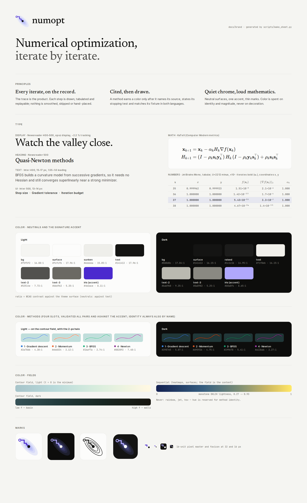

# numopt — brand

This is the identity for the numopt package, its README and its web portal. Every value on this page
comes from a script in [`scripts/`](scripts/), and `bash docs/brand/scripts/build.sh` rebuilds every
asset. When a number here and a number in `web/src/ui/tokens.css` disagree, the script output decides.

| Asset | File |
|---|---|
| Mark, lockups, favicon, app icon, social card | [`logo/`](logo/) |
| README hero: wide and stacked (phones), static and animated, light and dark | [`readme-hero/`](readme-hero/) (raster fallbacks build to `build/`, git-ignored) |
| Brand sheet (this page's image) | [`brand-sheet.png`](brand-sheet.png) |
| Matplotlib style for Python figures | [`numopt.mplstyle`](numopt.mplstyle) |
| README plan, full draft and citation file | [`readme-design.md`](readme-design.md), [`README.draft.md`](README.draft.md), [`CITATION.draft.cff`](CITATION.draft.cff) |
| Web portal art direction | [`portal-direction.md`](portal-direction.md), [`portal/home-concept.png`](portal/home-concept.png) |

---

## 1. Positioning

**Tagline:** *Numerical optimization, iterate by iterate.*

**One line:** 168 numerical methods, each cited to its algorithm and equation, tested against an
oracle, and replayable iterate by iterate in the browser. (The count comes from
`readme_facts.py`, and `readme_facts.py --check` fails when a README states another one; raster
assets that are not rebuilt per release say "150+", a floor that stays true as the registry grows.)

The audience is the person who reads the update rule before they trust the plot: a mathematician
checking a proof sketch, a researcher comparing a new method against the classics, a student who
needs to see why steepest descent zigzags. They are not impressed by gloss. They are won over when
the figure is correct, the notation is right and the numbers can be checked.

### Three principles

1. **Every iterate, on the record.** The trace is the product. Each step is drawn, tabulated and
   replayable; nothing is smoothed, subsampled without saying so, or hand-placed. If a step leaves
   the picture (Newton on Rosenbrock jumps to 𝐱₂ = (0.76, −3.18)), we draw it leaving and label
   where it went.
2. **Cited, then drawn.** A method earns a place on screen only after it names its source (book,
   algorithm and equation number), states its stopping test, and matches its fixture in both Python
   and TypeScript. Provenance is visible: a figure's caption states its stopping test and every
   parameter that differs from the registered default. A comparison uses one stopping test for
   every method, or it states each test.
3. **Quiet chrome, loud mathematics.** Neutral warm surfaces, one accent, thin marks. Color is spent
   on identity (which method) and magnitude (how high f is), never on decoration. Motion explains a
   state change or it does not happen.

---

## 2. Voice

Precise, mathematical, friendly — in that order. Write like a careful colleague annotating a
whiteboard: name the quantity, give its symbol, give its value, say what it means. American spelling,
sentence case, no exclamation marks, no emoji.

**Rules**

* **Name the quantity, then the symbol.** "Step size α", "Gradient tolerance ‖∇f‖ ≤", "Iteration
  budget". The symbol is typeset (KaTeX), the name is Inter.
* **State outcomes as facts with their evidence.** Converged *because* a test passed; stopped *because*
  a budget ran out. Never "success" or "failed" alone. One format for every method: the norm with
  its subscript, the value, the comparison, the tolerance as a number (never the id `gtol`), no
  nested parentheses.
* **Say what happened, then what to try.** Errors are numerical events, not user mistakes.
* **Use the textbook's name**, with the variant in parentheses: "Conjugate gradient (Polak–Ribière+)",
  "Brent (zeroin)". Use en dashes in eponyms (Gauss–Newton, Nelder–Mead), U+2212 for minus, × for
  scientific notation.
* **Numbers carry meaning.** "38 iterations", not "38"; "1,000-iteration budget", not "max_iter=1000".
  Parameter ids (`max_iter`, `lr`) appear only in code and in tooltips.

| Context | Good | Bad |
|---|---|---|
| Parameter label | Step size α | lr |
| Parameter label | Iteration budget | Max iters |
| Parameter help | Stop when ‖∇f(𝐱ₖ)‖₂ ≤ this value. | Gradient threshold param. |
| Run status (converged) | Converged in 38 iterations · ‖∇f‖∞ = 1.3×10⁻¹¹ ≤ 10⁻⁸ | Success! |
| Run status (budget) | Stopped at the 5,000-iteration budget without converging · ‖∇f‖₂ = 1.2×10⁻³ > 10⁻⁶ | Failed; "(reached max_iter=5000 (‖∇f(x)‖ = 0.00117 > gtol))" |
| Run status (breakdown) | The Hessian is singular at 𝐱₃, so Newton's step is undefined. Try damped Newton or a trust region. | Error: NaN encountered |
| Off-screen geometry | 𝐱₂ = (0.76, −3.18), below the view | Out of bounds |
| Empty state | Add a method to compare — up to four run on one clock. | Nothing here yet! |
| Rate badge | superlinear | Fast |
| CTA | Open the descent lab | Get started |
| Home lede | Pick a problem, race up to four methods across its landscape, and read every iterate beside the update rule that produced it. | The ultimate playground for optimization! |

---

## 3. Typography

Three voices plus math. All are self-hostable with `@fontsource` (SIL OFL 1.1) or ship with KaTeX
(MIT); nothing loads from a third-party CDN at runtime.

| Role | Family | Package | Use |
|---|---|---|---|
| Display | **Newsreader** (Production Type), 400 and 500, `opsz` axis at display sizes | `@fontsource-variable/newsreader` | Page titles, hero, section heads, lab titles, figure annotations (italic: "quadratic", "superlinear"). Display only: never body text beside inline math |
| Text and UI | **Inter** (variable) with `cv11` and `ss03` (already set in `global.css`) | `@fontsource-variable/inter` *(installed)* | Body, controls, labels, legends |
| Math | **KaTeX** fonts (Computer Modern metrics) | `katex` *(installed)* | Every symbol, formula, axis name and power of ten |
| Numbers and code | **JetBrains Mono** (variable) | `@fontsource-variable/jetbrains-mono` *(installed)* | Iteration tables, tick labels, code, hex values |

Why a serif display: KaTeX sets mathematics in Computer Modern, a serif. On an all-sans page the
formulas look pasted in. A serif display face lets the headings and the formulas belong to one
document — the Distill / Stripe Press register — while Inter keeps the prose and controls crisp.
Newsreader does *not* match Computer Modern's structure (it has a large x-height and low contrast;
CM has a small x-height and high contrast), so it is used at display sizes only, where the
difference reads as a deliberate pairing, and never as body text at the size of inline math.

### Scale (16 px root)

| Token | Size / leading | Face | Tracking | Use |
|---|---|---|---|---|
| `--text-display` | clamp(2.5rem, 1.6rem + 3.2vw, 4rem) / 1.04 | Newsreader 400 | −0.024em | Home hero |
| `--text-4xl` | 2.75rem / 1.08 | Newsreader 400 | −0.02em | Page title |
| `--text-3xl` | 2.125rem / 1.12 | Newsreader 500 | −0.016em | Lab title (`<h1>`) |
| `--text-2xl` | 1.625rem / 1.2 | Newsreader 500 | −0.012em | Section head |
| `--text-xl` | 1.25rem / 1.3 | Inter 600 | −0.012em | Card title |
| `--text-lg` | 1.0625rem / 1.6 | Inter 400 | 0 | Lede, long prose (measure 62–72ch) |
| `--text-base` | 0.9375rem / 1.55 | Inter 400 | 0 | Prose in panels |
| `--text-md` | 0.875rem / 1.4 | Inter 500 | 0 | UI base (buttons, inputs) |
| `--text-sm` | 0.8125rem / 1.4 | Inter 400–500 | 0 | Secondary UI, legends |
| `--text-xs` | 0.75rem / 1.35 | Inter 400 / JetBrains Mono | 0 | Captions, tick labels |
| `--text-2xs` | 0.6875rem / 1.3 | Inter 600 caps | +0.06em | Rail section labels |

The Inter sizes are the web team's existing tokens; the deltas are the Newsreader roles above them.

### Numerals and notation

* **Tables, ticks, stats:** tabular lining figures — `font-variant-numeric: tabular-nums lining-nums`
  for Inter, JetBrains Mono for columns of iterates. Align on the decimal point (`sigFixed` keeps a
  sign column). Display numbers in Newsreader use `lining-nums`.
* **Minus is U+2212** (−), never a hyphen. Multiplication is ×. Scientific notation is
  `1.3×10⁻¹¹` in UI text and `10^{-11}` (KaTeX) on axes — never `1.3e-11` outside code.
* **Significant figures, not decimals:** 4–6 significant digits for iterates, 2–3 for residuals and
  tolerances. Show `—` for undefined, `∞` for infinite.
* **Vectors** as `(0.7634, 0.5828)` with a thin space after the comma; matrices with KaTeX `bmatrix`.
* **KaTeX size:** `.katex { font-size: 1.2em }` inline in Inter prose. Inter's x-height is 0.546 em
  and KaTeX Main's is 0.431 em, so at 1.1em lowercase math (𝐱ₖ, α, f, k) sat about 13 % below the
  text around it. At 1.2em the math x-height is within 5 % of Inter's, and capitals (Hₖ, ∇f) stand
  about 13 % above Inter's cap height, which reads as ordinary math emphasis. Most inline math is
  lowercase, so the x-height decides (checked on a mixed sentence at 1.0, 1.1, 1.15, 1.2 and
  1.25em). Display formulas 1.2em.
* **Variables are italic, operators upright, names upright:** *f*(𝐱ₖ), ‖∇*f*‖, `\operatorname{prox}`.
  Subscript k for iteration, superscript ⋆ for the solution (𝐱⋆, f⋆), never x_opt.
* **Vectors are bold, coordinates are italic.** Iterates and other vectors are bold upright
  (`\mathbf{x}_k`, `\mathbf{x}^\star`, `\mathbf{s}_k`, `\mathbf{y}_k`); *x* and *y* are the
  coordinates of the plane, as in *f*(*x*, *y*). So 𝐱₂ is the second iterate and *y* is never also a
  gradient difference. Table columns of coordinates are headed *x*, *y* (or *x*₁ … *x*ₙ in n-D, where
  no *y* coordinate exists). Plain-text contexts that cannot set bold (alt text, `<desc>`) write xₖ.

---

## 4. Color

Run `.venv/bin/python docs/brand/scripts/palette_check.py` for every number below (it exits 1 if a
gate fails). Contrast is WCAG 2.x; ΔE is Euclidean OKLab distance ×100 under Machado–Oliveira–Fernandes
(2009) color-vision-deficiency simulation at severity 1 — the same model and thresholds the web team
used for `--series-1..4`.

### Neutrals

Warm, paper-like grays (hue ≈ 100°, chroma < 0.01). They are the web team's tokens, unchanged.

| Token | Light | Dark | Role |
|---|---|---|---|
| `--color-bg` | `#f5f5f2` | `#0d0d0c` | Page plane |
| `--color-surface` | `#fcfcfb` | `#141413` | Cards, rail, chart surface |
| `--color-surface-raised` | `#ffffff` | `#1c1c1b` | Popovers, inputs |
| `--color-sunken` | `#eeeeea` | `#0f0f0e` | Wells, tracks |
| `--color-text` | `#141413` | `#f1f0eb` | Primary text; 𝐱₀ ring and 𝐱⋆ cross in figures |
| `--color-text-2` | `#52514e` | `#bab9b0` | Secondary text |
| `--color-text-3` | `#6b6963` | `#8a8982` | Tertiary text, ticks |

Text contrast (computed):

| Token | Light: bg / surface / raised / sunken | Dark: bg / surface / raised / sunken |
|---|---|---|
| text | 16.88 / 17.96 / 18.43 / 15.85 | 17.04 / 16.15 / 14.95 / 16.81 |
| text-2 | 7.27 / 7.73 / 7.94 / 6.82 | 9.87 / 9.35 / 8.65 / 9.73 |
| text-3 | 5.03 / 5.35 / 5.49 / 4.72 | 5.54 / 5.25 / 4.86 / 5.46 |

All text tokens pass 4.5:1 on every surface in both themes. Status colors (text on bg / surface):
good 5.68 / 6.04, warn 5.54 / 5.90, bad 5.01 / 5.33 (light); good 8.21 / 7.79, warn 8.85 / 8.39,
bad 6.47 / 6.13 (dark).

### Signature accent: Iris

| | Light | Dark |
|---|---|---|
| **Iris** (proposed `--color-accent`, `--color-focus`, `--color-link`) | `#4b2ace` · OKLCH 0.45 0.23 281 | `#b0a8fc` · OKLCH 0.77 0.12 288 |
| Contrast bg / surface / raised / sunken | 7.62 / 8.11 / 8.33 / 7.16 | 9.12 / 8.65 / 8.00 / 9.00 |

The accent is gated against **every** method color with the same thresholds as the method pairs
(normal-vision ΔE ≥ 15, protan/deutan ΔE ≥ 8), so a link or a focus ring is never read as a fifth
method. Iris sits at the midpoint between series-1 (blue, hue 256) and series-4 (plum, hue 324), at
a lower lightness than both:

| Accent vs method color (normal / protan / deutan ΔE) | Light | Dark |
|---|---|---|
| Iris vs 1 blue | **16.6** / 13.1 / **10.7** | 17.3 / 12.3 / 16.6 |
| Iris vs 2 orange | 41.5 / 32.2 / 40.2 | 28.6 / 31.5 / 26.4 |
| Iris vs 3 aqua | 39.0 / 34.4 / 32.2 | 26.5 / 20.2 / 19.9 |
| Iris vs 4 plum | **15.8** / **10.0** / 11.5 | 25.9 / 28.2 / 22.7 |
| *Current accent* (`#3459d1` / `#7f9cf5`) vs 1 blue | 7.8 / 7.6 / 5.9 — fails | 9.8 / 7.5 / 9.6 — fails |
| *First Iris proposal* (`#4348d4`) vs 1 blue / 4 plum | 11.4 / — / 7.6 · 16.8 / — / 11.0 — fails | |

Iris keeps every role the accent has today (focus ring, links, selection, the path in the mark). It
is never a data color. `--color-accent-soft` becomes `rgba(75, 42, 206, 0.10)` light,
`rgba(176, 168, 252, 0.14)` dark.

**Focus is shown by shape, not by hue alone:** a 2 px Iris outline at a 2 px offset
(`outline: 2px solid var(--color-focus); outline-offset: 2px`), so the focus state reads even for a
viewer who cannot tell Iris from blue. Selection adds the soft fill *and* a 2 px rule on the left.

### Method colors (categorical)

Paths cross, so the palette is validated **all pairs**, not only neighbors. The four slots are the
web team's validated palette, unchanged. A figure shows **at most four methods**, the same limit as
the interactive lab, so every static figure (README, papers, research notes) can be replayed in the
lab with the same colors. A larger comparison is split into panels. (An earlier draft added a
neutral "reference ink" fifth slot; it read as a guide line, not data, and the lab could not
reproduce it, so it is withdrawn.)

| Slot | Name | Light | Dark | Light: vs surface / min vs field band | Dark: vs surface / min vs field band |
|---|---|---|---|---|---|
| 1 | Blue | `#2a78d6` | `#3987e5` | 4.30 / 2.40 | 5.07 / 2.30 |
| 2 | Orange | `#eb6834` | `#d95926` | 3.12 / 1.74 | 4.75 / 2.15 |
| 3 | Aqua | `#1baf7a` | `#199e70` | **2.74** / 1.53 | 5.41 / 2.46 |
| 4 | Plum | `#882892` | `#a13bab` | 7.40 / 4.12 | 3.27 / **1.49** |

Worst pairs over all six pairs (computed):

| | Normal vision ΔE (gate ≥ 15) | Protan / deutan ΔE (target ≥ 8) | Tritan ΔE (reported) |
|---|---|---|---|
| Light | 22.0 (blue / plum) | 9.2 (orange / aqua, deutan) | 9.6 (blue / aqua) |
| Dark | 20.9 (blue / aqua) | 9.4 (orange / aqua, deutan) | **4.0** (blue / aqua) |

Rules that make the bold cells acceptable:

* **Identity is never color alone.** Every series is also named — a legend chip, a direct label, a
  row in the iteration table. Light aqua (2.74:1) and dark plum on the darkest field band (1.49:1)
  rely on this, and dark blue / aqua collapse for tritanopes (ΔE 4.0), which the name resolves.
* **Every path has a 2–3 px surface-colored halo** (`--chart-halo`), so marks stay legible on any
  field band; the "min vs field band" column is the contrast *without* the halo.
* **Second encoding for dense figures:** iterate dots for methods with few steps (Newton, BFGS),
  progress diamonds at k = 10, 10², 10³, … for long runs, dashes for steps that leave the view, a
  hollow end marker for runs that hit the budget.
* **Slot follows the method, never its rank;** a method keeps its slot while selected. Never use
  status colors (`--color-good/warn/bad`) for data. Text stays in text tokens, never series colors.

### Fields (sequential colormaps)

* **Contour field** (`CONTOUR_MAPS` in `web/src/ui/colors.ts`, ported verbatim in `make_hero.py`):
  low-chroma teal-gray basin to warm paper walls. OKLCH lightness at t = 0, ¼, ½, ¾, 1:
  light 0.801 → 0.857 → 0.907 → 0.948 → 0.981; dark 0.419 → 0.349 → 0.292 → 0.240 → 0.196 —
  strictly monotone, and in a lightness band that method marks never use. The field is context; the
  paths are content. Levels are uniform in log(f − f_min + δ) for steep functions.
* **Sequential** (`SEQUENTIAL`, cividis-like, OKLCH L 0.27 → 0.93): heatmaps, surfaces, matrices —
  wherever the field itself is the content.
* **Never** rainbow, jet or hsv maps: hue is reserved for method identity. A diverging map (for a
  signed residual or eigenvalue sign) must have two hues with equal lightness steps and a neutral
  midpoint, and must pass `palette_check.py`'s monotonicity test per arm before it ships.

---

## 5. The mark

**Idea: the mark is a theorem, drawn exactly.** Steepest descent with exact line search on the
quadratic f(𝐱) = ½ 𝐱ᵀA𝐱 with condition number κ = 6, from 𝐱₀ = s(−κ, −1) in the eigenbasis. Every
step is orthogonal to the previous one and touches the next level set tangentially, and the
iterates contract by r = (κ − 1)/(κ + 1) = 5/7 per step (Cauchy 1847; Nocedal & Wright 2006,
Thm. 3.3). The valley is turned by −45°, which makes the first step horizontal — and therefore
*every* step horizontal or vertical. The familiar textbook zigzag becomes a **staircase into the
minimizer**: its square, mitered corners show the right angle that the theorem is about, and the
silhouette is a stair, not a generic galaxy or eye. The tinted ellipses are the level sets through
the iterates, so each segment kisses a contour. The mark uses the chart grammar of §9: 𝐱₀ is a
hollow ring, the path is the method color (Iris), and 𝐱⋆ is the solid dot at the bottom of the
well. The path ends at the last iterate that disappears under the 𝐱⋆ dot; no segment is
schematic. `make_logo.py` computes it and asserts that consecutive steps are orthogonal.

**Two masters.** The large mark (≥ 48 px) is the drawing above. Below 48 px it turns to texture,
so a separate **16-unit pixel master** carries the idea: no level sets, the first two steps only
(𝐱₀ → 𝐱₁ → 𝐱₂: one horizontal, one vertical, lengths 4 and 3 units against the exact ratio
5/7), a 2-unit stroke centered on whole units, and a separate 4 × 4 𝐱⋆ dot centered on a whole
unit. Every edge lands on a pixel boundary at 16 px. The snapped points are checked against the
exact iterates (error < 0.65 units). Checked at DPR 1 on light (`#f5f5f2`, `#dee1e6`) and dark
(`#35363a`, `#0d0d0c`) browser-tab grounds.

| File | Use |
|---|---|
| `mark-color-light.svg` / `mark-color-dark.svg` | Default mark on light / dark grounds (≥ 48 px) |
| `mark-small-light.svg` / `mark-small-dark.svg` | 16-unit pixel master for 16–47 px: two steps, then the 𝐱⋆ dot |
| `mark-mono-black.svg` / `mark-mono-white.svg` | One solid ink, no tints; level sets masked where the path crosses them (≥ 32 px) |
| `mark-small-mono-black.svg` / `mark-small-mono-white.svg` | One-ink pixel master for 16–31 px |
| `mark-tile.svg`, `mark-tile-512.png`, `mark-tile-180.png` | App icon / avatar: ink rounded square (radius 23.4 %) |
| `favicon.svg` | The pixel master on the ink tile (legible in light and dark browser tabs) |
| `wordmark-*.svg`, `wordmark-small-*.svg` | Mark + "numopt" in Newsreader Medium, outlined; the x-height is centered on 𝐱⋆ |
| `social-preview.svg/.png` (+ `-light`) | 1280 × 640 card for GitHub's Social preview and Open Graph |

Rules: clear space = the diameter of 𝐱⋆ ×3 on every side. Minimum sizes: large mark 48 px, mono
mark 32 px, pixel master 16 px, lockup 96 px wide. Do not rotate (the −45° valley is what makes the
steps axis-aligned), recolor the path in a series color, round the corners, add a stroke, or set
"numopt" in another face. The wordmark is always lower case.

## 6. Iconography

The UI icon set (`web/src/ui/components/Icon.tsx`) is the standard; new icons follow it.

* 16-unit grid, drawn at 16 / 20 / 24 px; **1.5 px stroke**, round caps and joins, no fills except a
  solid dot that *means a point* (an iterate, a minimizer).
* Prefer mathematical primitives over metaphors: a point, a segment, an ellipse, a bracket `[ ]`,
  a simplex triangle, a tangent line. A lab icon is the lab's characteristic geometry (bracket for
  roots, nested ellipses for descent, polytope for LP), not a pictogram.
* Icons inherit `currentColor` (text tokens). They never wear series colors and never carry meaning
  alone: every icon-only button has a label and a tooltip.
* Status pairs icon + word: ✓ "Converged", ◷ "Budget reached", △ "Diverged" — never color alone.

---

## 7. Motion

Motion answers *what changed between step k and step k + 1*. If it does not, it does not ship.

| What animates | How | Why |
|---|---|---|
| Trajectory playback | Head moves along the path; trail is drawn up to the head; eased per step (`easeInOut` in `timeline.ts`), ~7 s per run at 1× | The iteration *is* the content |
| Shared clock | All methods and the convergence playhead advance on one clock (linear in k in the lab; linear in log k in the README hero) | Comparisons are only honest in sync |
| Step geometry (bracket, trust-region disk, simplex, line-search trials, tangent) | Cross-fade 140 ms (`--duration-fast`) when k changes; never morph a bracket into a different interval | Shows what the method looked at to take this step |
| Matrix / tableau cells | Value flash 220 ms on change; pivot ring persists | Points at the entry that changed |
| Panels, sheets, popovers | 220–360 ms, `--ease-out` (cubic-bezier(0.22, 1, 0.36, 1)); exits 140 ms | Spatial continuity |
| Home hero | Cycles through a few labs' scenes (owner request, 2026-10-05): each scene plays its real run once, holds the final frame, then crossfades to the next; a scene switcher and a visible pause button; pauses when scrolled out of view | Shows the range of the labs at a glance; the pause button keeps attention with the user |

Never: parallax, floating gradients, animated backgrounds, count-up numbers, bouncing CTAs, spring
overshoot on data (the `--ease-spring` token is for UI affordances only, such as a toggle knob).

**Reduced motion** (`prefers-reduced-motion: reduce`): duration tokens collapse to 0; the player shows
the final step, paused, no autoplay or loop; Play advances in whole steps at ≤ 6 steps/s; the README
animated SVG shows the static final frame (a CSS media query inside the SVG swaps the groups); the
home hero does not cycle and renders each scene's final frame. The README hero itself plays once (about 9.5 s, every animation
`fill="freeze"`), then holds a final frame identical to the static figure; reload replays it.

---

## 8. Layout

* **Base unit 4 px** (`--space-*`). **Content width 1240 px**; side gutter 16 px on phones, 24 px
  ≥ 640 px, 40 px ≥ 1024 px.
* **12-column grid**, 24 px gutters, for the home and docs pages. Prose lives in a 62–72ch measure
  (≈ 7 columns); figures may break out to **wide** (10 columns) or **full** (12), Distill-style.
  Captions sit under figures, left-aligned to the figure, in `--text-sm` `--color-text-3`.
* **Lab layout** (unchanged structure, see `LabShell`): rail 304 px · stage fluid · insights 380 px
  at ≥ 1280 px; rail + stage, insights below at 900–1279 px; stage first with a bottom-sheet rail
  under 900 px.
* **Radii:** 6 px controls, 8 px inputs, 12 px panels, 16–18 px figures and cards. **Elevation:**
  hairline borders first, shadows only for floating layers (`--shadow-2/3`).

---

## 9. Charts and figures

The README hero is the reference figure. Every chart, in the web app or in a paper, follows it.

* **Fair comparisons:** one stopping test for every method in a figure (the hero: the first k with
  ‖∇f(𝐱ₖ)‖₂ ≤ 10⁻⁸ inside one 20,000-iteration budget), or each method's test stated in the
  caption. Name the variant in the legend: "Gradient descent (Armijo backtracking)".
* **Frame:** surface `--chart-surface`; hairline grid (`--chart-grid`); axes at `--chart-axis`; no
  top/right spines; no chart junk (no 3-D bars, no gradients on marks, no drop shadows).
* **Size for the display width.** Lay out a figure at the width it is shown, and keep its smallest
  type at ≥ 11 px there. The README hero is laid out at 960 units (smallest type 14 units = 12 px at
  the 830 px column) and has a stacked 540-unit variant for phones (17 units = 11 px at 360 px).
* **Ticks:** few and meaningful (decades on log axes: 1, 10, 10², 10³). Tick labels in JetBrains Mono
  or KaTeX, `--chart-tick`; powers of ten always typeset as 10⁻⁶, never `1e-06`. On a static
  contour figure, ticks sit outside the frame; in the lab, inset labels with a halo (`drawAxes`
  `inset`) are fine.
* **Axis names in math:** *x*, *y*, iteration *k*, f(𝐱ₖ) − f⋆, ‖∇f(𝐱ₖ)‖ — KaTeX. Units or meaning
  in Inter beside them ("iteration *k*"). State an axis restriction where a point is dropped
  ("iteration *k* ≥ 1" on a log-k axis, which cannot show k = 0).
* **Equal scale:** a contour plot uses the same scale on both axes, or says that it does not.
* **Marks:** paths 1.5–2.2 px with a 3 px halo; when slow methods share a valley floor, the
  slowest is painted last with the thinnest stroke; iterate dots r = 3 px for short traces only;
  progress diamonds at k = 10, 10², 10³, … on both the landscape and the convergence curve; start
  𝐱₀ = hollow ring; minimizer 𝐱⋆ = a + cross with its coordinates; current iterate = filled head
  with halo; the run's end = solid dot if converged, hollow if the budget ran out.
* **Steps that leave the view:** dashed in every frame; an outward chevron where the step leaves,
  an inward chevron where the next step comes back, and the off-view iterate labeled at the exit
  ("𝐱₂ = (0.76, −3.18)", "Newton, below the view").
* **Convergence plots:** f(𝐱ₖ) − f⋆ (or ‖∇f(𝐱ₖ)‖, or the bracket width) on a log axis; iterations on
  a log axis when runs differ by more than 30× in length, so linear, superlinear and quadratic
  convergence read as different *shapes*. Annotate rates in Newsreader italic beside the curve
  ("quadratic", "superlinear") only when the method's theory guarantees them.
* **Legends:** one row (one column on phones), swatch + name + iteration count in tabular figures.
  Direct labels where they do not collide. At most four methods.
* **Provenance in the caption**, not in the image: what was computed, the stopping test, and every
  parameter that differs from the registered default. A link to the script that made the figure.
* **Python:** `plt.style.use("docs/brand/numopt.mplstyle")` gives the same four-slot palette, CM
  math text, hairline grid and quiet ticks.
* **Accessibility:** canvases are `role="img"` with an `aria-label` that states the result; the same
  data is available as a table. SVG figures carry `<title>` and `<desc>` with the outcome of every run,
  written with the same typography as the visible text (U+2212, thousands separators, x₀, 10⁻⁸).
