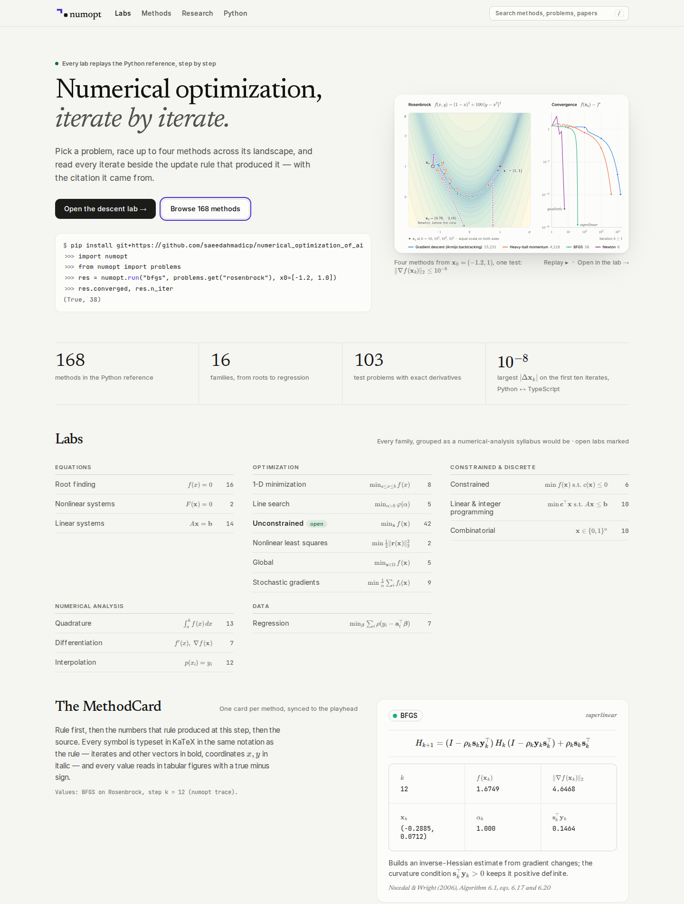

# Portal art direction

For the web team building `web/`. It builds on the current foundation — which is already good: warm
neutral tokens, a validated 4-slot method palette, perceptual contour maps, a solid LabShell, KaTeX
MethodCards, reduced-motion support. The goal is to move it from *a well-made tool* to *the place a
mathematician bookmarks*. Every proposal below is a delta against what exists (screenshots of the
current build at 1440 × 900 and 390 × 844, both themes, were reviewed on 2026-10-05).

`portal/home-concept.html` is a static concept (not production code) that shows type, spacing and
hierarchy with the brand fonts; render it with
`node docs/brand/scripts/render.mjs docs/brand/portal/home-concept.html out.png 1440 1900 --scale 1`. Its counts come
from `portal/facts.js`, which `readme_facts.py --portal-js` writes from the registry.

---

## 1. Home

**Concept: the home page is a journal's front page, not a product landing page.** One figure that
proves the claim, one sentence that states it, then an index.

* **Headline** in Newsreader 400 at `--text-display`: *Numerical optimization, iterate by iterate.*
  The second clause in italic `--color-text-2`. It replaces "Watch numerical methods converge, step by
  step." (good, but generic and set in the same Inter as every control).
* **Lede** (Inter 17.5 px, 30em measure): "Pick a problem, race up to four methods across its
  landscape, and read every iterate beside the update rule that produced it — with the citation it
  came from."
* **Eyebrow** — only true claims: "Every lab replays the Python reference, step by step" once
  `npm test` checks the lab's methods against `src/generated/fixtures`; until then keep the current
  "Interactive companion to the numopt Python package".
* **Hero visual:** keep the live `HeroViz`, but give it the README hero's composition: landscape on
  the left, a *small* f(𝐱ₖ) − f⋆ vs k chart (log-log) on the right, both on one clock that is linear
  in log k (see `make_hero.py`, `k_of_tau`). The README's four methods (gradient descent with Armijo
  backtracking, heavy-ball momentum, BFGS, Newton) under its one stopping test, ‖∇f(𝐱ₖ)‖₂ ≤ 10⁻⁸, so
  the visitor sees three different convergence shapes in ten seconds and the lab can replay the
  README figure exactly. The caption states the test. Plays once, holds the last frame, shows a
  replay control and "Open in the lab →" (deep link with the same `?p=&m=` state).
* **A code card under the CTAs** (JetBrains Mono, surface card): a snippet that runs as shown —
  `pip install git+https://github.com/saeedahmadicp/numerical_optimization_of_ai` (until the PyPI
  name `numopt-lab` is reserved; `numopt` on PyPI is another project), `import numopt`,
  `from numopt import problems`, `numopt.run(...)`, and its real output `(True, 38)`. Researchers
  trust a page that shows the call.
* **Facts strip** (four columns, Newsreader numerals at 38 px, hairline separators): methods in the
  Python reference (168), families (16), test problems (103), and parity stated with its quantity:
  "10⁻⁸ — largest |Δ𝐱ₖ| on the first ten iterates, Python ↔ TypeScript". Replace "1 lab
  open now / 3 methods to compare" — those numbers advertise what is missing. Read the counts from
  `src/generated/registry.json` at build time.
* **Labs as a syllabus index, not a card wall.** All 16 families in five groups (Equations ·
  Optimization · Constrained & discrete · Numerical analysis · Data), each a ruled list: lab name
  (Inter 500), its problem in KaTeX (*f*(*x*) = 0, min f(𝐱), A𝐱 = 𝐛, min 𝐜ᵀ𝐱), and the method
  count in mono. Open labs get a small green "open" pill and a hover thumbnail; planned labs are
  simply quieter text, not 15 "Coming soon" cards. The featured "Open now" card stays as the first
  row while only one lab exists.
* **Footer:** lockup, the tagline, links (Python package, Architecture, Research, GitHub, Cite).

## 2. Lab layout refinements

The three-column LabShell stays. Refinements, from the current screenshots:

1. **Lab title in Newsreader 500** (`--text-3xl`), the problem formula directly under it in the rail
   card (already there — make it the visual anchor: 20 px KaTeX, no border, a hairline below).
2. **Stage header:** method chips + status pills are good. Put the iteration count in the pill in
   tabular figures and the status word first: "converged · 596 it", "budget · 1,000 it". Status pills
   keep their icon (✓ ◷ △) so status is not color alone.
3. **Contour tick labels:** keep the inset labels; set the axis names *x*, *y* in KaTeX italic (they
   are variables, so they should match the formula above them), and confirm every negative tick goes
   through `format.ts` (U+2212, never a hyphen).
4. **Start and minimizer markers** as in the hero: hollow ring for 𝐱₀, a + cross with "𝐱⋆ = (1, 1)"
   for known minima; a step that leaves the view is dashed, with an outward chevron where it leaves,
   an inward chevron where the next step returns, and a label at the exit ("𝐱₂ = (0.76, −3.18),
   below the view"). Progress diamonds at k = 10, 10², 10³ on long paths.
5. **Convergence chart:** add a *log k* toggle (default on when the longest run is ≥ 30× the shortest)
   next to the existing *f − f⋆ / ‖∇f‖* switch; typeset tick labels as 10⁻⁶ in KaTeX instead of
   "10⁻⁶" in mono; replace the y-axis caption "f(xₖ) − f*" (plain text) with KaTeX f(𝐱ₖ) − f⋆.
   Annotate a curve with its proven rate (Newsreader italic, `--color-text-2`) only when the method's
   theory guarantees it.
6. **Iteration table:** right-align numbers on the decimal point, 4–6 significant digits, `—` for
   undefined, the current row highlighted with `--color-accent-soft` and a 2 px iris rule on the left.
7. **Rail density:** parameter rows at 40 px; the symbol (α, ‖∇f‖ ≤) set in KaTeX before the label —
   already done for α; apply everywhere a symbol exists.
8. **Mobile:** the floating "Controls" button covers chart content; dock it into the playback bar as
   its last control instead.

## 3. MethodCard

The card is the lab's textbook page for the current step. Order, top to bottom:

1. **Head:** method chip (slot swatch + name) · rate badge ("superlinear") · overflow menu (copy
   Python call, open docs).
2. **The rule**, display KaTeX at 1.2em, centered between hairlines. For two-line rules use
   `aligned`. Highlight (iris, 10 % background) the term that the current step's `info` explains.
3. **This step:** a 3-column grid of quantities — label in KaTeX (*k*, *f*(*x*ₖ), ‖∇*f*(*x*ₖ)‖,
   *x*ₖ, αₖ, *s*ₖᵀ*y*ₖ…), value in JetBrains Mono, tabular. Values update with the playhead without
   animating the digits (no count-up).
4. **Status sentence** from `describeResult`: "Converged in 38 iterations · ‖∇f‖∞ = 1.3×10⁻¹¹ ≤ 10⁻⁸".
5. **Intuition** (Inter 14.5 px, `--color-text-2`), two sentences at most.
6. **Strengths / weaknesses** (existing).
7. **Source** in Newsreader italic `--color-text-3`: "Nocedal & Wright (2006), Algorithm 6.1, eqs.
   6.17 and 6.20" — every reference from the registry, each with a copy-BibTeX action.

## 4. Typesetting LaTeX and numbers

* KaTeX everywhere a symbol appears — labels, tooltips, table headers, axis names, and inline in
  prose (the MethodCard's "the curvature condition 𝐬ₖᵀ𝐲ₖ > 0" is KaTeX, not Inter with ``).
  Inline size `1.2em` (matches Inter's x-height; brand.md §3); display `1.2em`. Never write math as
  Unicode text in one place and KaTeX in another.
* Vectors bold, coordinates italic: iterates 𝐱ₖ, 𝐱⋆, BFGS pairs 𝐬ₖ, 𝐲ₖ; coordinates *x*, *y*.
* Variables italic (*x*, *f*, α), operators and function names upright (∇, log, `\operatorname{prox}`).
  Iteration index subscript *k*; solution superscript ⋆ (`^\star`), never `*` or "opt".
* Numbers: `format.ts` already does the right things (U+2212, ×10ⁿ superscripts, `sigFixed`). Rules:
  tabular figures in every column, digit grouping with commas only for counts (1,000 iterations),
  never in iterates; scientific notation below 10⁻³ and above 10⁵; `∞` and `—` as specified.
* Mixed lines ("Step size α = 0.002") set the name in Inter, the symbol in KaTeX, the value in mono.

## 5. Empty, loading and error states

| State | Treatment |
|---|---|
| No method selected | The landscape still renders (it is the problem); centered note in `--color-text-3`: "Add a method to compare — up to four run on one clock." with the add button focused. |
| Loading KaTeX / a lab chunk | Reserve the exact box (no layout shift); show the formula's plain-text fallback in `--color-text-3`, then swap. No spinners under 400 ms; above that, a 2 px iris progress hairline at the top of the stage. |
| Heavy run in progress (`defer`) | Keep the previous result dimmed at 50 % with "Recomputing…" in the stage header; never blank the canvas. |
| Method raised (input error) | Card-level message in `--color-bad` text with the parameter named: "x₀ must have 2 entries (got 3)." The plot keeps the other methods. |
| Numerical breakdown | Not an error: an amber status pill ("Diverged after 12 iterations") and the MethodCard explains: "The Hessian is singular at x₃, so Newton's step is undefined. Try damped Newton or a trust region." |
| Unknown shared-link method | Existing toast is right; word it "This link asked for `foo`, which this lab does not have." |
| 404 route | Lockup, "This page is not in the catalog.", links to Home and Labs. |

## 6. Micro-interactions

* **Hover a path → focus it:** others go `muted` (already supported by `PathSpec`), the legend chip
  and the table column of that method highlight. Leave → restore in 140 ms.
* **Hover a convergence curve at k → the landscape shows xₖ** for that method as a ghost head (no
  seeking); click seeks the playhead.
* **Scrub the playback bar → geometry follows without easing** (easing only during play).
* **Copy affordances:** formula (LaTeX source), current iterate (`[0.7634, 0.5828]`), Python call that
  reproduces the run (`numopt.run("bfgs", problems.get("rosenbrock"), x0=[-1.2, 1.0])`), BibTeX.
  Confirmation is a 1.2 s inline "Copied" swap, not a toast.
* **Keyboard first:** existing shortcuts are right; add `/` (and ⌘K) for a method/problem search
  palette, and `?` for a shortcuts sheet.
* **Theme toggle** cross-fades surfaces in 220 ms; canvases redraw once (no transition).

## 7. Prioritized deltas against `web/`

| # | Change | Where | Effort | Why |
|---|---|---|---|---|
| 1 | Replace the mark: `Logo.tsx` → the staircase mark (inline SVG from the 16-unit pixel master `docs/brand/logo/mark-small-*.svg` below 48 px, `mark-color-*.svg` at 48 px and above); `public/favicon.svg` → `docs/brand/logo/favicon.svg`; add `apple-touch-icon` (`mark-tile-180.png`) | `src/app/Logo.tsx`, `public/`, `index.html` | S | Identity everywhere at once |
| 2 | Accent → Iris: `--color-accent`/`--color-focus` `#4b2ace` / `#b0a8fc`, `--color-link` same, `--color-accent-soft` `rgba(75,42,206,.10)` / `rgba(176,168,252,.14)`; focus ring = 2 px outline at 2 px offset | `src/ui/tokens.css` (3 blocks), focus styles | S | Passes the method-pair gates against every series color (light: ΔE 16.6 to blue, 15.8 to plum; CVD ≥ 10.0); focus ≠ "gradient descent" |
| 3 | Add Newsreader (display only): `@fontsource-variable/newsreader`; `--font-serif: 'Newsreader Variable', 'Newsreader', Georgia, serif`; tokens `--text-display`; apply to home `h1`, lab `h1`, section `h2`, rate annotations; inline `.katex` 1.2em | `package.json`, `tokens.css`, `Home.module.css`, `LabShell.module.css` | S | Headings and formulas belong to one document |
| 4 | Home hero copy, a code card that runs as shown, facts strip from the registry (168 / 16 / 103 / 10⁻⁸ with its quantity) | `src/app/Home.tsx` | M | Lead with the depth that exists |
| 5 | HeroViz → two-panel composition (landscape + log-log convergence) on a log-k clock, the README's four methods under one stopping test, plays once + replay | `src/app/HeroViz.tsx` | M | The README hero, live |
| 6 | ConvergenceChart: log-k toggle; KaTeX tick labels and axis name; rate annotations | `src/viz/ConvergenceChart.tsx` | M | Rates become visible shapes |
| 7 | Off-view steps dashed + labeled; x⋆ cross with coordinates; x₀ ring | `src/viz/PathLayer.ts`, `Contour2D.tsx` | S | Honest geometry |
| 8 | Labs index as a syllabus list of all 16 families (problem in KaTeX, counts in mono) instead of "Coming soon" cards | `src/app/Home.tsx` | M | Calmer, more informative |
| 9 | MethodCard order and the per-step quantity grid in KaTeX + mono; Source line in serif italic with copy-BibTeX | `src/labs/_shell/blocks.tsx` | M | The card becomes the textbook page |
| 10 | `index.html`: `<meta property="og:image">` → `social-preview.png`, `og:title`/`description` with the tagline, `theme-color` light `#f5f5f2` / dark `#0d0d0c` | `index.html` | S | Shared links look intentional |
| 11 | Search palette (`/`, ⌘K) over methods, problems, references | new `src/app/Search.tsx` | L | Researchers navigate by name |
| 12 | Mobile: dock "Controls" into the playback bar | `LabShell` | S | Stops covering the chart |

Effort: S ≤ half a day, M ≤ 2 days, L > 2 days. Items 1–3 are token- and asset-level and safe to
land first; 4–9 follow the brand's chart rules (`brand.md` §9) and can ship lab by lab.
