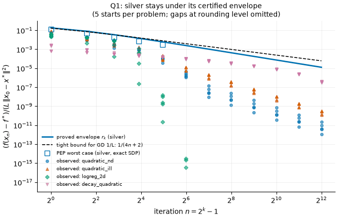
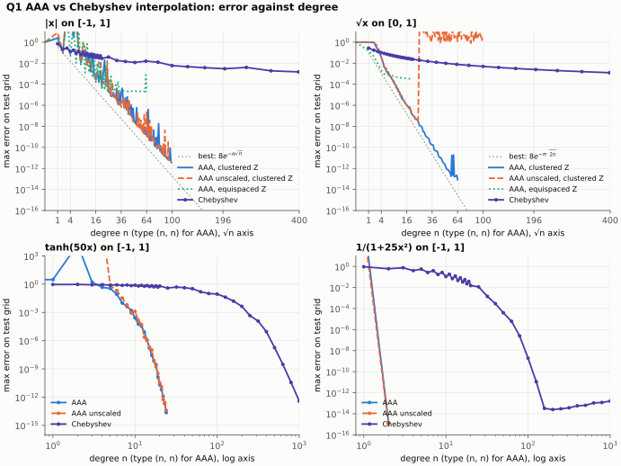
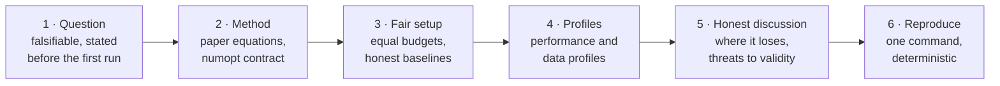

<div align="center">

# numopt · research

**Where new methods and improvements to existing ones are tested before they enter the package.**

Each study asks one falsifiable question and runs a fair, budget-matched experiment against the
package's baselines. It reports what it found, including where the new method loses, and it
regenerates every number from one command.

`9 studies` · `19 candidate methods` · `630 tests` · `every result regenerated by an independent reviewer`

</div>

---

## Contents

- [Why this folder exists](#why-this-folder-exists)
- [The studies](#the-studies)
- [The protocol](#the-protocol)
- [How benchmarking works](#how-benchmarking-works)
- [Adding a study](#adding-a-study)
- [From study to package](#from-study-to-package)
- [Reproducing everything](#reproducing-everything)
- [References](#references)

## Why this folder exists

`src/numopt/` holds textbook methods with known behaviour. Research methods are different. A new
method's paper may compare it against weak baselines, on problems the authors chose, at a single
tolerance. So a method is not ready for the package until we know three things:

1. **It is implemented correctly.** It follows the paper equation by equation and is tested
   against an independent oracle.
2. **It helps on our problems.** It is compared against numopt's own baselines, with the same
   oracle budget and stopping rule.
3. **We know where it fails.** Every study has a section on where the method loses and on threats
   to validity.

A study lives here, beside the package, until it meets all three. Code in `research/` imports
`numopt` and never changes it. Promotion moves the method into `src/numopt/` and ports it to the
web app ([below](#from-study-to-package)).

## The studies

Every finding below comes from the study's own `results/*.json`. A second agent ran each study
again from a clean `results/` folder and compared the output with the committed files. It also
checked each implementation against the primary papers. The review found defects in all nine
studies. Each defect was then fixed at its source, and the results were regenerated. The findings
below are the revised ones.

| Study | Family | Question | Finding (verified) | Promote? |
|---|---|---|---|---|
| [**Certified step-size schedules**](certified-stepsize-schedules/) <br><sub>silver steps · long steps · OGM1 · PEP</sub> | `unconstrained` | Do the proved silver-step envelopes hold on our problems, and when does silver lose to constant $1/L$ steps? | The envelope holds (0 of 240 violations). On the merely convex `decay_quadratic`, silver is 45× ahead of GD $1/L$ at $n = 4095$. It loses on strongly convex problems only when $\lambda_{\max}$ is within about 0.1 % of $L$ (crossover in 10 of 10 instances at $L = 1.001\,\lambda_{\max}$, in 0 of 10 at $1.003$). No certified schedule is fastest on any instance ($\rho(1) = 0$). | Yes: `silver_gd`, `silver_gd_strongly_convex`, `long_step_gd`, `ogm` |
| [**Benchmark profiles**](benchmark-profiles/) <br><sub>the shared harness · BenDFO · COCO ECDF</sub> | `bench` (methodology) | Does the ranking of derivative-free solvers change with the tolerance $\tau$, or with the choice of performance profile or data profile? | The point-estimate rankings change with $\tau$ (Kendall $\tau_b$ = 0.33 and 0.20) and with a fixed-budget data-profile readout ($\tau_b$ = 0.07–0.47). After a Holm correction, no pairwise rank change is significant on 15 2-D problems, so the null is not rejected. The harness now rejects any run whose $f_L$ comes from a divergent solver. | Yes: harness extensions (BenDFO cutoff, `cutoff_audit`, bootstrap rank tests) into `numopt.bench` |
| [**Restarted accelerated gradient**](restarted-accelerated-gradient/) <br><sub>FISTA · O'Donoghue–Candès restarts · lasso</sub> | `unconstrained` | Does gradient-restart AGD scale like $\sqrt\kappa$ with no $\mu$? Does FISTA's ripple delay lasso support identification? | Gradient-restart AGD scales as $\kappa^{0.549}$ (GD: $\kappa^{0.997}$) and needs at most 1.51× the iterations of `nesterov` tuned with the true $\kappa$. FISTA identifies the support before ISTA on 15 of 15 instances. FISTA can lose the support again after it finds it, and restart removes that lag on 7 of 8 affected instances. | Yes: `fista`, `ista`, `adaptive_proxgd` |
| [**Anderson acceleration**](anderson-acceleration/) <br><sub>AA(m) · RNA · GMRES · L-BFGS</sub> | `systems`, `unconstrained` | Does AA($m$) on gradient descent match L-BFGS($m$) at equal memory? Does the RNA term prevent failure from nonconvex starts? | Untruncated AA reproduces GMRES to $2.5\times10^{-15}$. On 2-D fixed-point maps, AA(2) is 4–28× faster than plain iteration. On gradient descent, AA does not match L-BFGS for $m \le 5$: on `rosenbrock_nd` its median is 9.1× ($m=3$) to 18.5× ($m=5$) higher, and 12 of 40 tuned runs stop at a saddle. RNA reduces saddle stops on Himmelblau by 45–61 %, at a cost in iterations. | Yes: `anderson` (fixed-point/systems); `anderson_gd` with its saddle caveat |
| [**Regularized Newton vs ARC**](regularized-newton-arc/) <br><sub>cubic regularization · gradient-regularized Newton</sub> | `unconstrained` | Can regularized Newton models replace line searches on convex problems where Newton diverges, and does ARC escape saddles? | ARC reaches a minimizer from all 241 nonconvex starts, including every start where damped or modified Newton stops at a saddle. Its median Hessian count equals that of `trust_region_exact` (7 vs 7). RegN-AdaN and RegN-SU converge from all 256 convex starts, including the starts where pure Newton fails. The method ranking holds only at the default constants. | Yes: `arc`, `reg_newton` (both return `converged=False` at a saddle) |
| [**Clenshaw–Curtis vs Gauss**](clenshaw-curtis-vs-gauss/) <br><sub>Trefethen 2008 reproduced · a ρ-sweep</sub> | `integration` | Is Gauss's factor-2 advantage in degree visible only for integrands analytic in a large Bernstein ellipse? | No non-entire integrand shows a persistent factor-2 gap. The gap grows with the Bernstein parameter $\rho$, not with entireness (normalized gap 0.00 → 0.60 as $\rho$ goes from 1.03 to 4.24). Nested CC costs 0.53–0.55× non-nested Gauss, but the saving comes from nesting: nested Gauss–Kronrod–Patterson is as cheap. QUADPACK QAGS solves 27 of 27 and is cheaper at tol ≤ $10^{-10}$. | Yes: `clenshaw_curtis` |
| [**Barycentric rational approximation**](barycentric-rational-approximation/) <br><sub>AAA · Floater–Hormann · Runge</sub> | `interpolation` | Does AAA reach the root-exponential rate $e^{-C\sqrt n}$ in floating point? Does Floater–Hormann beat splines on equispaced Runge samples? | For $\sqrt x$, AAA follows $e^{-\pi\sqrt{2n}}$ to about $10^{-11}$ (fitted $C = 4.47$, best possible 4.44). It reaches $8.4\times10^{-14}$ only with column scaling and samples clustered deep enough. Chebyshev interpolation decays like $n^{-1}$. Floater–Hormann beats the not-a-knot spline for every $d = 3..8$ from $n = 40$, and loses to it at $n = 10$. | Yes: `aaa`, `floater_hormann` |
| [**Restarted PDHG (PDLP-style)**](pdlp-restarted-pdhg/) <br><sub>first-order LP · adaptive restarts</sub> | `lp` | How many matrix products does PDHG need to reach a relative KKT error of $10^{-8}$ with no restarts, fixed restarts, and adaptive restarts? | Restarts solve 29 instances against 20 for plain PDHG, with a median of 4.9× fewer products (3.1× with preconditioning). Adaptive restarts are a median 45 % slower than the best fixed period in hindsight, so the claim "no slower than the best fixed period" fails. Their advantage is that they need no tuning. | Yes: `restarted_pdhg` |
| [**Adam successors and rotation**](adam-successors-rotation/) <br><sub>AdaBelief · Lion · Adan · Sophia</sub> | `stochastic` | Do coordinate-wise optimizers slow down when the problem is rotated away from its axes, as the $\ell_\infty$-geometry theory predicts? | GD and heavy ball do not change with rotation. Re-tuned Adam slows 9.2×, AdamW 8.0×, AdaBelief 5.8× and Lion 5.2× as the misalignment grows to 45°. Sophia, Sophia-H and tuned AMSGrad stay flat (≤ 1.16×). Lion is the most fragile method only with its fixed decay schedule. | **Not yet.** The review found that the original conclusions did not hold. The study was revised, but it covers only 2-D deterministic problems. |

<details>
<summary><b>Figure gallery</b> (one figure from each of four studies)</summary>

| | |
|:---:|:---:|
|  <br><sub>Silver steps stay under the certified envelope rₖ.</sub> |  <br><sub>Restarted AGD scales like √κ without knowing μ.</sub> |
|  <br><sub>AAA against Chebyshev interpolation on singular functions.</sub> |  <br><sub>Adaptive restarts against every fixed period on a half-octave grid.</sub> |

</details>

## The protocol

Every study follows the same six steps. Each step is a section of its `README.md`.



1. **Question.** The question is narrow, and the study states what result would falsify it
   before the first run. *Example:* "a non-entire integrand with a persistent 2× gap" falsifies
   the Clenshaw–Curtis claim. If the analysis changes after the first run, the README says so.
2. **Method.** `method.py` follows the cited algorithm equation by equation and names the
   equation it implements. Each deviation from the paper has a `# NOTE:` with the reason. The
   method satisfies the [numopt contract](../docs/architecture.md#method-contract-python): a full
   trace, exact evaluation counts, and `converged=True` only when the stated test passed. `test_method.py`
   checks it against an independent oracle (SciPy, a hand-derived step, a published table, or an
   exact SDP), and runs the `assert_valid_result` contract check from `tests/conftest.py`.
3. **Fair setup.** Every method gets the same budget, the same cost model and the same stopping
   test. Baselines run with their textbook or tuned parameters, never with weakened ones. Start
   points are drawn at random, never chosen. If a method gets information that the others do not
   (for example the true $\mu$ or $\kappa$), the README says so.
4. **Profiles.** The headline comparison uses performance and data profiles from
   [`numopt.bench`](#how-benchmarking-works) at two or more tolerances. Medians, ratios and
   claimed orderings come with a count ("on 7 of 8 instances") or a bootstrap interval.
5. **Honest discussion.** The discussion has a *Where it loses* section and a *Threats to
   validity* section. The discussion withdraws a claim that the data do not support. Results that
   show no difference are reported as results.
6. **Reproduce.** `run.py` regenerates every number in the README into `results/*.json`, and every
   figure into `figures/`. All randomness comes from `numopt.core.rng.Rng` with fixed seeds, so
   two runs give identical JSON.

## How benchmarking works

[`numopt.bench`](../src/numopt/bench.py) implements the protocol of Moré & Wild (2009). The
[benchmark-profiles](benchmark-profiles/) study extends it and adds the statistical tests.

**Instances and cost.** A *problem instance* $p$ is a problem with a fixed start point $x_0$, and
a seed for a stochastic solver. Each solver $s$ gets a budget of $\mu_f$ cost units on each
instance. A wrapper records every evaluation, so the curve of the best value against the cost is
exact. There are two cost models:

| `cost=` | One unit is | Use it when |
|---|---|---|
| `"nfev"` | one evaluation of $f$ (gradients are free) | the solvers are derivative-free |
| `"nfev+n*ngev"` | one evaluation of $f$; a gradient costs $n$ | gradient and derivative-free solvers are compared |

Hessian evaluations are free under both models, and every run records `n_hev`.

**Convergence test** (Moré & Wild 2009, eq. 2.2). Solver $s$ solves $p$ at the first cost
$t_{p,s}$ where the best value found satisfies

$$
f(x) \le f_L + \tau\,\bigl(f(x_0) - f_L\bigr), \qquad 0 < \tau < 1,
$$

with $f_L$ the known minimum. If $s$ never passes the test, $t_{p,s} = \infty$.

**Performance profile** (Dolan & Moré 2002). This profile answers the question "how close to the
fastest solver is $s$?"

$$
r_{p,s} = \frac{t_{p,s}}{\min_\sigma t_{p,\sigma}}, \qquad
\rho_s(\alpha) = \frac{\bigl|\{p : r_{p,s} \le \alpha\}\bigr|}{|P|} .
$$

$\rho_s(1)$ is the fraction of instances on which $s$ is the fastest, and $\rho_s(\infty)$ is the
fraction that $s$ solves.

**Data profile** (Moré & Wild 2009, eq. 2.7). This profile answers the question "what fraction
does $s$ solve within $\kappa$ simplex gradients?"

$$
d_s(\kappa) = \frac{\bigl|\{p : t_{p,s}/(n_p + 1) \le \kappa\}\bigr|}{|P|} .
$$

Adding a solver never changes another solver's data profile.

```python
from numopt import bench

res = bench.run_benchmark(
    ["bfgs", "nelder_mead", "cma_es"],
    [bench.BenchmarkCase("rosenbrock"), bench.BenchmarkCase("beale", x0s=[[1, 1], [-2, 2]])],
    budget=2000,
    cost="nfev+n*ngev",
    seeds=(0, 1),
)
for tau in (1e-3, 1e-7):  # always at two or more tolerances
    bench.plot_performance_profile(bench.performance_profile(res, tau=tau), f"perf_{tau:g}.svg")
    bench.plot_data_profile(bench.data_profile(res, tau=tau), f"data_{tau:g}.svg")
res.save("results/bench.json")
```

**Lessons from the studies.** Do these before you report a ranking:

- **Audit the cutoff.** A problem that is unbounded below without its box gives a divergent
  $f_L$, and that $f_L$ changes every profile. Run `cutoff_audit` from
  [`benchmark-profiles/method.py`](benchmark-profiles/method.py) before the analysis.
- **Test a ranking before you claim it.** A profile is a curve, and a ranking needs a scalar
  summary. Use the log-area scores $A_s$ and $D_s$, a problem-level cluster bootstrap, Holm-adjusted
  p-values, and a leave-one-problem-out count (`bootstrap_order_support`, `holm`,
  `leave_one_group_out`).
- **Check how numopt counts.** For example, numopt's `nesterov` evaluates two gradients per
  iteration. With the raw counts it ranks last in a profile. With one gradient per iteration, it
  is ahead of every AGD variant ([restarted-accelerated-gradient](restarted-accelerated-gradient/#discussion)).
- **Check what "solved" means.** A gradient test can pass at a saddle point, and a first-hit
  test can count a passing crossing of an oscillating run. Several studies changed their
  conclusions after they added a minimizer check or a settling metric.

## Adding a study

Copy this layout:

```
research/<slug>/
  README.md          Question · Background · Method · Setup · Results · Discussion · Reproduce · References
  method.py          the method(s), with the numopt contract and a PARAMS dict of ParamSpecs
  test_method.py     oracle, contract, failure-path and property (Hypothesis) tests
  run.py             regenerates results/ and figures/; deterministic
  results/*.json     every number that the README quotes
  figures/*.svg|png  every figure that the README shows
```

Before you ask for review, make sure that each item is true:

- [ ] The **Question** section states the falsification criterion before any results.
- [ ] The **Background** section gives the update rule in LaTeX and cites the paper, the
      algorithm number and the equation numbers.
- [ ] `method.py` returns a `Result` with a full trace (`k = 0` first, `n_iter == trace[-1].k`)
      and exact `n_fev`/`n_gev`/`n_hev`. It never raises on numerical breakdown.
- [ ] `converged=True` only when the stated test passed. A saddle, `max_iter`, divergence or a
      non-finite value gives `converged=False` and a clear `message`.
- [ ] `method.py` has a `PARAMS` dict of `ParamSpec`s with UI ranges, ready for `@register`.
- [ ] `test_method.py` compares the method with an independent oracle and calls
      `assert_valid_result` (load `tests/conftest.py` by path, as the existing studies do).
- [ ] The baselines are numopt's registered methods at their stated or tuned settings, with the
      same budget and stopping test.
- [ ] The headline comparison uses `numopt.bench` profiles at two or more values of $\tau$.
- [ ] All randomness comes from `numopt.core.rng.Rng(seed)`. `run.py` sets BLAS to one thread.
- [ ] Every number in the README appears in `results/*.json`. No number is typed in by hand.
- [ ] The Discussion has *Where it loses* and *Threats to validity* sections.
- [ ] The Reproduce section gives the test count, the commands, and the measured run time.
- [ ] The study adds a row to [the table above](#the-studies).

Do not edit `src/numopt/`, `tests/` or `web/` from a study. If a study finds a bug in a
baseline, report the bug in the study, and fix it in the package separately.

## From study to package

A study is ready for promotion when it meets four conditions:

1. Its tests pass, and a clean `run.py` reproduces the committed `results/`.
2. A reviewer checked the implementation against the primary source and reproduced the results.
3. The headline still holds after all the review findings are fixed.
4. The method helps on at least one problem class, and the README states where it does not.

To promote a method:

1. Move the function into its family module under `src/numopt/`.
2. Add `@register(..., params=PARAMS[...])`.
3. Move the tests into `tests/test_<package>_<module>.py`.
4. Add `FIXTURE_CASES`.
5. Port the method to `web/src/methods/` so that the parity test covers it.

The study stays here as the record of the evidence. The method's `references` point to the study.

## Reproducing everything

The studies use the repository's virtual environment and read `numopt` from `src/`. One command
runs every study's tests (CI runs it too); `research/pytest.ini` and `research/conftest.py` keep the
studies apart, although every study has its own `test_method.py` and `method.py`:

```bash
.venv/bin/python -m pytest research                 # 630 tests, about 70 s
.venv/bin/python -m pytest research/<slug>          # one study
.venv/bin/python research/<slug>/run.py             # one study's experiment
.venv/bin/python research/shrink_figures.py         # before you commit new figures
```

Some studies' `run.py` write each figure as both `.svg` and `.png`. Git keeps one format per
figure, the one the READMEs show (`.gitignore` lists the other), and `shrink_figures.py` removes the bulk that
matplotlib writes (metadata, unused precision; a 256-color palette for PNG) without a visible
change.

| Study | Tests | `run.py` time (measured, shared 20-core machine) |
|---|---:|---|
| certified-stepsize-schedules | 88 (1 needs `cvxpy`) | about 70 s; optional exact PEP in `pep.py`, about 70 s |
| benchmark-profiles | 33 | about 45 s |
| restarted-accelerated-gradient | 36 | 75–142 s |
| anderson-acceleration | 33 | 60–115 s |
| regularized-newton-arc | 89 | 40–80 s |
| clenshaw-curtis-vs-gauss | 197 | 15–40 s |
| barycentric-rational-approximation | 33 | 2–4 min |
| pdlp-restarted-pdhg | 45 (1 xfail) | about 2 min |
| adam-successors-rotation | 76 | about 50 min |

## References

- E. D. Dolan and J. J. Moré, "Benchmarking optimization software with performance profiles",
  *Math. Program.* 91 (2002) 201–213.
- J. J. Moré and S. M. Wild, "Benchmarking derivative-free optimization algorithms",
  *SIAM J. Optim.* 20(1) (2009) 172–191. Eq. 2.2 is the convergence test, and eq. 2.7 is the
  data profile. Reference code: [github.com/POptUS/BenDFO](https://github.com/POptUS/BenDFO).
- N. Hansen, A. Auger, R. Ros, O. Mersmann, T. Tušar and D. Brockhoff, "COCO: a platform for
  comparing continuous optimizers in a black-box setting", *Optim. Methods Softw.* 36(1) (2021)
  114–144.
- S. Holm, "A simple sequentially rejective multiple test procedure", *Scand. J. Statist.* 6
  (1979) 65–70.

Each study lists the papers for its own methods.
