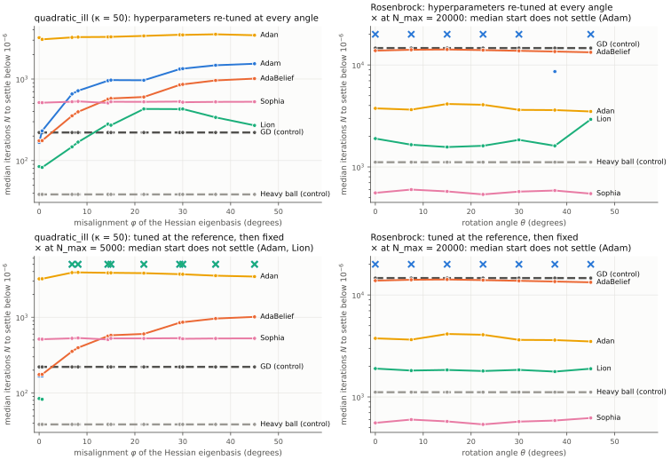
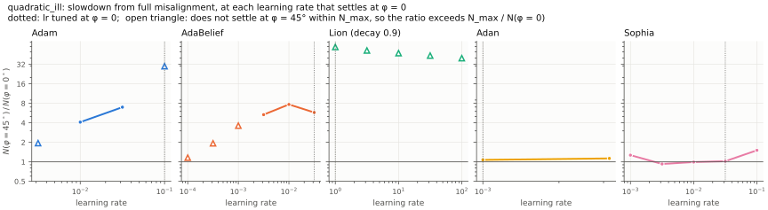
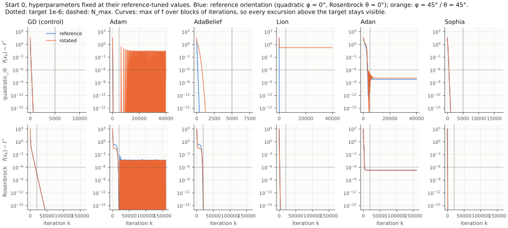

# Adam successors and the rotation question

**AdaBelief, Lion, Adan and Sophia on rotated `quadratic_ill` and rotated Rosenbrock.**
Code: [`method.py`](method.py) (the four optimizers and a rotation wrapper),
[`test_method.py`](test_method.py), [`run.py`](run.py). Every number below is read from
[`results/summary.json`](results/summary.json) (raw counts: [`results/iterations.json`](results/iterations.json)).

> **Revision note.** An earlier version of this study measured $N$ as the *first* iteration with
> $f(x_k) - f^* < 10^{-6}$ and stopped every run at a gradient tolerance. That metric counted
> passing crossings of oscillating runs as solved (RMSprop at lr = 100, for example, was
> reported at 7.5 iterations although it first rises from $f_0 = 32.7$ to $2.5\cdot10^6$ and never
> converges), and the tuner selected such configurations. All results were recomputed with the
> settling metric below, wider grids (all tuned hyperparameters checked against their grid
> edges), a heavy-ball control with tuned $\beta$, and a horizon certification. The headline
> changed: see [Discussion](#discussion).

## Question

Xie, Mohamadi & Li (ICLR 2025) argue that Adam's advantage over SGD comes from the
$\ell_\infty$ geometry of the loss, which only coordinate-wise methods exploit. A
coordinate-wise method is equivariant under permutations of the coordinates but not under
rotations, so it should slow down when a problem is rotated away from its "nice" axes, while
gradient descent (GD), which is rotation-equivariant, cannot notice the rotation. We ask:

1. When `quadratic_ill` and Rosenbrock are rotated by $\theta \in [0, \pi/4]$, does the number
   of iterations $N$ to reach $f - f^* < 10^{-6}$ grow with $\theta$ for Adam, AdaBelief,
   Lion, Adan and Sophia, while GD stays constant?
2. Which method is the most sensitive? The stated prediction is Lion (a pure sign method).
   The stated falsification criterion: a flat curve for a coordinate-wise method.

## Background

All four methods change one line of Adam (Kingma & Ba 2015); every operation acts per
coordinate. With $g_t = \nabla f(x_{t-1})$:

| Method | Update (as implemented) | Source |
|---|---|---|
| AdaBelief | $m_t = \beta_1 m_{t-1} + (1-\beta_1) g_t,\ \ s_t = \beta_2 s_{t-1} + (1-\beta_2)(g_t - m_t)^2 + \varepsilon,\ \ x_t = x_{t-1} - \eta\,\hat m_t/(\sqrt{\hat s_t} + \varepsilon)$ | Zhuang et al. (NeurIPS 2020), Alg. 2 |
| Lion | $c_t = \beta_1 m_{t-1} + (1-\beta_1) g_t,\ \ x_t = x_{t-1} - \eta_t(\operatorname{sign} c_t + \lambda x_{t-1}),\ \ m_t = \beta_2 m_{t-1} + (1-\beta_2) g_t$ | Chen et al. (NeurIPS 2023), Alg. 2 |
| Adan | $m_k = (1-\beta_1)m_{k-1} + \beta_1 g_k,\ \ v_k = (1-\beta_2)v_{k-1} + \beta_2(g_k - g_{k-1}),\ \ n_k = (1-\beta_3)n_{k-1} + \beta_3[g_k + (1-\beta_2)(g_k - g_{k-1})]^2,$ $x_{k+1} = x_k - \eta\,(m_k + (1-\beta_2)v_k)/(\sqrt{n_k} + \varepsilon)$ | Xie et al. (IEEE TPAMI 2024), Alg. 1 |
| Sophia | $m_t = \beta_1 m_{t-1} + (1-\beta_1) g_t,\ \ h_t = \beta_2 h_{t-k} + (1-\beta_2)\hat h_t$ every $k$ steps, $x_t = x_{t-1} - \eta\,\operatorname{clip}(m_t/\max(\gamma h_t, \varepsilon), 1)$ | Liu et al. (ICLR 2024), Alg. 3, eq. 6 |

Here $\hat m_t, \hat s_t$ are the bias-corrected moments, Adan starts from $m_0 = g_0$, $v_0 = 0$,
$v_1 = g_1 - g_0$, $n_0 = g_0^2$, and Sophia's $\hat h$ is either the exact $\operatorname{diag}\nabla^2 f$
("Sophia") or Hutchinson's $u \odot (\nabla^2 f\,u)$ with $u \sim \mathcal N(0, I)$ ("Sophia-H").

**Rotation.** For an orthogonal $R$, `rotate(problem, R)` returns $g(x) = f(Rx)$ with
$\nabla g = R^\top \nabla f(Rx)$ and $\nabla^2 g = R^\top \nabla^2 f(Rx) R$. The spectrum of the Hessian
does not change, and neither does GD's path ($x_k \mapsto R^\top x_k$). The quantity that does
change is the $(1,1)$-norm $\|H\|_{1,1} = \sum_{ij} |H_{ij}|$, the surrogate of $\ell_\infty$
smoothness of Xie et al. (2025). For a $2\times 2$ SPD Hessian whose eigenbasis makes an angle
$\varphi$ with the axes, $\|H\|_{1,1} = \operatorname{tr} H + (\lambda_{\max} - \lambda_{\min})|\sin 2\varphi|$.
The prediction is therefore that $N$ grows with $\varphi$ (equivalently with $\|H\|_{1,1}$).

**A wrinkle in the question.** `quadratic_ill` is *already* rotated:
$A = Q\,\operatorname{diag}(1, 50)\,Q^\top$ with $Q = R(\varphi_0)$, $\varphi_0 = \arctan(3/4) = 36.87^\circ$. After a
further rotation by $\theta$ the misalignment is $\varphi = |\varphi_0 - \theta|$, so the literal sweep
$\theta \in [0^\circ, 45^\circ]$ first *aligns* the problem ($\theta = 36.87^\circ$, $\varphi = 0$) and then
misaligns it slightly ($\theta = 45^\circ$, $\varphi = 8.13^\circ$). We run the literal grid and add
angles so that $\varphi$ covers $[0^\circ, 45^\circ]$; results are reported against $\varphi$.

## Method

[`method.py`](method.py) implements the four optimizers under the `numopt` method contract
(full trace with geometry in `Step.info`, exact evaluation counts, `converged` only when
$\|\nabla f\| \le$ `gtol`, a `PARAMS` dict of `ParamSpec`s). Deviations, each marked `# NOTE:` in the code:

* **Lion schedule.** Alg. 2 writes the learning rate as a schedule $\eta_t$. We use
  $\eta_t = \eta\,\rho^{t-1}$ (`lr_decay` $= \rho$, default 1). With constant $\eta$ every coordinate
  moves by exactly $\pm\eta$, so the iterates stay on the lattice $x_0 + \eta\mathbb Z^n$ and cannot
  reach a fixed small tolerance except by chance; a decaying $\eta_t$ is needed for this question.
  The price: after iteration $K$ a coordinate can travel at most $\eta\rho^K/(1-\rho)$ in total,
  so a run still farther than that from $x^*$ is *frozen* by the schedule (`lion_frozen` in
  [`run.py`](run.py) flags such runs).
* **Sophia refresh test.** "$t \bmod k = 1$" is implemented as $(t-1) \bmod k = 0$ (identical for
  $k \ge 2$; the paper's test never fires for $k = 1$). The Hutchinson product $\nabla^2 f\,u$ uses
  the full Hessian, since `numopt` problems supply $\nabla^2 f$.
* **Omitted options.** Weight decay is 0 in Adan and Sophia (Lion keeps $\lambda$, default 0); no
  Adan restart (the paper does not use it in its experiments either).
* **Parameter ranges.** The `ParamSpec` range of `lr` is $[10^{-6}, 100]$ (it covers the grids
  below) and that of Lion's `lr_decay` is $[0.5, 1]$. Values of `lr` far above
  $\|x_0 - x^*\|$ overshoot on the first steps; the experiment flags such selections.

**Verification** ([`test_method.py`](test_method.py), 76 tests). The oracles are independent of the
code under test: hand-computed first and second steps from each paper's formulas; reductions
to other implementations (AdaBelief with $\beta_1 = 0$ equals `numopt`'s fixed-step gradient
descent with step $\eta/(\sqrt{\varepsilon/(1-\beta_2)}+\varepsilon)$ to `rtol=1e-12`; Adan with
$\beta_1 = \beta_2 = \beta_3 = 1$ and Lion with $\beta_1 = 0$ both reduce to sign descent, and Sophia
with $\gamma \to 0$ and Lion with $\beta_1 = \beta_2$ both reduce to signum, with bit-identical
iterates); Sophia with $k = 1$, $\beta_1 = \beta_2 = 0$, $\eta = \gamma$ takes one exact Newton step on an
axis-aligned quadratic but a Jacobi step on the same quadratic rotated by $45^\circ$. Hypothesis
property tests (1000 examples each): exact equivariance of all four methods under the eight
signed permutations of $\mathbb R^2$ (Theorem 2.2 of Xie et al.); $|\Delta x_i| = \eta_t$ for Lion and
$|\Delta x_i| \le \eta$ for Sophia, to within 2 ulp of $x$; derivatives of the rotated problems against
central differences and an unchanged Hessian spectrum. An unbiasedness test checks the
Hutchinson estimates against $\operatorname{diag} H$ (4000 draws, within 4 standard errors). GD
on rotated problems follows $R^\top x_k$ to `rtol=1e-9`. The experiment's own machinery is tested
too: the settling iteration against its brute-force definition and its monotonicity in the
horizon (Hypothesis, 1000 examples each), the grid-edge check on every tuned hyperparameter,
Lion's remaining-travel bound $\eta\rho^K/(1-\rho)$ (Hypothesis, 200 examples) and the
frozen-schedule detector, and a regression test that RMSprop at lr = 100 (first hit at $k = 7$)
is *not* counted as solved.

## Setup

* **Problems.** `quadratic_ill` ($\kappa = 50$, $f^* = 0$) at 11 angles: the literal
  $\theta = 0, 7.5, \dots, 45^\circ$ plus $\theta = \varphi_0 - \varphi$ for $\varphi = 0, 15, 30, 45^\circ$. Rosenbrock
  ($f^* = 0$) at $\theta = 0, 7.5, \dots, 45^\circ$.
* **Start points** are rotated with the problem ($x_0 \mapsto R^\top x_0$), so GD sees the same problem
  at every angle. `quadratic_ill`: 4 points at radius $2\sqrt 2$ in the eigenbasis frame, at
  $22.5^\circ, 67.5^\circ, 112.5^\circ, 157.5^\circ$; together with their negatives, which give identical
  counts, the set is symmetric under reflections, so $N$ depends on $\varphi$ only. Rosenbrock: 6
  points at distance 1.2 from $x^* = (1, 1)$.
* **Metric: the settling iteration.** Every run has *no gradient stop* (`gtol` = $10^{-150}$, the
  smallest value the methods accept) and runs for a fixed horizon $H$. $N$ is the smallest $k$
  such that $f(x_j) - f^* < 10^{-6}$ for **every** $j = k, \dots, H$. A run counts as solved only if
  $N \le N_{\max}$, with $N_{\max} \le H/2$, so $f$ is seen to stay below the target for at least as many
  iterations again. A run that crosses the target and leaves it, oscillates around it, or ends
  above it, is unsolved. `quadratic_ill`: $N_{\max} = 5000$, $H = 40000$. Rosenbrock:
  $N_{\max} = 20000$, $H = 40000$ for the sweep. The median over start points is reported; an
  unsolved start counts as $\infty$. The first-hit count is kept in `summary.json`
  (`first_hit_median`) as a diagnostic only.
* **Horizon certification.** $N$ can only grow with $H$ (the trajectory prefix is the same), so
  every sweep value is a lower bound on its value at a longer horizon. On Rosenbrock, every
  selected configuration (tuned at each angle, and the fixed one at every angle) is re-run at
  $H_c = 160000$ and the selection is repeated until the chosen configuration is certified (a
  lazy argmin over lower bounds, `certify()` in [`run.py`](run.py)). 486 runs were repeated; none
  changed $N$. On `quadratic_ill` the sweep horizon already is $H_c = 40000 = 8N_{\max}$; a
  preliminary sweep at $H = 10000$ differed from it only for NAdam at $\varphi = 36.87^\circ$ and
  $45^\circ$ (3551.5 → 4492.5 and 3653.5 → unsolved).
* **Methods.** The four successors (paper defaults: AdaBelief $\beta = (0.9, 0.999)$,
  $\varepsilon = 10^{-8}$; Lion $\beta = (0.9, 0.99)$, $\lambda = 0$; Adan $\beta = (0.02, 0.08, 0.01)$;
  Sophia $\beta = (0.96, 0.99)$, $\gamma = 0.01$, $\varepsilon = 10^{-12}$, $k = 10$) and the `numopt`
  baselines `gradient_descent` (fixed step), `adam`, `adamw` ($\lambda = 10^{-3}$), `amsgrad`,
  `nadam`, `rmsprop` (default $\beta$'s), and two heavy-ball controls (`momentum`): with
  $\beta = 0.9$ (Adam's $\beta_1$, $\eta$ tuned) and with $\eta$ *and* $\beta$ tuned.
* **Tuning grids** (all in [`run.py`](run.py)). Adaptive methods: one grid per problem for all
  of them, $\eta \in [10^{-4}, 10^{2}]$ in half-decade steps (`quadratic_ill`) and
  $[10^{-5}, 10]$ in third-decade steps (Rosenbrock). Lion: $\eta \in [10^{-3}, 10^2]$ resp.
  $[10^{-4}, 10^{1.5}]$ in half decades, times $\rho = 1 - 10^{-j/4}$ with $j = 2,\dots,14$ resp.
  $4,\dots,16$ ($\rho$ from 0.68 resp. 0.9 to 0.9997 resp. 0.9999). Heavy ball: quarter-decade $\eta$
  times $\beta \in \{0.3, \dots, 0.98\}$ resp. $\{0.5, \dots, 0.995\}$. GD: quarter- resp. third-decade
  $\eta$. Two protocols:
  * *tuned*: at each angle, the grid point with the fewest unsolved starts and then the smallest
    median $N$, which is the best each method can do at that orientation;
  * *fixed*: the grid point tuned at the reference orientation ($\varphi = 0$ for the quadratic,
    $\theta = 0$ for Rosenbrock) is kept at every angle, as in Xie et al.'s rotated-loss experiment.
* **Checks on the selections.** `tuned_best_on_grid_edge` tests *every* tuned hyperparameter
  (for Lion both $\eta$ and $\rho$; for heavy ball $\eta$ and $\beta$) and is empty for every
  method and problem. Selections whose trajectory first rises above $10 f(x_0)$ are listed under
  `overshoot`: Lion tuned on the quadratic at $\varphi = 0$ ($\eta = 1$, peak $145 f_0$); on
  Rosenbrock AMSGrad tuned at $\theta = 15, 22.5, 30^\circ$ (peak $44$–$449 f_0$) and Lion with
  $\eta = 1$ (tuned at $\theta = 0, 30^\circ$; fixed at every angle; peak $89$–$251 f_0$). Their
  counts are valid (they settle) but come from a large first excursion.
* 33516 sweep runs plus 486 certification runs; 48 min on 20 cores of a shared machine
  (`meta.seconds_total`).

## Results

### Crossings are common

Of the 19103 runs that reach $f < 10^{-6}$ at some iteration, 12226 leave the target again
afterwards and 7621 never settle by $N_{\max}$ (`diagnostics` per method in `summary.json`).
On the quadratic, tuned Adam first hits the target at iteration 131 at $\varphi = 0$ but settles
at 167; at lr = 0.1 and $\varphi = 45^\circ$ one start keeps returning to $f \approx 0.3$ until
iteration 29650 (figure below, second panel).

### `quadratic_ill`: median $N$ against the misalignment φ

$\|H\|_{1,1}$ rises from 51 ($\varphi = 0$) to 100 ($\varphi = 45^\circ$). "–": the median start does not
settle by $N_{\max} = 5000$. ρ: Spearman correlation of $N$ with $\|H\|_{1,1}$ over the 11 angles
(p in brackets); "n/a" where every angle is unsolved.

| φ (°) | 0 | 0.6301 | 6.87 | 8.13 | 14.37 | 15 | 21.87 | 29.37 | 30 | 36.87 | 45 | max/min | ρ (p) |
|---|---|---|---|---|---|---|---|---|---|---|---|---|---|
| literal θ (°) | 36.87 | 37.5 | 30 | 45 | 22.5 | 21.87 | 15 | 7.5 | 6.87 | 0 | -8.13 | | |
| **tuned** | | | | | | | | | | | | | |
| GD | 221 | 221 | 221 | 221 | 221 | 221 | 221 | 221 | 221 | 221 | 221 | 1.00 | const. |
| Heavy ball, β = 0.9 | 170.5 | 170.5 | 170.5 | 170.5 | 170.5 | 170.5 | 170.5 | 170.5 | 170.5 | 170.5 | 170.5 | 1.00 | const. |
| Heavy ball, β tuned | 38.5 | 38.5 | 38.5 | 38.5 | 38.5 | 38.5 | 38.5 | 38.5 | 38.5 | 38.5 | 38.5 | 1.00 | const. |
| Adam | 167 | 231.5 | 655.5 | 718 | 953 | 970 | 965.5 | 1323 | 1340 | 1474.5 | 1538.5 | 9.21 | +0.99 (4×10⁻⁹) |
| AdamW | 166 | 223.5 | 603 | 656 | 849.5 | 863 | 828 | 1142 | 1156.5 | 1271.5 | 1328.5 | 8.00 | +0.97 (5×10⁻⁷) |
| AMSGrad | 165 | 163 | 165 | 166.5 | 167 | 168.5 | 166.5 | 171 | 170.5 | 169 | 170.5 | 1.05 | +0.87 (0.0004) |
| NAdam | 141.5 | 241 | 190 | 715.5 | 947.5 | 964.5 | 957.5 | 3290.5 | 3321 | 4492.5 | – | ∞ | +0.98 (8×10⁻⁸) |
| RMSprop | – | – | – | – | – | – | – | – | – | – | – | – | n/a |
| AdaBelief | 175 | 176 | 354 | 396 | 564.5 | 578 | 602 | 847.5 | 859.5 | 961 | 1011 | 5.78 | +1.00 (<10⁻⁹) |
| Adan | 3211 | 3064 | 3236.5 | 3263.5 | 3280 | 3289 | 3376.5 | 3487.5 | 3473.5 | 3535 | 3440.5 | 1.15 | +0.93 (4×10⁻⁵) |
| Sophia | 514.5 | 512.5 | 526.5 | 532 | 508.5 | 526 | 525 | 529 | 519.5 | 524.5 | 526 | 1.05 | +0.21 (0.5) |
| Sophia-H | 516.5 | 512.5 | 543.5 | 559.5 | 525 | 526.5 | 529.5 | 528.5 | 515 | 530.5 | 528 | 1.09 | +0.17 (0.6) |
| Lion | 84.5 | 82.5 | 147.5 | 168.5 | 279.5 | 271.5 | 429.5 | 427.5 | 429 | 338.5 | 270 | 5.21 | +0.71 (0.01) |
| **fixed** | | | | | | | | | | | | | |
| Adam | 167 | 168 | – | – | – | – | – | – | – | – | – | ∞ | +0.67 (0.02) |
| AdamW | 166 | 167 | – | – | – | – | – | – | – | – | – | ∞ | +0.67 (0.02) |
| AMSGrad | 165 | 163 | 200 | 227 | 346.5 | 361.5 | 383 | 701 | 720 | 879.5 | 968 | 5.94 | +0.99 (4×10⁻⁹) |
| NAdam | 141.5 | 145 | 190 | 270.5 | – | – | – | – | – | – | – | ∞ | +0.86 (0.0006) |
| RMSprop | – | – | – | – | – | – | – | – | – | – | – | – | n/a |
| AdaBelief | 175 | 176 | 354 | 396 | 564.5 | 578 | 602 | 847.5 | 859.5 | 961 | 1011 | 5.78 | +1.00 (<10⁻⁹) |
| Adan | 3211 | 3217 | 3883.5 | 3906 | 3856 | 3857.5 | 3817.5 | 3701 | 3689 | 3535 | 3440.5 | 1.22 | -0.07 (0.8) |
| Sophia | 514.5 | 512.5 | 526.5 | 532 | 508.5 | 526 | 525 | 529 | 519.5 | 524.5 | 526 | 1.05 | +0.21 (0.5) |
| Sophia-H | 516.5 | 512.5 | 543.5 | 559.5 | 525 | 526.5 | 529.5 | 528.5 | 515 | 530.5 | 528 | 1.09 | +0.17 (0.6) |
| Lion | 84.5 | 82.5 | – | – | – | – | – | – | – | – | – | ∞ | +0.66 (0.03) |

The fixed rows of the controls equal their tuned rows (their best configuration is the same at
every angle). Polyak's optimal heavy-ball parameters ($\eta = 4/(\sqrt L + \sqrt\mu)^2 = 0.0614$,
$\beta = ((\sqrt\kappa - 1)/(\sqrt\kappa + 1))^2 = 0.566$) give 47.5 (`polyak_heavy_ball`); the grid
optimum ($\eta = 0.0562$, $\beta = 0.6$) gives 38.5, faster in this transient-dominated regime.



**The slowdown at each learning rate.** $N(\varphi = 45^\circ)/N(\varphi = 0)$ for every grid point
that settles at $\varphi = 0$ (`sensitivity_by_config`). "$>r$": settles at $\varphi = 0$ but not at
$\varphi = 45^\circ$, so the ratio exceeds $N_{\max}/N(\varphi{=}0)$; "·": does not settle at $\varphi = 0$.

| lr | 10⁻⁴ | 3.2×10⁻⁴ | 10⁻³ | 3.2×10⁻³ | 0.01 | 0.032 | 0.1 | 0.32 | 1 | 3.2 | 10 | 32 | 100 |
|---|---|---|---|---|---|---|---|---|---|---|---|---|---|
| Adam | · | · | · | >1.9 | 4.10 | 6.98 | >29.9 | · | · | · | · | · | · |
| AdamW | · | · | >1.4 | 2.36 | 3.57 | 6.00 | >30.1 | · | · | · | · | · | · |
| AMSGrad | · | · | · | >3.2 | >29.0 | 5.87 | 1.49 | 1.00 | 1.02 | 1.03 | 1.04 | 1.02 | 1.04 |
| NAdam | · | · | · | >1.9 | >5.6 | >21.9 | >35.3 | · | · | · | · | · | >5.3 |
| AdaBelief | >1.2 | >1.9 | >3.6 | 5.35 | 7.69 | 5.78 | · | · | · | · | · | · | · |
| Adan | · | · | 1.07 | 1.13 | · | · | · | · | · | · | · | · | · |
| Sophia | · | · | 1.27 | 0.93 | 0.99 | 1.02 | 1.51 | · | · | · | · | · | · |
| Sophia-H | · | · | 1.24 | 0.93 | 1.00 | 1.02 | 1.70 | · | · | · | · | · | · |

Lion, at the schedule tuned at $\varphi = 0$ ($\rho = 0.9$), settles at $\varphi = 0$ for every
$\eta \ge 1$ (84.5 to 125.5 iterations) and at $\varphi = 45^\circ$ for none.



**The momentum floor.** A heavy-ball iteration with momentum $\beta$ contracts by at best
$\sqrt\beta$ per step (the roots of $z^2 - (1 + \beta - a\lambda)z + \beta$ have product $\beta$), so it
needs at least about $\ln(f_0/10^{-6})/\ln(1/\beta)$ iterations (per start; $f_0 = 32.7$ or
$171.3$). At $\varphi = 0$, with the tuned configuration (`momentum_floor`):

| method | β | floor (median) | N at φ = 0 (median) | N / floor, per start |
|---|---|---|---|---|
| Heavy ball, β = 0.9 | 0.9 | 172.1 | 170.5 | 0.99 |
| Heavy ball, β tuned | 0.6 | 35.5 | 38.5 | 1.06–1.10 |
| Adam | 0.9 | 172.1 | 167 | 0.95–0.99 |
| AdamW | 0.9 | 172.1 | 166 | 0.94–0.98 |
| AMSGrad | 0.9 | 172.1 | 165 | 0.95–0.97 |
| NAdam | 0.9 | 172.1 | 141.5 | 0.77–0.87 |
| AdaBelief | 0.9 | 172.1 | 175 | 0.97–1.06 |
| Sophia | 0.96 | 444.1 | 514.5 | 1.13–1.18 |
| Sophia-H | 0.96 | 444.1 | 516.5 | 1.16–1.19 |
| Adan ($1-\beta_1$) | 0.98 | 897.5 | 3211 | 3.52–3.64 |

### Rosenbrock: median $N$ against θ

Rosenbrock is not axis-aligned at $\theta = 0$: the Hessian eigenbasis at $x^*$ makes
$\varphi = 26.5^\circ$ with the axes, and $\|\nabla^2 f(x^*)\|_{1,1}$ peaks at $\theta \approx 15^\circ$–$22.5^\circ$,
not at $45^\circ$. "–": the median start does not settle by $N_{\max} = 20000$.

| θ (°) | 0 | 7.5 | 15 | 22.5 | 30 | 37.5 | 45 | max/min | ρ (p) vs $\|\nabla^2 f(x^*)\|_{1,1}$ |
|---|---|---|---|---|---|---|---|---|---|
| $\|\nabla^2 f(x^*)\|_{1,1}$ | 1802 | 1931 | 1996 | 1993 | 1923 | 1791 | 1604 | | |
| **tuned** | | | | | | | | | |
| GD | 14650.5 | 14650.5 | 14650.5 | 14650.5 | 14650.5 | 14650.5 | 14650.5 | 1.00 | const. |
| Heavy ball, β = 0.9 | 3035 | 3035 | 3035 | 3035 | 3035 | 3035 | 3035 | 1.00 | const. |
| Heavy ball, β tuned | 1113.5 | 1113.5 | 1113.5 | 1113.5 | 1113.5 | 1113.5 | 1113.5 | 1.00 | const. |
| Adam | – | – | – | – | – | 8621.5 | – | ∞ | +0.41 (0.4) |
| AdamW | – | – | – | – | – | – | – | – | n/a |
| AMSGrad | 2298 | 3058 | 3078.5 | 2729 | 2716.5 | 2510.5 | 1695.5 | 1.82 | +0.93 (0.003) |
| NAdam | – | – | – | – | – | – | – | – | n/a |
| RMSprop | – | – | – | – | – | – | – | – | n/a |
| AdaBelief | 13828.5 | 14097.5 | 14191.5 | 13986.5 | 13771.5 | 13545.5 | 13313 | 1.07 | +0.93 (0.003) |
| Adan | 3754.5 | 3647.5 | 4146 | 4073.5 | 3627.5 | 3611 | 3499 | 1.18 | +0.89 (0.007) |
| Sophia | 557 | 600 | 575.5 | 538 | 573 | 587 | 547.5 | 1.12 | +0.11 (0.8) |
| Sophia-H | 605.5 | 597 | 607 | 561 | 582 | 585 | 546.5 | 1.11 | +0.46 (0.3) |
| Lion | 1898 | 1652 | 1567.5 | 1612 | 1843.5 | 1612 | 2928 | 1.87 | -0.72 (0.07) |
| **fixed** | | | | | | | | | |
| Adam | – | – | – | – | – | – | – | – | n/a |
| AdamW | – | – | – | – | – | – | – | – | n/a |
| AMSGrad | 2298 | 3058 | 3540 | 3227 | 3021 | 2510.5 | 1695.5 | 2.09 | +0.96 (0.0005) |
| NAdam | – | – | – | – | – | – | – | – | n/a |
| RMSprop | – | – | – | – | – | – | – | – | n/a |
| AdaBelief | 13828.5 | 14097.5 | 14191.5 | 13986.5 | 13771.5 | 13545.5 | 13313 | 1.07 | +0.93 (0.003) |
| Adan | 3754.5 | 3647.5 | 4146 | 4073.5 | 3627.5 | 3611 | 3499 | 1.18 | +0.89 (0.007) |
| Sophia | 557 | 600 | 575.5 | 538 | 573 | 587 | 622 | 1.16 | -0.46 (0.3) |
| Sophia-H | 605.5 | 597 | 607 | 561 | 582 | 585 | 600 | 1.08 | +0.00 (1) |
| Lion | 1898 | 1815.5 | 1840 | 1796.5 | 1843.5 | 1773 | 1892 | 1.07 | -0.29 (0.5) |

The correlations with the mean $\|H\|_{1,1}$ along GD's path (`h11_along_gd`, 1726 → 1898 → 1522)
are the same as those with $\|\nabla^2 f(x^*)\|_{1,1}$ (the two series have the same ranks).
Adam settles the median start only at $\theta = 37.5^\circ$ (5 of 6 starts at lr = 0.01); at the
other angles at most 2 of 6 starts settle at any learning rate. AdamW, NAdam and RMSprop settle
the median start at no angle and no learning rate (RMSprop: 2 of 6 starts at $\theta = 0$). For
AdamW this is by construction: the decoupled decay ($\lambda = 10^{-3}$) pulls toward 0, so $x^*
= R^\top(1, 1)$ is not a fixed point of the update. AdaBelief settles every start only at lr = $10^{-4}$, close to GD's count: at smaller rates it is
too slow for $N_{\max}$, and at larger rates at most 5 of 6 starts settle.



**Across all 86 instances** (problem × angle × start, tuned protocol), the tuned heavy ball is
the fastest on all 44 quadratic instances and fastest or tied on 1 Rosenbrock instance; Sophia
and Sophia-H are fastest or tied on 21 Rosenbrock instances each (`profiles.fastest_or_tied_by_problem`). AMSGrad,
AdaBelief, Adan, Sophia, Sophia-H and Lion solve every instance; Adam 62.8%, AdamW 51.2%,
NAdam 45.3% and RMSprop 2.3% ([`figures/performance_profile.svg`](figures/performance_profile.svg),
[`figures/data_profile.svg`](figures/data_profile.svg), via `numopt.bench`).

## Discussion

**Q1, literally.** On `quadratic_ill`, $N$ does not grow with the literal $\theta \in [0, \pi/4]$, and it
should not: the problem is aligned at $\theta = 36.87^\circ$. Where $N$ depends on the geometry it
*falls* with the literal $\theta$ (tuned protocol: Spearman ρ with $\theta$ = −0.89 for Adam and
AdaBelief, −0.75 for Lion). On Rosenbrock the $\ell_\infty$ surrogate is not monotone in $\theta$
either. Against the misalignment $\varphi$ (or $\|H\|_{1,1}$), which is the variable the theory names:

* **GD and both heavy-ball controls are exactly constant** (221, 170.5, 38.5; 14650.5, 3035,
  1113.5), as rotation equivariance requires. This also checks the rotation wrapper.
* **On the quadratic the Adam family slows down strongly and monotonically, under both
  protocols.** Re-tuned at every angle: Adam 9.2× (167 → 1538.5, ρ = +0.99), AdamW 8.0×,
  AdaBelief 5.8× (ρ = +1.00); NAdam does not settle at $\varphi = 45^\circ$ at any learning rate.
  With the learning rate fixed at its aligned value, Adam and AdamW lose the median start for
  every $\varphi \ge 6.87^\circ$, NAdam for $\varphi \ge 14.37^\circ$, and AMSGrad and AdaBelief slow down
  5.9× and 5.8×. This supports the $\ell_\infty$ explanation.
* **The mechanism, as measured.** At $\varphi = 0$, tuned Adam, AdamW and AMSGrad run at the
  heavy-ball floor of their $\beta_1 = 0.9$ (0.94–0.99 of 172), so on the aligned problem their rate
  is momentum-limited. The learning rate that reaches the floor (0.1) does not settle at
  $\varphi \ge 6.87^\circ$ for two of Adam's four starts: $f$ keeps returning to values up to about
  0.3 (convergence figure). The tuner must fall back to smaller learning rates, where the
  slowdown is 4.1–7.0× (lr = 0.01–0.032). Our interpretation: in that regime the per-coordinate
  normalization acts as a diagonal preconditioner, exact at $\varphi = 0$ and poor at
  $\varphi = 45^\circ$. So for Adam the rotation *is* binding; the earlier conclusion that
  Adam's rate is "momentum-limited, not geometry-limited" was an artefact of the first-hit
  metric and is withdrawn.
* **Flat: AMSGrad (tuned), Sophia, Sophia-H, and nearly Adan.** Tuned AMSGrad stays at 163–171
  at every angle: its learning-rate ratio is 1.00–1.04 for every lr ≥ 0.32. A plausible reason,
  not tested separately: its normalizer $\hat v_t = \max_{s \le t} v_s$ cannot shrink as $g \to 0$, so
  the step does not grow near the minimizer and large learning rates stay stable. Sophia and
  Sophia-H vary by 1.05× and 1.09× with no significant trend (ρ = 0.21, 0.17) and run at
  1.13–1.19 of the $\beta_1 = 0.96$ floor at every angle. Their $h$ also warms up slowly: with
  $\beta_2 = 0.99$ and $k = 10$, after 515 iterations it holds only $1 - 0.99^{52} \approx 0.41$ of
  $\operatorname{diag}\nabla^2 f$. Adan varies by 1.15× (tuned; monotone, ρ = 0.93) and 1.22×
  (fixed; no trend) but is 3.5× above its floor: it settles only at learning rates of
  $10^{-3}$–$3\cdot10^{-3}$, and no larger rate settles even at $\varphi = 0$.
* **Rosenbrock.** The methods that settle vary by at most 1.87× (tuned) and 2.09× (fixed).
  AMSGrad (1.82×, fixed 2.09×), AdaBelief (1.07×) and Adan (1.18×) follow $\|H\|_{1,1}$
  (ρ = 0.89–0.96), but only AMSGrad's spread is large. Lion's tuned spread (1.87×) is
  anti-correlated with $\|H\|_{1,1}$ (ρ = −0.72) and comes from one angle (45°). Sophia is flat. The
  Adam-family methods without a monotone normalizer (Adam, AdamW, NAdam, RMSprop) mostly do
  not settle at all, so the rotation question cannot be answered for them here.
* **RMSprop** (no momentum; the setting of Xie et al.'s Theorem 3.5) does not settle on the
  quadratic at any learning rate or angle. The earlier "7.5 iterations at $\varphi = 0$" was a
  passing crossing: at lr = 100 the run first rises to $f \approx 2.5\cdot 10^6$, crosses the target
  at $k = 7$ and ends at $f = 6.4\cdot10^4$.

**Q2.** The prediction that Lion is the most sensitive holds only under the fixed protocol.
With its aligned-problem schedule ($\eta = 1$, $\rho = 0.9$, total travel $\eta/(1-\rho) = 10$ per
coordinate), Lion loses the median start for every $\varphi \ge 6.87^\circ$. Every unsolved start is
*frozen*: the remaining travel $\eta\rho^K/(1-\rho)$ is smaller than the distance to $x^*$
(`unsolved_frozen`). A sign method needs more travel when rotated, and the exponential schedule
runs out first; this is how Lion's rotation sensitivity shows up under a decaying schedule.
Re-tuned, Lion's slowdown is 5.21× (ρ = +0.71), and the tuner compensates with slower decays
($\rho = 0.94$–$0.98$ at $\varphi \ge 6.87^\circ$). AdaBelief is about as sensitive (5.78×, ρ = +1.00), and
Adam (9.21×), AdamW (8.00×) and NAdam (unbounded) are more so. So Lion is not the most
sensitive method measured, and among the four successors it ties with AdaBelief under the
tuned protocol. Sophia, a coordinate-wise method, is flat on both problems under both protocols
(≤ 1.16×). By the stated criterion this falsifies the prediction for Sophia on these problems.
Our reading is narrower: in these 2-D deterministic runs Sophia's rate is set by its momentum
($\beta_1 = 0.96$) and its slow Hessian EMA before the geometry matters. The flat curve is evidence
that the $\ell_\infty$ geometry is not the binding constraint for Sophia here, not evidence against
it in the stochastic, high-dimensional regime that the theory addresses.

**Threats to validity.**
* Two 2-D problems, deterministic gradients, and one tolerance. Xie et al. analyze stochastic,
  high-dimensional training, where momentum limits matter less and noise matters more.
* The settling metric certifies only up to the horizon. A run can leave the target after
  $H_c$; the certification (Rosenbrock: $H_c = 8N_{\max}$, 0 of 486 runs changed; quadratic: 2
  medians changed between $H = 10000$ and $40000$) bounds but does not remove this.
* The metric depends on the target level. At its selected learning rates Adan does not
  converge to $x^*$: it ends in a period-2 oscillation around $x^*$ at constant $f$
  ($6\cdot10^{-9}$ at $\varphi = 0$ and $1.2\cdot10^{-8}$ at $\varphi = 45^\circ$ on the quadratic,
  $1.9$–$2.1\cdot10^{-7}$ on Rosenbrock, with $|x - x^*| \approx 1.5\cdot10^{-5}$ there). It counts as
  solved only because these levels are below $10^{-6}$; at a target of $10^{-8}$ Adan would be
  unsolved on Rosenbrock.
* The medians use 4 and 6 start points, and the grids are discrete (half-decade steps on the
  quadratic). Ratios below about 1.3× (Adan, Sophia, AMSGrad tuned) are within this resolution.
* Lion has two tuned hyperparameters and a schedule that the other methods lack, and its
  results depend on the exponential schedule; a schedule that ends with the budget (for
  example cosine to $H$) would remove the freezing but tie $N$ to $H$.
* Sophia uses the paper's $k = 10$ and $\beta_2 = 0.99$, which were chosen for $10^5$-step LLM runs.
  A faster Hessian EMA would expose the Jacobi preconditioner (exact at $\varphi = 0$, see the
  one-step-Newton test) and probably make Sophia rotation-sensitive. We did not run this variant.
* Some selections overshoot (listed under Setup). Counts are iterations; Sophia also uses one
  Hessian evaluation per 10 iterations, and that cost is not counted.

## Reproduce

```bash
.venv/bin/python -m pytest research/adam-successors-rotation -q      # 76 tests
.venv/bin/python research/adam-successors-rotation/run.py            # ~50 min on 20 cores (no BLAS threads)
```

Deterministic: the only random draws are Sophia-H's Hutchinson vectors, from
`numopt.core.rng.Rng(seed = start index)`. Two consecutive runs give identical `summary.json`
(excluding timings).

## References

* J. Zhuang, T. Tang, Y. Ding, S. Tatikonda, N. Dvornek, X. Papademetris, J. Duncan. AdaBelief
  Optimizer: Adapting Stepsizes by the Belief in Observed Gradients. NeurIPS 2020.
* X. Chen et al. Symbolic Discovery of Optimization Algorithms. NeurIPS 2023.
* X. Xie, P. Zhou, H. Li, Z. Lin, S. Yan. Adan: Adaptive Nesterov Momentum Algorithm for Faster
  Optimizing Deep Models. IEEE TPAMI, 2024. doi:10.1109/TPAMI.2024.3423382.
* H. Liu, Z. Li, D. Hall, P. Liang, T. Ma. Sophia: A Scalable Stochastic Second-order Optimizer
  for Language Model Pre-training. ICLR 2024.
* S. Xie, M. A. Mohamadi, Z. Li. Adam Exploits ℓ∞-geometry of Loss Landscape via Coordinate-wise
  Adaptivity. ICLR 2025.
* D. P. Kingma, J. Ba. Adam: A Method for Stochastic Optimization. ICLR 2015.
* B. T. Polyak. Some methods of speeding up the convergence of iteration methods. USSR
  Computational Mathematics and Mathematical Physics 4(5), 1964.
