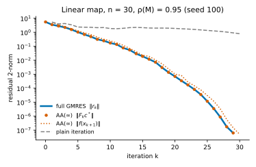
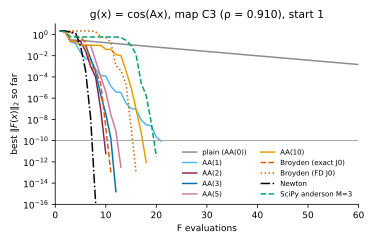
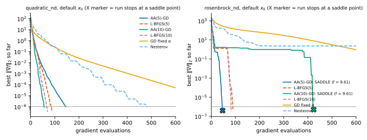
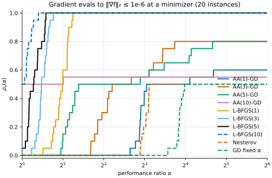
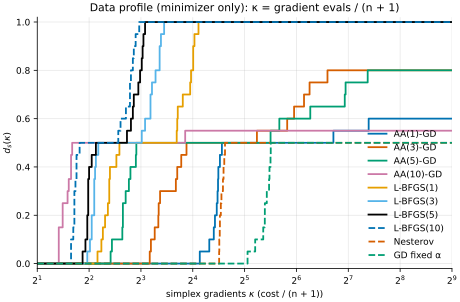
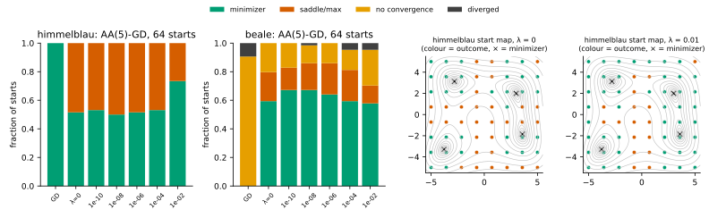

# Anderson acceleration AA(m) and RNA: fixed-point maps, gradient descent, GMRES and L-BFGS

Promoted to numopt as `anderson_gd` (`src/numopt/unconstrained/anderson.py`, tests in
`tests/test_unconstrained_anderson.py`). The package method adds a second-order test at the
stopping point, so a stop at a saddle point or a maximizer gives `converged=False`. The fixed-point
solver `anderson` of `method.py` is not promoted.

## Question

1. **Correctness.** On a linear map $g(x) = Mx + b$, does untruncated AA reproduce the GMRES residual
   history to rounding error, as Walker & Ni (2011, Thm. 2.2) predict?
2. **Main question.** With equal memory $m \in \{1, 3, 5, 10\}$, does AA($m$) applied to gradient
   descent match L-BFGS($m$) in gradient evaluations on `quadratic_nd` and `rosenbrock_nd`? Does
   AA($m$) beat plain iteration and good Broyden on 2-D maps $g(x) = \cos(Ax)$?
3. **Robustness.** Does the RNA term $\lambda \in [10^{-10}, 10^{-2}]$ stop plain AA from diverging
   from nonconvex starts on `himmelblau` and `beale`?

## Background

For a fixed-point problem $x = g(x)$, let $f_i = g(x_i) - x_i$, $m_k = \min(m, k)$ and
$F_k = [f_{k-m_k}, \dots, f_k]$. AA($m$) (Anderson 1965; Walker & Ni 2011, Alg. AA, eq. 1.1) with
mixing $\beta$ and the RNA Tikhonov term (Scieur, d'Aspremont & Bach 2016) computes

$$
\begin{aligned}
c^\star &= \arg\min_{\mathbf 1^\top c = 1} \|F_k c\|_2^2 + \lambda' \|c\|_2^2, \\
\lambda' &= \lambda \|F_k\|_2^2, \\
x_{k+1} &= \sum_{i=0}^{m_k} c^\star_i \big[(1-\beta)\,x_{k-m_k+i} + \beta\, g(x_{k-m_k+i})\big].
\end{aligned}
$$

The value $\lambda = 0$ gives plain AA. In practice the constraint is removed: with the difference
matrices $\Delta F = [f_{i+1} - f_i]$ and $\Delta X = [x_{i+1} - x_i]$,

$$
\begin{aligned}
\gamma^\star &= \arg\min_\gamma \|f_k - \Delta F\,\gamma\|_2, \\
x_{k+1} &= x_k + \beta f_k - (\Delta X + \beta\,\Delta F)\,\gamma^\star .
\end{aligned}
$$

Three known facts frame the study:

* **GMRES.** For $g(x) = Mx + b$ and $m = \infty$, the point $\bar x_k = \sum_i c^\star_i x_i$ is
  the $k$-th GMRES iterate for $(I - M)x = b$. Also $\|F_k c^\star\| = \|r_k^{\mathrm{GMRES}}\|$
  and $x_{k+1} = g(\bar x_k)$ (Walker & Ni 2011, Thm. 2.2).
* **Multisecant.** AA is the quasi-Newton step $x_{k+1} = x_k - H_k f_k$ with
  $H_k = -\beta I + (\Delta X + \beta \Delta F)(\Delta F^\top \Delta F)^{-1}\Delta F^\top$, and
  $H_k \Delta F = \Delta X$ (Fang & Saad 2009, Type-II).
* **Theory and variants.** Toth & Kelley (2015) prove local r-linear convergence for contractions.
  Zhang, O'Donoghue & Boyd (2020) add safeguards for global convergence. This study does not
  implement those safeguards.

## Method

`method.py` implements two functions with the numopt contract (`Result`, full trace, `Step.info`
geometry, exact counts and honest `converged` flags). The `PARAMS` dict holds the `ParamSpec`
lists for later promotion.

* `anderson(problem, *, x0, m, beta, lam, omega, ftol, max_iter)`: AA on
  $g(x) = x + \omega F(x)$ for a system $F(x) = 0$. It uses one $F$ evaluation per iteration and no
  Jacobian.
* `anderson_gd(problem, *, x0, m, lr, beta, lam, gtol, max_iter)`: AA on
  $g(x) = x - \alpha\nabla f(x)$. It uses one gradient per iteration and has no line search or
  descent safeguard. The code evaluates $f$ only for the trace's `fun`.

The coefficient problem is one stacked least-squares solve,
$\min_\gamma \|[f_k;\ \sqrt{\lambda'}e] - [\Delta F;\ -\sqrt{\lambda'}D]\gamma\|$, with
$c = e + D\gamma$ and $D$ bidiagonal. The solve is SVD-based (`np.linalg.lstsq`). It never uses
the normal equations.

Deviations (each is also marked `# NOTE:` in the code):

* RNA (Scieur et al., Alg. 2) extrapolates $\sum c_i x_i$ of a fixed base sequence. Here the RNA
  weights go into the AA step, and the iteration restarts from the result (the online form). Thus
  $\lambda$ is the only RNA ingredient that this study tests. The adaptive $\lambda$ grid and the
  step-length search of their Alg. 3 are not implemented.
* $\lambda$ is relative: $\lambda' = \lambda\|F_k\|_2^2$, the normalization $R^\top R/\|R^\top R\|$
  of Scieur et al., Alg. 3, step 3. Thus $c^\star$ does not depend on the units of $F$.
* Walker & Ni remove the oldest columns when the QR factor of $\Delta F$ is ill-conditioned. This
  code uses the truncated-SVD minimum-norm solution instead.

**Tests** (`test_method.py`, 33 tests, all pass):

* AA(0) reproduces numopt `fixed_point` on $x \leftarrow \cos x$ bit for bit.
* The first two steps match a hand computation.
* Untruncated AA matches numopt `gmres` (Walker–Ni Thm. 2.2) on 5 non-normal matrices.
* AA(∞)-GD on a quadratic reaches $x^\star$ at step $n+1$ to $10\kappa\varepsilon\|\nabla f(x_0)\|$.
* The trace satisfies the Fang–Saad multisecant identities.
* A Hypothesis test (1500 examples) compares the coefficients with an independent KKT oracle
  (`scipy.linalg.solve`) over $\lambda \in \{0, 10^{-10}, 10^{-6}, 10^{-2}, 1\}$ and residual
  scales $10^{\pm 8}$. It also checks scale invariance. These windows have full column rank
  ($n \ge m + 2$).
* A second Hypothesis test (1500 examples) covers the underdetermined windows $m > n$ that E2 uses
  ($\Delta F$ is $n \times m$ with rank $\le n < m$). For $\lambda = 0$, $\gamma^\star$ is not
  unique. The test checks that $\|F_k c^\star\|$ equals the optimal value from an independent
  parametrization $c = \mathbf 1/p + Nz$ (LAPACK `gelsy`), and that $\gamma^\star \perp
  \operatorname{null}(\Delta F)$. Together these define the minimum-norm solution. For
  $\lambda > 0$, $c^\star$ is unique, and the test compares it with the same parametrization on the
  stacked rows $[F;\ \sqrt{\lambda'} I]$. A mutation check confirms that the test fails when
  $\gamma^\star$ gets a null-space component or when $\lambda'$ loses the factor $\|F_k\|_2^2$.
* The root agrees with `scipy.optimize.anderson`.
* Other tests cover the contract checks of `tests/conftest.py`, rank deficiency, failure paths
  (max_iter, divergence, non-finite values) and input validation.

## Setup

All start points come from `numopt.core.rng.Rng` with fixed seeds. The run uses no network.

| | problems | starts | metric | budget |
|---|---|---|---|---|
| E1 | $g(x) = Mx + b$, $n = 30$, $\rho(M) = 0.95$, $M$ Gaussian (5 seeds) | $x_0 = 0$ | deviation from full GMRES (`restart = n`) | 30 iterations |
| E2 | $g(x) = \cos(Ax)$ for 5 matrices $A$ (C1–C4 attracting, $\rho(g'(x^\star)) = 0.43$–$0.97$; N1 repelling, $\rho = 1.19$) | 10 uniform in $[-2, 2]^2$ | $F$ evaluations to the first $\|F\|_2 \le 10^{-10}$ | 500 $F$ evaluations |
| E3 | `quadratic_nd` ($n = 20$, $\kappa = 100$), `rosenbrock_nd` ($n = 10$) | default $x_0$ + 9 uniform in the domain | gradient evaluations to the first $\|\nabla f\|_2 \le 10^{-6}$ **at a minimizer** ($\lambda_{\min}(\nabla^2 f) > 0$) | 2000 gradients |
| E4 | `himmelblau` (starts in $[-5,5]^2$), `beale` (starts in $[-2,2]^2$), $\alpha = 0.01$ | 8 × 8 grid (64) | outcome class after ≤ 2000 iterations | 2000 iterations |

A wrapper counts every call of $F$ or $\nabla f$, including line-search trial points. The metric
is the index of the first call that meets the tolerance, so it does not depend on how a method
fills its trace or on its own stopping test. In E3, a call counts only if the Hessian at that point
is positive definite. AA-GD solves $\nabla f = 0$ and stops at the first stationary point, so a stop
at a saddle point is a failure, not a solve. E3 reports these saddle stops separately.

Baselines and tuning (E2, E3):

* **E2 baselines.**
  * Plain iteration is AA(0); the tests show it is identical to numopt `fixed_point`.
  * `broyden` runs with the exact $J_0$ (one Jacobian) and with a central-difference $J_0$
    ($2n + 1 = 5$ $F$ evaluations, included in the count).
  * `newton_system` runs undamped with exact Jacobians; the Jacobians are not in the $F$ count.
  * `scipy.optimize.anderson(M=3)` (SciPy 1.18.1) runs with its default line search.
* **E3 tuning.**
  * L-BFGS($m$) and GD with backtracking use the numopt defaults (strong Wolfe for L-BFGS) and
    are not tuned.
  * AA($m$)-GD, GD with a fixed $\alpha$, and Nesterov are **tuned on the test instances**. For
    each problem and memory, the run keeps the step $\alpha$ (and Nesterov's
    $\mu \in \{0.9, 0.95, 0.99\}$) with the most instances solved (at a minimizer), then the
    smallest median.
  * The $\alpha$ grids are $\{0.005, 0.01, 0.015, 0.0199, 0.025, 0.03, 0.04, 0.05, 0.07, 0.1\}$
    for `quadratic_nd` ($L = 100$) and $\{0.625, 1.25, 2.5, 5, 10, 20, 40\} \cdot 10^{-4}$ for
    `rosenbrock_nd`. AA does not need the GD stability limit $\alpha < 2/L$, so the quadratic grid
    goes past $2/L = 0.02$. Every tuned AA($m$)-GD step is inside its grid, not at an edge
    (`chosen_at_grid_edge` in `results/e3_gd.json`). This tuning favors AA.
* **E4 outcomes.**
  * *minimizer*: converged, with a positive definite Hessian.
  * *saddle/max*: converged to a stationary point that is not a minimizer.
  * *diverged*: $\|x\| > 10^{12}\max(1, \|x_0\|)$ or a non-finite value.
  * *no convergence*: the run reached `max_iter`.

## Results

### E1: untruncated AA is GMRES (`results/e1_gmres.json`)

All five matrices have $\kappa(I - M)$ from 10.3 to 247.4. Over 30 iterations, the largest values are:

* $\max_k \big|\|F_k c^\star\| - \|r_k^{\mathrm{GMRES}}\|\big| / \|r_0\| = 2.49 \times 10^{-15}$;
* $\max_k \|x_{k+1}^{\mathrm{AA}} - g(x_k^{\mathrm{GMRES}})\| / \max(1, \|x_k^{\mathrm{GMRES}}\|) = 2.04 \times 10^{-14}$.

Thus the answer to question 1 is yes, to rounding error ($\approx 10\,\varepsilon$ and
$\approx 90\,\varepsilon$).



### E2: 2-D maps cos(Ax) (`results/e2_contractions.json`)

Each cell gives the starts solved out of 10, then the median $F$ evaluations to
$\|F\|_2 \le 10^{-10}$.

| method | C1 (ρ = 0.432) | C2 (ρ = 0.676) | C3 (ρ = 0.910) | C4 (ρ = 0.967) | N1 (ρ = 1.189) |
|---|---|---|---|---|---|
| plain iteration (AA(0)) | 10/10, 28 | 10/10, 59.5 | 10/10, 237 | 0/10, – | 0/10, – |
| AA(1) | 10/10, 13 | 10/10, 29.5 | 10/10, 17 | 10/10, 18 | 10/10, 22 |
| **AA(2)** ($m = n$) | **10/10, 7** | **10/10, 9** | **10/10, 8.5** | **10/10, 9** | **10/10, 9** |
| AA(3) | 10/10, 8.5 | 10/10, 10 | 10/10, 9 | 10/10, 10 | 10/10, 10.5 |
| AA(5) | 10/10, 10 | 10/10, 12 | 10/10, 11 | 10/10, 11.5 | 10/10, 12.5 |
| AA(10) | 10/10, 14 | 10/10, 15 | 10/10, 14.5 | 10/10, 16 | 10/10, 17.5 |
| Broyden, exact $J_0$ (+1 Jacobian) | 10/10, 8.5 | 10/10, 10.5 | 10/10, 10 | 10/10, 9.5 | 10/10, 10.5 |
| Broyden, FD $J_0$ | 10/10, 13.5 | 10/10, 15.5 | 10/10, 15 | 10/10, 14.5 | 10/10, 15.5 |
| Newton (+ median 4.5–7 Jacobians) | 10/10, 5.5 | 8/10, 6.5 | 10/10, 7 | 8/10, 5.5 | 7/10, 5 |
| SciPy `anderson`, M = 3 | 10/10, 11 | 10/10, 13 | 10/10, 12 | 10/10, 13 | 10/10, 16.5 |

* AA(2) needs 7–9 $F$ evaluations on all five maps. It is the fastest AA variant on every map.
* Plain iteration needs 28–237 evaluations and fails on C4 and N1 within 500 evaluations. C4
  would need about $\ln 10^{-10} / \ln 0.967 \approx 690$; N1 has a repelling fixed point.
* AA(2) needs 0.5–1.5 fewer evaluations than Broyden with an exact $J_0$, and it does not need
  that Jacobian. AA(3) is within ±1 evaluation of the same Broyden. Against Broyden with a
  finite-difference $J_0$, AA(2) uses 5.5–6.5 fewer evaluations.
* **Memory beyond $m = n$ makes AA slower here, and the cause is the dimension.** For $m > n = 2$,
  the matrix $\Delta F \in \mathbb R^{2 \times m}$ has rank $\le 2$, so the coefficient problem is
  underdetermined. `lstsq` returns the minimum-norm $\gamma^\star$ (the test above checks this).
  The extra columns cannot lower the least-squares residual, because two columns already span
  $\mathbb R^2$. They only change which minimizing $\gamma$ the solver selects. The medians grow
  with $m$: AA(2) < AA(3) < AA(5) < AA(10) on every map. Walker & Ni's column dropping would remove
  these extra columns; this code does not drop them (see the deviations above).



### E3: AA($m$)-GD vs L-BFGS($m$) (`results/e3_gd.json`, `results/e3_profiles.json`)

Each cell gives the starts solved out of 10, then the median gradient evaluations (∞ when more
than half fail), then [the runs that stopped at a saddle point]. A start is solved when
$\|\nabla f\|_2 \le 10^{-6}$ at a point with a positive definite Hessian. On both problems, every
solved run of every method ended at the global minimum ($f \le 10^{-8}$). No run ended at the
local minimizer of `rosenbrock_nd` near $x_1 = -1$.

| memory | AA($m$)-GD, quadratic_nd | L-BFGS($m$), quadratic_nd | AA($m$)-GD, rosenbrock_nd | L-BFGS($m$), rosenbrock_nd |
|---|---|---|---|---|
| 1 | 10/10, 465.5 [0] (α = 0.015) | 10/10, 109 [0] | 2/10, ∞ [**4**] (α = 2.5×10⁻⁴) | 10/10, 171 [0] |
| 3 | 10/10, 215 [0] (α = 0.03) | 10/10, 90 [0] | 6/10, 952.5 [**3**] (α = 10⁻³) | 10/10, 104.5 [0] |
| 5 | 10/10, 134.5 [0] (α = 0.01) | 10/10, 83 [0] | 6/10, 1591.5 [**3**] (α = 10⁻³) | 10/10, 86 [0] |
| 10 | **10/10, 61 [0]** (α = 0.01) | 10/10, 69 [0] | 1/10, ∞ [**2**] (α = 2×10⁻³) | 10/10, 76.5 [0] |

* **Saddle stops.** On `rosenbrock_nd`, 12 of the 40 AA-GD runs above stop at the same saddle
  point: $f = 9.606$, smallest Hessian eigenvalue $-2.81$. These stops are fast. For example,
  AA(5)-GD stops at the saddle after 47 and 72 gradients, and AA(3)-GD after 70, 83 and 130. A
  count that accepts any $\|\nabla f\| \le 10^{-6}$ credits these runs. For example, it puts the
  AA(5)-GD saddle stop on the default $x_0$ (47 gradients) ahead of L-BFGS(10) (82). With the
  minimizer criterion, no AA-GD run on `rosenbrock_nd` is within 2× of the cheapest method.
* **Runs without a stationary point.** The other AA-GD failures reach `max_iter` = 2000 without
  convergence. AA(10)-GD wanders on 7 of 10 starts: the final $f$ values are 8.91, 41.2, 78.6,
  219, 7.17×10³, 2.57×10⁷ and 1.55×10⁸.
* **Tuning.** The tuned AA steps are all inside the grids. On `quadratic_nd`, the AA(3) sweep is
  not monotone (276 at α = 0.025, 215 at 0.03, 351.5 at 0.04). Larger steps than 2/L help AA(3)
  only (239 → 215); AA(1), AA(5) and AA(10) are best at α ≤ 0.015.

Single-memory baselines on the same instances:

* `quadratic_nd`: GD with a fixed α needs 892.5 (α = 0.015), GD with backtracking needs 406.5,
  and Nesterov needs 491 (α = 0.01, μ = 0.9).
* `rosenbrock_nd`: GD with a fixed α and Nesterov solve 0/10 within 2000 gradients at every grid
  value. GD with backtracking solves 0/10.

Over the 20 instances, the performance profile (minimizer criterion) gives these values:

* $\rho_s(1)$, the fraction of instances where a method is the cheapest (ties count for each):
  AA(10)-GD 0.50 (all on `quadratic_nd`), L-BFGS(10) 0.50, L-BFGS(5) 0.05. Every other method
  has 0.
* $\rho_s(2)$, the fraction within 2× of the cheapest: L-BFGS(3), L-BFGS(5) and L-BFGS(10) 1.00,
  L-BFGS(1) 0.60, AA(10)-GD 0.50, AA(5)-GD 0.15, all others 0.
* The fraction solved: all L-BFGS($m$) 1.00; AA(1, 3, 5, 10)-GD 0.60, 0.80, 0.80, 0.55;
  Nesterov and GD with a fixed α 0.50.

In the convergence figure, an X marks a run that stops at a saddle point, and the legend says so.
On the default $x_0$ of `rosenbrock_nd`, AA(5)-GD (47 gradients) and AA(10)-GD (424) both stop
at the saddle.





### E4: RNA λ from nonconvex starts (`results/e4_rna.json`)

The table gives the outcome counts out of 64 starts for AA(5)-GD; `results/` also has $m = 3$ and
$m = 10$.

| | GD (AA(0)) | λ = 0 | 10⁻¹⁰ | 10⁻⁸ | 10⁻⁶ | 10⁻⁴ | 10⁻² |
|---|---|---|---|---|---|---|---|
| himmelblau: minimizer / saddle-max / diverged | 64 / 0 / 0 | 33 / 31 / 0 | 34 / 30 / 0 | 32 / 32 / 0 | 33 / 31 / 0 | 34 / 30 / 0 | **47 / 17 / 0** |
| himmelblau: median iterations to a minimizer | — | 12 | 16 | 16 | 16 | 17.5 | 27 |
| beale: minimizer / saddle-max / no conv. / diverged | 0 / 0 / 58 / 6 | 38 / 13 / 13 / 0 | 43 / 10 / 11 / 0 | 43 / 12 / 8 / 1 | 41 / 14 / 9 / 0 | 38 / 14 / 9 / 3 | 37 / 8 / 16 / 3 |

* **Plain AA did not diverge.** Over 384 runs ($m \in \{3, 5, 10\}$, both problems), plain AA
  ($\lambda = 0$) diverged 0 times. On beale this includes the 6 starts where GD with the same α
  diverges.
* **RNA added divergences on beale.** $\lambda > 0$ gave 22 diverged runs over all $m$. 20 of
  them start where GD with the same α diverges, and the other 2 start where GD does not converge.
  `results/e4_rna.json` records the weights of each diverged run (`diverged_runs`). Step 1 is
  always the Picard step with $c = [1]$, so the diagnostic uses $k \ge 2$ only.
  * 18 of the 22 runs ($\lambda \in \{10^{-4}, 10^{-2}\}$, from the three corners
    $(-2, -2)$, $(2, -2)$, $(2, 2)$) have $\max_{k \ge 2}\|c^\star\|_2 = 0.988$–$1.000$. Thus AA
    does not extrapolate with large weights there.
  * The other 4 runs ($\lambda \in \{10^{-8}, 10^{-6}, 10^{-4}\}$) have
    $\max_{k \ge 2}\|c^\star\|_2 = 18.7$–$1956$, so large extrapolation weights occur in them.
  * In all 22 runs, the last weights are $1/m_k$ on each older iterate and at most 0.0033 on the
    newest one. The cause is the relative scale $\lambda' = \lambda\|F_k\|_2^2$: the residual of
    the newest iterate grows fast, so $\lambda'$ becomes much larger than the other columns of
    $F_k^\top F_k$. The Tikhonov term then forces a uniform average of $g(x_i) = x_i - \alpha
    \nabla f(x_i)$ over the older iterates. That average does not stop the divergence when the
    older iterates are already where the GD map with this α is expansive.
* **The real failure is the stationary point.** Plain AA($m$)-GD converged to a saddle point or a
  maximum from 28–32 of the 64 himmelblau starts; GD did so from 0. Only $\lambda = 10^{-2}$
  reduced this, to 17 ($m = 3$, $m = 5$) and 11 ($m = 10$), at a cost of 1.9–2.8× more median
  iterations. $\lambda \le 10^{-4}$ changed the count by at most 4.



## Discussion

* **Correctness (Q1).** The implementation reproduces GMRES to $2.5 \times 10^{-15}\|r_0\|$. It
  also satisfies the Fang–Saad secant identities. It matches an independent KKT oracle over 1500
  full-rank windows, and the minimum-norm characterization over 1500 underdetermined windows.
* **Fixed-point maps (Q2b): yes.** AA(2) beats plain iteration by 4.0× (C1) to 28× (C3).
  It also converges where plain iteration cannot (C4 within the budget; N1, a repelling fixed
  point). It needs 0.5–1.5 fewer evaluations than good Broyden with an exact $J_0$, and it needs
  no Jacobian. In 2-D, memory $m > n = 2$ only makes the coefficient problem underdetermined, and
  each extra column makes AA slower.
* **Gradient descent (Q2a): no.** AA($m$)-GD does not match L-BFGS($m$) for $m \le 5$. On
  `quadratic_nd` it needs 1.6–4.3× more gradients (2.4× at $m = 3$). On `rosenbrock_nd`, with
  only minimizers counted, its median is 9.1× (m = 3) and 18.5× (m = 5) higher. For $m = 1$ and
  $m = 10$ the median is ∞, because AA-GD solves 2/10 and 1/10 starts. AA-GD wins only at
  $m = 10$ on the quadratic (61 vs 69). On a quadratic, untruncated AA-GD is GMRES on
  $\nabla f = 0$ (E1), AA(10) is its windowed version, and L-BFGS is close to CG.
* **AA-GD is not a descent method.** On `rosenbrock_nd`, at most 6 of 10 AA-GD runs reach a
  minimizer (L-BFGS: 10/10). 12 of the 40 tuned AA-GD runs stop at a saddle point, and these
  stops are the fastest AA runs. AA(10)-GD wanders without convergence on 7 of 10 starts within
  2000 gradients. These results come with an α that was tuned on the test instances, so the
  comparison favors AA.
* **RNA (Q3): the premise did not hold.** Plain AA did not diverge in these runs. Its failure is
  convergence to non-minimizing stationary points: it solves $\nabla f = 0$, and nothing in
  the step prefers minima. $\lambda = 10^{-2}$ moves the weights toward uniform averaging and
  cuts that failure on himmelblau by 45–61%, but it costs iterations. On beale it adds divergences,
  20 of 22 at starts where GD itself diverges. In 18 of them the weights are not large
  ($\|c^\star\|_2 \le 1$ for $k \ge 2$), and the run ends as a uniform average of gradient steps.
  $\lambda \le 10^{-4}$ had almost no effect on himmelblau.

**Threats to validity.**

* The problem sets are small: 2 smooth problems in E3, 5 maps in E2, and 10 starts each.
* The E3 minimizer test is the sign of $\lambda_{\min}(\nabla^2 f)$ at the first point with
  $\|\nabla f\|_2 \le 10^{-6}$. The saddle on `rosenbrock_nd` has $\lambda_{\min} = -2.81$ and
  the minimizers have $\lambda_{\min} = 0.499$, so the test has a large margin here.
* The tuning favors AA, GD with a fixed α, and Nesterov (oracle-tuned on the test instances).
  L-BFGS ran with defaults.
* The gradient metric charges line-search gradients to L-BFGS. It does not charge AA-GD for the
  $f$ evaluations of its trace, which do not influence the iterates.
* numopt `nesterov` evaluates 2 gradients per iteration (look-ahead and stopping test), so its
  counts are about 2× its iteration counts.
* The E4 start grid is symmetric, and the saddle and maximum basins depend on α.
* The study does not cover the safeguarded AA of Zhang et al. (2020), Scieur's offline
  extrapolation with the adaptive λ search, or restarted AA. It does not test float32 either.
* `scipy.optimize.anderson` is a different variant (Eyert's Jacobian form with a line search),
  so it is a reference, not an exact oracle.

## Reproduce

```bash
.venv/bin/pytest research/anderson-acceleration -q                      # 33 tests
.venv/bin/python research/anderson-acceleration/run.py                  # E1–E4, 60–115 s measured (shared machine)
```

The run writes `results/*.json` (with `timings.json`) and `figures/*.svg` and `*.png`.

## References

* H. F. Walker, P. Ni, *Anderson acceleration for fixed-point iterations*, SIAM J. Numer. Anal.
  49(4):1715–1735, 2011. doi:10.1137/10078356X
* A. Toth, C. T. Kelley, *Convergence analysis for Anderson acceleration*, SIAM J. Numer. Anal.
  53(2):805–819, 2015. doi:10.1137/130919398
* H. Fang, Y. Saad, *Two classes of multisecant methods for nonlinear acceleration*, Numer. Linear
  Algebra Appl. 16:197–221, 2009. doi:10.1002/nla.617
* D. Scieur, A. d'Aspremont, F. Bach, *Regularized nonlinear acceleration*, NeurIPS 2016
  (arXiv:1606.04133; algorithm numbers refer to the arXiv text).
* J. Zhang, B. O'Donoghue, S. Boyd, *Globally convergent type-I Anderson acceleration for
  nonsmooth fixed-point iterations*, SIAM J. Optim. 30(4), 2020. doi:10.1137/18M1232772
* D. G. Anderson, *Iterative procedures for nonlinear integral equations*, J. ACM 12(4):547–560, 1965.
