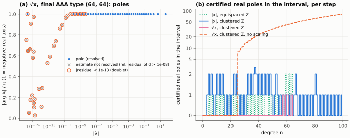
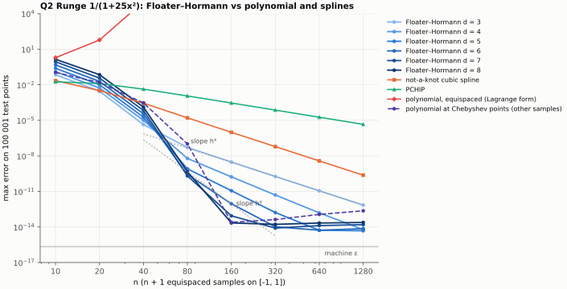
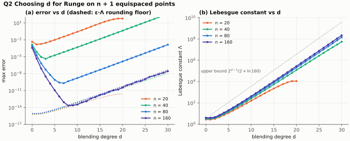

# Barycentric rational approximation: AAA and Floater–Hormann vs polynomials

Promoted to numopt as `aaa` and `floater_hormann` (`src/numopt/interpolation/rational.py`, tests in
`tests/test_interpolation_rational.py`). The package AAA gives the same weights, poles and
certified real poles as `method.py`, and its message reports each certified real pole in the
interval. `lebesgue_constant` and `aaa_eval` of `method.py` are not promoted.

Every number below is copied from `results/tables.md` or read from `results/*.json`
(both generated by `run.py`). The Floater–Hormann (FH) table values are also checked against the
published tables in `test_method.py`.

## Question

1. For $|x|$ on $[-1,1]$, $\sqrt{x}$ on $[0,1]$, $\tanh(50x)$ and $1/(1+25x^2)$ on $[-1,1]$,
   does the AAA error fall root-exponentially in the degree $n$, like $e^{-C\sqrt n}$ as
   Newman's theorem allows, while Chebyshev interpolation falls only algebraically
   ($\sim 1/n$ for $|x|$)? Does AAA reach that rate in floating point?
2. On equispaced samples of Runge's function, does FH with $d = 3,\dots,8$ converge at
   $O(h^{d+1})$ where the interpolating polynomial diverges, until the Lebesgue constant
   (which grows like $2^d$) takes over? Does any $d$ beat the not-a-knot cubic spline at
   equal $n$?

## Background

Both methods use the barycentric form that numopt's `barycentric` method evaluates
(Berrut & Trefethen 2004, eq. (4.2); Nakatsukasa, Sète & Trefethen 2018, eq. (2.1)):

$$
r(z) \;=\; \frac{\displaystyle\sum_{j=1}^{m} \frac{w_j f_j}{z-z_j}}{\displaystyle\sum_{j=1}^{m} \frac{w_j}{z-z_j}},
\qquad r(z_j) = f_j \ \text{ if } w_j \neq 0 .
$$

Only the weights differ.

**AAA** (NST 2018, Fig. 4.1). The method samples $F = f(Z)$ on a set $Z$ of $M$ points.
It starts from $R = \operatorname{mean}(F)$. At step $m$ it adds the worst sample
$z_m = \arg\max_{Z}|F - R|$ as a support point. Then it takes $w$ as the right singular
vector of the smallest singular value of the $(M-m)\times m$ Loewner matrix (eqs. (3.5)–(3.6)):

$$
A^{(m)}_{ij} = \frac{F_i - f_j}{Z_i - z_j}, \qquad
w = \arg\min_{\|w\|_2 = 1} \|A^{(m)} w\|_2 .
$$

AAA stops when $\max_Z |F - r| \le 10^{-13}\max|F|$. The result is of type $(m-1, m-1)$.
The poles are the finite eigenvalues of the $(m+1)\times(m+1)$ arrowhead pencil (3.11).
The method flags poles with $|\text{residue}| < 10^{-13}$ as numerical Froissart doublets
(NST §5). Best rational approximation of $|x|$ has error
$E_{nn} \sim 8e^{-\pi\sqrt n}$ (Stahl 1993, quoted in NST §6.7). The substitution $x = t^2$
gives $8e^{-\pi\sqrt{2n}}$ for $\sqrt x$ on $[0,1]$.

**Floater–Hormann** (FH 2007, eqs. (4), (5), (18)). FH blends the degree-$d$ interpolants
$p_i$ through $x_i,\dots,x_{i+d}$:

$$
r(x) = \frac{\sum_{i=0}^{n-d}\lambda_i(x)p_i(x)}{\sum_{i=0}^{n-d}\lambda_i(x)},\quad
\lambda_i(x)=\frac{(-1)^i}{(x-x_i)\cdots(x-x_{i+d})},\quad
w_k = (-1)^{k-d}\!\!\sum_{i\in J_k}\prod_{\substack{j=i\\ j\ne k}}^{i+d}\frac{1}{|x_k-x_j|},
$$

with $J_k=\{i: k-d\le i\le k,\ 0\le i\le n-d\}$. The interpolant $r$ has no real poles
(Theorem 1). If $f\in C^{d+2}$, then $\|f-r\| = O(h^{d+1})$ (Theorem 2). For equispaced
nodes the Lebesgue constant satisfies

$$
\frac{1}{2^{d+2}}\binom{2d+1}{d}\ln\!\left(\frac{n}{d}-1\right) \;\le\; \Lambda_n \;\le\; 2^{d-1}(2+\ln n)
$$

(Bos, De Marchi, Hormann & Klein 2012, Theorems 1–2).

## Method

The implementation is `method.py`. It needs only NumPy and reuses numopt's
`_barycentric_eval` and Result helpers.

* `aaa(problem, *, tol=1e-13, max_terms=100, scaling="columns")` implements NST Fig. 4.1
  with one deviation, marked `# NOTE:` in the code. With the default `scaling="columns"`,
  the SVD acts on $A^{(m)}D$ with $D=\operatorname{diag}(1/\|a_j\|)$, and
  $w = Dv/\|Dv\|$. `scaling="none"` is Fig. 4.1 exactly. The reason for the deviation is
  measured: for the clustered $\sqrt x$ samples the column norms differ by a factor
  $9.2\cdot10^{13}$, and at $m = 24$ the scaling reduces $\kappa(A^{(m)})$ from
  $4.7\cdot10^{21}$ to $5.2\cdot10^{8}$. SciPy's `AAA` switches to the same scaling once
  $\kappa > 1/(3\varepsilon)$.
* Poles: numopt has no runtime SciPy (no QZ), so `barycentric_poles` reduces the pencil
  (3.11) exactly, by one shift-and-invert step, to an $m\times m$ eigenproblem. It then
  polishes each pole with 3 safeguarded Newton steps on $d(\lambda)$. Against roots
  computed in long double (IEEE quad on this machine), the 24 poles for tanh(50x) have
  relative error at most $6.3\cdot10^{-10}$ (median $2.1\cdot10^{-11}$). QZ gives
  $2.8\cdot10^{-9}$ (median $3.1\cdot10^{-10}$).
* Resolution of the pole positions. The eigenvalue route computes $\lambda=\sigma+1/\mu$
  with a shift $|\sigma|\approx1$, so its absolute resolution is about
  $\varepsilon|\sigma|\approx10^{-16}$. Estimates closer to the origin than that are
  noise; QZ is not better here. Fig. 2a marks an estimate as *not resolved* when the
  relative residual $|d(\lambda)|/\sum_j|w_j/(\lambda-z_j)|$ exceeds $10^{-8}$.
* Real poles in $[a,b]$ (`n_interval_poles`, `interval_poles`) are therefore not read off
  the eigenvalue list. `real_denominator_roots` certifies each one by a sign change of the
  real function $d(t)=\sum_j w_j/(t-z_j)$. It samples $d$ on every gap between support
  points, keeps only samples whose sign exceeds the rounding bound
  $4(m+2)\varepsilon\sum_j|w_j/(t-z_j)|$, and uses the exact limit signs next to each
  support point. So equal signs of neighboring weights force a zero in their gap
  (Schneider–Werner). Each sign change is bisected in absolute float64 arithmetic, which
  resolves a pole at $-4\cdot10^{-17}$. The count is a certified lower bound: two zeros
  closer than the sample spacing, and not separated by a near-real eigenvalue estimate,
  are missed. An earlier version used the relative test $|\operatorname{Im}\lambda|\le
  \sqrt\varepsilon|\lambda|$ on the eigenvalue estimates. That test missed real poles at
  $|\lambda|<10^{-15}$ on 20 steps of the clustered $|x|$ run.
* `floater_hormann(problem, *, d=3)` implements eq. (18) and computes the weights in O(nd²).
  It multiplies all weights by $h^d$, a common factor that cancels and prevents overflow.
* `lebesgue_constant(x, w)` is the maximum of the Lebesgue function on 30–400 points per
  gap.

The tests (`test_method.py`, 33 tests, Hypothesis with 1000 examples per property test)
check the following:
* The AAA support-point sequence equals that of SciPy `AAA(rtol=1e-13, clean_up=False)`
  for 23 of 25 steps on tanh(50x). Step 24 is a rounding tie between neighboring samples
  at an error level near $10^{-13}$.
* The approximants agree to $10^{-12}$.
* $\sigma_{\min}$ is monotone (NST Prop. 3.1).
* AAA is affine in $f$.
* AAA recovers type $(k,k)$ rational functions exactly, and finds their poles.
* The poles of tanh(50x) are found at $\pm i\pi/100$ with residue $1/50$.
* `real_denominator_roots` finds every prescribed real zero of $d$ (weights built by
  partial fractions from known zeros, a Hypothesis property test), including a zero at
  $-4\cdot10^{-17}$ between support points $\pm10^{-15}$. On the clustered $|x|$ run
  with 50 support points, its count equals an independent long-double sign scan of $d$.
* FH matches the integer weights of FH §4, SciPy's `FloaterHormannInterpolator`, and the
  values in FH Table 1.
* FH reproduces polynomials of degree ≤ d.
* The FH denominator does not change sign on any gap (Theorem 1).
* The Lebesgue constants stay within the bounds of Bos et al.

## Setup

* **Q1.** AAA uses `tol=1e-13` and `max_terms=100`, with both `scaling` values.
  * Sample sets Z: "equispaced" has 20 000 points for $|x|$ and $\sqrt x$, and 2 000 for
    tanh and Runge. "Clustered" has 4 000 equispaced points ∪ 1 000 points log-spaced in
    $[10^{-15},1]$ on each side of 0 for $|x|$, or 2 000 points in $[10^{-30},1]$ for
    $\sqrt x$. These two sets correspond to each other under $x=t^2$.
  * The error is the maximum over a separate test grid: 100 001 to 200 001 equispaced
    points plus 20 001 to 30 001 log-spaced points near the singularity, down to
    $10^{-16}$ for $|x|$ and $10^{-32}$ for $\sqrt x$.
  * The baseline is numopt `chebyshev_interpolation` at degree $n$ ($n+1$ Chebyshev
    points, $n\le 1000$), evaluated with `numpy.polynomial.chebyshev.chebval`. The curves
    and fits use 37 degrees (1–20, then log-spaced to 1000). The "smallest degree" table checks *every*
    $n\le1000$: it computes the same coefficients by a DCT (max difference from numopt's
    $3.2\cdot10^{-14}$) and uses the error on every 50th test point as a lower bound to
    skip degrees.
  * Rate test: least-squares fits of $\ln E = \alpha - C g(n)$ with $g=\sqrt n$
    (root-exponential) and $g=\ln n$ (algebraic). Each model is fitted on the whole window
    and on its two halves. A model that describes the data gives the same $C$ on both
    halves. The window runs from $n = 6$ to the first $n$ with $E\le10^{-11}$, so the
    rounding floor is excluded.
* **Q1, sample depth.** For $\sqrt x$, the log-spaced part of $Z$ starts at
  $10^{-10}, 10^{-15}, \dots, 10^{-30}$. The test grid is the same for every depth (down
  to $10^{-32}$), so the test error estimates the true error on $[0,1]$.
* **Q2.** Runge $1/(1+25x^2)$ on $n+1$ equispaced points, $n = 10,20,\dots,1280$. The
  error is measured on 100 001 points.
  * Baselines on the same samples, all numopt defaults: `lagrange`, `barycentric`,
    `cubic_spline_not_a_knot` and `pchip`.
  * Reference: `chebyshev_interpolation` with $n+1$ Chebyshev points, which uses
    *different* samples.
  * A sweep over $d = 0..\min(n,30)$ for $n = 10..160$.
  * In the paper's setting ($1/(1+x^2)$ on $[-5,5]$): FH Table 2 at $n=160$, $d=10$ on
    equispaced test grids of 101 to 100 001 points, in float64 and in long double; and FH
    Table 3 (clamped cubic spline) with SciPy's `CubicSpline` next to numopt's
    not-a-knot spline.
* Everything is deterministic (no random numbers). `OPENBLAS_NUM_THREADS=1` is set.
* Moré–Wild data and performance profiles (`numopt.bench`) do not apply. These are direct
  methods without a start point or an evaluation budget, so the comparison is error
  against degree (Q1) or against $n$ (Q2).

## Results

### Q1: AAA against Chebyshev interpolation


Rate fits ($C$ on the whole window; first half, second half in brackets; RMS residual in decades):

| function | approximant | window n | algebraic C | RMS | root-exp C | RMS |
|---|---|---|---|---|---|---|
| \|x\| | Chebyshev | 10–1000 | **1.00** (1.10, 1.01) | 0.11 | 0.17 (0.46, 0.12) | 0.21 |
| \|x\| | AAA, clustered Z | 6–92 | 9.66 (7.84, 12.53) | 0.81 | **3.38** (3.41, 3.05) | 0.71 |
| √x | Chebyshev | 10–1000 | **0.98** (0.96, 0.99) | 0.01 | 0.17 (0.39, 0.12) | 0.17 |
| √x | AAA, clustered Z | 6–45 | 9.87 (8.39, 12.98) | 0.30 | **4.47** (4.55, 4.41) | 0.11 |
| √x | AAA unscaled (Fig. 4.1), clustered Z | 6–24 | 8.46 (7.98, 9.05) | 0.10 | 4.69 (5.11, 4.14) | 0.11 |

The window ends at the first $n$ with $E\le10^{-11}$. Moving the end changes the
root-exponential $C$ (AAA, clustered Z, column scaling):

| function | window n | root-exp C (1st half, 2nd half) | RMS |
|---|---|---|---|
| \|x\| | 6–92 | 3.38 (3.41, 3.05) | 0.71 |
| \|x\| | 10–60 | 3.45 (3.62, 4.37) | 0.67 |
| \|x\| | 6–99 (to the best step) | 3.37 (3.44, 3.10) | 0.69 |
| √x | 6–45 | 4.47 (4.55, 4.41) | 0.11 |
| √x | 10–60 | 4.19 (4.45, 3.34) | 0.40 |
| √x | 6–64 (to the best step) | 4.21 (4.52, 3.37) | 0.39 |

For √x the ratio of the AAA error to $8e^{-\pi\sqrt{2n}}$ is 6.0–11.6 for
$n = 10..45$, then 18.1 at $n=60$ and 28.8 at $n=64$.

Smallest degree with test error ≤ level (— means not reached for n ≤ 99 with AAA, or
n ≤ 1000 with Chebyshev; every degree is checked):

| function | level | Chebyshev | AAA clustered Z | AAA clustered Z, unscaled | AAA equispaced Z |
|---|---|---|---|---|---|
| \|x\| | 10⁻⁶ | — | 39 | 36 | — |
| \|x\| | 10⁻¹⁰ | — | 78 | 79 | — |
| √x | 10⁻⁶ | — | 17 | 17 | — |
| √x | 10⁻¹⁰ | — | 38 | — | — |
| √x | 10⁻¹³ | — | 64 | — | — |
| tanh(50x) | 10⁻⁶ | 447 | n/a | n/a | 15 |
| tanh(50x) | 10⁻¹⁰ | 741 | n/a | n/a | 20 |
| tanh(50x) | 10⁻¹³ | 961 | n/a | n/a | 24 |
| 1/(1+25x²) | 10⁻⁶ | 70 | n/a | n/a | 2 |
| 1/(1+25x²) | 10⁻¹⁰ | 116 | n/a | n/a | 2 |
| 1/(1+25x²) | 10⁻¹³ | 150 | n/a | n/a | 2 |

An earlier version read the Chebyshev column off the log-spaced degree grid and reported
the first grid degree: 501, 794 and "—" for tanh(50x), 79, 126 and 158 for Runge. Those
values were 5–13 % too high, which favored AAA.

AAA runs (sample error = what AAA controls; test error = true maximum error):

| function | Z | scaling | m | converged | sample error | test error (final) | best test error (n) | certified real poles in interval | doublets | unresolved pole estimates |
|---|---|---|---|---|---|---|---|---|---|---|
| \|x\| | equispaced, M = 20000 | columns | 65 | True | 2.5×10⁻¹⁴ | 1.9×10⁻⁵ | 1.9×10⁻⁵ (64) | 1 (at −0.055) | 1 | 0 |
| \|x\| | clustered, M = 5998 | columns | 100 | False | 3.7×10⁻¹² | 3.7×10⁻¹² | 3.7×10⁻¹² (99) | 1 (at −4.0×10⁻¹⁷) | 29 | 3 |
| √x | equispaced, M = 20000 | columns | 20 | True | 4.9×10⁻¹⁴ | 3.2×10⁻⁴ | 3.2×10⁻⁴ (19) | 0 | 0 | 0 |
| √x | clustered, M = 5999 | columns | 65 | True | 8.1×10⁻¹⁴ | 8.4×10⁻¹⁴ | 8.4×10⁻¹⁴ (64) | 0 | 33 | 27 |
| √x | clustered, M = 5999 | none | 100 | False | 3.9×10⁻² | 2.6 | 2.9×10⁻⁸ (24) | 82 | 7 | 2 |
| tanh(50x) | equispaced, M = 2000 | columns | 25 | True | 2.2×10⁻¹⁴ | 2.3×10⁻¹⁴ | 2.3×10⁻¹⁴ (24) | 0 | 0 | 0 |
| 1/(1+25x²) | equispaced, M = 2000 | columns | 3 | True | 1.1×10⁻¹⁵ | 1.4×10⁻¹⁵ | 1.4×10⁻¹⁵ (2) | 0 | 0 | 0 |

"Unresolved" means a relative residual of $d$ above $10^{-8}$ at the pole estimate.

Clustering depth for √x (log-spaced samples in $[10^{-\text{depth}},1]$; same test grid
down to $10^{-32}$):

| depth | scaling | m | converged | sample error | test error (final) | best test error (n) |
|---|---|---|---|---|---|---|
| 10⁻¹⁰ | columns | 38 | True | 4.3×10⁻¹⁴ | 3.7×10⁻⁷ | 3.7×10⁻⁷ (36) |
| 10⁻¹⁵ | columns | 49 | True | 9.3×10⁻¹⁴ | 1.4×10⁻⁹ | 1.4×10⁻⁹ (48) |
| 10⁻²⁰ | columns | 57 | True | 7.5×10⁻¹⁴ | 2.3×10⁻⁸ | 6.7×10⁻¹² (55) |
| 10⁻²⁵ | columns | 65 | True | 5.4×10⁻¹⁴ | 2.1×10⁻¹³ | 1.1×10⁻¹³ (61) |
| 10⁻³⁰ | columns | 65 | True | 8.1×10⁻¹⁴ | 8.4×10⁻¹⁴ | 8.4×10⁻¹⁴ (64) |
| 10⁻¹⁰ | none | 100 | False | 1.6×10⁻⁹ | 4.3×10⁻⁷ | 4.3×10⁻⁷ (66) |
| 10⁻¹⁵ | none | 100 | False | 1.8×10⁻⁹ | 7.0×10⁻⁷ | 3.2×10⁻⁹ (28) |
| 10⁻²⁰ | none | 100 | False | 2.0×10⁻⁴ | 3.3×10⁻⁵ | 2.0×10⁻⁸ (24) |
| 10⁻²⁵ | none | 100 | False | 9.6×10⁻⁴ | 6.6×10⁻³ | 1.9×10⁻⁸ (24) |
| 10⁻³⁰ | none | 100 | False | 3.9×10⁻² | 2.6 | 2.9×10⁻⁸ (24) |

The Chebyshev rates agree with theory:
* At n = 1000 the error is 6.0×10⁻⁴ for |x| and 5.0×10⁻⁴ for √x.
* The geometric fits give ρ = 1.0310 for tanh(50x) (theory 1.0319) and ρ = 1.2213 for
  Runge (theory 1.2198).



Fig. 2a: pole estimates of the final √x approximant. Gray crosses are estimates that the
eigenvalue route does not resolve (relative residual of d above 10⁻⁸); orange rings are
doublets. Fig. 2b: real poles in the interval per step, each certified by a sign change of
d (a lower bound, see Method).

### Q2: Floater–Hormann on equispaced Runge samples



| n | FH d=3 | d=4 | d=5 | d=6 | d=7 | d=8 | not-a-knot spline | PCHIP | polynomial (Lagrange form) | polynomial (barycentric form) | Chebyshev points |
|---|---|---|---|---|---|---|---|---|---|---|---|
| 10 | 6.9×10⁻² | 1.3×10⁻¹ | 2.4×10⁻¹ | 4.7×10⁻¹ | 8.7×10⁻¹ | 1.4 | **2.2×10⁻²** | **1.8×10⁻²** | 1.9 | 1.9 | 1.1×10⁻¹ |
| 20 | **2.8×10⁻³** | 5.3×10⁻³ | 9.9×10⁻³ | 1.9×10⁻² | 3.6×10⁻² | 7.0×10⁻² | 3.2×10⁻³ | 1.3×10⁻² | 6.0×10¹ | 6.0×10¹ | 1.5×10⁻² |
| 40 | **4.3×10⁻⁶** | 9.9×10⁻⁶ | 1.8×10⁻⁵ | 3.5×10⁻⁵ | 6.7×10⁻⁵ | 1.3×10⁻⁴ | 2.8×10⁻⁴ | 4.2×10⁻³ | 1.0×10⁵ | 1.0×10⁵ | 2.9×10⁻⁴ |
| 80 | 5.1×10⁻⁸ | 6.0×10⁻⁹ | 8.0×10⁻¹⁰ | 2.7×10⁻¹⁰ | **2.0×10⁻¹⁰** | 4.5×10⁻¹⁰ | 1.6×10⁻⁵ | 1.1×10⁻³ | 5.5×10¹¹ | 6.3×10¹⁴ | 1.0×10⁻⁷ |
| 160 | 3.0×10⁻⁹ | 1.7×10⁻¹⁰ | 1.1×10⁻¹¹ | 9.1×10⁻¹³ | 8.7×10⁻¹⁴ | **2.2×10⁻¹⁴** | 9.7×10⁻⁷ | 2.9×10⁻⁴ | — | non-finite | 2.5×10⁻¹⁴ |
| 320 | 1.8×10⁻¹⁰ | 5.0×10⁻¹² | 1.7×10⁻¹³ | 1.0×10⁻¹⁴ | **8.0×10⁻¹⁵** | 1.7×10⁻¹⁴ | 6.0×10⁻⁸ | 7.2×10⁻⁵ | — | overflow | 4.2×10⁻¹⁴ |
| 640 | 1.1×10⁻¹¹ | 1.5×10⁻¹³ | **5.3×10⁻¹⁵** | **5.3×10⁻¹⁵** | 1.3×10⁻¹⁴ | 2.1×10⁻¹⁴ | 3.7×10⁻⁹ | 1.8×10⁻⁵ | — | non-finite | 1.1×10⁻¹³ |
| 1280 | 7.0×10⁻¹³ | 6.0×10⁻¹⁵ | **4.8×10⁻¹⁵** | 7.3×10⁻¹⁵ | 1.6×10⁻¹⁴ | 2.4×10⁻¹⁴ | 2.3×10⁻¹⁰ | 4.5×10⁻⁶ | — | overflow | 2.3×10⁻¹³ |

Observed order $\log_2(e_n/e_{2n})$:

| n → 2n | d=3 | d=4 | d=5 | d=6 | d=7 | d=8 | spline | PCHIP |
|---|---|---|---|---|---|---|---|---|
| 40→80 | 6.4 | 10.7 | 14.5 | 17.0 | 18.3 | 18.1 | 4.1 | 1.9 |
| 80→160 | 4.1 | 5.2 | 6.1 | 8.2 | 11.2 | 14.3 | 4.1 | 2.0 |
| 160→320 | 4.0 | 5.1 | 6.1 | 6.4 | 3.4 | 0.4 | 4.0 | 2.0 |
| 320→640 | 4.0 | 5.0 | 5.0 | 1.0 | -0.7 | -0.4 | 4.0 | 2.0 |
| 640→1280 | 4.0 | 4.7 | 0.1 | -0.5 | -0.3 | -0.2 | 4.0 | 2.0 |

Rounding floor at n = 1280. The Lebesgue constant grows from Λ = 9.8 (d = 3) to 185.8 (d = 8):

| d | 4 | 5 | 6 | 7 | 8 |
|---|---|---|---|---|---|
| error | 6.0×10⁻¹⁵ | 4.8×10⁻¹⁵ | 7.3×10⁻¹⁵ | 1.6×10⁻¹⁴ | 2.4×10⁻¹⁴ |
| ε·Λ·max\|f\| | 3.7×10⁻¹⁵ | 6.6×10⁻¹⁵ | 1.2×10⁻¹⁴ | 2.2×10⁻¹⁴ | 4.1×10⁻¹⁴ |
| ratio | 1.60 | 0.72 | 0.60 | 0.71 | 0.58 |



FH 2007 in the paper's setting, $1/(1+x^2)$ on $[-5,5]$. Table 2, $n=160$, $d=10$
(published 1.3×10⁻¹⁵; Λ = 424.1, ε·Λ = 9.4×10⁻¹⁴):

| equispaced test points | float64 error | same weights in long double (truncation) |
|---|---|---|
| 101 | 7.8×10⁻¹⁶ | 4.5×10⁻¹⁷ |
| 201 | 8.1×10⁻¹⁵ | 7.3×10⁻¹⁷ |
| 1001 | 1.5×10⁻¹⁴ | 3.3×10⁻¹⁶ |
| 10 001 | 4.1×10⁻¹⁴ | 3.3×10⁻¹⁶ |
| 100 001 | 6.0×10⁻¹⁴ | 3.3×10⁻¹⁶ |

Table 3, spline column (100 001 test points):

| n | 10 | 20 | 40 | 80 | 160 | 320 | 640 |
|---|---|---|---|---|---|---|---|
| paper (clamped) | 2.2×10⁻² | 3.2×10⁻³ | 2.8×10⁻⁴ | 1.6×10⁻⁵ | 9.5×10⁻⁷ | 5.9×10⁻⁸ | 3.7×10⁻⁹ |
| clamped (SciPy) | 2.2×10⁻² | 3.2×10⁻³ | 2.8×10⁻⁴ | 1.6×10⁻⁵ | 9.7×10⁻⁷ | 6.0×10⁻⁸ | 3.7×10⁻⁹ |
| not-a-knot (numopt) | 2.2×10⁻² | 3.2×10⁻³ | 2.8×10⁻⁴ | 1.6×10⁻⁵ | 9.7×10⁻⁷ | 6.0×10⁻⁸ | 3.7×10⁻⁹ |

The best d for each n, over d ≤ min(n, 30), is d = 0, 1, 3, 7, 8 for n = 10, 20, 40, 80,
160. The errors are 3.6×10⁻², 1.5×10⁻³, 4.3×10⁻⁶, 2.0×10⁻¹⁰ and 2.2×10⁻¹⁴. For n = 160 and
d = 10..30, log₂ Λ grows by 0.95 per unit d (Λ = 424 at d = 10, 2.18×10⁸ at d = 30).

## Discussion

**Q1, root-exponential rate.** For √x with clustered samples, the AAA error follows the
best rate $e^{-\pi\sqrt{2n}}$ down to about 10⁻¹¹ (n ≤ 45):
* The fit on n = 6–45 gives C = 4.47, with C = 4.55 and 4.41 on the two halves of the
  window. Stahl's best rate is $\pi\sqrt2 = 4.44$. In this window the AAA error is
  6.0–11.6 times $8e^{-\pi\sqrt{2n}}$.
* The algebraic exponent changes from 8.39 to 12.98 across the window, so the decay is not
  algebraic.
* Beyond n = 45 the error approaches the rounding floor and the ratio grows (18.1 at
  n = 60, 28.8 at n = 64). Windows that include these steps give a smaller C: 4.19 for
  n = 10–60 and 4.21 for n = 6–64. AAA reaches 8.4×10⁻¹⁴ at n = 64, near the rounding floor.
* Chebyshev interpolation decays like $n^{-1}$ (C = 0.98 and 1.00, residual 0.01–0.11
  decades) and is still at 5.0×10⁻⁴ at n = 1000.

For |x| the result is the same in kind but noisier:
* C = 3.38 (3.41, 3.05), against π = 3.14 for the best approximation. The RMS residual is
  0.71 decades, and the C values for other windows (3.37–3.45) do not settle it better.
* The error curve is irregular. NST §6.7 explains this: an odd number of poles for an even
  function forces a real pole into [−1, 1]. Fig. 2b shows at least one certified real
  pole in [−1, 1] on 68 of the 97 steps with n ≥ 3, and two or three on 20 steps. The
  largest error spike (3 670 times the best-approximation value, at n = 80) is on a step
  with two real poles.
* AAA reaches 3.7×10⁻¹² at n = 99 and does not meet the 10⁻¹³ stopping test within 100 terms.
  The final approximant has one real pole, at −4.0×10⁻¹⁷, inside the gap between the two
  innermost support points. It is a doublet: it does not change the test error.

For the analytic test functions, AAA needs a much lower degree:
* tanh(50x): degree 20 for 10⁻¹⁰, against 741 for Chebyshev interpolation; degree 24 for
  10⁻¹³, against 961.
* Runge: AAA recovers the function exactly at type (2, 2), because the function is
  rational. This shows exactness, not a rate. Chebyshev interpolation needs n = 150 for
  10⁻¹³.

**Q1, floating point.** The answer depends on two choices that the algorithm description
does not fix.
1. *The sample set.* With equispaced samples, the sample error reaches the stopping test
   (2.5×10⁻¹⁴ for |x|, 4.9×10⁻¹⁴ for √x). The true error stays at 1.9×10⁻⁵ and 3.2×10⁻⁴, set by
   the sample spacing near the singularity. So the stopping test of Fig. 4.1 reports
   success on a 10⁻⁴-accurate approximant. Clustered samples have the same problem when
   they do not go deep enough. With column scaling, every depth from 10⁻¹⁰ to 10⁻³⁰ gives
   `converged=True`, but the true error is 3.7×10⁻⁷ (depth 10⁻¹⁰), 1.4×10⁻⁹ (10⁻¹⁵) and
   2.3×10⁻⁸ (10⁻²⁰). Only depths 10⁻²⁵ and 10⁻³⁰, where √x at the smallest sample (3.2×10⁻¹³ and
   1.0×10⁻¹⁵) is within a factor 3 of tol·max|f| or below it, give a true error at the
   10⁻¹³ level (2.1×10⁻¹³ and 8.4×10⁻¹⁴).
2. *The scaling of the Loewner matrix.* Fig. 4.1 without scaling stalls on the clustered
   √x samples at 2.9×10⁻⁸ (n = 24). After that it puts real poles into [0, 1]: 82 at the
   final step, with test error 2.6. With column equilibration, the same samples give
   8.4×10⁻¹⁴ at n = 64. The unscaled iteration does not converge at any depth from 10⁻¹⁰ to
   10⁻³⁰, and its best error is 3.2×10⁻⁹ or worse at every depth.

With both choices made well, AAA reaches 8.4×10⁻¹⁴ for √x in float64. The final √x
approximant has 33 numerical doublets (poles with residue below 10⁻¹³), all at
|λ| ≲ 4×10⁻⁹. The eigenvalue solver cannot resolve 27 of the 64 pole estimates (all with
|λ| ≤ 5.6×10⁻¹¹; Fig. 2a, gray crosses). These 27 estimates are all doublets, and their
positions are noise. They do not change the test error, but the pole list is not
reliable near the singularity. No real pole lies in [0, 1] at the final step. Certified
real poles in [0, 1] occur at n = 57, 59, 60 and 63, and the error spikes at n = 57
(1.7×10⁻¹¹) and n = 59 (1.9×10⁻¹¹) are on two of these steps.

**Q2, convergence order.** FH converges where the polynomial diverges. On the same samples
the polynomial gives 1.9 at n = 10, 60 at n = 20, 1.0×10⁵ at n = 40 and 5.5×10¹¹ at n = 80.

FH with d = 3 shows the predicted order 4.0 for n ≥ 160, and FH with d = 4 shows order
5.0–5.2. For d ≥ 5 the asymptotic order d + 1 is never seen cleanly:
* At first the orders are larger (up to 18.3 at n = 40→80). The large derivatives of Runge
  make the constant of Theorem 2 large, and the error drops fast once h is smaller than the
  distance 0.2 to the poles at ±i/5.
* Then the error reaches the rounding floor.

The floor is set by the Lebesgue constant: at n = 1280 the error is 0.58–1.60 times
ε·Λ·max|f| for d = 4..8. Over this range the floor rises from 6.0×10⁻¹⁵ to 2.4×10⁻¹⁴ as Λ grows.

So "until the Lebesgue constant takes over" holds, but for d ≤ 8 the Lebesgue constant
costs at most about one digit (Λ ≤ 185.8). The exponential growth in d (0.95 bits per unit
d) matters at larger d: in the d-sweep the error for n = 160 rises from its minimum
2.2×10⁻¹⁴ at d = 8 along the ε·Λ line (Fig. 4a).

The FH tables are reproduced to the printed digits: Table 1 (d = 3) exactly, and Table 2
for n ≤ 80 with the same best d. Table 2 lists 1.3×10⁻¹⁵ for n = 160, d = 10, and the
paper does not state its test grid. On [−5, 5] with 100 001 test points, float64 gives
6.0×10⁻¹⁴, at the rounding floor ε·Λ = 9.4×10⁻¹⁴. The data allow two explanations of the
published value, and they do not decide between them:
* It is the truncation error. The same weights evaluated in long double give 3.3×10⁻¹⁶ on
  grids of 501 points or more, which is 4 times smaller than 1.3×10⁻¹⁵.
* It is a float64 error on a coarse test grid. Float64 gives 7.8×10⁻¹⁶ with 101 points and
  8.1×10⁻¹⁵ with 201 points; a coarse grid shares many points with the nodes and misses the
  largest rounding errors.

**Q2, against the spline.** The spline column reproduces FH 2007 Table 3, which compares
d = 3 with a clamped cubic spline. A clamped spline (SciPy) and numopt's not-a-knot spline
give the published values to the printed digits for n ≤ 80 and n = 640. At n = 160 and
320 both give 9.7×10⁻⁷ and 6.0×10⁻⁸, against 9.5×10⁻⁷ and 5.9×10⁻⁸ in the paper (about 2 %);
a different test grid can explain this. The comparison in the table above is therefore a
reproduction, not a new result. It extends Table 3 to d = 4..8 and to PCHIP:
* At equal n the not-a-knot spline wins at n = 10: 2.2×10⁻², against 6.9×10⁻² for the best
  FH with d in 3..8, and 3.6×10⁻² for the best FH of any d. PCHIP is even better there
  (1.8×10⁻²).
* At n = 20 only d = 3 is better than the spline (2.8×10⁻³ against 3.2×10⁻³).
* From n = 40 on, every d = 3..8 beats the spline: 4.3×10⁻⁶ against 2.8×10⁻⁴ at n = 40,
  2.2×10⁻¹⁴ against 9.7×10⁻⁷ at n = 160.

From n = 160 on, FH at the best d is as accurate as polynomial interpolation at Chebyshev
points (2.2×10⁻¹⁴ against 2.5×10⁻¹⁴), without the freedom to choose the nodes.

**Where the new methods lose or need care.**
* FH with large d is worse than a spline for coarse data (n ≤ 20).
* AAA's `converged` flag only says that the *samples* are fitted. It is wrong for
  equispaced samples of a singular function, and also for clustered samples that do not
  reach deep enough into the singularity (√x: true error up to 3.7×10⁻⁷ at
  `converged=True`).
* Fig. 4.1 without column scaling fails on a strongly clustered sample set.
* The pole positions from the eigenvalue route have an absolute resolution of about
  10⁻¹⁶. Below that, only certified real poles (sign changes of d) are reliable.
* AAA costs O(M m³) for M samples and m support points. Each AAA run here took at most
  about 10 s (column `s` of `results/tables.md`, on a heavily loaded machine).

**Threats to validity.**
* Q1 compares error per degree (a type (n, n) rational function has 2n + 1 free
  parameters, a degree-n polynomial n + 1), not per function evaluation. AAA uses
  M = 2 000–20 000 samples, and Chebyshev interpolation uses n + 1.
* The clustered sample sets are a design choice. The depth sweep shows that the depth
  decides the true error of the scaled AAA (3.7×10⁻⁷ to 8.4×10⁻¹⁴). The unscaled variant
  fails at every depth tried.
* The test grids are finite. A pole between two test points would be missed by the error
  value, so the real poles in the interval are counted separately, by certified sign
  changes of d. That count is a lower bound: two real zeros closer than the sample spacing
  of `real_denominator_roots`, and not separated by an eigenvalue estimate, are missed.
* The |x| rate estimate is rough (residual 0.71 decades).
* Q2 uses one function. The PCHIP order 2.0 on Runge is below numopt's O(h³) claim for
  monotone data. Runge is not monotone, so this is not a contradiction, but it is
  untested here.
* The long-double check gives 33 digits only on aarch64, where `longdouble` is IEEE quad.
* Timings come from one heavily loaded machine.

## Reproduce

```bash
.venv/bin/python research/barycentric-rational-approximation/run.py        # ~2 min
.venv/bin/python -m pytest research/barycentric-rational-approximation     # 33 tests, ~20 s
```

Measured on a shared 20-core aarch64 machine: `run.py` took 120 s at load average about 35
and 250 s at load average about 100 (one BLAS thread). The every-degree Chebyshev scan and
the depth sweep are new in this version; the reviewer measured 99.5 s for the previous one.
Two runs gave identical `results/tables.md` apart from the timing column.

## References

* Y. Nakatsukasa, O. Sète, L. N. Trefethen, *The AAA algorithm for rational approximation*,
  SIAM J. Sci. Comput. 40(3), A1494–A1522, 2018. doi:10.1137/16M1106122
* M. S. Floater, K. Hormann, *Barycentric rational interpolation with no poles and high rates
  of approximation*, Numer. Math. 107, 315–331, 2007. doi:10.1007/s00211-007-0093-y
* L. Bos, S. De Marchi, K. Hormann, G. Klein, *On the Lebesgue constant of barycentric
  rational interpolation at equidistant nodes*, Numer. Math. 121, 461–471, 2012.
  doi:10.1007/s00211-011-0442-8
* J.-P. Berrut, L. N. Trefethen, *Barycentric Lagrange interpolation*, SIAM Review 46(3),
  501–517, 2004.
* N. J. Higham, *The numerical stability of barycentric Lagrange interpolation*, IMA J.
  Numer. Anal. 24, 547–556, 2004. It explains why the second barycentric form gives 6.3×10¹⁴
  at n = 80 where the Lagrange form gives 5.5×10¹¹: the forward error of the second form
  grows like Λ(x)·|p(x)|. The long-double reference with long-double nodes is 5.46×10¹¹
  (`run.py` diagnostics), so the Lagrange-form value is the correct one.
* H. Stahl, *Best uniform rational approximation of |x| on [−1, 1]*, Russian Acad. Sci. Sb.
  Math. 76, 1993.
* A. van der Sluis, *Condition numbers and equilibration of matrices*, Numer. Math. 14,
  14–23, 1969.
