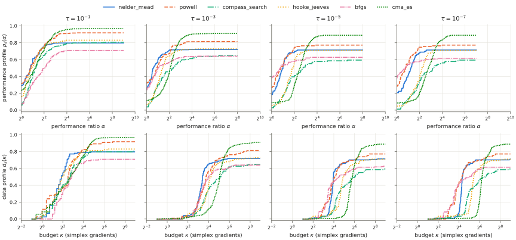
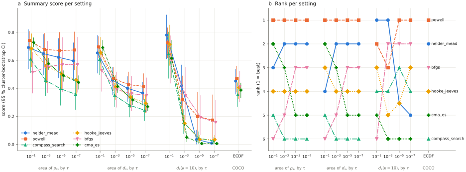
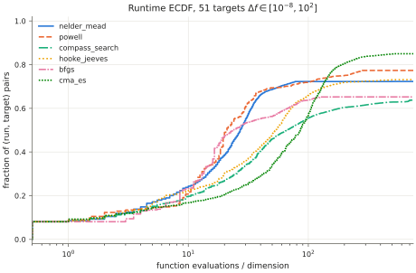
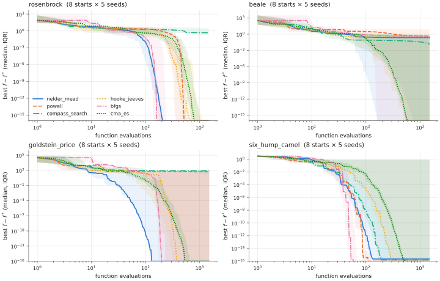

# Benchmark profiles: does the ranking of derivative-free solvers depend on τ and on the profile?

This folder holds the shared benchmark harness for `research/`, plus a first study made with it.
`method.py` extends `numopt.bench` in six ways: the BenDFO cutoff $f_L$, a literal port of the
BenDFO reference scripts (used as a test oracle), scalar summaries with a cluster bootstrap so
that "the ranking" is a defined and testable quantity, the COCO runtime ECDF and ERT, an audit
that rejects a run whose $f_L$ is far below the stated minimum, and multiple-comparison and
leave-one-problem-out tools for rank changes.

## Question

Moré and Wild (2009, §2) show that performance profiles and data profiles can order two solvers
differently. They plot results at several accuracy levels τ = 10⁻ᵏ, k ∈ {1, 3, 5, 7}, "so that a
user can evaluate solver performance for different levels of accuracy". On numopt's 2-D
unconstrained library, does the order of the derivative-free solvers change

1. when τ goes from 10⁻¹ to 10⁻⁷, or
2. when the plot changes from a performance profile to a data profile?

The null hypothesis for each question is "the order of every pair is the same in both settings".
A pairwise rank change that is significant after a correction for multiple comparisons rejects
the null.

## Background

A *problem instance* p is a problem with a start point x₀ (and a seed for a stochastic solver).
Solver s gets a budget of $\mu_f$ function evaluations on every instance. A wrapper records each
evaluation. Let $t_{p,s}$ be the number of evaluations until the best value found passes the
Moré–Wild convergence test (their eq. 2.2):

$$
f(x) \le f_L + \tau\,\bigl(f(x_0) - f_L\bigr), \qquad 0 < \tau < 1 .
$$

If s never passes the test, $t_{p,s}$ = ∞. With the **BenDFO cutoff**, $f_L$ is the smallest value
that any solver found on p (the code at github.com/POptUS/BenDFO takes `prob_min = min(min(H),[],3)`).
`numopt.bench` uses the known global minimum by default. We report both conventions.

**Performance profile** (Dolan & Moré 2002):

$$
r_{p,s} = \frac{t_{p,s}}{\min_{\sigma} t_{p,\sigma}}, \qquad
\rho_s(\alpha) = \frac{1}{|P|}\,\bigl|\{p \in P : r_{p,s} \le \alpha\}\bigr| .
$$

**Data profile** (Moré & Wild 2009, eq. 2.7), with the budget κ measured in simplex gradients:

$$
d_s(\kappa) = \frac{1}{|P|}\,\Bigl|\Bigl\{p \in P : \frac{t_{p,s}}{n_p + 1} \le \kappa\Bigr\}\Bigr| .
$$

**COCO runtime ECDF** (Hansen et al. 2021): for targets $f_{\text{opt}}$ + Δf with Δf ∈ {10², $10^{1.8}$, …, 10⁻⁸}
(51 targets), the ECDF is the fraction of (run, target) pairs whose runtime / n is ≤ x. The
expected running time is ERT(Δf) = ($\sum_{\text{runs}}$ evaluations until success or stop) / #successes.

**Rankings.** A profile is a curve, so we need a scalar summary to rank solvers. We use the
normalized area under each curve on a log₂ axis. Both areas have a closed form, because
∫₀ᴸ 1[log₂ r ≤ u] du = max(0, L − log₂ r):

$$
A_s = \frac{1}{L}\int_0^{L} \rho_s(2^u)\,du
    = \frac{1}{|P|}\sum_{p} \max\!\Bigl(0,\; 1 - \frac{\log_2 r_{p,s}}{L}\Bigr),\quad L = \log_2 \alpha_{\max},
$$

$$
D_s = \frac{1}{|P|}\sum_{p} \max\!\Bigl(0,\; 1 - \frac{\log_2 \max(\kappa_{p,s}, 1)}{\log_2 \kappa_{\max}}\Bigr),
\qquad \kappa_{p,s} = \frac{t_{p,s}}{n_p + 1}.
$$

Moré and Wild compare the two profile types *at a fixed budget*. In their example, solver S2 is
better than S1 for budgets of κ ∈ [20, 100] in the data profile, but S1 is better in the
performance profile. For this reason we also rank solvers by the readouts $d_s(10)$ and $d_s(100)$.

## Method (`method.py`)

| function | what it does |
|---|---|
| `with_bendfo_cutoff(result)` | sets $f_L$ = min(f(x₀), best value of every solver) on each instance of a `numopt.bench` result |
| `log_evaluations`, `history_array`, `bendfo_solve_counts`, `bendfo_performance_ratios`, `bendfo_data_values` | a raw per-evaluation logger and a line-by-line port of `perf_profile.m` / `data_profile.m`, checked against the BenDFO source |
| `performance_area`, `data_area`, `area_terms` | the closed forms of $A_s$ and $D_s$ above (sums with `math.fsum`, so a column does not depend on the other columns) |
| `dominance` | for each pair of curves: one dominates (≥ everywhere, > somewhere), the curves cross, or they are equal |
| `bootstrap_order_support` | cluster bootstrap that draws whole problems with replacement, using `numopt.core.rng.Rng` |
| `kendall_tau_b`, `rank_scores` | rank agreement between two settings |
| `runtime_ecdf`, `ecdf_area`, `expected_running_time`, `coco_targets` | COCO runtime ECDF and ERT |
| `cutoff_audit` | flags every instance whose best found value is below the stated minimum $f_{\text{known}}$ by more than 10⁻¹⁰ (f(x₀) − $f_{\text{known}}$) + 64 ε max(1, \|$f_{\text{known}}$\|) |
| `order_support`, `holm` | the bootstrap support of the point-estimate order of a pair, and Holm (1979) adjusted p-values |
| `leave_one_group_out` | drops each problem in turn and re-tests one rank change (point estimates and paired bootstrap supports) |

`PARAMS` describes τ, $f_L$, $\alpha_{\max}$, $\kappa_{\max}$ and `n_boot` as `ParamSpec`s.

**Test of a rank change.** A pair (i, j) changes rank between settings a and b when the point
estimates of score_i − score_j have opposite signs. Let $S_a$ and $S_b$ be the bootstrap supports of
the point-estimate order in each setting. The rank change is an intersection-union test (Berger
1982): it needs both orders, so its p-value is p = 1 − min($S_a$, $S_b$). If the point estimates do
not flip, p = 1. Holm's procedure then adjusts the p-values of all pairs in a family.

Deviations, marked `# NOTE:` in the code:

* f(x₀) is passed in explicitly. BenDFO uses `H(1,p,1)`, but CMA-ES does not evaluate x₀ first.
* A failure is +∞, not NaN.
* The ECDF uses single-run runtimes, with no simulated restarts.
* In $D_s$, a solve in less than one simplex gradient counts as κ = 1.
* The bootstrap p-value is a percentile bootstrap p-value, not an exact test.
* `run.py` uses 20 000 bootstrap replicates, not the `PARAMS` default of 2000.

**Tests** (`test_method.py`, 33 tests, all passing):

* Hand-computed values for BenDFO counts, $A_s$, $D_s$, dominance, ERT, ECDF, the cutoff audit, Holm
  and the leave-one-problem-out test.
* An independent oracle. A raw per-evaluation log, fed through the BenDFO port, gives exactly
  the same $t_{p,s}$ table and the same profile values at every break point as `numopt.bench`
  under the BenDFO cutoff (`assert_array_equal`, 4 solvers × 16 instances × τ ∈ {10⁻¹, 10⁻³, 10⁻⁵, 10⁻⁷}).
* Areas checked against exact integration of the step functions that `numopt.bench` returns
  (`assert_allclose(rtol=1e-12, atol=1e-14)`).
* The leave-one-problem-out point estimates checked against areas recomputed from the cost
  table of the remaining instances (`assert_allclose(atol=1e-14)`).
* The audit on the real McCormick problem: the CMA-ES run from the default x₀ with seed 1
  leaves the box and diverges, and the audit flags it. The four problems of the oracle
  benchmark are not flagged.
* `run.make_cases` excludes every `bounded-domain` problem and keeps the start points of the
  other problems.
* Hypothesis properties, 1000 examples each:
  * affine invariance of eq. 2.2 (f → 2ᵉ f + b, so the arithmetic is exact);
  * no all-unsolved instance under the BenDFO cutoff;
  * a looser τ never needs more evaluations;
  * $A_s$ does not change when one problem's costs are scaled;
  * $D_s$ does not depend on the other solvers;
  * Kendall $\tau_b$ agrees with `scipy.stats.kendalltau`;
  * the bootstrap is symmetric and bounded;
  * `holm(p) ≤ α` gives the same rejections as Holm's sequential step-down procedure, and
    p ≤ holm(p) ≤ min(1, m p).
* Through the logger, every baseline passes the `tests/conftest.py` contract, and its `n_fev`
  equals the logged count.

## Setup (`run.py`)

* **Problems.** The 15 two-dimensional problems in `problems.list_problems("unconstrained")`
  that have their minimum on ℝ²: quadratic_bowl, quadratic_ill, rosenbrock, himmelblau, beale,
  booth, matyas, three_hump_camel, six_hump_camel, goldstein_price, rastrigin, ackley,
  styblinski_tang, bohachevsky and levi13. Analytic gradients and Hessians are removed.
  * **mccormick is excluded.** The library tags it `bounded-domain`: its $f_{\min}$ = −1.9132 holds
    on the box [−1.5, 4] × [−3, 4] only. On ℝ², f = σ/2 + sin σ along x − y = 1 (σ = x + y),
    so f is unbounded below. An unconstrained solver can leave the box and diverge (the CMA-ES
    run from the default x₀ with seed 1 ends at f ≈ −7.7 × 10¹³). Then $f_L$ is meaningless under
    both conventions, and the COCO targets count every escape as a hit.
  * **Audit.** Before any analysis, `run.py` calls `cutoff_audit` and stops if an instance is
    flagged. In this run, no instance is flagged. On 53 instances a solver went below $f_{\text{known}}$,
    by at most 1.7 × 10⁻¹⁵ (f(x₀) − $f_{\text{known}}$), which is rounding.
* **Start points.** 8 per problem: the library default x₀, plus 7 points drawn uniformly on the
  plotting domain (`Rng(20261005)`, documented draw order). The draw goes through all 16 2-D
  problems in library order, mccormick included. Thus the start points of the other problems
  are the same as in the first version of the study.
* **Instances.** 120 (problem, x₀) pairs × 5 seeds = 600 instances. CMA-ES runs once per seed.
  A deterministic solver runs once, and its history is shared by the 5 seed copies.
* **Solvers.** nelder_mead, powell, compass_search, hooke_jeeves, bfgs and cma_es.
  * bfgs uses numopt's central-difference gradient (2n evaluations per gradient), and the
    budget charges every evaluation.
  * Default parameters, except that the tolerances are tightened and max_iter is set to 100 000.
    Thus the solver stops at rounding level or at the budget, and a default tolerance looser
    than τ = 10⁻⁷ does not stop it:
    * nelder_mead and cma_es: xtol 10⁻¹⁴, ftol 10⁻¹⁶;
    * powell: xtol 10⁻¹⁴, ftol 10⁻¹⁶;
    * compass_search and hooke_jeeves: xtol 10⁻¹⁴;
    * bfgs: gtol 10⁻¹⁴.
* **Budget.** $\mu_f$ = 1500 evaluations (500 simplex gradients). The cost model is `nfev`.
* **Summaries.** $\alpha_{\max}$ = 32, $\kappa_{\max}$ = 500, 20 000 bootstrap replicates (seed 1). Every setting
  uses the same replicates, so the joint flip probabilities are paired. The Monte Carlo standard
  error of a support near 0.95 is 0.0015.
* **Decision rules.**
  * In one setting, the order of a pair is *resolved* when its bootstrap support is ≥ 0.95.
  * A rank change is *resolved in both settings* when the point estimates flip and both orders
    are resolved. This rule has no correction for multiple comparisons.
  * A rank change is *confirmed* when its Holm-adjusted p-value is ≤ 0.05. The families are:
    Q1 (2 comparisons × 15 pairs = 30 tests), Q2 whole-budget areas (4 × 15 = 60 tests) and
    Q2 fixed-budget readouts (8 × 15 = 120 tests).
  * For every rank change that is resolved in both settings, `leave_one_group_out` reports how
    many of the 15 one-problem deletions keep it resolved in both settings.

Share of runs that ended at the budget (all other runs stopped on the solver's own test; there
were no errors):

| nelder_mead | powell | compass_search | hooke_jeeves | bfgs | cma_es |
|---|---|---|---|---|---|
| 10.8 % | 5.0 % | 18.3 % | 4.2 % | 1.7 % | 15.3 % |

## Results

All numbers come from `results/summary.json`, with the BenDFO cutoff unless stated. A support
is the bootstrap probability of the stated order.



**Areas and ranks** (rank in brackets; 95 % cluster-bootstrap interval for $A_s$ at τ = 10⁻¹ and 10⁻⁷):

| solver | $A_s$, τ=10⁻¹ | $A_s$, τ=10⁻³ | $A_s$, τ=10⁻⁵ | $A_s$, τ=10⁻⁷ | $D_s$, τ=10⁻¹ | $D_s$, τ=10⁻⁷ | $d_s(10)$, τ=10⁻¹ | $d_s(10)$, τ=10⁻⁷ |
|---|---|---|---|---|---|---|---|---|
| nelder_mead | 0.691 (3) [0.54, 0.82] | 0.647 (2) | 0.621 (2) | 0.596 (2) [0.45, 0.73] | 0.653 (4) | 0.366 (2) | 0.780 (1) | 0.008 (5) |
| powell | 0.742 (1) [0.67, 0.81] | 0.678 (1) | 0.670 (1) | 0.673 (1) [0.53, 0.80] | 0.695 (1) | 0.414 (1) | 0.725 (2) | 0.173 (1) |
| compass_search | 0.608 (5) [0.51, 0.70] | 0.457 (6) | 0.397 (6) | 0.358 (6) [0.25, 0.48] | 0.606 (5) | 0.244 (6) | 0.647 (4) | 0.025 (4) |
| hooke_jeeves | 0.683 (4) [0.55, 0.79] | 0.561 (4) | 0.503 (4) | 0.458 (4) [0.35, 0.56] | 0.654 (3) | 0.293 (4) | 0.713 (3) | 0.033 (3) |
| bfgs (FD) | 0.513 (6) [0.36, 0.66] | 0.553 (5) | 0.570 (3) | 0.570 (3) [0.37, 0.77] | 0.527 (6) | 0.350 (3) | 0.610 (6) | 0.157 (2) |
| cma_es | 0.728 (2) [0.69, 0.76] | 0.575 (3) | 0.490 (5) | 0.442 (5) [0.39, 0.49] | 0.689 (2) | 0.268 (5) | 0.615 (5) | 0.005 (6) |



The marginal intervals overlap a lot, because there are only 15 problem clusters. The pairwise
supports below use paired replicates, so they are sharper than the overlap suggests.

### Q1: tolerance

The point estimates of the order change with τ. No single rank change is confirmed.

* Kendall $\tau_b$ between the scores at τ = 10⁻¹ and τ = 10⁻⁷ is **0.33** for $A_s$ and **0.20** for
  $D_s$. By $A_s$, bfgs moves from rank 6 to rank 3, and cma_es moves from rank 2 to rank 5.
* The point estimates flip for 5 of 15 pairs in $A_s$ and for 6 of 15 pairs in $D_s$.
* **No rank change is confirmed.** The smallest Holm-adjusted p-value in the Q1 family of 30 tests
  is 1.00. Thus the null "same order at every τ" is not rejected at a family-wise level of 0.05.
  With 15 problems, the test has little power: the smallest raw p-value is 0.0486, and Holm
  needs ≤ 0.05/30 = 0.0017.
* One rank change is resolved in both settings, without correction: **hooke_jeeves vs bfgs** in
  $A_s$. P(hooke_jeeves ahead) is 0.9943 at τ = 10⁻¹, and P(bfgs ahead) is 0.9514 at τ = 10⁻⁷
  (Monte Carlo standard error 0.0015). The joint flip probability is 0.946.
  * This change is fragile. It stays resolved in only 5 of 15 one-problem deletions. It is lost
    when any one of booth, himmelblau, matyas, quadratic_bowl, quadratic_ill, rastrigin,
    rosenbrock, six_hump_camel, styblinski_tang or three_hump_camel is dropped.
* The other flips are resolved in at most one of the two settings:

  | profile | pair | support at τ = 10⁻¹ | support at τ = 10⁻⁷ | resolved at |
  |---|---|---|---|---|
  | $A_s$ | bfgs vs cma_es | P(cma_es ahead) = 0.9994 | P(bfgs ahead) = 0.9038 | 10⁻¹ only |
  | $A_s$ | nelder_mead vs cma_es | P(cma_es ahead) = 0.6816 | P(nelder_mead ahead) = 0.9788 | 10⁻⁷ only |
  | $A_s$ | compass_search vs bfgs | P(compass_search ahead) = 0.8814 | P(bfgs ahead) = 0.9846 | 10⁻⁷ only |
  | $A_s$ | hooke_jeeves vs cma_es | P(cma_es ahead) = 0.7524 | P(hooke_jeeves ahead) = 0.6230 | neither |
  | $D_s$ | hooke_jeeves vs bfgs | P(hooke_jeeves ahead) = 0.9915 | P(bfgs ahead) = 0.9226 | 10⁻¹ only |
  | $D_s$ | bfgs vs cma_es | P(cma_es ahead) = 0.9997 | P(bfgs ahead) = 0.9407 | 10⁻¹ only |
  | $D_s$ | nelder_mead vs hooke_jeeves | P(hooke_jeeves ahead) = 0.5171 | P(nelder_mead ahead) = 1.0000 | 10⁻⁷ only |
  | $D_s$ | nelder_mead vs cma_es | P(cma_es ahead) = 0.7790 | P(nelder_mead ahead) = 0.9970 | 10⁻⁷ only |
  | $D_s$ | compass_search vs bfgs | P(compass_search ahead) = 0.8994 | P(bfgs ahead) = 0.9734 | 10⁻⁷ only |
  | $D_s$ | hooke_jeeves vs cma_es | P(cma_es ahead) = 0.8051 | P(hooke_jeeves ahead) = 0.8407 | neither |

* powell is first by $A_s$ at every τ. At τ = 10⁻¹ its lead over cma_es is not resolved
  (support 0.6398). At τ = 10⁻⁷ it is resolved (0.9966).
* No pair shows a dominance reversal: where an order flips, the curves cross in at least one of
  the two settings.

### Q2: profile type

* *Whole-budget summaries agree.* Kendall $\tau_b$ between $A_s$ and $D_s$ at the same τ is 0.87, 1.00,
  1.00 and 1.00 for τ = 10⁻¹, 10⁻³, 10⁻⁵ and 10⁻⁷. Only one point estimate flips in the 60
  tests: nelder_mead vs hooke_jeeves at τ = 10⁻¹ ($A_s$ 0.691 vs 0.683, $D_s$ 0.653 vs 0.654). Its
  joint flip probability is 0.153, and it is not resolved in either setting.
* *Fixed-budget readouts do not agree in the point estimates.* Kendall $\tau_b$ between $A_s$ and
  $d_s(10)$ is 0.47, 0.07, 0.41 and 0.47. Between $A_s$ and $d_s(100)$, it is 0.69, 0.73, 0.33 and
  0.47.
  * No rank change is confirmed. The smallest Holm-adjusted p-value in the family of 120 tests
    is 1.00.
  * One rank change is resolved in both settings, without correction: **compass_search vs
    cma_es** at τ = 10⁻³. P(cma_es ahead) is 0.9718 in $A_s$, and P(compass_search ahead) is
    0.9966 in $d_s(10)$. It stays resolved in 12 of 15 one-problem deletions. It is lost when
    goldstein_price, rastrigin or rosenbrock is dropped.
  * By $d_s(10)$, cma_es is 5th at τ = 10⁻¹ and last at the other tolerances (0.615, 0.050,
    0.005, 0.005). By $A_s$, it is 2nd at τ = 10⁻¹.

**COCO view** (5 seeds, all instances, 51 targets):



| | nelder_mead | powell | compass_search | hooke_jeeves | bfgs | cma_es |
|---|---|---|---|---|---|---|
| ECDF area (log axis to 750 evals/n) | 0.451 (2) | 0.468 (1) | 0.355 (6) | 0.405 (4) | 0.410 (3) | 0.387 (5) |
| ECDF at the budget | 0.723 | 0.774 | 0.637 | 0.731 | 0.652 | 0.850 |
| ERT, Δf = 10⁻¹ | 258.3 | 254.1 | 496.4 | 283.1 | 216.2 | 316.4 |
| ERT, Δf = 10⁻⁸ | 311.3 | 293.1 | 731.5 | 419.2 | 235.6 | 575.7 |

The ECDF-area order is the same as the $A_s$ and $D_s$ orders at τ = 10⁻⁵ and 10⁻⁷ ($\tau_b$ = 1.00).
Against $A_s$ at τ = 10⁻¹, $\tau_b$ is 0.33.

**Sensitivity to $f_L$.** With the known global minimum as $f_L$ (the `numopt.bench` default):

* $\tau_b$ between τ = 10⁻¹ and 10⁻⁷ is 0.33 for $A_s$ and 0.20 for $D_s$.
* No rank change is confirmed. The smallest Holm-adjusted p-value is 0.9615.
* A different pair is resolved in both settings, without correction: **bfgs vs cma_es**, in $A_s$
  (P(cma_es ahead) = 0.9990 at τ = 10⁻¹, P(bfgs ahead) = 0.9656 at 10⁻⁷) and in $D_s$ (0.9995,
  0.9679). Each stays resolved in 8 of 15 one-problem deletions.
* hooke_jeeves vs bfgs in $A_s$ is not resolved at τ = 10⁻⁷ (P(bfgs ahead) = 0.9472).
* compass_search vs cma_es at τ = 10⁻³ is not resolved in $A_s$ (P(cma_es ahead) = 0.9389).
* $A_s$ and $D_s$ at the same τ agree with $\tau_b$ = 0.87, 0.87, 1.00 and 1.00.

Thus the set of rank changes that pass the uncorrected rule depends on the $f_L$ convention. This
is more evidence that these changes are near the threshold.



## Discussion

**Answer.** On this problem set:

* *Q1, tolerance.* The point estimates of the ranking change with τ (Kendall $\tau_b$ = 0.33 for $A_s$
  and 0.20 for $D_s$). But no pairwise rank change is significant after the Holm correction, so
  the null "same order at every τ" is not rejected. One change passes the uncorrected 0.95 rule,
  and it survives only 5 of 15 one-problem deletions. With 15 problems, this study cannot
  separate a true rank change from noise in the choice of problems. That the null is not
  rejected does not show that the order is the same.
* *Q2, profile type.* The answer depends on how the data profile is read:
  * integrated over the whole budget, it ranks the solvers like the performance profile
    ($\tau_b$ ≥ 0.87, one small point-estimate flip, nothing resolved);
  * read at a small fixed budget (κ = 10, that is, 30 evaluations), the point estimates rank
    the solvers very differently ($\tau_b$ between 0.07 and 0.47). One change passes the uncorrected
    rule and survives 12 of 15 deletions, but it is not significant after the Holm correction.

  The direction agrees with the effect that Moré and Wild describe: a data profile at a budget
  answers a different question ("what is solved within k simplex gradients") than a performance
  ratio does.

**Why.**

* *cma_es* solves the most instances at every τ: $\rho_s(32)$ = 0.965 at τ = 10⁻¹ and 0.888 at 10⁻⁷.
  It is slow at the start, so $d_s(10)$ is among the lowest at every τ. At τ = 10⁻¹, robustness
  gives it a high area. At τ = 10⁻⁷, its performance ratios grow, because each generation costs
  a full population.
* *bfgs* with central differences solves the fewest instances at τ = 10⁻¹ (0.708). Many runs end
  in line-search failures at rounding level, or at local minima. When it converges, it is the
  fastest: $\rho_s(1)$ = 0.377 at τ = 10⁻⁷, the highest of all solvers. It also has the lowest ERT,
  because its unsuccessful runs stop early and cost little.

**Where the harness, or the study, can mislead.**

* **Problems with a minimum on a box only.** A problem that is unbounded below on ℝⁿ gives a
  divergent $f_L$. The first version of this study included mccormick, and its divergent runs set
  $f_L$ on 19 of its 40 instances. That changed the headline numbers (for example, $\tau_b$($A_s$,
  $d_s(10)$) was 0.14 to 0.20, and is 0.07 to 0.47 without mccormick). `cutoff_audit` now stops
  such a run before the analysis.
* **Small, homogeneous problem set.** There are 15 problems, all 2-D. The cluster bootstrap has
  only 15 clusters, so the intervals are wide and the pairwise tests have little power after a
  correction. With $n_p$ = 2 for every problem, a data profile is the distribution of t/3, a
  rescaled cost axis. Some of the perf-vs-data differences that Moré–Wild see with mixed
  dimensions cannot occur here.
* **Choice of summary.** $A_s$ and $D_s$ depend on $\alpha_{\max}$ = 32 and $\kappa_{\max}$ = 500. `summary.json` also
  lists the readouts $\rho_s(1)$, $\rho_s(32)$, $d_s(10)$, $d_s(100)$ and $d_s(500)$, and the order changes with
  the readout. "The ranking" always means a ranking under a stated summary.
* **Multiple comparisons.** Holm's procedure is valid under any dependence between the tests,
  but it is conservative here, because the tests share the same runs. The families are defined
  per question; one family of all 210 tests would be stricter. The bootstrap p-values are
  percentile p-values with a Monte Carlo resolution of 1/20 000.
* **Solver settings.** The tolerances are tightened, not left at their defaults. The FD gradient
  of bfgs uses central differences (2n evaluations per gradient). We did not run a
  forward-difference variant, and the study makes no claim about one.
* **Recorder convention.** The best value includes every evaluation, also FD probe points and
  rejected trial points. This is the Moré–Wild convention, but it is not the value at the
  solver's iterate.
* **COCO deviations.** The ECDF has no simulated restarts, and Δf is measured from the known
  minimum, not from $f_L$.
* **Weighting.** Deterministic solvers enter 5 times, once per seed copy. This does not change
  any fraction, but under the BenDFO cutoff, $f_L$ of a seed copy depends on that CMA-ES run.

**Use from other research topics.** Put the headline comparison of a topic through the
harness:

```python
import method as bp  # research/benchmark-profiles/method.py
from numopt import bench

raw = bench.run_benchmark(methods, cases, budget=B, seeds=(0, 1, 2))
assert not bp.cutoff_audit(raw).flagged  # no f_L from a divergent run
res = bp.with_bendfo_cutoff(raw)
T = res.solve_costs(1e-5)
A = bp.performance_area(bp.performance_ratios(T), 32.0)
D = bp.data_area(bp.bendfo_data_values(T, [i.n for i in res.instances]), B / 3)
support = bp.bootstrap_order_support(
    bp.area_terms(bp.performance_ratios(T), 32.0), [i.problem_id for i in res.instances]
)
```

Report the scores at two or more τ. For each claimed order, give the bootstrap support, and
for a claimed change, give the Holm-adjusted p-value of its family and the leave-one-problem-out
count (see `run.analyse`).

## Revision after review

A reviewer reproduced the first version bit for bit and found four defects. Each one is fixed
at the source, and every number above is regenerated:

1. *mccormick is unbounded below.* It is now excluded by its `bounded-domain` tag, and
   `cutoff_audit` stops any run whose $f_L$ is far below $f_{\text{known}}$. The cost tables of the new run
   are identical to the first run with the mccormick instances removed, under both $f_L$
   conventions and at all four τ.
2. *Fragile "confirmed" flips and no correction.* The test is now an intersection-union test
   with Holm-adjusted p-values per question, and every flip that passes the uncorrected rule
   has a leave-one-problem-out count. The supports are given to four decimals, with 20 000
   replicates. The support of the point-estimate order is now taken in the direction of the
   point estimate. No rank change is confirmed, and the conclusions above are weaker.
3. *The sentence "resolved at τ = 10⁻⁷ only" was false for two flips.* The table in Q1 now
   lists both directions and the setting in which each order is resolved.
4. *An untested claim about forward-difference bfgs.* It is removed.

## Reproduce

```bash
.venv/bin/python -m pytest research/benchmark-profiles -q   # 33 tests, about 40 s
.venv/bin/python research/benchmark-profiles/run.py         # about 45 s; deterministic
```

The run writes `results/summary.json` (every number above) and `results/costs.json` (the
$t_{p,s}$ tables for both $f_L$ conventions and all four τ). It also writes the four figures in
`figures/`.

## References

* R. L. Berger. Multiparameter hypothesis testing and acceptance sampling. *Technometrics*
  24:295–300, 1982. doi:10.1080/00401706.1982.10487790
* E. D. Dolan, J. J. Moré. Benchmarking optimization software with performance profiles.
  *Math. Program.* 91:201–213, 2002. doi:10.1007/s101070100263
* S. Holm. A simple sequentially rejective multiple test procedure. *Scand. J. Statist.*
  6:65–70, 1979.
* J. J. Moré, S. M. Wild. Benchmarking derivative-free optimization algorithms. *SIAM J. Optim.*
  20(1):172–191, 2009. doi:10.1137/080724083 (preprint ANL/MCS-P1471-1207, §2: the
  performance-vs-data example; §5: τ = 10⁻ᵏ, k ∈ {1, 3, 5, 7})
* N. Hansen, A. Auger, R. Ros, O. Mersmann, T. Tušar, D. Brockhoff. COCO: a platform for comparing
  continuous optimizers in a black-box setting. *Optim. Methods Softw.* 36:114–144, 2021.
  doi:10.1080/10556788.2020.1808977
* BenDFO: `profiling/perf_profile.m`, `profiling/data_profile.m`, https://github.com/POptUS/BenDFO (BSD-3)
