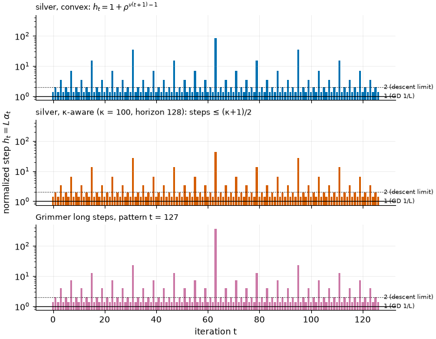
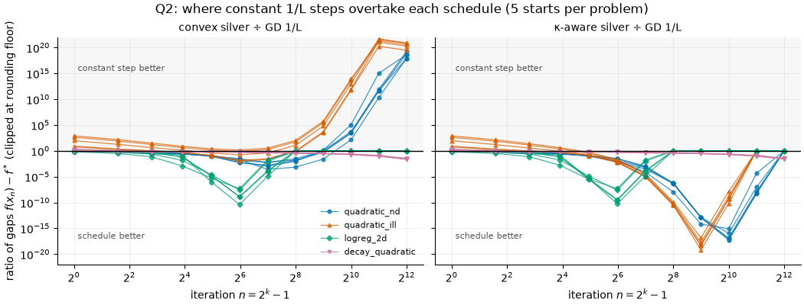
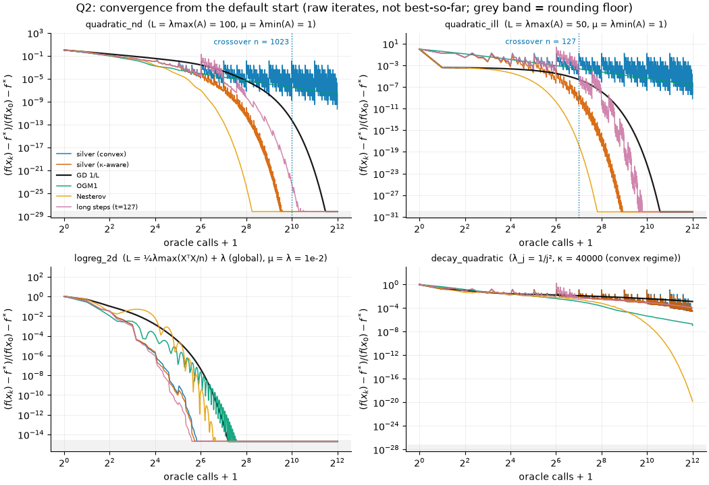
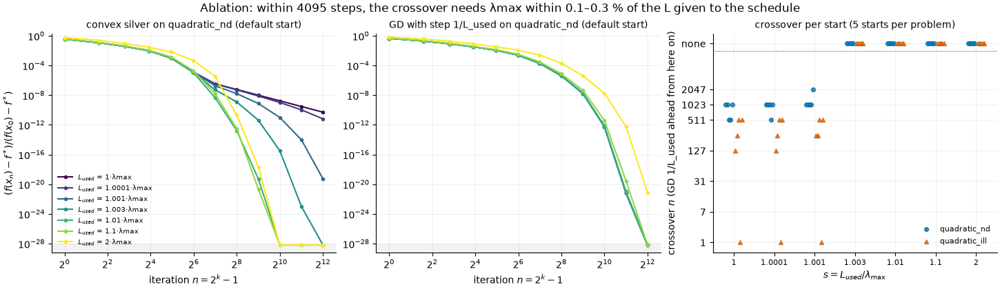
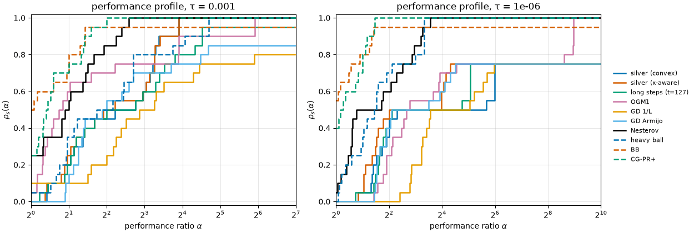

# Certified step-size schedules: silver steps, long steps and OGM

Promoted to numopt as `silver_gd`, `silver_gd_strongly_convex`, `long_step_gd` and `ogm`
(`src/numopt/unconstrained/accelerated.py`, tests in `tests/test_unconstrained_accelerated.py`).
The package methods give the same iterates and counts as `method.py`. The UI range of `gtol` starts
at 10⁻¹⁴, but `gtol = 0` is still accepted, and the stopping test uses a scaled norm, so a gradient
below 10⁻¹⁶² does not round to 0.

Plain gradient descent with a fixed, non-monotone step-size schedule, certified by a
performance-estimation (PEP) analysis, compared with numopt's first-order baselines.

## Question

1. **Q1.** On numopt's L-smooth convex problems, does $f(x_n)-f^\star$ under the convex silver
   schedule stay below the proved envelope $r_k L\|x_0-x^\star\|^2$ at every $n=2^k-1$?
2. **Q2.** At what horizon $n$ does convex silver lose to constant $1/L$ steps on strongly convex
   problems? Does the $\kappa$-aware silver schedule (Part I) remove that crossover, as predicted?
3. **Q3.** How do the certified schedules compare with momentum, Barzilai–Borwein (BB) and nonlinear
   CG on the same oracle budget?

## Background

Gradient descent with normalized steps $h_t$ is

$$x_{t+1} = x_t - \frac{h_t}{L}\nabla f(x_t).$$

The worst case of a fixed schedule over all $L$-smooth convex functions is the value of a small SDP
(Drori & Teboulle 2014; Taylor, Hendrickx & Glineur 2017). For $h_t\equiv 1$ it is
$L\|x_0-x^\star\|^2/(4n+2)$, and the bound is tight.

**Convex silver schedule** (Altschuler & Parrilo, *Math. Program.* 2024, eq. 2.1, Theorem 1.1).
Let $\rho = 1+\sqrt2$ and let $\nu$ be the 2-adic valuation. Then

$$h_t = 1+\rho^{\nu(t+1)-1} = [\sqrt2,\ 2,\ \sqrt2,\ 1+\rho,\ \sqrt2,\ 2,\ \sqrt2,\ 1+\rho^2,\ \dots],$$

$$
\begin{aligned}
f(x_n)-f^\star &\le r_k\,L\|x_0-x^\star\|^2, \\
r_k &= \frac{1}{1+\sqrt{4\rho^{2k}-3}}\approx\frac{1}{2n^{\log_2\rho}}, \\
n &= 2^k-1 .
\end{aligned}
$$

Here $\log_2\rho \approx 1.2716$. This rate lies between the $O(1/n)$ rate of constant steps and
Nesterov's $O(1/n^2)$.

**$\kappa$-aware silver schedule** (Altschuler & Parrilo, *J. ACM* 2025, §3, eqs. 3.1–3.9).
Let $\kappa=L/\mu$ and $\psi(t)=(1+\kappa t)/(1+t)$. Start from $y_1=z_1=1/\kappa$, and for
$n=2,4,8,\dots$ set

$$
\begin{aligned}
y_n z_n &= z_{n/2}^2, \qquad z_n-y_n = 2(z_{n/2}-z_{n/2}^2), \\
a_n &= \psi(y_n), \qquad b_n = \psi(z_n), \\
h^{(n)} &= [\tilde h^{(n/2)},a_n,\tilde h^{(n/2)},b_n],
\end{aligned}
$$

$$
\begin{aligned}
\|x_n-x^\star\|^2 &\le \tau_n\|x_0-x^\star\|^2, \\
\tau_n &= \Big(\frac{1-z_n}{1+z_n}\Big)^2 .
\end{aligned}
$$

**Grimmer's long steps** (*SIAM J. Optim.* 2024, Table 1, Theorem 2.1). Cycle a "straightforward"
pattern, for example $(2.9, 1.5)$ or the length-127 pattern with a peak step of 370. The proved
bound is $f(x_T)-f^\star \le LD^2/(c\,T)+O(1/T^2)$, with $c\approx\mathrm{avg}(h)$ up to 5.83.
$D$ is the radius of the initial sublevel set, and the $O(1/T^2)$ constant is not explicit.

**OGM1** (Kim & Fessler, *Math. Program.* 2016, §7.1, eq. 6.17). Set $y_{i+1}=x_i-\nabla f(x_i)/L$
and $x_{i+1}=y_{i+1}+\frac{\theta_i-1}{\theta_{i+1}}(y_{i+1}-y_i)+\frac{\theta_i}{\theta_{i+1}}(y_{i+1}-x_i)$.
The last step uses $\theta_N=(1+\sqrt{1+8\theta_{N-1}^2})/2$. The bound is

$$f(x_N)-f^\star\le \frac{L\|x_0-x^\star\|^2}{2\theta_N^2}\le\frac{L\|x_0-x^\star\|^2}{(N+1)^2},$$

which is half of Nesterov's bound, and it is attained exactly (Theorem 3).

## Method

[`method.py`](method.py) implements four solvers that follow the numopt contract: a full trace,
`Step.info` geometry, exact counts, and a `PARAMS` dict of `ParamSpec`s for promotion.

| solver | schedule | `info["bound_f"]` at certified iterates |
|---|---|---|
| `silver_gd` | eq. 2.1 of Part II | $r_k$ at $k=2^j-1$ |
| `silver_gd_strongly_convex` | eqs. 3.1–3.8 of Part I; one block of length `horizon` is repeated | $\tau_n^m/2$ (and `bound_dist` $=\tau_n^m$) at $k=mn$ |
| `long_step_gd` | Grimmer, Table 1 (t = 2, 3, 7, 15, 31, 63, 127) | none (the constant is not explicit) |
| `ogm` | Kim–Fessler OGM1 with $N=$ `max_iter` | $1/(2\theta_N^2)$ at $k=N$ |

Implementation choices (each one has a `# NOTE:` in the code):

- **No cancellation in $1-z_n$.** $z_n\to1$ doubly exponentially, so $1-z_n$ is never formed by
  subtraction. The code runs the exact identity
  $w_n = w^2(w+\sqrt{1+w^2})/(1+\sqrt{1+w^2})$ for $w=1-z$ in log form. The tests check it against
  a 600-digit implementation of eqs. 3.1–3.2.
- **Auto horizon.** Part I fixes no block length for the repetition. With `horizon=0` the code
  picks the first $n=2^j$ for which doubling improves $-\log(\tau_n)/n$ by less than 1 %. This
  gives 64 for $\kappa=100$ and 32 for $\kappa=50$ and $\kappa=69.4$.
- **A spec inconsistency in Part I (arXiv v1, the only public version).** Lemma 3.1
  ($1/\kappa\le y_n$), Lemma 3.2 ($a_n\ge 2\kappa/(\kappa+1)$) and Remark 3.3
  ($a_2=\kappa/(\kappa-1)$) do not follow from eqs. 3.1–3.2 as printed. Those equations give
  $y_2<1/\kappa$; for $\kappa=10$, $a_2=1.384<1.818$. I implemented eqs. 3.1–3.2. Two facts support
  this choice. First, the exact PEP worst case of this schedule equals $\tau_n$ (table below).
  Second, as $\kappa\to\infty$ the steps tend to the convex silver schedule (Part II, Remark 2.2);
  the tests check this to $10^{-9}$ for $\kappa=10^{12}$.
- **The value of L.** `L = 0` means: use `problem.extra["L"]`, else $\lambda_{\max}(\nabla^2 f(x_0))$
  for a problem tagged quadratic. In all other cases a `ValueError` is raised, because the
  certificates need a global constant.

**Verification.** [`test_method.py`](test_method.py) has 88 tests. In the venv 87 pass in about 4 s,
and the PEP test is skipped; it passes under a Python that has cvxpy. The tests check the
following:

- the paper identities: Lemma 2.3 ($\sum h_t=\rho^k-1$), the one-liner in footnote 2, eq. 1.4,
  eq. 3.6, and the averages of Table 1;
- a 600-digit oracle for the $\kappa$-aware recursion;
- iterates against the closed form $x_n-x^\star=\prod_t(I-h_tA/L)(x_0-x^\star)$ on random quadratics;
- OGM1 against its exact worst-case value on the Kim–Fessler Huber function (`rtol=1e-10`);
- three Hypothesis properties, with 1000 examples each and 0 failures, on random $L$-smooth convex
  functions with a known minimizer (Huber terms plus a PSD quadratic, scales $10^{\pm3}$): the silver
  envelope, the OGM bound, and the $\kappa$-aware distance bound;
- the numopt result contract (`tests/conftest.py::assert_valid_result`), the counts and the failure
  paths;
- the PEP SDP values ([`pep.py`](pep.py), which needs cvxpy; this test is skipped without it).

## Setup

| problem | n | L (used) | μ | κ = L/μ | note |
|---|---|---|---|---|---|
| `quadratic_nd` | 20 | 100 = λmax(A) | 1 | 100 | numopt problem |
| `quadratic_ill` | 2 | 50 = λmax(A) | 1 | 50 | numopt problem |
| `logreg_2d` (full batch) | 2 | 0.694 = ¼λmax(XᵀX/n) + λ | 0.01 = λ | 69.4 | the global L is about 6× the curvature at the minimizer (0.112) |
| `decay_quadratic` | 200 | 1 | 2.5×10⁻⁵ | 40 000 | eigenvalues 1/j²: the merely convex regime for n ≤ 4095 |

`decay_quadratic` is a control problem defined in `run.py`. It is not in numopt.

- **Starts.** Each problem has 5 starts: the default $x_0$, and 4 points from
  `numopt.core.rng.Rng(100 + problem index)`, uniform in the problem's plotting box. That gives 20
  instances.
- **Extra starts.** For a robustness check, each problem has 12 more starts from
  `Rng(900 + problem index)` in the same box (48 instances). These starts run only convex silver,
  κ-aware silver and GD 1/L. They are not used in the profiles or in the main tables.
- **Budget.** $N=4095=2^{12}-1$ oracle calls.
- **Cost model.** An oracle call is one point at which $f$ and/or $\nabla f$ is evaluated, so a
  line-search trial point is one call. numopt's Nesterov also computes $\nabla f(x_k)$ for its
  stopping test, so it is charged $k$ calls for $k$ iterations, which is the textbook count.
  A sensitivity profile in Q3 charges it every gradient that it evaluates (about $2k$).
- **Baselines.** All are numopt registry methods, run with `gtol = 1e-150` so that they use the
  budget:
  - GD 1/L: `gradient_descent`, `step_rule="fixed"`, `lr=1/L`;
  - GD Armijo: `gradient_descent`, numopt default backtracking;
  - Nesterov: `nesterov`, `lr=1/L`, `beta=(√κ−1)/(√κ+1)`;
  - heavy ball: `momentum`, Polyak's optimal `lr=4/(√L+√μ)²` and `beta=((√κ−1)/(√κ+1))²`;
  - BB: `barzilai_borwein`, default (BB1, nonmonotone);
  - CG-PR+: `cg_polak_ribiere`, default (strong Wolfe, c₂ = 0.1).

  Nesterov, heavy ball and the κ-aware schedule all receive the same μ.
- **Rounding floor.** A gap is at rounding level when it is at most
  $\max(64\varepsilon|f^\star|,\ \tfrac{L}{2}\,n(8\varepsilon\max(1,\|x^\star\|_\infty))^2)$. When
  both methods are at this level, the comparison is a tie.
- **Crossover $n$.** The first checkpoint $2^k-1$ from which GD 1/L is strictly better (not a tie)
  at every later checkpoint up to 4095. The *distance crossover* applies the same rule to
  $\|x-x^\star\|^2$, with the floor $n(8\varepsilon\max(1,\|x^\star\|_\infty))^2$. When
  $f^\star\ne0$ this floor is much lower than the floor of $f-f^\star$ (`logreg_2d`: 2.6×10⁻²⁹ against
  4.0×10⁻¹⁵).

## Results

The runtime is 70 s. The raw data is in [`results/summary.json`](results/summary.json),
[`results/envelope.json`](results/envelope.json) and [`results/pep.json`](results/pep.json).



### Q1 — the envelope holds, with room to spare

There are 240 checks (4 problems × 5 starts × 12 checkpoints), with **0 violations**. The largest
observed ratio of the gap to $r_kL\|x_0-x^\star\|^2$ is 0.468, on `quadratic_ill` start 3 at $n=1$.
The largest ratio per problem is: `quadratic_nd` 0.211, `quadratic_ill` 0.468, `logreg_2d` 0.278,
`decay_quadratic` 0.111. On the 48 extra starts there are 576 checks, with 0 violations and a
largest ratio of 0.471.

The exact worst case (PEP SDP, Clarabel) shows how loose the envelope itself is:

| n | PEP worst case, silver | $r_k$ | ratio | PEP, GD 1/L | $1/(4n+2)$ | PEP, OGM1 | $1/(2\theta_N^2)$ |
|---|---|---|---|---|---|---|---|
| 1 | 0.13060 | 0.18158 | 0.72 | 0.16667 | 0.16667 | 0.12500 | 0.12500 |
| 3 | 0.04692 | 0.07982 | 0.59 | 0.07143 | 0.07143 | 0.03769 | 0.03769 |
| 7 | 0.01842 | 0.03438 | 0.54 | 0.03333 | 0.03333 | 0.01116 | 0.01116 |
| 15 | 0.00747 | 0.01451 | 0.51 | 0.01613 | 0.01613 | 0.00316 | 0.00316 |
| 31 | 0.00307 | 0.00606 | 0.51 | 0.00794 | 0.00794 | 0.00086 | 0.00086 |

The PEP reproduces the two known tight bounds to within 4×10⁻⁸ relative (GD 1/L) and 2×10⁻⁶ relative
(OGM1). This validates the oracle. The silver worst case is about half of $r_k$ for $n\ge15$. Note also that the bound $r_k$
is below the tight constant-step bound only from $n=15$ on: at $n=7$, $r_3=0.0344>1/30$. The true
worst case, however, is already below 1/30 at $n=7$ (0.0184).

For the κ-aware schedule, the PEP worst case of $\|x_n-x^\star\|^2$ equals $\tau_n$ to within
1.3×10⁻⁶ relative for κ ∈ {16, 100}, n ≤ 16, and for κ = 4, n ≤ 8. The row κ = 4, n = 16 (PEP 5.9×10⁻⁸ vs
τ = 1.5×10⁻⁸) is below the solver's accuracy and carries no information.


### Q2 — the crossover, and what the κ-aware schedule changes

| problem | crossover $n$, 5 starts | distance crossover, 5 starts | crossover $n$, 12 extra starts | convex silver is ahead at (5 starts) |
|---|---|---|---|---|
| `quadratic_nd` (κ = 100) | 1023, 1023, 511, 511, 1023 | 1023 (all 5) | 1023 (11), 511 (1) | every checkpoint up to 255 or 511 |
| `quadratic_ill` (κ = 50) | 127, 255, 511, **1**, 511 | 255, 511, 511, 255, 511 | 511 (8), 255 (2), **1** (2) | from n = 7–63 up to 63–255; never on start 3 |
| `logreg_2d` (κ = 69.4) | none | none | none (12) | n ≤ 127 in f − f⋆, n ≤ 255 in distance; then a tie at the floor |
| `decay_quadratic` (κ = 4·10⁴) | none | none | none (12) | every checkpoint from n = 1, 3 or 7 to 4095 |

Over all 17 starts, the crossover is at n = 511–1023 for κ = 100 and at n = 1–511 for κ = 50.
The value n = 1 means that convex silver is never ahead in $f-f^\star$. This happens on 3 of the
17 `quadratic_ill` starts, so it is not a single outlier. On these starts the distance crossover is
n = 255: in $\|x-x^\star\|^2$ convex silver leads at first. The difference comes from the weights.
A single 1/L step removes the λ = L eigencomponent exactly, and $f-f^\star$ weights that component
by λ = 50, so silver's slow λ = L component dominates its gap in $f$.

The pilot reproduces exactly (`quadratic_nd`, default start, absolute gaps):

| n | convex silver | GD 1/L | κ-aware |
|---|---|---|---|
| 63 | 2.58×10⁻³ | 0.503 | 3.69×10⁻³ |
| 255 | 1.15×10⁻⁵ | 8.27×10⁻⁴ | 4.03×10⁻¹⁰ |
| 1023 | 3.39×10⁻⁷ | 1.16×10⁻¹⁰ | 0 (x = x⋆ in floating point) |

Results for the κ-aware schedule (auto horizon 64 / 32 / 32), on the three strongly convex problems
(15 instances):

- It loses to GD 1/L **only within its first few blocks**. On the 15 instances the last loss is at
  n = 64 on `quadratic_nd` (horizon 64) and at n = 32–72 on `quadratic_ill` (horizon 32). On the 36
  extra starts the last loss is at n ≤ 32 on `quadratic_nd` and at n ≤ 96 (three blocks) on
  `quadratic_ill`. The exact value depends on the start; it is not a property of the schedule.
- On `logreg_2d` it never loses (5 + 12 starts).
- At its own certified checkpoints it loses 0–2 times per instance, all at n ≤ 64.
- The distance certificate $\|x_{mn}-x^\star\|^2\le\tau_n^m R^2$ holds at every checkpoint above
  the rounding floor: 63, 127 and 127 checks per instance. It also holds on all 36 extra starts.

So **the prediction is confirmed on these three problems** (51 instances): the late crossover
is gone. Early on,
the κ-aware schedule can still trail constant steps, because the first block is not yet complete.

On `decay_quadratic` the auto horizon is 8192 > N. There is therefore no certified checkpoint within
the budget, and the κ-aware run, still inside its first block, trails GD 1/L at up to 222 of 4095
iterates (the last at n = 3584; on the extra starts, the last at n = 2048–3584). This regime has
no certificate and does not test the prediction.




**Ablation: how close to L the curvature must be.** The ablation re-runs the schedules with
$L_\text{used}=s\cdot\lambda_{\max}$; each value is still a valid smoothness constant. The first
table uses one instance, the default start of `quadratic_nd`. The gaps in it are relative,
$(f-f^\star)/(f(x_0)-f^\star)$.

| $s$ | crossover $n$ | silver gap at n = 1023 | GD $1/L_{\text{used}}$ gap at n = 1023 | silver gap at n = 4095 | GD $1/L_{\text{used}}$ gap at n = 4095 |
|---|---|---|---|---|---|
| 1 | 1023 | 1.7×10⁻⁹ | 5.9×10⁻¹³ | 5.1×10⁻¹¹ | 9.9×10⁻³¹ |
| 1.0001 | 1023 | 1.0×10⁻⁹ | 6.0×10⁻¹³ | 6.5×10⁻¹² | 9.7×10⁻³¹ |
| 1.001 | 1023 | 9.9×10⁻¹² | 6.1×10⁻¹³ | 5.4×10⁻²⁰ | 9.9×10⁻³¹ |
| 1.003 | none | 3.2×10⁻¹⁶ | 6.3×10⁻¹³ | 2.0×10⁻³⁵ | 1.0×10⁻³⁰ |
| 1.01 | none | 3.7×10⁻³² | 7.3×10⁻¹³ | 0 | 1.0×10⁻³⁰ |
| 1.1 | none | 3.3×10⁻³⁵ | 3.9×10⁻¹² | 0 | 1.2×10⁻³⁰ |
| 2 | none | 2.5×10⁻³⁰ | 1.8×10⁻⁸ | 0 | 7.5×10⁻²² |

The second table repeats the crossover test (convex silver against GD $1/L_{\text{used}}$) on all 5 starts of
`quadratic_nd` and `quadratic_ill`, which gives 10 instances.

| $s$ | crossover $n$, `quadratic_nd` | crossover $n$, `quadratic_ill` |
|---|---|---|
| 1 | 1023, 1023, 511, 511, 1023 | 127, 255, 511, 1, 511 |
| 1.0001 | 1023, 1023, 1023, 511, 1023 | 127, 255, 511, 1, 511 |
| 1.001 | 1023, 1023, 1023, 1023, 2047 | 255, 255, 511, 1, 511 |
| 1.003, 1.01, 1.1, 2 | none | none |

So the crossover does not need a Hessian eigenvalue *exactly equal to* the $L$ given to the
schedule. Within the 4095-step budget it needs $\lambda_{\max}$ within about 0.1–0.3 % of $L$: there
is a crossover in 10 of 10 instances at $s=1.001$ and in 0 of 10 at $s=1.003$. I did not test
longer runs, so the threshold applies to this budget only. Both problems are quadratics.

The mechanism is as follows. Along an eigenvector with $\lambda=L$ the silver factors $|1-h_t|$ are
0.414 (each $\sqrt2$ step), 1 (each step of 2) and $\rho^j$ (each spike). These nearly cancel over a
block, so this component decays only polynomially. On `quadratic_bowl` (κ = 2), $f(x_{2^k-1})$ falls
by $\rho^2\approx5.8$ per doubling of $n$; this is checked in the tests. When $\lambda/L<1$ the
factors no longer cancel, and the component decays geometrically. The decay is slow when
$\lambda/L$ is close to 1: at $s=1.001$ silver is still at 9.9×10⁻¹² against 6.1×10⁻¹³ for GD at
n = 1023.

**Why `logreg_2d` has no crossover: a hypothesis.** The global $L$ of `logreg_2d` (0.694) is 6.19×
the largest eigenvalue of $H^\star=\nabla^2 f(x^\star)$ (0.112). Near $x^\star$ the schedule thus
sees a normalized curvature of at most 1/6.19, as in the $s=2$ row of the ablation. The hypothesis
is that this ratio removes the crossover. Two results are consistent with it:

- *The comparison in distance.* The comparison in $f-f^\star$ reaches the floor (4.0×10⁻¹⁵) by
  n = 255. In $\|x-x^\star\|^2$ (floor 2.6×10⁻²⁹) convex silver is ahead of GD 1/L at every
  checkpoint up to n = 255 on all 5 starts (at n = 255: 2.0×10⁻³¹ against 4.5×10⁻²³ to 6.6×10⁻²⁰). From
  n = 511 both are at the floor. So "no crossover" also holds in distance, and not only because
  $f$ reaches its floor early.
- *A quadratic model.* On $f(x)=\tfrac12(x-x^\star)^\top H^\star(x-x^\star)$, from the same 5
  starts, $L_\text{used}=\lambda_{\max}(H^\star)$ gives a crossover on every start (n = 3, 1, 7, 1,
  15). $L_\text{used}=0.694$ gives none.

This test uses the quadratic model only. It does not separate the effect of the ratio from the
non-quadratic part of the logistic loss on `logreg_2d` itself.



### Q3 — the budget comparison (performance profiles, `numopt.bench`)

The performance profile is $\rho_s(\alpha)$, the fraction of the 20 instances that solver $s$ solves
within α times the fewest oracle calls of any solver. "Solved" means the best-so-far gap is at most
τ times the initial gap.

| solver | ρ(1), τ = 10⁻³ | ρ(2), τ = 10⁻³ | solved, τ = 10⁻³ | ρ(1), τ = 10⁻⁶ | ρ(2), τ = 10⁻⁶ | solved, τ = 10⁻⁶ |
|---|---|---|---|---|---|---|
| silver (convex) | 0.00 | 0.20 | 1.00 | 0.00 | 0.05 | 0.75 |
| silver (κ-aware) | 0.00 | 0.25 | 1.00 | 0.00 | 0.05 | 0.75 |
| long steps (t = 127) | 0.00 | 0.20 | 0.95 | 0.00 | 0.05 | 0.75 |
| OGM1 | 0.05 | 0.60 | 1.00 | 0.00 | 0.00 | 1.00 |
| GD 1/L | 0.10 | 0.10 | 0.80 | 0.00 | 0.00 | 0.75 |
| GD Armijo | 0.00 | 0.15 | 0.85 | 0.00 | 0.00 | 0.75 |
| Nesterov | 0.25 | 0.55 | 1.00 | 0.05 | 0.50 | 1.00 |
| heavy ball | 0.05 | 0.35 | 1.00 | 0.00 | 0.30 | 1.00 |
| BB | 0.50 | 0.80 | 0.95 | 0.55 | 0.80 | 0.95 |
| CG-PR+ | 0.25 | 0.75 | 1.00 | 0.40 | 0.80 | 1.00 |

**Sensitivity: Nesterov charged every gradient.** numopt's Nesterov evaluates $\nabla f$ at the
look-ahead point and again at $x_k$ for its stopping test, so it uses about 2 gradients per
iteration. The main table charges 1 call per iteration, the cost of the method without the extra
test. With a strict count of every gradient, the Nesterov row becomes:

| Nesterov | ρ(1), τ = 10⁻³ | ρ(2), τ = 10⁻³ | solved, τ = 10⁻³ | ρ(1), τ = 10⁻⁶ | ρ(2), τ = 10⁻⁶ | solved, τ = 10⁻⁶ |
|---|---|---|---|---|---|---|
| 1 call per iteration (main table) | 0.25 | 0.55 | 1.00 | 0.05 | 0.50 | 1.00 |
| every gradient (strict) | 0.10 | 0.25 | 1.00 | 0.00 | 0.05 | 1.00 |

Under the strict count the other rows change only a little, because the best cost on some
instances changes. BB gains (ρ(1) = 0.55 and 0.60), and heavy ball reaches ρ(1) = 0.05 at τ = 10⁻⁶.
The three certified long-step schedules keep ρ(1) = 0 at both τ, and their ρ(2) is 0.25 at
τ = 10⁻³ (silver, κ-aware silver, long steps) and 0.05–0.10 at τ = 10⁻⁶. The conclusions of Q3 do
not change.

Median final relative gap on `decay_quadratic` after 4095 calls:

| silver | κ-aware | long steps | OGM1 | GD 1/L | GD Armijo | Nesterov | heavy ball | BB | CG-PR+ |
|---|---|---|---|---|---|---|---|---|---|
| 8.7×10⁻⁵ | 9.5×10⁻⁵ | 3.2×10⁻⁴ | 1.3×10⁻⁷ | 3.1×10⁻³ | 1.2×10⁻³ | 4.8×10⁻²⁰ | 1.1×10⁻³⁰ | 2.0×10⁻⁹ | 1.1×10⁻²⁸ |



## Discussion

**What holds.**

- Every certificate holds on every instance: the silver envelope (0 of 240 violations), the
  κ-aware distance bound, and the OGM1 bound in the property tests.
- The exact PEP confirms that the published constants are correct. The OGM1 constant and the
  κ-aware $\tau_n$ are tight. The convex silver $r_k$ is about 2× above the true worst case for
  n = 15–31.
- In the merely convex regime (`decay_quadratic`), convex silver is ahead of GD 1/L at every
  checkpoint from n = 7, by 45× at n = 4095 (1.9×10⁻⁵ vs 8.6×10⁻⁴, default start). There is no
  crossover.

**Where it loses.**

- *Strongly convex problems whose largest curvature is within about 0.1 % of L.* Convex silver
  loses to constant 1/L steps from n = 511–1023 (κ = 100) and from n = 1–511 (κ = 50), over 17
  starts per problem. The ablation finds a crossover in 10 of 10 instances at
  $L=1.001\,\lambda_{\max}$ and in none at $L=1.003\,\lambda_{\max}$ (one 4095-step budget, two
  quadratics). On 3 of the 17 `quadratic_ill` starts silver is never ahead in $f-f^\star$, because
  a single 1/L step removes the λ = L eigencomponent exactly. In distance it leads until n = 127 on
  these starts.
- *Grimmer's long steps.* They are tuned for the convex worst case. On an eigenvector with
  $\lambda=L$, one period of pattern 7 contracts the distance only by 0.99. Measured with
  $\|x_0-x^\star\|$ (not with Grimmer's sublevel radius $D$), the PEP worst case after one period
  is 0.45–0.49 for t = 2, 3 and 7, close to the trivial 0.5.
- *Practical speed.* None of the three certified long-step schedules (convex silver, κ-aware
  silver, Grimmer t = 127) is the fastest on any instance: ρ(1) = 0 at both τ, also under the
  strict Nesterov count. GD 1/L and OGM1 also use fixed steps, and at τ = 10⁻³ they are the
  fastest on 2 and 1 of the 20 instances (ρ(1) = 0.10 and 0.05). Methods that adapt to the local
  curvature (BB, CG-PR+) or that use μ (Nesterov, heavy ball) dominate the profiles. Certified
  schedules buy a worst-case guarantee, not typical-case speed.

**Threats to validity.**

- *Small problem set.* There are 4 problems and 5 starts each, and three of the problems are
  quadratics. The 12 extra starts per problem reproduce the crossover pattern, but the crossover
  numbers depend on the spectrum near L, as the ablation shows. They are not universal constants.
  The ablation uses 2 problems (10 instances), and both are quadratics.
- *Results at the floor.* The `logreg_2d` comparisons in $f-f^\star$ end at the floating-point
  floor by n = 63–255, and the comparisons in distance end at it by n = 511. Any later crossover is
  unobservable in double precision. The explanation by the ratio $L/\lambda_{\max}(H^\star)\approx6$
  is a hypothesis; the test of it uses a quadratic model, not the logistic loss.
- *Cost model.* The cost model charges a line-search trial point as one call. It does not charge
  the f-only nature of Armijo trials separately, which favors the line-search baselines. It
  charges numopt's Nesterov 1 call per iteration, which favors Nesterov; the strict count in Q3
  shows that this does not change the conclusions.
- *Baseline tuning.* The baselines use stated textbook parameters, not tuned ones. Nesterov and
  heavy ball receive the exact μ, which the convex schedules do not use.
- *Auto horizon.* This rule is my choice. A shorter block gives more checkpoints but a slower
  per-step rate (Part I, Theorem 4.1).
- *Spec inconsistency.* The κ-aware schedule follows eqs. 3.1–3.2 of the arXiv v1 of Part I,
  where three statements are inconsistent (see Method). The PEP agreement with $\tau_n$ is strong
  evidence, but I did not compare against the JACM text.

## Reproduce

```bash
.venv/bin/python -m pytest research/certified-stepsize-schedules -q        # 87 pass + 1 skipped (PEP), ~4 s
.venv/bin/python research/certified-stepsize-schedules/run.py              # ~70 s, results/ + figures/
# optional exact worst cases (needs cvxpy + Clarabel), writes results/pep.json, ~70 s:
cd research/certified-stepsize-schedules && PYTHONPATH=../../src python3 pep.py
```

The runs are deterministic: there is no network access and no unseeded randomness. `run.py` reads
`results/pep.json` only to draw the PEP markers in `figures/envelope.png`.

## References

- J. M. Altschuler, P. A. Parrilo. Acceleration by stepsize hedging: Multi-step descent and the
  silver stepsize schedule. *J. ACM* 72(2), 2025. doi:10.1145/3708502 (arXiv:2309.07879).
- J. M. Altschuler, P. A. Parrilo. Acceleration by stepsize hedging: Silver stepsize schedule for
  smooth convex optimization. *Math. Program.*, 2024. doi:10.1007/s10107-024-02164-2
  (arXiv:2309.16530).
- B. Grimmer. Provably faster gradient descent via long steps. *SIAM J. Optim.* 34(3), 2024
  (arXiv:2307.06324).
- D. Kim, J. A. Fessler. Optimized first-order methods for smooth convex minimization.
  *Math. Program.* 159, 2016. doi:10.1007/s10107-015-0949-3.
- Y. Drori, M. Teboulle. Performance of first-order methods for smooth convex minimization: a novel
  approach. *Math. Program.* 145, 2014. doi:10.1007/s10107-013-0653-0.
- A. B. Taylor, J. M. Hendrickx, F. Glineur. Smooth strongly convex interpolation and exact
  worst-case performance of first-order methods. *Math. Program.* 161, 2017.
- E. D. Dolan, J. J. Moré. Benchmarking optimization software with performance profiles.
  *Math. Program.* 91, 2002.
