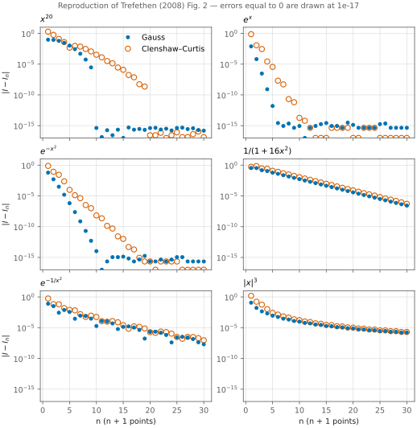
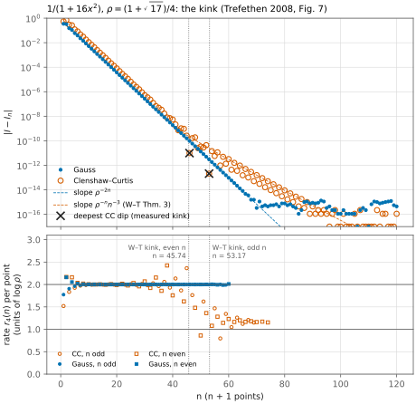
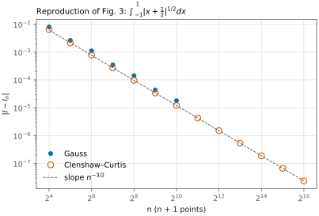
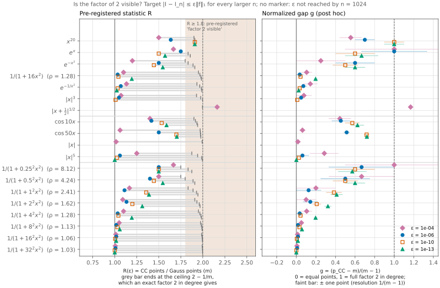
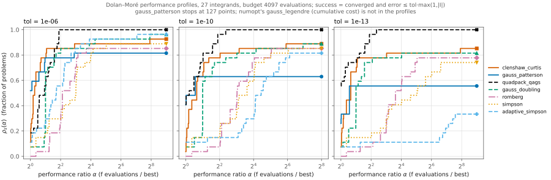
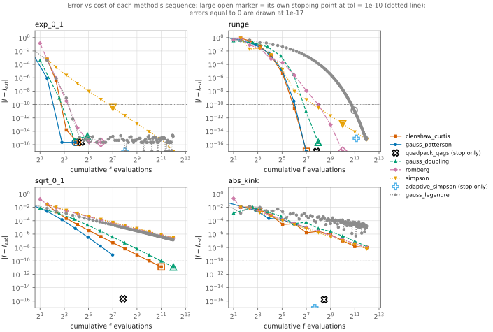

# Is Gauss quadrature better than Clenshaw–Curtis? A reproduction and a ρ-sweep

**Promoted to numopt as `clenshaw_curtis` and `gauss_patterson`** (`src/numopt/integration/methods.py`, tests in `tests/test_integration_promoted.py`). `gauss_patterson` is the nested Gauss–Kronrod–Patterson baseline of `baselines.py`, with the rules of `patterson_rules.json` embedded; both use this study's stopping test unchanged.

**Question.** The (n+1)-point Gauss–Legendre rule is exact to degree 2n+1, Clenshaw–Curtis (CC) only
to degree n. Trefethen (2008) argues that this "factor of 2" is rarely realized: the two rules have
essentially the same accuracy *unless f is analytic in a sizable neighborhood of [−1, 1]*. We ask:
**is the factor of 2 visible only for integrands analytic in a large Bernstein ellipse?** The
pre-stated falsification test was: *a non-entire integrand with a persistent 2× gap in n.* Secondary
question: does CC's nesting (a free error estimate) make it the cheaper rule in practice?

**Answer in one paragraph.** In double precision, no integrand in our 19-function set shows a
persistent factor-2 gap except the polynomial x²⁰ (R = 1.91 = 21/11 points, the largest value that
11 Gauss points allow). So the falsification test is not met. But "entire" is the wrong boundary.
The gap grows with the Bernstein parameter ρ, not with entireness. On the pole family
1/(1 + α²x²), the normalized gap g (0 = equal point counts, 1 = the full factor 2 in degree) rises
at ε = 10⁻¹³ from 0.00 (ρ = 1.03) to 0.60 (ρ = 4.24). At the four tightest ε it is 0.50–0.67
for the meromorphic ρ = 4.24 and 8.12, inside the range of the entire $e^{-x^2}$ (0.43–0.67).
Integrands with ρ ≤ 1.28 and all non-analytic integrands have g ≤ 0.2, with two exceptions:
|x|⁵ at ε = 10⁻⁴ (0.29) and the artifact of $\lvert x+\tfrac12\rvert^{1/2}$ (§4.2). The kink of Weideman & Trefethen (2007),
which decides where CC's rate halves, reproduces to within one n. In a practical comparison with
error estimates on a 4097-evaluation budget, nested CC costs a median 0.53–0.55× a *non-nested*
doubling Gauss scheme, and it is cheaper than the Newton–Cotes family. That advantage comes from
nesting, not from the rule: a *nested* Gauss–Kronrod–Patterson sequence with the same stopping test
stops at the same doubling level on 13–17 of 15–22 integrands that both solve, and it is then two
points cheaper. Adaptive Gauss–Kronrod (QUADPACK QAGS) solves all 27 integrands at every
tolerance. CC is cheaper than QAGS at tol = 10⁻⁶ (median cost ratio 0.81) but not at
tol ≤ 10⁻¹⁰ (1.03 and 1.11).

## 1. Background

On [−1, 1] an interpolatory (n+1)-point rule approximates $I(f)=\int_{-1}^{1}f(x)\,dx$ by
$I_n(f)=\sum_{k=0}^{n} w_k f(x_k)$ (Trefethen 2008, eq. 2.2). Clenshaw–Curtis takes the Chebyshev
extreme points $x_k=\cos(k\pi/n)$ (eq. 2.3) and integrates the interpolant
$p_n=\sum_{j=0}^{n}a_jT_j$ exactly:

$$
I_n^{\mathrm{CC}}(f)=\sum_{j\ \mathrm{even}} \frac{2\,a_j}{1-j^2},
\qquad
w_k=\frac{c_k}{n}\Bigl[1-\sum_{j=1}^{\lfloor n/2\rfloor}\frac{b_j}{4j^2-1}\cos\frac{2jk\pi}{n}\Bigr]
$$

with $b_j=1$ for $j=n/2$ (else 2) and $c_k=1$ for $k\equiv 0 \pmod n$ (else 2) (Waldvogel 2006,
eqs. 2.4–2.5). Waldvogel's theorem (§5) gives the same weights as one inverse DFT of order n,
$w=F_n^{-1}(v+g)$ with explicit rational vectors v (3.10) and g (4.2): O(n log n).

Why CC is better than its degree suggests (Trefethen 2008, Thm. 5.2): on the grid,
$T_{n+p}(x_k)=T_{n-p}(x_k)$, so the aliased Chebyshev modes are integrated with the small error

$$
I(T_{n+p})-I_n(T_{n+p})=\frac{8pn}{n^4-2(p^2+1)n^2+(p^2-1)^2}\quad(n\pm p\ \text{even}),
\tag{5.4}
$$

whereas Gauss integrates $T_{2n+2}$ with an O(1) error. For f analytic inside the Bernstein ellipse
$E_\rho$, Gauss converges like $\rho^{-2n}$. CC converges like $\rho^{-2n}$ *until a kink* and like
$\rho^{-n}n^{-3}$ afterwards (Weideman & Trefethen 2007, Thm. 3). The kink lies where the two terms
are equal (their eqs. 27–28). For poles close to [−1, 1] it moves to large n and small errors, so in
floating point CC never leaves the Gauss-like regime.

## 2. Method

`method.py` implements `clenshaw_curtis(problem, *, bracket=None, n=2, max_levels=12, tol=1e-10)`
with the numopt contract (`Result`, full trace, exact counts, `PARAMS`/`META` for promotion):

* step k uses the rule with $n_k=n\,2^k$ on [a, b]; nodes are computed as
  $\sin(\pi(n_k-2j)/(2n_k))$, which are exactly antisymmetric and **bit-identical under doubling**, so
  the evaluation cache makes a run that stops at level K cost exactly $n_K+1$ evaluations;
* weights: Waldvogel's DFT (symmetrized, `# NOTE` in code);
* error estimate $d_k=|I_{n_k}-I_{n_{k-1}}|$; converged at the first $k\ge 2$ with
  $d_k\le \mathrm{tol}\cdot\max(1,|I_{n_k}|)$; `max_levels` exhausted or a non-finite value gives
  `converged=False`;
* `Step.info`: `estimate`, `error`, `err_est`, `n`, `n_points`, `nodes`, `weights`,
  `cheb_coeffs` (the aliasing picture), `new_nodes`.

`baselines.py` adds the two Gauss–Kronrod baselines of E3:

* `gauss_patterson` — the nested Gauss–Kronrod–Patterson sequence 1, 3, 7, 15, 31, 63, 127 points
  (Patterson 1968), run non-adaptively with **exactly CC's stopping test**. Level k has
  $2^{k+1}-1$ points against CC's $2^{k+1}+1$, and every node is reused, so the two nested schemes
  have the same cost structure; only the rule differs (Patterson's N-point rule is exact to degree
  ≈ 3N/2, CC's to degree N − 1). The rules are computed from the extension conditions
  $\Pi=\sum_{i=n+1}^{N}\pi_iP_i$, $\Pi(x_j)=0$ at the old nodes, in binary128 (numpy `longdouble`
  on aarch64), and stored in `patterson_rules.json`. **The sequence stops at 127 points.** The
  127 → 255 extension is ill-conditioned: the envelope of the node polynomial spans 5.7×10⁻⁵ … 1.7×10²
  at 63 points. Three independent formulations agree to ≤ 3×10⁻²⁸ up to 63 points and to 1.9×10⁻¹⁷ at
  127 points, and all three fail at 255 points in binary128.
* `quadpack_qags` — `scipy.integrate.quad`: QUADPACK's QAGS, adaptive G10/K21 bisection with Wynn's
  ε-extrapolation, with `epsabs = epsrel = tol`. That request is $\mathrm{tol}\cdot\max(1,|I|)$,
  which is the acceptance scale of E3 and the stopping scale of CC; converged = `ier == 0`.

**Verification** (197 tests, ≈ 15–40 s depending on machine load; all oracles are independent of the code that they test):

* `test_method.py` (146 tests). CC weights equal the O(n²) cosine formula to 10⁻¹⁵ for 71 values
  of n ≤ 1024 and the solution of the Chebyshev-moment system to 10⁻¹⁴. Eq. (5.4) holds to 50·m·ε
  for 1000 Hypothesis draws of (n ≤ 200, p ≤ n). The rule is exact to degree n (n + 1 for even n)
  in 1000 random Chebyshev polynomials. Weights are positive and symmetric, sum to 2, and
  $w_0=1/(n^2-1+n\bmod 2)$ for n ≤ 2000. Nodes nest bit for bit for n ≤ 4096. The tests also check
  the paper's printed values, the contract checks of `tests/conftest.py`, agreement with
  `scipy.integrate.quad`, and every failure path. One known blind spot is tested and documented:
  $f=1-T_8^2$ vanishes on every node of n = 2, 4, 8 and gives a false "converged".
* `test_baselines.py` (51 tests). The extension routine applied to Gauss G₇ and G₁₀ reproduces
  QUADPACK's K₁₅ and K₂₁ tables (read from SciPy) to 2ε in nodes and weights. Level 1 equals
  numopt's G₃. Every stored rule is nested bit for bit, symmetric and positive, and integrates
  $P_j$ exactly to 10⁻¹³ for j ≤ 3n + 2. The rules are not exact for $P_{3n+3}$; the defect is
  ≥ 8.8×10⁻¹¹ up to 63 points. 1000 random Legendre series of degree ≤ 3n + 2 are integrated
  exactly. The stored file equals a fresh binary128 computation bit for bit. The 255-point
  extension raises instead of returning wrong nodes. `gauss_patterson` and `quadpack_qags` satisfy
  the contract, and QAGS's count equals QUADPACK's `neval`. The tests also cover the R ceiling
  and g by hand, both kink detectors (53/46 and 65/58) and the 3 ∤ n check (n = 194).

## 3. Setup

* **E1 – reproduction.** Trefethen's Figs. 2, 3, 7, his §2/§5 numbers, and the kink location of
  Weideman & Trefethen (2007) for $1/(1+16x^2)$.
* **E2 – the research question.** 19 integrands on [−1, 1]: Trefethen's seven (x²⁰, eˣ, $e^{-x^2}$,
  1/(1+16x²), $e^{-1/x^2}$, |x|³, $\lvert x+\tfrac12\rvert^{1/2}$), the pole family $1/(1+\alpha^2x^2)$ with
  α ∈ {¼, ½, 1, 2, 4, 8, 16, 32} (poles ±i/α, $\rho=1/\alpha+\sqrt{1+1/\alpha^2}$ from 8.12 to 1.03),
  cos 10x, cos 50x, |x| and |x|⁵. For each, $n_X(\varepsilon)$ is the smallest n on the grid
  (all n ≤ 256, then every 4th n to 1024) with $|I-I_{n'}|\le\varepsilon\|f\|_1$ for **every** larger
  grid n′, and $R(\varepsilon)=(n_{CC}+1)/(n_G+1)$ is the ratio of points.
  **Thresholds fixed before the first run** (not independently timestamped: the study folder had
  no commit history when the first run was made): R ≥ 1.8 = "factor 2 visible"; a *persistent*
  gap is R ≥ 1.8 at the two smallest ε that both rules reach; R ≤ 1.25 = "essentially equal";
  ε ∈ {10⁻⁴, 10⁻⁶, 10⁻⁸, 10⁻¹⁰, 10⁻¹², 10⁻¹³}.
  **Quantization (added after review).** R is a ratio of small integers. If Gauss needs m points
  (degree 2m − 1), the CC rule of the same degree has 2m − 1 points (even n is exact to degree n + 1).
  So an exact factor 2 in degree gives $R=2-1/m$, not 2, and **R ≥ 1.8 can fire only when Gauss
  needs m ≥ 5 points.** Each level therefore also reports the ceiling 2 − 1/m and the normalized gap
  $g=(p_{CC}-m)/(m-1)=(R-1)/(1-1/m)$, where $p_{CC}=n_{CC}+1$. g = 0 means equal point counts and
  g = 1 the full degree factor. One point changes g by 1/(m − 1), and that is its resolution.
* **E3 – practical comparison.** 27 integrands (numopt's 9 `calculus` problems and the 19 above,
  with `pole_a4` removed because it equals 1/(1+16x²)). tol ∈ {10⁻⁶, 10⁻¹⁰, 10⁻¹³}. The budget is
  4097 f-evaluations per run. Success means `converged` and $|I_{\rm est}-I|\le \mathrm{tol}\max(1,|I|)$
  within the budget. A *false convergence* is `converged` with an error above that bound. The
  methods are CC, the two Gauss–Kronrod baselines of §2, `gauss_doubling`, and numopt's `romberg`,
  `simpson` and `adaptive_simpson`, at registered defaults except `tol` and the level that fits the
  budget (`results/practical.json → settings`). `gauss_doubling` is a study construct: Gauss on
  m = 2·2ᵏ points with CC's stopping test, at a cost of Σm because Gauss rules do not nest. For
  `simpson`, the cost is that of the first level whose run reports `converged`. numopt's
  `gauss_legendre` is run and reported, but **it is not in the profiles or the "best" counts**:
  its cost is cumulative over every rule m = 1, …, n (≈ m²/2 evaluations, 761–1105 on cos 50x
  against 254 for `gauss_doubling`). Its stopping test takes the max of the last three
  differences. So its numbers describe that implementation, not the Gauss rule. Quadrature has no
  start point and no randomness, so the instances are integrand × tolerance. The profiles are
  Dolan–Moré performance profiles from `numopt.bench`.
* **Gauss reference.** numopt's Golub–Welsch rule for m ≤ 128 points. Above that, Newton on
  $P_m$ with the three-term recurrence, because dense `eigh` is O(m³). This rule agrees with numopt's
  to 5.0×10⁻¹⁶ in the weights (m = 65, 96, 128) and with a binary128 refinement to 1.5×10⁻¹⁶ (m = 257,
  513, 1025). Side finding: `scipy.special.roots_legendre` is *less* accurate than numopt's rule. At
  m = 256 its maximum weight error against binary128 is 2.2×10⁻¹⁴ absolute (2.0×10⁻¹⁰ relative), against
  2.3×10⁻¹⁶ (1.4×10⁻¹²) for numopt.

## 4. Results

### 4.1 Reproduction (E1) — `results/paper_checks.json`

| Paper statement | Paper | This study |
|---|---|---|
| `gauss(@cos,6)` | 1.68294196961579 | 1.6829419696157941 |
| `clenshaw_curtis(@cos,11)` correct to 15 digits; n = 10 not | yes | 1.682941969615787 (n = 11), 1.6829419696157752 (n = 10) |
| x²⁰ exact for n ≥ 10 (Gauss), n ≥ 20 (CC) | 10 / 20 | 10 / 20 |
| §5, n = 50: CC errors on T₅₂, T₆₀, T₇₀, T₈₀, T₉₀ | "about" 10⁻⁴, 6×10⁻⁴, 2×10⁻³, 6×10⁻³, 2×10⁻² | 1.29×10⁻⁴, 6.95×10⁻⁴, 1.82×10⁻³, **4.70×10⁻³**, 2.00×10⁻² (= eq. 5.4 to 10⁻¹⁵) |
| §5, Gauss (51 pts) on T₁₀₂ | ≈ −1.6 | **+1.563** for $I - I_n$ (the sign convention of 5.4) |
| Clenshaw–Curtis (1960) on $\lvert x+\tfrac12\rvert^{1/2}$: Gauss 32 / 64 points | 0.00317 / 0.00036 | 0.003170 / 0.000364 |
| … CC | 0.00078 | 0.000779 at n = 64 (0.00373 at n = 63) |
| Fig. 3, log–log slope (n ≥ 256) | — | −1.500 (CC), −1.495 (Gauss), i.e. $n^{-3/2}$ |
| Kink of 1/(1+16x²), W–T eqs. 27–28 | n = 53.17 (odd n), 45.74 (even n) | **53, 46** (deepest cancellation dip); the first-run rate rule gave 65, 58 |
| Rate in units of log ρ (fit) | 2 (Gauss), 2 → ≈ 1 + 3/(n log ρ) (CC) | Gauss −2.000 (n 10–60); CC −1.996 (n 10–40), −1.068 (n 60–80; model −1.17 at n = 70) |

Two prose numbers of the paper differ from its own formula (5.4) (T₈₀) or from its sign convention
(T₁₀₂); the formula itself reproduces to rounding. The 1960 CC value matches n = 64. The paper's
remark that the 1960 numbers "correspond to n = 63" is consistent with its Gauss values, which
are the 32- and 64-*point* rules.





*Top: errors to n = 120 with slope guides fixed to the data. The crosses mark the deepest CC
dips. The dotted lines mark the kinks that W–T predict. Bottom: the local rate over four steps of n.
Gauss stays at 2. CC leaves 2 at the predicted n and approaches 1 + 3/(n log ρ).*



### 4.2 The efficiency ratio R(ε) (E2) — `results/efficiency_ratio.json`

Each cell is **R / g**. R is the pre-registered ratio of points, and g is the normalized gap of §3.
† marks a level where Gauss needs m < 5 points: there the ceiling 2 − 1/m is below 1.8, so the
pre-registered test cannot fire. "–" means that a rule does not reach ε by n = 1024. The column
"m/p" gives the point counts (Gauss/CC) at the smallest ε reached.

| integrand | class | ρ | ε = 10⁻⁴ | 10⁻⁶ | 10⁻⁸ | 10⁻¹⁰ | 10⁻¹² | 10⁻¹³ | m/p | verdict |
|---|---|---|---|---|---|---|---|---|---|---|
| x²⁰ | polynomial | – | 1.50 / 0.56 | 1.64 / 0.70 | 1.91 / 1.00 | 1.91 / 1.00 | 1.91 / 1.00 | 1.91 / 1.00 | 11/21 | **persistent gap** |
| eˣ | entire | – | 1.67† / 1.00 | 1.75† / 1.00 | 1.40 / 0.50 | 1.50 / 0.60 | 1.83 / 1.00 | 1.57 / 0.67 | 7/11 | intermediate |
| $e^{-x^2}$ | entire | – | 1.20 / 0.25 | 1.50 / 0.60 | 1.38 / 0.43 | 1.44 / 0.50 | 1.60 / 0.67 | 1.55 / 0.60 | 11/17 | intermediate |
| cos 10x | entire | – | 1.40 / 0.44 | 1.42 / 0.45 | 1.62 / 0.67 | 1.53 / 0.57 | 1.69 / 0.73 | 1.59 / 0.62 | 17/27 | intermediate |
| cos 50x | entire | – | 1.06 / 0.06 | 1.50 / 0.51 | 1.63 / 0.65 | 1.70 / 0.72 | 1.74 / 0.76 | 1.70 / 0.72 | 44/75 | intermediate |
| 1/(1+x²/16) | analytic | 8.12 | 1.67† / 1.00 | 1.50† / 0.67 | 1.40 / 0.50 | 1.50 / 0.60 | 1.57 / 0.67 | 1.50 / 0.57 | 8/12 | intermediate |
| 1/(1+x²/4) | analytic | 4.24 | 1.50† / 0.67 | 1.40 / 0.50 | 1.43 / 0.50 | 1.44 / 0.50 | 1.50 / 0.56 | 1.55 / 0.60 | 11/17 | intermediate |
| 1/(1+x²) | analytic | 2.41 | 1.17 / 0.20 | 1.11 / 0.12 | 1.27 / 0.30 | 1.36 / 0.38 | 1.44 / 0.47 | 1.39 / 0.41 | 18/25 | intermediate |
| 1/(1+4x²) | analytic | 1.62 | 1.09 / 0.10 | 1.13 / 0.14 | 1.10 / 0.11 | 1.20 / 0.21 | 1.27 / 0.28 | 1.31 / 0.32 | 32/42 | intermediate |
| 1/(1+16x²) | analytic | 1.28 | 1.10 / 0.11 | 1.03 / 0.03 | 1.05 / 0.05 | 1.04 / 0.04 | 1.14 / 0.14 | 1.19 / 0.20 | 62/74 | equal |
| 1/(1+64x²) | analytic | 1.13 | 1.05 / 0.05 | 1.02 / 0.02 | 1.01 / 0.01 | 1.03 / 0.03 | 1.04 / 0.04 | 1.06 / 0.06 | 123/130 | equal |
| 1/(1+256x²) | analytic | 1.06 | 1.01 / 0.01 | 1.02 / 0.02 | 1.01 / 0.01 | 1.01 / 0.01 | 1.01 / 0.01 | 1.02 / 0.02 | 246/250 | equal |
| 1/(1+1024x²) | analytic | 1.03 | 1.01 / 0.01 | 1.01 / 0.01 | 1.00 / 0.00 | 1.00 / 0.00 | 1.00 / 0.00 | 1.00 / 0.00 | 493/493 | equal |
| $e^{-1/x^2}$ | C^∞ | – | 1.13 / 0.14 | 1.07 / 0.07 | 1.05 / 0.05 | 1.03 / 0.03 | 1.01 / 0.01 | 1.02 / 0.02 | 85/87 | equal |
| \|x\|⁵ | C⁴ | – | 1.25 / 0.29 | 1.06 / 0.06 | 1.06 / 0.06 | 1.03 / 0.03 | 1.01 / 0.01 | 1.00 / 0.00 | 248/248 | equal |
| \|x\|³ | C² | – | 1.07 / 0.08 | 1.05 / 0.05 | 1.01 / 0.02 | 1.01 / 0.01 | – | – | 425/429 | equal |
| \|x\| | C⁰ | – | 1.02 / 0.02 | – | – | – | – | – | 128/130 | equal (persistence undefined) |
| $\lvert x+\tfrac12\rvert^{1/2}$ | C⁰ | – | **2.16 / 1.17** | – | – | – | – | – | 252/545 | intermediate (persistence undefined) |

The persistence rule needs two reached ε levels. For |x| and $\lvert x+\tfrac12\rvert^{1/2}$, which reach only
ε = 10⁻⁴, it is undefined and cannot fire, whatever R is. For the other 16 integrands the Gauss
point counts at the two deciding levels are m ≥ 5, so there the test *could* have fired.

For the algebraically convergent integrands, the complementary equal-n statistic is the median of
$e_{CC}(n)/e_G(n)$ over the grid n ≥ 8 where both errors exceed 10⁻¹³‖f‖₁. It is
1.01 (|x|), 1.03 (|x|³), 1.07 (|x|⁵), 0.78 ($\lvert x+\tfrac12\rvert^{1/2}$) and 1.46 ($e^{-1/x^2}$). This is Theorem 5.1:
the bound has the same rate and constant. The single R = 2.16 is an artifact of the worst-case
definition of $n_X(\varepsilon)$. When 3 | n, a CC node falls exactly on the singularity at x = −½.
For n ≥ 256 the median relative CC error is then 7.9×10⁻⁵, against 1.7×10⁻⁵ for the other n, and the
maximum is 3.0×10⁻⁴. So the last n with an error above 10⁻⁴ is 540. If the n with 3 | n are removed
from the grid, CC needs n = 194 for ε = 10⁻⁴, against n = 251 for Gauss (unchanged)
(`results/paper_checks.json → sqrt_abs_x_half_spikes`). At equal n, CC is *more* accurate on
this integrand.



*Left: the pre-registered R with its ceiling 2 − 1/m (end of the grey bar). Right: g with a bar of
± one point.*

### 4.3 Practical comparison with error estimates (E3) — `results/practical.json`

| tol | method | solved /27 | false conv. | median f-evals (solved) | $\rho_s(1)$ | $\rho_s(2)$ |
|---|---|---|---|---|---|---|
| 10⁻⁶ | clenshaw_curtis | 25 | 1 (abs_kink) | 33 | 0.11 | **0.78** |
|  | gauss_patterson (≤ 127 pts) | 22 | 0 | **31** | **0.52** | **0.78** |
|  | quadpack_qags | **27** | 0 | 63 | 0.19 | 0.56 |
|  | gauss_doubling | 26 | 0 | 62 | 0.07 | 0.67 |
|  | romberg | 23 | 1 (cos50) | 129 | 0.00 | 0.04 |
|  | simpson | 24 | 0 | 129 | 0.07 | 0.19 |
|  | adaptive_simpson | 26 | 1 (cos50) | 153 | 0.11 | 0.26 |
|  | *gauss_legendre (cumulative cost)* | *21* | *1 (sqrt_0_1)* | *85* | – | – |
| 10⁻¹⁰ | clenshaw_curtis | 24 | 0 | 65 | 0.04 | 0.63 |
|  | gauss_patterson (≤ 127 pts) | 17 | 0 | **31** | **0.41** | 0.63 |
|  | quadpack_qags | **27** | 0 | 63 | **0.41** | **0.74** |
|  | gauss_doubling | 24 | 0 | 62 | 0.07 | 0.59 |
|  | romberg | 23 | 0 | 257 | 0.00 | 0.04 |
|  | simpson | 23 | 0 | 257 | 0.07 | 0.15 |
|  | adaptive_simpson | 22 (4 over budget) | 0 | 977 | 0.11 | 0.11 |
|  | *gauss_legendre (cumulative cost)* | *18* | *0* | *86* | – | – |
| 10⁻¹³ | clenshaw_curtis | 23 | 0 | 65 | 0.07 | 0.67 |
|  | gauss_patterson (≤ 127 pts) | 15 | 0 | **31** | 0.26 | 0.56 |
|  | quadpack_qags | **27** | 0 | 63 | **0.56** | **0.74** |
|  | gauss_doubling | 22 | 0 | 94 | 0.07 | 0.56 |
|  | romberg | 21 | 0 | 513 | 0.00 | 0.04 |
|  | simpson | 20 | 0 | 1537 | 0.07 | 0.15 |
|  | adaptive_simpson | 9 (17 over budget) | 0 | 1937 | 0.07 | 0.07 |
|  | *gauss_legendre (cumulative cost)* | *18* | *0* | *99* | – | – |

The profiles and $\rho_s$ use the seven methods above the italic rows. The medians are over each
method's own solved set, so they are not a paired comparison. The paired comparisons on the
integrands that both methods solve are these (tol = 10⁻⁶, 10⁻¹⁰, 10⁻¹³):

| CC against | integrands both solve | CC cheaper | median cost ratio CC/other |
|---|---|---|---|
| gauss_doubling (not nested) | 25, 24, 22 | 21, 17, 14 | 0.53, 0.55, 0.55 |
| gauss_patterson (nested) | 22, 17, 15 | 3, 0, 0 | 1.10, 1.06, 1.06 |
| quadpack_qags (adaptive GK21) | 25, 24, 23 | 18, 9, 8 | 0.81, 1.03, 1.11 |
| romberg | 23, 22, 20 | 20, 19, 17 | 0.26, 0.19, 0.13 |
| simpson | 24, 22, 19 | 20, 19, 16 | 0.25, 0.13, 0.13 |
| adaptive_simpson | 24, 20, 8 | 21, 19, 7 | 0.34, 0.07, 0.01 |

* **Nested CC against nested Gauss–Patterson.** The two stop at the same doubling level on 17/22,
  14/17 and 13/15 of the integrands that both solve. At the same level Patterson uses two points
  fewer ($2^{k+1}-1$ against $2^{k+1}+1$). This alone sets $\rho_s(1)$ for this pair, so $\rho_s(1)$ is not
  a rule comparison here. Where the levels differ, the direction is mostly the one that E2
  predicts. Patterson stops earlier on the entire integrands (cos 10x at 10⁻⁶; gaussian, x²⁰,
  cos 50x at 10⁻¹⁰; x²⁰, cos 50x at 10⁻¹³) and on √x on [0, 1] at 10⁻⁶. CC stops earlier on
  small-ρ or less smooth integrands (1/(1+16x²), 1/(1+4x²), |x|⁵ at 10⁻⁶). Independent of any
  stopping test, at 65 CC points against 63 Patterson points (degree 64 against 95), CC is *more*
  accurate on 10 of the 12 integrands whose errors are above rounding. All 10 are small-ρ
  analytic or non-smooth, e.g. Runge 1/(1+25x²): 2.9×10⁻¹¹ against 3.1×10⁻¹⁰. Patterson is more
  accurate on the other two (√x on [0, 1] and abs_kink). The entire integrands are at rounding
  with both rules by then; on cos 50x Patterson reaches 3.1×10⁻¹⁶ with 63 points, where CC has
  1.1×10⁻⁹ (`matched_level_accuracy`). Patterson fails more often only because its
  sequence stops at 127 points. With equal caps (CC ≤ 129 points), both solve 22 and 22, 17 and
  17, 14 (CC) and 15 integrands.
* **CC against QUADPACK.** QAGS solves all 27 integrands at every tolerance with no false
  convergence. That includes abs_kink and $\lvert x+\tfrac12\rvert^{1/2}$ (and |x|, √x at tighter tol), where CC
  fails: adaptive bisection isolates interior kinks and endpoint singularities. CC is cheaper on
  18 of 25 integrands at tol = 10⁻⁶, and on only 9/24 and 8/23 at 10⁻¹⁰ and 10⁻¹³. With a
  purely relative request (`epsabs = 0`), QAGS solves 26, 26 and 24, and the median CC/QAGS ratio
  is 0.81, 1.03 and 1.20 (`pairwise_cc → quadpack_qags_epsabs0`).





## 5. Discussion

**The research question.** The pre-stated falsification test (a non-entire integrand with a
persistent 2× gap) is not met. For 16 of the 18 distinct integrands the test could fire, since at
the two deciding levels Gauss needs m ≥ 5 points. For |x| and $\lvert x+\tfrac12\rvert^{1/2}$ it is undefined. The
stronger reading "the factor 2 is a property of entire functions" is not supported either. The
quantity that decides the gap is ρ relative to the target accuracy. At ε = 10⁻¹³, g rises with ρ
on the pole family: 0.00, 0.02, 0.06, 0.20, 0.32, 0.41, 0.60 for ρ = 1.03 … 4.24. These steps
are resolved, because g's resolution 1/(m − 1) is 0.002–0.1 there. For ρ ≥ 4 the point counts are
small (m = 8–11), so g has a resolution of only 0.10–0.14. The meromorphic ρ = 4.24 and 8.12
(g = 0.50–0.67 at the four tightest ε) cannot be separated from the entire $e^{-x^2}$ (0.43–0.67)
or eˣ (0.50–1.00, with resolution 0.17–0.25). That is the precise meaning of "the same range".
The comparison with R alone (1.40–1.67 against 1.20–1.60) was close to quantization noise,
because one point moves R by 0.1–0.3 at these m. The full factor (g = 1) occurs for
analytic non-polynomial integrands only at isolated levels with m ≤ 6 (eˣ at 10⁻⁴, 10⁻⁶, 10⁻¹²;
ρ = 8.12 at 10⁻⁴), where g's resolution is 0.2–0.5. This is Trefethen's own formulation
("analytic in a sizable neighborhood") and what the kink theory predicts. When the kink falls at
an error level below ε, CC is Gauss-like for the whole run. The asymptotic factor 2 ($\rho^{-n}$
against $\rho^{-2n}$) is visible only after the kink, and in double precision that requires a large
ρ. The only persistent full factor 2 that we observed is the exactness degree of a polynomial.

**The practical question.** Nesting, not the rule, gives CC its ≈ 2× cost advantage over
`gauss_doubling`. The nested Gauss–Kronrod–Patterson sequence has the same advantage and stops at
the same level on most integrands, two points cheaper. So "nested CC is the cheapest method"
holds only against non-nested Gauss and the Newton–Cotes family (Romberg, Simpson, adaptive
Simpson). Among nested schemes the rule decides only at the margin, in the direction of E2: the
higher-degree Patterson rule wins on entire integrands, and CC wins on small-ρ ones. Adaptive
Gauss–Kronrod (QAGS) is the most robust method here. It solves more integrands than CC at every
tolerance, and at tol ≤ 10⁻¹⁰ it is cheaper on most integrands that both solve. CC's practical
merits are its simplicity, its closed-form O(n log n) weights for any n, and an unlimited nested
sequence: Patterson stops at 127 points in binary128.

**Where CC loses.** (i) At equal n, Gauss is far more accurate for entire functions, e.g. eˣ at
n = 8: 2.2×10⁻¹⁵ against 2.0×10⁻¹¹. Past the kink of 1/(1+16x²), at n = 64: 1.30×10⁻¹⁴ against
9.49×10⁻¹³. Point counts hide this, because the error is falling fast there. (ii) In E3, CC fails
the budget on every integrand with a kink in f or an interior singularity at tight tolerance (|x|,
$\lvert x+\tfrac12\rvert^{1/2}$, abs_kink, and sqrt_0_1 at 10⁻¹³). QAGS solves all of them. (iii) CC has one false
convergence (abs_kink, tol = 10⁻⁶: error 2.6×10⁻⁶ = 2.6× tol). The reason is that $d_k$ estimates
the error of the coarser rule, and this underestimates when an algebraic sequence oscillates.
(iv) Because $d_k$ estimates the coarser rule, CC usually does one more doubling than necessary
on analytic f. On runge it stops with 129 points at tol = 10⁻⁶ (and at 10⁻¹⁰) with an error of
0.0, while the 65-point rule already had 2.9×10⁻¹¹. The same is true of every scheme with this stopping test,
`gauss_patterson` included.

**Aliasing hazards are rule-specific.** On cos 50x, Romberg and adaptive Simpson stop after 17
equispaced points with an error of 1.99 at tol = 10⁻⁶, because the integrand looks constant on
those grids. CC (Chebyshev grids), both Gauss-type nested schemes and QAGS did not stop early
there.

**Threats to validity.** (1) The integrand set is ours. It is Trefethen's set plus three families
that we chose to vary ρ, oscillation and smoothness. (2) Double precision truncates the asymptotic
regime. R(ε) for ε → 0 in exact arithmetic tends to 2 for every analytic non-polynomial f, so our
conclusion is about computable accuracies, ε ≥ 10⁻¹³·‖f‖₁. (3) $n_X(\varepsilon)$ uses the worst
case over larger n, which penalizes irregular sequences ($\lvert x+\tfrac12\rvert^{1/2}$). We therefore also report an
equal-n median. That statistic was **added after the first run**. The ceiling, g and the
"can fire" flags were **added after review**; they do not change any verdict. (4) Two other
analysis choices were also changed after the first run, and both changes are in the code as
`# NOTE`. First, errors were normalized by |I|, which put the 10⁻¹³ target of cos 50x
(|I| = 0.0105, ‖f‖₁ = 1.27) at the rounding floor and produced a spurious R = 0.09 in that first
run. They are now normalized by ‖f‖₁. Second, the kink was first detected by a rate threshold
(the first n after which the two-step rate stays < 1.5). The zig-zag of the CC error defeats
that rule: it reported n = 65/58, and it still does (`kink_runge16 → first_run_detector`). The
kink is now the deepest cancellation dip, which is the equal-magnitude condition of W–T. That dip
is not marginal: the deepest D(n) is −4.11 (n = 53) and −3.76 (n = 46), against −1.06 and −1.15
for the next dips. The thresholds GAP = 1.8 and EQUAL = 1.25 and the ε grid were not changed.
"Fixed before the first run" is our statement; it has no independent timestamp. (5) In E3,
tolerance semantics differ: `adaptive_simpson`'s tol is an absolute target. All methods are judged
by the same |error| ≤ tol·max(1,|I|) rule, and the 4097-evaluation budget favors methods with
doubling grids at powers of two. `gauss_patterson` is capped at 127 points by the precision of its
construction, not by the budget; the equal-cap counts above remove that handicap. (6) The Gauss
rules above 128 points are not numopt's implementation; they are verified against it and against
binary128 (§3). (7) numopt is being rewritten while this study runs. The numopt baselines
(romberg, simpson, adaptive_simpson, gauss_legendre) are whatever the installed code does, and
their stopping tests became stricter between two runs of this study (a confirmed asymptotic regime
is now required). This raised their costs: romberg's median went from 65 to 129 evaluations at
10⁻⁶. `results/practical.json → numopt_integration_sha256` records the version that was used.
The CC, Gauss, Patterson and QAGS results do not depend on numopt's integration code, except for
numopt's Golub–Welsch rule for m ≤ 128.

## 6. Reproduce

```bash
.venv/bin/python -m pytest research/clenshaw-curtis-vs-gauss      # 197 tests, ~15–40 s
.venv/bin/python research/clenshaw-curtis-vs-gauss/run.py          # ~15–40 s; writes results/*.json, figures/*.svg
.venv/bin/python research/clenshaw-curtis-vs-gauss/baselines.py    # optional: rebuild patterson_rules.json (needs binary128 longdouble)
```

The outputs are byte-identical across runs for a fixed numopt version: the study has no randomness,
and the SVGs have fixed ids and no date. `run.py` sets one BLAS thread, because on a loaded
multi-core machine the threaded `eigh` inside numopt's Gauss rule was much slower and gave the same
output.

## References

* L. N. Trefethen, *Is Gauss quadrature better than Clenshaw–Curtis?*, SIAM Review 50(1):67–87,
  2008. doi:10.1137/060659831
* J. Waldvogel, *Fast construction of the Fejér and Clenshaw–Curtis quadrature rules*, BIT Numer.
  Math. 46:195–202, 2006. doi:10.1007/s10543-006-0045-4
* J. A. C. Weideman and L. N. Trefethen, *The kink phenomenon in Fejér and Clenshaw–Curtis
  quadrature*, Numer. Math. 107:707–727, 2007. doi:10.1007/s00211-007-0101-2
* T. N. L. Patterson, *The optimum addition of points to quadrature formulae*, Math. Comp.
  22:847–856, 1968. doi:10.1090/S0025-5718-68-99866-9
* R. Piessens, E. de Doncker-Kapenga, C. W. Überhuber, D. K. Kahaner, *QUADPACK: A Subroutine
  Package for Automatic Integration*, Springer, 1983.
* L. N. Trefethen, *Approximation Theory and Approximation Practice*, SIAM, 2013, Ch. 19.
* C. W. Clenshaw and A. R. Curtis, *A method for numerical integration on an automatic computer*,
  Numer. Math. 2:197–205, 1960.
* E. D. Dolan and J. J. Moré, *Benchmarking optimization software with performance profiles*, Math.
  Program. 91:201–213, 2002.
