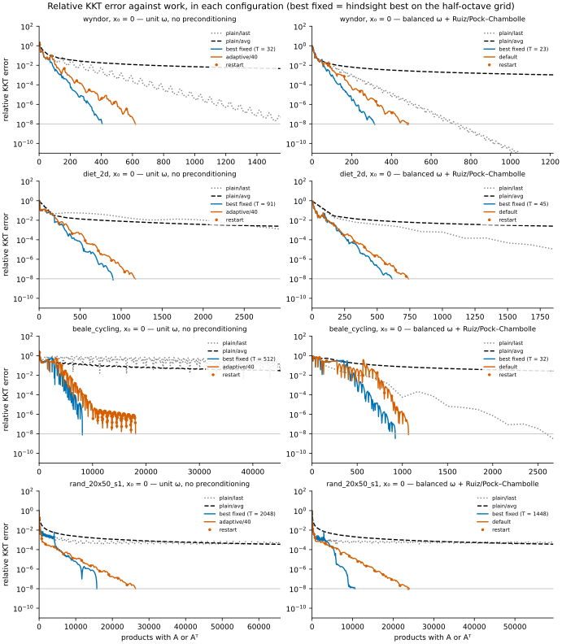
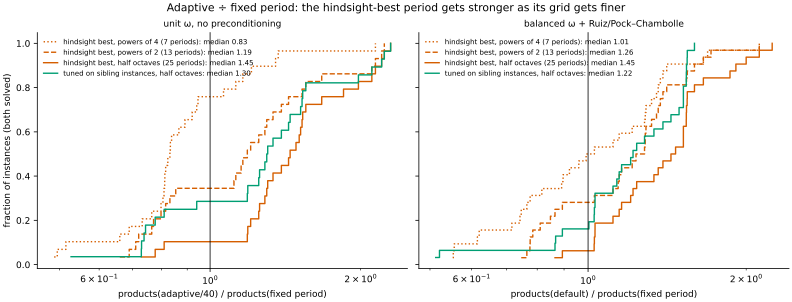
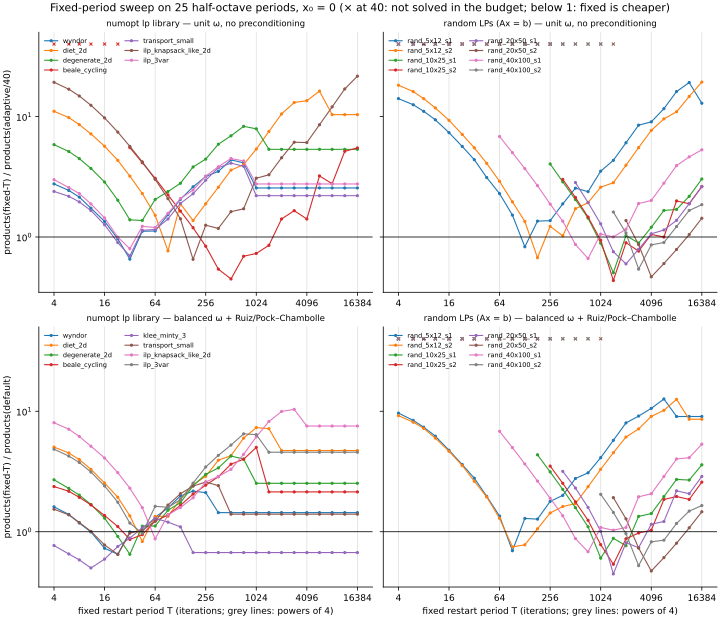
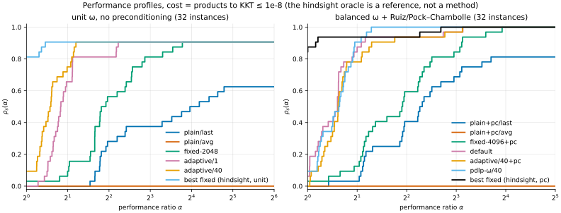
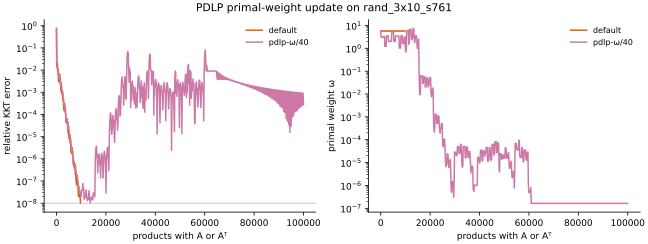

# Restarted PDHG for linear programming (PDLP-style)

Promoted to numopt as `restarted_pdhg` (`src/numopt/lp/pdhg.py`, tests in `tests/test_lp_pdhg.py`).

## Question

On small LPs, how many products with $A$ or $A^\top$ does the primal-dual hybrid gradient
method (PDHG) need to reach a relative KKT error of $10^{-8}$:

- with no restarts,
- with fixed-frequency restarts,
- with adaptive restarts?

The theory of Applegate et al. (2023) predicts that restarted PDHG converges linearly. It also
predicts that the adaptive scheme is competitive with the best fixed restart period. The study
asked for a sublinear curve for plain PDHG and an adaptive scheme "no slower than the best
fixed frequency". We test both claims as stated.

**Findings at a glance** (details and qualifications in Results and Discussion).

- **Restarts pay off in both configurations.** Without preconditioning, adaptive restarts solve
  29 of 32 instances against 20 for plain PDHG, with a median 4.9× fewer products where both
  solve. With the method's default preconditioning, they solve 32 against 26, with a median
  3.1× fewer products. Plain PDHG with preconditioning is cheaper on 3 of 26 instances (all
  three `klee_minty_3` starts).
- **The plain average converges at exactly $O(1/k)$** (fitted exponent 1.00 on every instance).
  The plain *last* iterate is linear on all 21 fitted library instances (2–6 variables; 24 with
  preconditioning), as the 2023 theory states. On the 6 larger random LPs it does not reach $10^{-8}$, and the data
  inside the budget do not identify its rate.
- **Adaptive restarts are not as fast as a tuned fixed period.** Against the hindsight-best
  period, the median ratio is 0.83, 1.19 or 1.45 for adaptive/40 when the grid of periods is
  powers of 4, powers of 2 or half octaves; with preconditioning it is 1.01, 1.26 or 1.45. The
  ratio depends on the grid, because a minimum over more periods is a stronger oracle. Against
  any single period chosen in advance, adaptive/40 is cheaper on at least 61% of the instances
  that both solve, and it never fails where that period succeeds. Its advantage is that it
  needs no tuning.
- **PDLP's adaptive primal weight is unstable with a constant step** (Results §4).

## Background

The LP $\min c^\top x$ s.t. $A_{ub}x\le b_{ub}$, $A_{eq}x=b_{eq}$, $x\ge 0$ is put in equality
standard form $\min \tilde c^\top z$ s.t. $Az=b$, $z\ge 0$, with one slack per inequality row.
The method solves the saddle-point problem

$$\min_{z\ge 0}\max_{y}\; L(z,y)=\tilde c^\top z-y^\top A z+b^\top y .$$

One PDHG step (Chambolle & Pock 2011, Alg. 1 with $\theta=1$; Applegate et al. 2021, eq. 3) is

$$z^{+}=\operatorname{proj}_{z\ge 0}\big(z-\tau(\tilde c-A^\top y)\big),\qquad
y^{+}=y+\sigma\big(b-A(2z^{+}-z)\big),$$

with $\tau=\eta/\omega$, $\sigma=\eta\omega$, $\eta=0.9/\lVert A\rVert_2$, so
$\tau\sigma\lVert A\rVert_2^2=0.81<1$. Here $\omega$ is the *primal weight* (Applegate et al.
2021, eq. 4).

A **restart** replaces the iterate by the running average
$\bar z^{n,t}=\tfrac1t\sum_{i=1}^t z^{n,i}$ of the current epoch (Applegate et al. 2023,
Alg. 1). The fixed scheme restarts every $T$ iterations (their eq. 29). The adaptive scheme
(their eq. 30) restarts when the normalized duality gap decays by a factor $\beta=e^{-1}$
(their Remark 5):

$$\rho_{\lVert\bar z^{n,t}-z^{n,0}\rVert}(\bar z^{n,t})\;\le\;\beta\,
\rho_{\lVert z^{n,0}-z^{n-1,0}\rVert}(z^{n,0}),\qquad
\rho_r(z)=\frac1r\max_{\hat z\in Z,\;\lVert\hat z-z\rVert_\omega\le r}\big[L(z,\hat y)-L(\hat z,y)\big].$$

The weighted norm is $\lVert(z,y)\rVert_\omega^2=\omega\lVert z\rVert^2+\lVert y\rVert^2/\omega$.
PDLP (Applegate et al. 2021) adds three components:

- a primal-weight update at every restart:
  $\omega\leftarrow\exp\big(\tfrac12\log(\Delta y/\Delta z)+\tfrac12\log\omega\big)$, their Alg. 3;
- diagonal preconditioning: 10 Ruiz passes, then one Pock–Chambolle pass with $\alpha=1$ (§3.5);
- an adaptive step size, presolve and further restart heuristics, which this study does not use.

The 2023 paper (Table 2, bilinear case) gives these complexities:

| sequence | complexity |
|---|---|
| plain PDHG, last iterate | $\Theta(\kappa^2\log\frac1\varepsilon)$ (linear, but with $\kappa^2$) |
| plain PDHG, average | $\Theta(\kappa/\varepsilon)$ (sublinear) |
| restarted PDHG | $\Theta(\kappa\log\frac1\varepsilon)$ |

The theory therefore does **not** predict a sublinear curve for the plain *last* iterate. It
predicts one for the plain *average* only. We measure both sequences.

**References.**

- D. Applegate, M. Díaz, O. Hinder, H. Lu, M. Lubin, B. O'Donoghue, W. Schudy, "Practical
  large-scale linear programming using primal-dual hybrid gradient", NeurIPS 2021.
- D. Applegate, O. Hinder, H. Lu, M. Lubin, "Faster first-order primal-dual methods for linear
  programming using restarts and sharpness", *Math. Program.* 201:133–184, 2023.
- A. Chambolle, T. Pock, "A first-order primal-dual algorithm for convex problems with
  applications to imaging", *J. Math. Imaging Vis.* 40:120–145, 2011.
- Official code: google-research/FirstOrderLp.jl and PDLP in OR-Tools. We did not run them.

## Method

`method.py` implements `restarted_pdhg(problem, *, x0=None, seed=None, **params) -> Result`
with the numopt contract:

- a full trace with one `Step` per iteration;
- the geometry in `Step.info`: the dual iterate, the epoch average, the KKT terms, ω, τ, σ,
  the restart flags, the normalized gap and the threshold;
- an honest `converged` flag;
- the parameter list in `PARAMS` for later promotion into the package.

The variants are parameters:

| parameter | values |
|---|---|
| `restart` | `none`, `fixed` (`restart_period`), `adaptive` (`beta`, `restart_check_every`) |
| `primal_weight` | `unit` (ω = 1), `balanced` (ω = ‖c‖/‖b‖, PDLP's initial value), `adaptive` (PDLP Alg. 3) |
| `precondition` | `none`, `ruiz_pc` |

- **Stopping test.** This is PDLP eq. 6 on the unscaled standard form. The relative KKT error
  is the largest of the three terms
  $|\tilde c^\top z-b^\top y|/(1+|\tilde c^\top z|+|b^\top y|)$,
  $\lVert Az-b\rVert/(1+\lVert b\rVert)$ and
  $\lVert\min(\tilde c-A^\top y,0)\rVert/(1+\lVert\tilde c\rVert)$.
  The method stops when the iterate or the epoch average has an error ≤ `tol`.
- **Normalized duality gap.** The gap is computed exactly. The maximizer is
  $d(t)=(\max(-z,\,t g_z/\omega),\,t\omega g_y)$ with $g=(A^\top y-\tilde c,\;b-Az)$ (their
  eqs. 50–54, in the weighted norm). A sort of the bound break points gives the radius
  equation $\lVert d(t)\rVert_\omega=r$ exactly.
- **Cost.** The method keeps $Az$ and $A^\top y$ for the iterate. By linearity, it also keeps
  them for the average. Every KKT and gap evaluation is therefore free, and the number of
  products is exactly $2+2k$ after $k$ iterations.

**Deviations from PDLP (all marked `# NOTE:` in the code).**

- The step size is constant, $\eta=0.9/\lVert A\rVert_2$, as in the paper's baseline and in the
  2023 experiments. $\lVert A\rVert_2$ comes from an exact SVD, and this cost is not counted.
- The restart always goes to the average. PDLP's restart conditions (ii) and (iii) and its
  `GetRestartCandidate` are not used.
- There is no presolve and no infeasibility detection.
- The LP is solved in the slack (equality standard) form $Az=b$, $z\ge0$. PDLP keeps the
  inequality rows $Gx\ge h$ with a dual projection $y_G\ge0$, and measures the primal residual
  as $\lVert(Ax-b,\,(h-Gx)^+)\rVert_2$ (Applegate et al. 2021, eq. 6b). The slack form adds an
  identity block to the constraint matrix. This changes $\lVert A\rVert_2$ (hence η), the
  Ruiz/Pock–Chambolle scalings, the weighted norm in the normalized gap, and the KKT terms.
- The task text wrote "ω = τ/σ". We use the papers' parameterization τ = η/ω, σ = ηω, because
  PDLP Alg. 3 is stated for it.
- The method default is `primal_weight="balanced"`, not PDLP's adaptive update. The reason is
  in Results §4.
- In passing: the NeurIPS text gives $\beta_{\text{sufficient}}$ = 0.9 and $\beta_{\text{necessary}}$ = 0.1, which appear
  swapped relative to the meaning of its conditions (i) and (ii). We use only the theory test,
  eq. 30, with β = e⁻¹.

**Verification.** `test_method.py` has 44 tests that pass and 1 expected failure.

- A hand-computed three-step PDHG trajectory agrees to `rtol=1e-14`.
- Convergence to the `scipy.optimize.linprog` (HiGHS) optimum on all 8 library LPs, for three
  variants. The objective agrees to $10^{-6}$ relative. $x$ agrees to $10^{-5}$ where the optimum
  is unique.
- The dual of `wyndor` equals the HiGHS marginals.
- The normalized gap equals the Lagrangian dual bound $\min_{\lambda>0}$ of the trust-region
  problem, an independent formulation. This test uses 1000 Hypothesis examples at
  `rel=1e-7`, the accuracy of the 1-D search. The gap also agrees with SLSQP in 200 examples.
- Further Hypothesis invariants, with 1000 examples each:
  - $\rho_r$ is non-increasing in $r$ and is 0 at a primal-dual optimum;
  - one PDHG step fixes a primal-dual optimum for any τ, σ;
  - $\lVert\tilde A\rVert_2\le 1$ after Ruiz + Pock–Chambolle, as in Pock & Chambolle 2011, Lemma 2.
- PDLP's scale invariance (their App. A): the $x$ iterates are unchanged and $y$ scales by 1000
  when $c$ is multiplied by 1000.
- The count of products equals $2+2k$ exactly.
- The `tests/conftest.py` contract checks pass.
- 40 Hypothesis random sharp LPs are solved to their known optimum.
- The expected failure: without preconditioning, `klee_minty_3` does not reach $10^{-8}$ in
  50 000 iterations.
- The experiment design in `run.py` is tested too: the period grids are nested
  (powers of 4 ⊂ powers of 2 ⊂ half octaves); the `default` variant is the adaptive scheme of
  the preconditioned configuration (identical iterates); the tuning set of an instance never
  contains it; and the per-LP aggregate ratio equals the geometric mean of the per-start ratios
  (1000 Hypothesis examples, `rtol=1e-12`).

## Setup

- **Instances (32 instances of 16 distinct LPs).**
  - The 8 feasible, bounded LPs of `numopt.problems` (kind `lp`): `wyndor`, `diet_2d`,
    `degenerate_2d`, `beale_cycling`, `klee_minty_3`, `transport_small`, and the LP relaxations
    of `ilp_knapsack_like_2d` and `ilp_3var`. Each has 3 starts: $x_0=0$ and two uniform random
    $x_0\in[0,2\max(1,\lVert x^\star\rVert_\infty)]^n$ (NumPy seeds 11 and 12). This gives 24
    instances.
  - 8 random equality LPs of size 5×12, 10×25, 20×50 and 40×100, with seeds 1 and 2. They have a
    known, strictly complementary optimum, and they start from $x_0=0$.
  - The dual start is always $y_0=0$.
- **Pseudo-replication.** The 3 starts of a library LP differ only in $x_0$, and their outcomes
  are almost the same. Every comparison is therefore also reported **per LP**: the cost of an
  LP is the geometric mean over its starts (∞ if a start fails), so a per-LP ratio is the
  geometric mean of the per-start ratios. Counts over 32 instances overstate the number of
  independent tests; counts over 16 LPs do not.
- **Budget.** The budget is the same for every variant: 50 000 iterations, which is 100 002
  products. The tolerance is $10^{-8}$ on the relative KKT error.
- **Cost.** The cost of a run is the number of products with $A$ or $A^\top$ at the first
  iterate (or average) whose error is ≤ $10^{-8}$.
- **Two configurations.** Every restart comparison is made inside one configuration, never
  across a change of preconditioning:

  | configuration | settings | plain PDHG | fixed restarts | adaptive restarts |
  |---|---|---|---|---|
  | `unit` | ω = 1, no preconditioning (the 2023 paper's setting) | `plain/last`, `plain/avg` | `fixed-T` | `adaptive/40`, `adaptive/1` |
  | `pc` | balanced ω, Ruiz + Pock–Chambolle (the method's defaults) | `plain+pc/last`, `plain+pc/avg` | `fixed-T+pc` | `default` (= adaptive/40) |

  - `plain/*` is one run to the full budget; both the last iterate and the running average are
    measured.
  - `adaptive/40` tests eq. 30 every 40 iterations (PDLP's check interval); `adaptive/1` tests
    it every iteration (the theory scheme).
  - Ablations in the `pc` configuration: `adaptive/40+pc` (unit ω), `pdlp-ω/40` and `pdlp-ω/1`
    (PDLP's adaptive primal weight, checked every 40 or every iteration).
- **Fixed periods.** T runs over 25 half-octave values $\mathrm{round}(2^{j/2})$, $j=4,\dots,28$,
  that is 4, 6, 8, 11, 16, 23, 32, …, 11585, 16384, in both configurations. Two coarser grids
  are subsets: powers of 4 (4, 16, …, 16384; 7 periods) and powers of 2 (4, 8, …, 16384;
  13 periods). The 2023 paper sweeps $4^1,\dots,4^9$; with our budget, 16384 is the largest
  period that still restarts more than twice.
- **Fixed-period comparators.** None of them is a method that a user can run without tuning.
  - *Hindsight best*: the per-instance best period on a grid. It is chosen on the test
    instance itself, so it is an optimistic bound, and it gets stronger as the grid gets finer.
  - *Tuned on siblings*: the period chosen (most solved, then smallest geometric mean) on the
    other instances of the same LP (library: the 2 other starts) or on the random LP of the
    same size with the other seed, then applied to the held-out instance. For the library LPs
    the siblings are near-replicates, so this is close to the hindsight best. For the random
    LPs it is a genuine transfer to a different LP.
  - *Best single period*: one period for all instances, chosen in-sample by the same rule.
- **Baselines.** These are exact methods. Their cost is in pivots or Newton steps, not in
  products, so we report their iterations and accuracy only.
  - `primal_dual_ipm` (Mehrotra);
  - `affine_scaling`;
  - `two_phase_simplex` and `revised_simplex`, both with Bland's rule, because the Dantzig
    rule cycles on `beale_cycling` by design;
  - `scipy.optimize.linprog(method="highs")`, the oracle for $x^\star$ and $f^\star$.
- **Shape of the curves.** On the running-minimum KKT envelope, in the segment
  $10^{-8}\le e\le10^{-3}$, we fit two models:
  - a linear model, $\log_{10} e = a - r\,k$ (a straight line on a log-y plot);
  - a power model, $\log_{10} e = a - p\log_{10}k$, where $p$ is the power-law exponent.

## Results

All numbers are from `results/summary.json`. The run takes 75–125 s on 16 worker processes.

### 1. Instances solved to $10^{-8}$ within 100 002 products

| variant | all 32 instances | library 24 | LPs, all starts solved (of 16) |
|---|---|---|---|
| plain/last | 20 | 18 | 8 |
| plain/avg | **0** | 0 | 0 |
| fixed-T (25 periods) | 20 – 29 | 18 – 21 | 8 – 15 |
| adaptive/1 | 29 | 21 | 15 |
| adaptive/40 | 29 | 21 | 15 |
| plain+pc/last | 26 | 24 | 10 |
| plain+pc/avg | **0** | 0 | 0 |
| fixed-T+pc (25 periods) | 26 – 32 | 24 | 10 – 16 |
| default | 32 | 24 | 16 |
| adaptive/40+pc | 32 | 24 | 16 |
| pdlp-ω/40 | 32 | 24 | 16 |
| pdlp-ω/1 | 31 | 24 | 15 |

Without preconditioning, no variant solves the 3 `klee_minty_3` instances, where $b$ ranges
from 1 to $10^4$. Fixed periods of 2048 or more solve 29 instances (16384 solves 28); with
preconditioning, periods of 1448 or more solve all 32.

### 2. Products to $10^{-8}$, start $x_0=0$ (— = not solved in the budget)

"best ⁴" and "best ½" are the hindsight-best fixed period on the powers-of-4 and the
half-octave grid, with the period in parentheses.

| instance | plain/last | best ⁴ (T) | best ½ (T) | adaptive/1 | adaptive/40 | plain+pc/last | best ⁴+pc (T) | best ½+pc (T) | default | pdlp-ω/40 |
|---|---|---|---|---|---|---|---|---|---|---|
| wyndor | 1584 | 696 (64) | 406 (32) | 664 | 620 | 700 | 354 (16) | 316 (23) | 486 | 494 |
| diet_2d | 12204 | 1782 (64) | 902 (91) | 1958 | 1176 | 3492 | 992 (64) | 614 (45) | 740 | 732 |
| degenerate_2d | 2556 | 980 (64) | 656 (45) | 886 | 478 | 1570 | 694 (64) | 404 (32) | 622 | 680 |
| beale_cycling | — | 13194 (1024) | 8096 (512) | 37800 | 18056 | 2286 | 1308 (64) | 922 (32) | 1068 | 920 |
| klee_minty_3 | — | — | — | — | — | 306 | 270 (16) | 228 (11) | 456 | 482 |
| transport_small | 1512 | 792 (64) | 478 (32) | 686 | 686 | 786 | 436 (16) | 364 (23) | 562 | 684 |
| ilp_knapsack_like_2d | 49660 | 3452 (256) | 1798 (181) | 3896 | 2754 | 7694 | 890 (64) | 890 (64) | 1020 | 1016 |
| ilp_3var | 1704 | 742 (64) | 494 (32) | 668 | 618 | 2752 | 978 (64) | 584 (45) | 602 | 830 |
| rand_5x12_s1 | 26670 | 2824 (256) | 1714 (128) | 2890 | 2066 | 13906 | 2070 (64) | 1068 (91) | 1536 | 1524 |
| rand_5x12_s2 | 53630 | 3936 (256) | 2160 (181) | 4226 | 3208 | 16506 | 2478 (64) | 1440 (91) | 1922 | 2228 |
| rand_10x25_s1 | — | 19986 (1024) | 11366 (1448) | 24468 | 22500 | — | 11360 (1024) | 11360 (1024) | 18832 | 20058 |
| rand_10x25_s2 | — | 24462 (1024) | 11334 (1448) | 24484 | 26022 | — | 20594 (1024) | 14158 (1448) | 26378 | 27398 |
| rand_20x50_s1 | — | 28014 (4096) | 15756 (2048) | 27074 | 26342 | — | 23980 (1024) | 10606 (1448) | 23774 | 24184 |
| rand_20x50_s2 | — | 23790 (4096) | 23790 (4096) | 51502 | 50928 | — | 23344 (4096) | 23344 (4096) | 49452 | 56938 |
| rand_40x100_s1 | — | 13612 (1024) | 8542 (724) | 13114 | 12874 | — | 13594 (1024) | 8536 (724) | 12528 | 13414 |
| rand_40x100_s2 | — | 38800 (4096) | 24408 (2896) | 45448 | 45114 | — | 38464 (4096) | 24408 (2896) | 46666 | 46738 |



**Restart gain.** Ratios of products, on the instances that both solve:

| configuration | comparison | n | ratio ≤ 1 | median | geo. mean | max | solved only by the adaptive scheme |
|---|---|---|---|---|---|---|---|
| unit | plain/last ÷ adaptive/40 | 20 | 0 | 4.914 | 5.268 | 18.03 | 9 |
| unit | same, per LP | 8 | 0 | 7.122 | 6.250 | 16.72 | 7 |
| pc | plain+pc/last ÷ default | 26 | 3 | 3.079 | 2.784 | 9.053 | 6 |
| pc | same, per LP | 10 | 1 | 3.766 | 3.247 | 9.053 | 6 |

With preconditioning, plain PDHG is already much better (26 instances solved instead of 20),
so the restart gain in the shipped configuration is about 3×, not 5×. Plain+pc is cheaper than
`default` on all 3 `klee_minty_3` starts (306 against 456, 5930 against 8234, 11538 against
15692).

**Shape of the curves, by instance class.**

| sequence | class | fitted | linear fits better | reached $10^{-8}$ | median $R^2_{lin}$ | median $R^2_{pow}$ | median $p$ (range) |
|---|---|---|---|---|---|---|---|
| plain/last | library | 21 | 21 | 18 | 0.999 | 0.968 | 8.39 (3.97–9.63) |
| plain/last | random | 8 | 4 | 2 | 0.958 | 0.903 | 0.39 (0.22–6.57) |
| plain/avg | library | 16 | 0 | 0 | 0.891 | 1.000 | 1.00 (1.00–1.00) |
| plain/avg | random | 8 | 0 | 0 | 0.953 | 1.000 | 1.00 (1.00–1.01) |
| plain+pc/last | library | 24 | 24 | 24 | 0.999 | 0.965 | 8.87 (6.55–30.53) |
| plain+pc/last | random | 8 | 5 | 2 | 0.968 | 0.918 | 0.49 (0.14–8.14) |
| plain+pc/avg | library | 20 | 0 | 0 | 0.873 | 1.000 | 1.00 (1.00–1.00) |
| plain+pc/avg | random | 8 | 0 | 0 | 0.955 | 1.000 | 1.00 (1.00–1.00) |
| adaptive/40 | library | 21 | 17 | 21 | 0.988 | 0.968 | 10.31 (8.51–16.69) |
| adaptive/40 | random | 8 | 8 | 8 | 0.994 | 0.913 | 5.46 (2.85–9.17) |
| default | library | 24 | 24 | 24 | 0.985 | 0.965 | 9.74 (7.78–46.01) |
| default | random | 8 | 8 | 8 | 0.994 | 0.880 | 5.50 (2.95–9.67) |
| best fixed ½ (unit) | library | 21 | 21 | 21 | 0.988 | 0.965 | 11.18 (7.73–17.23) |
| best fixed ½ (unit) | random | 8 | 7 | 8 | 0.957 | 0.911 | 8.13 (4.09–10.04) |
| best fixed ½ (pc) | library | 24 | 24 | 24 | 0.991 | 0.973 | 10.62 (8.26–30.53) |
| best fixed ½ (pc) | random | 8 | 7 | 8 | 0.940 | 0.863 | 7.25 (2.99–10.81) |

- **The plain average is sublinear at exactly $O(1/k)$.** The power model fits with
  $R^2=1.000$ and exponent $p=1.00$ (range 0.997–1.005) on every fitted instance, in both
  configurations. This is the ergodic rate of Table 2 of the 2023 paper.
- **The plain last iterate is linear on the small LPs.** On all 21 (unit) and 24 (pc) fitted
  library instances, which have 2–6 variables, the linear model fits better (median
  $R^2_{lin}=0.999$). This is the linear-with-$\kappa^2$ rate that Table 2 states for the
  bilinear case. The two 5×12 random LPs behave the same way.
- **On the 6 larger random LPs the rate of the plain last iterate is not identified.** None of
  them reaches $10^{-8}$; the envelope falls only from $10^{-3}$ to between $6\times10^{-5}$ and
  $7\times10^{-4}$ in 100 002 products, so the fitted segment spans at most 1.2 decades. Without
  preconditioning the power model fits better on 4 of the 6 (`rand_10x25_s1`, `rand_20x50_s1`,
  `rand_20x50_s2`, `rand_40x100_s2`; $p$ = 0.22–0.48), and on `rand_20x50_s2` neither model fits
  ($R^2$ = 0.19 / 0.48). Inside the budget these curves look sublinear or flat.
- **The restarted variants are close to straight lines on every class.** The exceptions are
  mainly `beale_cycling` without preconditioning, where the restarted runs oscillate near
  $10^{-6}$ before they finish. For these short segments the power-model $R^2$ is also high
  (medians 0.86–0.97); the strong discriminator is the exponent, 1.00 for the plain average and 2.8 or
  more for every restarted run.

### 3. Adaptive against fixed-frequency restarts

Ratios of products, adaptive ÷ fixed, on the instances that both solve. "Per LP" aggregates the
starts (geometric mean) and counts LPs.

| configuration | fixed comparator | grid | n | ratio ≤ 1 | median | geo. mean | max | per LP: ≤ 1 / n, median |
|---|---|---|---|---|---|---|---|---|
| unit, adaptive/40 | hindsight best | powers of 4 | 29 | 22 | 0.831 | 0.870 | 2.141 | 10 / 15, 0.877 |
| unit, adaptive/40 | hindsight best | powers of 2 | 29 | 10 | 1.187 | 1.160 | 2.230 | 4 / 15, 1.163 |
| unit, adaptive/40 | hindsight best | half octaves | 29 | 3 | 1.445 | 1.440 | 2.296 | 1 / 15, 1.498 |
| unit, adaptive/40 | tuned on siblings | powers of 4 | 28 | 22 | 0.819 | 0.842 | 2.141 | 10 / 14, 0.828 |
| unit, adaptive/40 | tuned on siblings | powers of 2 | 28 | 15 | 0.956 | 1.030 | 2.230 | 9 / 14, 0.876 |
| unit, adaptive/40 | tuned on siblings | half octaves | 28 | 8 | 1.301 | 1.243 | 2.296 | 6 / 14, 1.253 |
| unit, adaptive/1 | hindsight best | powers of 4 | 29 | 15 | 0.994 | 1.115 | 2.865 | 6 / 15, 1.023 |
| unit, adaptive/1 | hindsight best | powers of 2 | 29 | 0 | 1.334 | 1.486 | 4.669 | 0 / 15, 1.264 |
| unit, adaptive/1 | hindsight best | half octaves | 29 | 0 | 1.705 | 1.845 | 4.669 | 0 / 15, 1.862 |
| pc, default | hindsight best | powers of 4 | 32 | 16 | 1.010 | 1.004 | 2.118 | 8 / 16, 1.043 |
| pc, default | hindsight best | powers of 2 | 32 | 9 | 1.257 | 1.170 | 2.118 | 4 / 16, 1.257 |
| pc, default | hindsight best | half octaves | 32 | 2 | 1.453 | 1.385 | 2.242 | 1 / 16, 1.529 |
| pc, default | tuned on siblings | powers of 4 | 31 | 17 | 0.896 | 0.915 | 1.658 | 9 / 15, 0.867 |
| pc, default | tuned on siblings | powers of 2 | 31 | 12 | 1.146 | 1.069 | 1.658 | 7 / 15, 1.095 |
| pc, default | tuned on siblings | half octaves | 31 | 5 | 1.218 | 1.176 | 1.594 | 4 / 15, 1.220 |
| unit, adaptive/40 | best single period (T = 2048) | half octaves | 29 | 27 | 0.391 | 0.377 | 1.672 | — |
| pc, default | best single period (T = 4096) | half octaves | 32 | 27 | 0.445 | 0.424 | 2.118 | — |

In each "tuned on siblings" row, the adaptive scheme solves one random LP that the tuned period
does not solve (on the half-octave grid: `rand_40x100_s2`, where the period 724 tuned on
`rand_40x100_s1` fails).



- **The answer depends on the grid.** On the powers-of-4 grid that the 2023 paper uses,
  adaptive/40 beats the hindsight-best period at the median (0.83) without preconditioning and
  ties it (1.01) with preconditioning. On the half-octave grid it is 45% slower at the median in
  both configurations, and it wins on only 3 of 29 and 2 of 32 instances. The cost as a function
  of T is jagged (figure below): for most small library LPs the best period is 23, 32 or 45,
  between the powers-of-4 grid points 16 and 64.
- **The jagged structure is a property of the LP, not of the start.** For the library LPs,
  the period tuned on the two other starts gives the same ratios as the hindsight best
  (half octaves, unit: median 1.336 on both, 3 of 21 wins; pc: 1.228 against 1.299). A user
  who solves many instances of one LP can tune a fixed period that is about 20–35% cheaper
  than the adaptive scheme at the median.
- **The tuning does not transfer between different LPs.** For the random LPs, where the period
  is tuned on the other LP of the same size, adaptive/40 is cheaper on 5 of 7 (median 0.743)
  without preconditioning, and on 3 of 7 (median 1.134) with it. The hindsight best on the same
  LPs wins on all 8, with median 1.760. Seven pairs are a small sample.
- **Against any single period chosen in advance, adaptive wins on most instances.** For every
  one of the 25 periods, adaptive/40 is cheaper on at least 14 of the 23 instances that both
  solve (61%, at T = 32); `default` is cheaper on at least 16 of 26 (62%, at T = 23 and 32).
  For most periods the share is far higher (for example 27/29 at T = 2048 and 4096). No fixed
  period solves an instance that the adaptive scheme does not solve, in either configuration.
- **Adaptive/1 (the literal eq. 30 with τ⁰ = 1)** loses to the hindsight best on every
  instance on the finer grids. It is also slower than adaptive/40 on 27 of the 29 instances
  that both solve.

The 2023 paper reports the same direction: its Table 4 shows adaptive PDHG 7–45% slower than
the best fixed period on all 4 of its LPs.





Performance profile values (`numopt.bench.performance_profile_from_costs`, 32 instances, one
profile per configuration; the hindsight best on the half-octave grid is drawn as a reference,
not a method):

| configuration | variant | $\rho(1)$ | $\rho(2)$ | solved |
|---|---|---|---|---|
| unit | plain/last | 0 | 0 | 0.625 |
| unit | plain/avg | 0 | 0 | 0 |
| unit | fixed-2048 (best single) | 0.03125 | 0.09375 | 0.90625 |
| unit | adaptive/1 | 0 | 0.65625 | 0.90625 |
| unit | adaptive/40 | 0.09375 | 0.75 | 0.90625 |
| unit | best fixed (hindsight) | 0.8125 | 0.90625 | 0.90625 |
| pc | plain+pc/last | 0 | 0.03125 | 0.8125 |
| pc | plain+pc/avg | 0 | 0 | 0 |
| pc | fixed-4096+pc (best single) | 0.03125 | 0.125 | 1.0 |
| pc | default | 0.0625 | 0.875 | 1.0 |
| pc | adaptive/40+pc | 0 | 0.78125 | 1.0 |
| pc | pdlp-ω/40 | 0.09375 | 0.90625 | 1.0 |
| pc | best fixed (hindsight) | 0.84375 | 0.9375 | 1.0 |

### 4. Preconditioning and primal weight

- **Preconditioning.** Ruiz + Pock–Chambolle with balanced ω (`default`) against the
  unpreconditioned adaptive/40: of the 29 instances that both solve, `default` is cheaper than
  or equal on 24 (median ratio 0.837, max 1.301). It also solves the 3 `klee_minty_3`
  instances. Preconditioning also helps plain PDHG: 26 instances solved against 20.
- **Balanced against unit ω, with preconditioning.** `default` ÷ `adaptive/40+pc`: ≤ 1 on
  24 of 32, median 0.986, max 1.110.
- **Adaptive primal weight against `default`.** On the 32 instances, PDLP's adaptive ω
  (`pdlp-ω/40`) is cheaper than or equal to `default` on 8 (median ratio 1.068, max 1.462). It
  helps a lot on `klee_minty_3` with random starts:

  | instance | `default` | `pdlp-ω/40` | `plain+pc/last` |
  |---|---|---|---|
  | `klee_minty_3@s11` | 8234 | 1234 | 5930 |
  | `klee_minty_3@s12` | 15692 | 1788 | 11538 |

- **Instability of the adaptive primal weight.** We found two failure modes.
  1. **Every-iteration checks.** With `restart_check_every=1`, epochs can be a single
     iteration. Then $\Delta y/\Delta z\approx\omega^2\lVert b-Az\rVert/\lVert\tilde c-A^\top y\rVert$
     measures the step sizes, not the distance to the optimum. Alg. 3 then becomes
     $\log\omega^+\approx1.5\log\omega+\text{const}$, a map that amplifies any error. In
     `pdlp-ω/1`, ω fell below $10^{-6}$ on 13 of the 24 library instances. It reached
     $4.05\times10^{-9}$ on `rand_10x25_s2`, which then does not converge.
  2. **Checks every 40 iterations.** This removed the instability on all 32 benchmark instances.
     The smallest ω was $2.9\times10^{-4}$, on `ilp_3var@0`. But the property test found a 3×10
     random LP (`rand_3x10_s761`, NumPy seed 761) where the collapse still occurs, after
     convergence:
     - `pdlp-ω/40` reached KKT < 3×10⁻⁸ after 9326 products;
     - ω then fell to $1.6\times10^{-7}$, and the error rose again, as high as $7.95\times10^{-2}$
       (in the downsampled curve);
     - the run ended at the budget with best error $1.07\times10^{-8}$, so it did not converge;
     - `default` converged at 9708 products.

  This is why the method's default is the balanced ω.



### 5. Exact baselines (library LPs, $x_0$ not used)

| LP | HiGHS $f^\star$ | IPM iters | affine-scaling iters | two-phase / revised simplex pivots (Bland) | PDHG `default` iters (products) | PDHG rel. obj. error |
|---|---|---|---|---|---|---|
| wyndor | 36 | 5 | 32 | 3 / 3 | 242 (486) | 1.98×10⁻¹⁰ |
| diet_2d | 9 | 5 | 32 | 4 / 4 | 369 (740) | 4.14×10⁻⁹ |
| degenerate_2d | 6 | 5 | 32 | 3 / 3 | 310 (622) | 1.23×10⁻⁹ |
| beale_cycling | 1 | 6 | 34 | 7 / 7 | 533 (1068) | 1.06×10⁻⁷ |
| klee_minty_3 | 10000 | 14 | 48 | 5 / 5 | 227 (456) | 3.23×10⁻⁹ |
| transport_small | 435 | 5 | 32 | 6 / 6 | 280 (562) | 7.26×10⁻⁹ |
| ilp_knapsack_like_2d (LP) | 41.25 | 6 | 32 | 2 / 2 | 509 (1020) | 9.95×10⁻¹¹ |
| ilp_3var (LP) | 13.8 | 5 | 32 | 3 / 3 | 300 (602) | 1.37×10⁻⁹ |

All baselines converge. The simplex variants are exact. The IPM objective errors are at most
1.02×10⁻⁸. Over all 1532 converged PDHG runs, the largest relative objective error is 1.68×10⁻⁷
(fixed-4096 on `beale_cycling@0`). A KKT error of $10^{-8}$ bounds the objective error only up
to the LP's conditioning.

## Discussion

- **Restarts work as the 2023 theory predicts.** The plain *average* converges at exactly
  $O(1/k)$. Every restarted variant converges linearly, and it reaches $10^{-8}$ where plain
  PDHG does not. Without preconditioning: 29 against 20 instances (15 against 8 LPs), with a
  median 4.9× fewer products where both solve. With the method's default preconditioning:
  32 against 26 instances (16 against 10 LPs), with a median 3.1× fewer products.
- **The plain last iterate: theory confirmed on small LPs, not tested on larger ones.** Table 2
  of the 2023 paper states a linear rate with a $\kappa^2$ factor for the bilinear case, not
  a sublinear one. The 21–24 library instances (2–6 variables) and the two 5×12 random LPs
  agree with that statement. On the 6 larger random LPs, the last iterate does not reach
  $10^{-8}$, and inside the budget the curves look sublinear or flat; the data cannot separate a
  very slow linear rate from a sublinear one. The prediction "plain PDHG is sublinear" is
  therefore right for the average. For the last iterate, the theory predicts a linear rate,
  the small LPs confirm it, and the larger random LPs do not decide the question. A study
  that plots only the plain average overstates the effect of restarts on small LPs.
- **"Adaptive no slower than the best fixed frequency" is false once the fixed period is
  tuned on a fine grid.** On the half-octave grid, adaptive/40 is a median 45% slower than the
  hindsight-best period. Over the library instances, it is a median 23–34% slower than a
  period tuned on the other starts of the same LP.
  The claim seemed to hold on the powers-of-4 grid (median 0.83) only because that grid misses
  the best periods of the small LPs. This agrees with the 2023 paper's Table 4 (7–45% slower).
- **What holds is the practical claim.** The adaptive scheme needs no tuning. Against every
  single period chosen in advance, it is cheaper on at least 61% of the instances that both
  solve, usually on far more, and it solves at least as many instances. A tuned period did not
  transfer from one random LP to another of the same size (adaptive/40 cheaper on 5 of 7
  without preconditioning).
- **Where this method loses.** On these tiny LPs, PDHG needs 227–533 iterations, while IPM
  needs 5–14 and simplex needs 2–7 pivots. Each PDHG iteration is much cheaper (two products,
  no factorization), but these problem sizes cannot show that advantage.
- **Threats to validity.**
  1. The problems are tiny: at most 6 variables in the library, at most 40×100 in the random
     set. PDLP targets problems with millions of nonzeros.
  2. The random LPs are nondegenerate and strictly complementary, so they are benign.
  3. Pseudo-replication: the 3 starts of a library LP differ only in $x_0$ ($y_0=0$ always).
     Per-LP aggregates (16 LPs) are reported beside the instance counts, but 16 distinct LPs
     is still a small sample, and the transfer test for the random LPs has only 7 pairs.
  4. Every fixed-period comparator is tuned on data that a user may not have. The hindsight
     best is chosen on the test instance; its strength grows with the size of the grid (median
     ratio 0.83 → 1.19 → 1.45 for 7 → 13 → 25 periods).
  5. The best single period was chosen on the same set (in-sample).
  6. The product count ignores the $O(N\log N)$ gap computation at each restart check, which
     adaptive/1 performs every iteration.
  7. The constant step $0.9/\lVert A\rVert_2$ comes from an exact SVD. PDLP uses an adaptive step,
     restart candidates, and two further restart conditions. The `default` and `pdlp-ω`
     variants are therefore **not** PDLP, and the primal-weight finding may not transfer to it.
  8. The LP is solved in slack form, not in PDLP's inequality form (see Deviations). KKT is
     measured on the slack form, and it includes "1+" terms that are not scale invariant.
  9. Termination takes the better of the iterate and the average for restarted runs. For plain
     PDHG, the two sequences are reported separately.

## Reproduce

```bash
.venv/bin/python -m pytest research/pdlp-restarted-pdhg -o addopts="" -q   # 44 passed, 1 xfailed
.venv/bin/python research/pdlp-restarted-pdhg/run.py                      # ≈ 2 min; writes results/ and figures/
```

The run is deterministic: fixed NumPy seeds and no network. Files:

- `method.py` — the method;
- `test_method.py` — the tests;
- `run.py` — the experiment;
- `results/summary.json` — every number above;
- `results/curves.json` — the plotted curves;
- `figures/*.svg` and `figures/*.png`.
