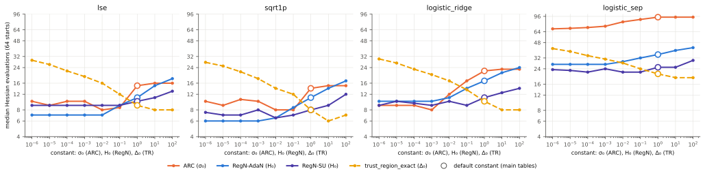
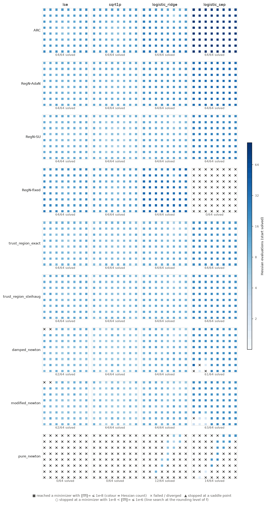
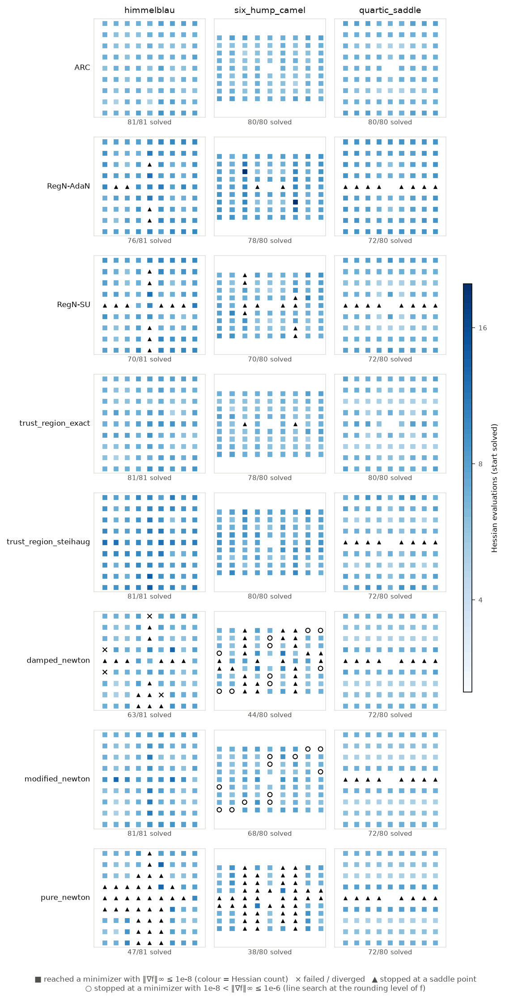
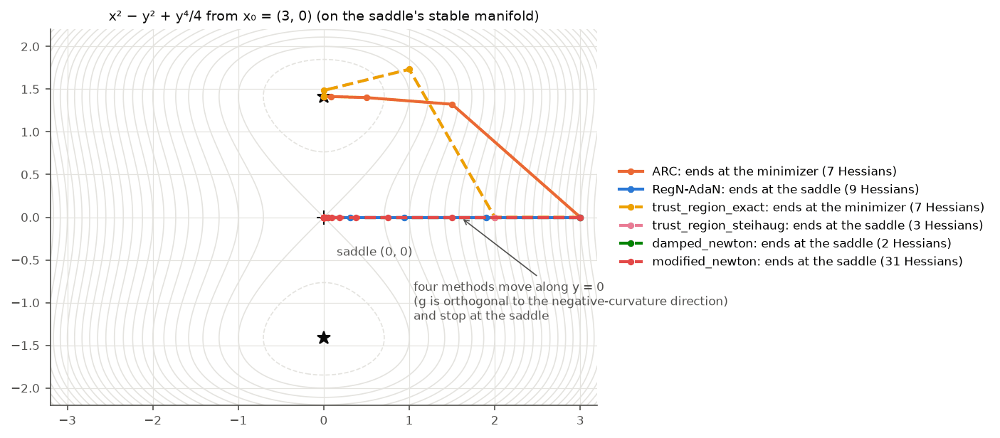
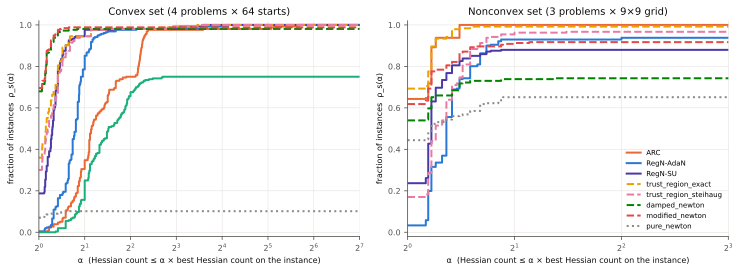
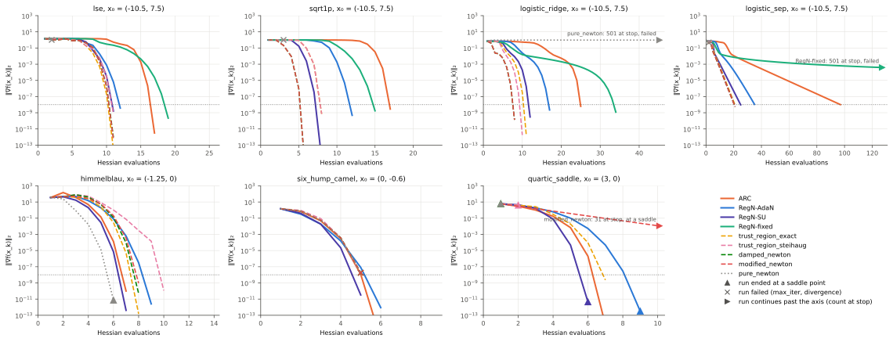

# Globalized Newton without a line search: cubic regularization (ARC) vs gradient-regularized Newton

**Status:** method verified (89 tests, see [Verification](#verification)); experiment deterministic, 2-D only.
The method rankings in the main tables hold **at each method's default constant**; the
[sensitivity sweep](#sensitivity-to-the-constants) shows that several of them change when the constants are tuned.

**Promoted to numopt as `arc` and `reg_newton`** (family `unconstrained`;
`src/numopt/unconstrained/regularized_newton.py`, tests in `tests/test_unconstrained_regularized_newton.py`).
The package code is a port of [`method.py`](method.py) that gives bit-identical results; one change is
that the saddle/maximizer message says "not a minimizer" in lower case, as `numopt.unconstrained.newton` does.

## Question

Newton's method is quadratically convergent near a nondegenerate minimizer and useless far from one:
it diverges on convex functions whose curvature decays, and it is attracted to saddle points. Two
families globalize it without a line search by *regularizing the model*:

1. **Convex case.** On 2-D convex problems where pure Newton fails from most starts of a grid (log-sum-exp,
   $\sqrt{1+\|x\|^2}$, logistic loss on a small separable data set), does **gradient-regularized
   Newton** converge from every start of a grid, with Hessian counts no higher than **ARC**? A
   diverging start or a clearly higher count falsifies the claim.
2. **Nonconvex case.** On Himmelblau, six-hump camel and $x^2 - y^2 + y^4/4$, does ARC escape strict
   saddles from the starts where `damped_newton` and `modified_newton` stall, and does it need fewer
   Hessian evaluations than `trust_region_exact` to reach $\|\nabla f\|_\infty \le 10^{-8}$? The
   $O(\varepsilon^{-3/2})$ advantage of ARC is a worst-case statement, so equal medians on easy
   problems are an expected, reportable outcome.

## Background

**ARC** (Cartis, Gould & Toint 2011a, Algorithm 2.1; Nesterov & Polyak 2006). At $x_k$ the step
minimizes the cubic model (CGT eq. 1.4)

$$
m_k(s) = f_k + g_k^\top s + \tfrac12 s^\top H_k s + \tfrac{\sigma_k}{3}\|s\|^3 .
$$

$s^*$ is a global minimizer iff $(H_k + \lambda I)s^* = -g_k$ with $\lambda = \sigma_k\|s^*\|$ and
$H_k + \lambda I \succeq 0$ (CGT Thm. 3.1). With $H_k = Q\Lambda Q^\top$ and $\gamma = Q^\top g_k$,
$\lambda$ is the root $\lambda > \max(0,-\lambda_1)$ of the secular equation (CGT eq. 6.7)

$$
\phi_1(\lambda) = \frac{1}{\|s(\lambda)\|} - \frac{\sigma_k}{\lambda} = 0,\qquad
s(\lambda) = -Q(\Lambda+\lambda I)^{-1}\gamma ,
$$

or, in the hard case ($\gamma$ vanishes on the eigenspace of $\lambda_1<0$), $\lambda=-\lambda_1$ and
$s^* = s(-\lambda_1) + \alpha u_1$ with $\|s^*\| = -\lambda_1/\sigma_k$ (CGT eq. 6.6). The step is
accepted when $\rho_k = (f_k - f(x_k+s_k))/(f_k - m_k(s_k)) \ge \eta_1$ (eq. 2.4–2.5), and
$\sigma_k$ is updated like an inverse trust radius (eq. 2.6, with the choices of CGT §7):
$\sigma_{k+1} = \max(\min(\sigma_k, \|g_k\|), \varepsilon_M)$ if $\rho_k > \eta_2$, $\sigma_k$ if
$\eta_1 \le \rho_k \le \eta_2$, $2\sigma_k$ otherwise; $\sigma_0 = 1$, $\eta_1 = 0.1$, $\eta_2 = 0.9$.
ARC needs $O(\varepsilon^{-3/2})$ evaluations to reach $\|g\|\le\varepsilon$ (CGT 2011b) and converges
to second-order critical points (CGT 2011a, §5).

**Gradient-regularized Newton** (Mishchenko 2023, Algorithm 1) replaces the cubic subproblem by one
linear solve:

$$
x_{k+1} = x_k - \bigl(\nabla^2 f(x_k) + \lambda_k I\bigr)^{-1}\nabla f(x_k),\qquad
\lambda_k = \sqrt{H\,\|\nabla f(x_k)\|}.
$$

For convex $f$ whose Hessian is $2H$-Lipschitz (Assumption 1) with bounded level sets
(Assumption 2), $f(x_k) - f^* = O(1/k^2)$ (Theorem 1), with local superlinear convergence for strongly
convex $f$ (Theorem 2). Note the constant: Mishchenko's $H$ is **half** the Hessian Lipschitz
constant $L_2$, so the "$\sqrt{L\|g\|}$" of the task statement corresponds to $H = L_2/2$ here.
**AdaN** (Algorithm 2) removes the need to know $H$: $H_k$ starts at $H_{k-1}/4$ and doubles before
each trial until $\|\nabla f(x_+)\| \le 2\lambda r_+$ and $f(x_+) \le f(x_k) - \tfrac23\lambda r_+^2$,
$r_+ = \|x_+ - x_k\|$ (Theorem 3: about two linear solves per iteration). The **super-universal**
method (Doikov, Mishchenko & Nesterov 2024, Algorithm 2) uses $\lambda = 4^j H_k\|\nabla f(x_k)\|^\alpha$,
$\alpha\in[2/3,1]$, accepts when $\langle\nabla f(x_+), x_k - x_+\rangle \ge \|\nabla f(x_+)\|^2/(4\lambda)$,
and sets $H_{k+1} = 4^{j_k}H_k/4$.

Equation and algorithm numbers follow the arXiv versions (Mishchenko: arXiv:2112.02089v3; DMN:
arXiv:2208.05888v1) and the published CGT Part I.

## Method

[`method.py`](method.py) implements two functions in the numopt contract (`fn(problem, *, x0, **params)
-> Result`, full trace with `Step.info` geometry, exact `Counted` evaluation counts, a `PARAMS` dict of
`ParamSpec`s for promotion):

* `arc(problem, *, x0, gtol, max_iter, sigma0, eta1, eta2, gamma)` with the **exact global model
  minimizer** (one `eigh` per iteration, safeguarded Newton on $\phi_1$, the hard case of eq. 6.6).
* `reg_newton(problem, *, x0, gtol, max_iter, variant, H, alpha)`, `variant ∈ {"fixed", "adan",
  "super_universal"}`.

Both stop when $\|\nabla f(x_k)\|_\infty \le$ `gtol`, and report $\lambda_{\min}(\nabla^2 f)$ at the
final point in the message and in `Result.extra["lambda_min"]`. They report `converged=True` only
when $\lambda_{\min}(\nabla^2 f) \ge -\mathrm{tol}$ as well; a stop at a saddle point or a maximizer
gives `converged=False` with a message that says which. This is the convention of the numopt Newton
methods, with their tolerance ($\mathrm{tol} = n\varepsilon|\lambda|_{\max}$ for an analytic
Hessian, $n\varepsilon^{1/3}\max(1,|\lambda|_{\max})$ for a finite-difference one).

Deviations, each marked `# NOTE:` in the code:

* **Rounding allowance.** `arc` computes $\rho_k = (\text{actual}+\delta)/(\text{predicted}+\delta)$
  and `adan` tests $f(x_+) \le f(x_k) - \tfrac23\lambda r_+^2 + \delta$, with
  $\delta = 10^3\varepsilon\max(|f(x_k)|, |f(x_+)|)$ — the same allowance as numopt's trust-region
  code (Conn, Gould & Toint 2000, §17.4.2). Without it a correct step near the minimizer can be
  rejected only because $f$ is evaluated in floating point.
* **Secular equation.** CGT §6.1 factorize $H+\lambda I$ per iteration; we use one eigendecomposition
  and iterate on $t = \lambda$ ($\lambda_1 \ge 0$) or $t = \lambda + \lambda_1$ ($\lambda_1 < 0$), so that
  every denominator $\lambda_j + \lambda$ is a sum of non-negative terms. (A first version iterated on
  $\lambda+\lambda_1$ also for $\lambda_1 > 0$; the Hypothesis test found that it loses
  $\log_{10}(\lambda_1/\lambda) \approx 6$ digits of $\lambda$ when $\|g\|$ is small.) The predicted
  decrease is computed from the identity $f_k - m_k(s^*) = \tfrac12 s^{*\top}(H+\lambda I)s^* + \lambda\|s^*\|^2/6$,
  which has no cancellation.
* **AdaN at $k=0$.** Algorithm 2 initializes $H_0$ and doubles it before the first trial, so the
  first trial uses $2H_0$; we follow the text literally.
* **Second-order stopping test.** An earlier version followed the numopt trust-region methods,
  which use the gradient test alone and so return `converged=True` at a saddle point. A consumer
  that reads only `Result.converged` (the web portal, for example) then shows the saddle stops of
  `reg_newton` as successes. The study classifies every run independently, so no number depended
  on the flag; [`results/converged_flag.json`](results/converged_flag.json) now checks the flag
  against that classification for every method (see [the flag audit](#the-converged-flag)).
* `fixed` and `super_universal` do not need $f$; it is evaluated (and counted) for the trace only.
  On nonconvex $f$, $\nabla^2 f + \lambda I$ can be indefinite; the step is taken as written
  (`info["pd"] = False`).

Two study problems that are not in the numopt library live in [`problems.py`](problems.py):
`lse` ($\log\sum_{i=1}^3 e^{a_i^\top x - b_i}$, three rows with $0$ inside their convex hull),
`sqrt1p` ($\sqrt{1+\|x\|^2}$; pure Newton maps $r \mapsto -r^3$), `logistic_ridge` and `logistic_sep`
(mean logistic loss on 8 separable points with $\mu = 10^{-3}$ and $\mu = 0$), and `quartic_saddle`
($x^2 - y^2 + y^4/4$: a strict saddle at $0$, minima $(0,\pm\sqrt2)$).
`logistic_sep` follows the task statement literally, but **it has no minimizer** (inf $f = 0$ is not
attained), so Assumption 2 of Mishchenko fails there; it is kept as a stress case, and
`logistic_ridge` is the variant that satisfies the assumptions.

## Setup

* **Starts.** Convex: an $8\times8$ grid on $[-10.5, 10.5]^2$ (spacing 3; no start is a minimizer),
  64 starts per problem, 256 in all. Not every start is far from $x^*$: the nearest start is 1.78
  (lse), 2.12 (sqrt1p) and 0.137 (logistic_ridge, the start $(4.5, 7.5)$ against
  $x^* = (4.537, 7.632)$) from the minimizer, and 4, 4 and 3 starts lie within distance 3; the median
  distance is 9.7, 9.7 and 12.4 ([`results/start_distances.json`](results/start_distances.json)).
  These starts are kept, so the grid is the same for every method. Nonconvex: a $9\times9$ grid on each problem's plotting domain,
  minus the starts that are already stationary: 81 (Himmelblau), 80 (six-hump camel), 80 (quartic).
* **Methods.** `ARC` ($\sigma_0=1$, $\eta_1=0.1$, $\eta_2=0.9$, $\gamma=2$: CGT §7), `RegN-AdaN`
  ($H_0=1$), `RegN-SU` (super-universal, $H_0=1$, $\alpha=1$), `RegN-fixed` (convex only,
  $H = \hat L_2/2$ per problem, below), and the numopt baselines `trust_region_exact`,
  `trust_region_steihaug`, `damped_newton`, `modified_newton`, `pure_newton` at their **default
  parameters** (radius$_0=1$, max radius 100, Armijo backtracking, ...). Every method gets
  `gtol = 1e-8` ($\|\nabla f\|_\infty$) and the same budget `max_iter = 500`. None of the methods was
  tuned. A sweep (below) runs ARC ($\sigma_0$), RegN-AdaN and RegN-SU ($H_0$) and
  `trust_region_exact` (radius$_0$) on all 256 convex starts for each value in
  $\{10^{-6}, 10^{-5}, \dots, 10, 100\}$ (radius$_0 > 100$ is clamped to the maximum radius 100).
* **$\hat L_2$** for `RegN-fixed`: the maximum over a $61\times61$ grid on $[-12,12]^2$ and 36
  directions $u$ of $\|(\nabla^2 f(x+hu)-\nabla^2 f(x-hu))/2h\|_2$: 1.2207 (lse), 0.8477 (sqrt1p),
  0.1782 (both logistic problems). A grid value is a lower bound of the true $L_2$ (for `sqrt1p` the
  radial third derivative gives $\sup_r 3r/(1+r^2)^{5/2} = 0.8587$), so Assumption 1 is not certified.
* **Outcome of a run** (from the final $x$, with the exact $\nabla f$, $\nabla^2 f$, not counted):
  *min* if $\|\nabla f\|_\infty \le 10^{-8}$ and $\lambda_{\min}(\nabla^2 f) \ge -10^{-8}\max(1,\|\nabla^2 f\|)$
  (on `logistic_sep`, only the gradient test); *saddle* if the gradient test passes with a negative
  eigenvalue; *fail* otherwise. A fail that stopped at a minimizer with
  $10^{-8} < \|\nabla f\|_\infty \le 10^{-6}$ is flagged *near-min*.
* **Cost** = Hessian evaluations at the stop (`Result.n_hev`; one at $x_0$ plus one per accepted
  iterate for every method). Paired comparisons use the starts that both methods solve; the p-value
  is a two-sided sign test on the non-tied pairs. Performance profiles (Dolan & Moré 2002) are
  computed with `numopt.bench.performance_profile_from_costs` on the Hessian count (∞ unless *min*).
  Moré–Wild data profiles are not shown: they count simplex gradients (f evaluations), which is not
  the cost under study.

## Results

### Q1 — convex problems

Starts reaching a minimizer, and median [IQR] Hessian evaluations on those starts
([`results/summary.json`](results/summary.json)):

| method | lse | sqrt1p | logistic_ridge | logistic_sep |
|---|---|---|---|---|
| ARC | 64/64; 15 [13, 17] | 64/64; 14 [11.75, 16] | 64/64; 22 [16, 26.25] | 64/64; 94 [87.75, 98] |
| RegN-AdaN | 64/64; 11 [11, 12] | 64/64; 11 [10, 11] | 64/64; 17 [16, 18] | 64/64; 35 [35, 35] |
| RegN-SU | 64/64; 10 [9, 11] | 64/64; 8 [6.75, 9] | 64/64; 11 [9, 12] | 64/64; 25 [23, 26] |
| RegN-fixed | 64/64; 17.5 [15, 20] | 64/64; 13.5 [11.75, 14] | 64/64; 36 [30, 38] | 0/64 (all stop at max_iter) |
| trust_region_exact | 64/64; 9 [9, 11] | 64/64; 8 [8, 10] | 64/64; 10 [9, 11] | 64/64; 21 [19.75, 22] |
| trust_region_steihaug | 64/64; 11 [9, 12] | 64/64; 8 [8, 10] | 64/64; 10 [8, 11] | 64/64; 21 [19, 22] |
| damped_newton | 62/64; 8 [7, 10] | 64/64; 6 [6, 7] | 64/64; 10 [8, 11] | 61/64; 20 [19, 21] |
| modified_newton | 62/64; 8 [7, 10] | 64/64; 6 [6, 7] | 64/64; 10 [8, 11] | 63/64; 20 [18, 21] |
| pure_newton | 0/64 | 0/64 | 12/64; 7.5 [7, 8.5] | 14/64; 18 [16.25, 18] |

Paired Hessian counts, RegN-AdaN vs ARC ([`results/q1_convex_paired.json`](results/q1_convex_paired.json)):

| problem | AdaN fewer | tie | AdaN more | median AdaN − ARC | sign test p |
|---|---|---|---|---|---|
| lse | 54 | 5 | 5 | −3.5 | 1.9×10⁻¹¹ |
| sqrt1p | 52 | 8 | 4 | −3 | 1.1×10⁻¹¹ |
| logistic_ridge | 46 | 3 | 15 | −5 | 8.8×10⁻⁵ |
| logistic_sep | 64 | 0 | 0 | −59 | 1.1×10⁻¹⁹ |

RegN-SU uses fewer Hessians than ARC on 58, 60, 64 and 64 of the 64 starts (one start more, on lse).

Paired Hessian counts against `trust_region_exact` (default constants; fewer / tie / more, median
difference, sign test p):

| problem | RegN-AdaN vs TR-exact | RegN-SU vs TR-exact |
|---|---|---|
| lse | 0 / 6 / 58; +2; 6.9×10⁻¹⁸ | 12 / 16 / 36; +1; 7.2×10⁻⁴ |
| sqrt1p | 0 / 8 / 56; +1.5; 2.8×10⁻¹⁷ | **36** / 24 / 4; −1; 1.9×10⁻⁷ |
| logistic_ridge | 0 / 0 / 64; +7; 1.1×10⁻¹⁹ | 6 / 19 / 39; +1; 5.4×10⁻⁷ |
| logistic_sep | 0 / 0 / 64; +14; 1.1×10⁻¹⁹ | 0 / 0 / 64; +4; 1.1×10⁻¹⁹ |

RegN-AdaN is never cheaper than `trust_region_exact` (0 of 256 starts). RegN-SU is cheaper on 54
of 256 starts, and on `sqrt1p` it is cheaper on most starts (36 fewer, 4 more).

The Hessian count hides the gradients that the adaptive searches pay at every rejected trial.
Paired **gradient** counts against ARC (ARC uses one gradient per Hessian):

| problem | RegN-AdaN vs ARC | RegN-SU vs ARC | medians AdaN / SU / ARC |
|---|---|---|---|
| lse | 54 / 5 / 5; −3; 1.9×10⁻¹¹ | 6 / 6 / **52**; **+3**; 3.2×10⁻¹⁰ | 12 / 18 / 15 |
| sqrt1p | 52 / 8 / 4; −2.5; 1.1×10⁻¹¹ | 48 / 12 / 4; −2; 1.3×10⁻¹⁰ | 11 / 11.5 / 14 |
| logistic_ridge | 46 / 3 / 15; −5; 8.8×10⁻⁵ | 54 / 8 / 2; −4; 4.4×10⁻¹⁴ | 17 / 18 / 22 |
| logistic_sep | 64 / 0 / 0; −59; 1.1×10⁻¹⁹ | 64 / 0 / 0; −48; 1.1×10⁻¹⁹ | 35 / 46 / 94 |

On `lse`, RegN-SU uses fewer Hessians than ARC on 58 starts but **more gradients** on 52: with
gradients as the cost, ARC is the cheaper of the two there.

### Sensitivity to the constants

Median Hessian count on the 64 starts of each convex problem, for each constant
([`results/sensitivity.json`](results/sensitivity.json); every run reaches the minimizer, 64/64, at
every value). Cells are lse · sqrt1p · logistic_ridge · logistic_sep; the default is in bold.

| value | ARC σ₀ | RegN-AdaN H₀ | RegN-SU H₀ | TR-exact radius₀ |
|---|---|---|---|---|
| 10⁻⁶ | 10 · 10 · 9 · 69 | 7 · 6 · 10 · 27 | 9 · 7.5 · 9 · 23.5 | 29 · 27.5 · 30 · 41 |
| 10⁻⁵ | 9 · 9 · 9 · 70 | 7 · 6 · 10 · 27 | 9 · 7 · 10 · 23 | 26 · 25 · 27 · 38 |
| 10⁻⁴ | 10 · 10.5 · 9 · 71.5 | 7 · 6 · 10 · 27 | 9 · 7 · 9.5 · 22 | 22 · 21.5 · 23 · 34 |
| 10⁻³ | 10 · 10 · 8 · 74 | 7 · 6 · 10 · 27 | 9 · 8 · 9 · 24 | 19 · 18 · 20 · 31 |
| 10⁻² | 8 · 8 · 12 · 83 | 7 · 6.5 · 11 · 29 | 9 · 6.5 · 10 · 22 | 16 · 14 · 17 · 28 |
| 0.1 | 8.5 · 8 · 17 · 88.5 | 9 · 8.5 · 14 · 32 | 9 · 7 · 9 · 22 | 12 · 12 · 13.5 · 24 |
| 1 | **15 · 14 · 22 · 94** | **11 · 11 · 17 · 35** | **10 · 8 · 11 · 25** | **9 · 8 · 10 · 21** |
| 10 | 16 · 15 · 23 · 94 | 15 · 14 · 21 · 39 | 11 · 9 · 12.5 · 25 | 8 · 6 · 8 · 19 |
| 100 | 16 · 15 · 23 · 94 | 18 · 17 · 24 · 42 | 13 · 12 · 14 · 30 | 8 · 7 · 8 · 19 |



No default is the best value of its method. ARC and AdaN want a much smaller constant (σ₀,
H₀ ≤ 0.01), SU a slightly smaller one (H₀ = 0.01–0.1), and the trust-region method a larger initial
radius (radius₀ = 10). Below
$H_0 \approx 10^{-2}$ the Hessian count of AdaN stops falling while its gradient count grows (lse:
10 gradients at $H_0 = 10^{-2}$, 23 at $10^{-6}$), because the doubling search starts lower.

With **each method at its best constant for the problem** (the smallest median Hessian count, ties
broken by the median gradient count), the medians and the paired comparisons are:

| problem | best medians (Hessians) | AdaN vs ARC | AdaN vs TR-exact | SU vs TR-exact | ARC vs TR-exact |
|---|---|---|---|---|---|
| lse | AdaN 7, ARC 8, TR 8, SU 9 | 39 / 18 / 7; p = 1.8×10⁻⁶ | 31 / 15 / 18; p = 0.085 | 13 / 16 / 35; p = 0.0021 | 9 / 22 / 33; p = 2.7×10⁻⁴ |
| sqrt1p | TR 6, AdaN 6, SU 6.5, ARC 8 | 52 / 12 / 0; p = 4.4×10⁻¹⁶ | 24 / 36 / 4; p = 1.8×10⁻⁴ | 20 / 20 / 24; p = 0.65 | 8 / 12 / 44; p = 4.0×10⁻⁷ |
| logistic_ridge | ARC 8, TR 8, SU 9, AdaN 10 | 15 / 9 / 40; p = 0.0010 | 6 / 9 / 49; p = 1.8×10⁻⁹ | 6 / 14 / 44; p = 3.2×10⁻⁸ | 19 / 20 / 25; p = 0.45 |
| logistic_sep | TR 19, SU 22, AdaN 27, ARC 69 | 54 / 1 / 9; p = 6.1×10⁻⁹ | 0 / 0 / 64; p = 1.1×10⁻¹⁹ | 0 / 3 / 61; p = 8.7×10⁻¹⁹ | 3 / 0 / 61; p = 4.7×10⁻¹⁵ |

(Best constants: ARC σ₀ = 0.01, 0.01, 0.001, 10⁻⁶; AdaN H₀ = 0.01, 0.001, 0.001, 0.001; SU H₀ = 0.1,
0.01, 0.1, 0.1; TR radius₀ = 10 on all four. Cells are A fewer / tie / A more.) Tuned, the order
changes: AdaN is cheaper than `trust_region_exact` on `sqrt1p` (24 fewer, 4 more) and no longer
more expensive on `lse` (31 fewer, 18 more, p = 0.085), and ARC is cheaper than AdaN on
`logistic_ridge` (40 fewer, 15 more). The best value is chosen on the same starts on which it is scored, so these
are optimistic numbers for every method alike.



### Q2 — nonconvex problems

| method | himmelblau | six_hump_camel | quartic_saddle |
|---|---|---|---|
| ARC | 81/81; 7 [6, 7] | 80/80; 7 [6, 7] | 80/80; 7 [7, 7] |
| RegN-AdaN | 76/81; 8 [8, 9]; 5 saddle | 78/80; 8 [7, 9]; 2 saddle | 72/80; 8 [8, 9]; 8 saddle |
| RegN-SU | 70/81; 8 [7, 9]; 11 saddle | 70/80; 7 [7, 8]; 10 saddle | 72/80; 7 [6, 8]; 8 saddle |
| trust_region_exact | 81/81; 7 [7, 8] | 78/80; 7 [6, 7]; 2 saddle | 80/80; 7 [5, 7] |
| trust_region_steihaug | 81/81; 9 [8, 10] | 80/80; 8 [7, 8] | 72/80; 7 [6, 7]; 8 saddle |
| damped_newton | 63/81; 7 [7, 8]; 14 saddle, 4 fail | 44/80; 7 [6, 7]; 26 saddle, 10 fail (10 near-min) | 72/80; 6.5 [5.75, 7]; 8 saddle |
| modified_newton | 81/81; 7 [7, 8] | 68/80; 7 [6, 7]; 12 fail (12 near-min) | 72/80; 6.5 [5.75, 7]; 8 saddle |
| pure_newton | 47/81; 7 [7, 8]; 34 saddle | 38/80; 7 [7, 8]; 42 saddle | 72/80; 6.5 [5.75, 7.25]; 8 saddle |

**Saddle escape** ([`results/q2_nonconvex.json`](results/q2_nonconvex.json)). `damped_newton` stops at
a saddle point from 14 (Himmelblau), 26 (six-hump) and 8 (quartic) starts; ARC reaches a minimizer
from all 48 of them, as does `trust_region_exact`; `trust_region_steihaug` from 40 (not the 8 quartic
starts); RegN-AdaN from 33 (9, 24, 0). `modified_newton` stops at a saddle only on the quartic, from
the 8 starts on the line $y = 0$ — the only starts where *both* line-search methods stall at a
saddle — and ARC and `trust_region_exact` reach $(0,\pm\sqrt2)$ from all 8, while
`trust_region_steihaug`, RegN-AdaN, RegN-SU and pure Newton stop at the saddle. On these starts
$\nabla f$ is orthogonal to the negative-curvature direction $e_2$, so every step built from Krylov
vectors of $g$, or from $(H+\lambda I)^{-1}g$, stays on $y = 0$; ARC's first step is the hard case of
CGT eq. 6.6 (from $(2,0)$: $s = (-1, \sqrt3)$, checked by hand in the tests).
The 12 six-hump "failures" of `modified_newton` (and 10 of `damped_newton`) are **not** saddle stalls:
they stop at a local minimizer with $\|\nabla f\| \approx 1.6\cdot10^{-8}$ because the Armijo search
cannot resolve a predicted decrease ($3.3\cdot10^{-17}$ in the case inspected) below the rounding
level of $f$ ($4.7\cdot10^{-16}$).

**Hessian counts, ARC vs `trust_region_exact`** (starts both solve):

| problem | both solve | ARC fewer | tie | ARC more | medians ARC / TR | sign test p |
|---|---|---|---|---|---|---|
| himmelblau | 81 | 27 | 45 | 9 | 7 / 7 | 0.0039 |
| six_hump_camel | 78 | 10 | 56 | 12 | 7 / 7 | 0.83 |
| quartic_saddle | 80 | 6 | 38 | 36 | 7 / 7 | 2.8×10⁻⁶ |





### The `converged` flag

[`results/converged_flag.json`](results/converged_flag.json) compares `Result.converged` with the
independent outcome of every run. ARC, RegN-AdaN and RegN-SU (497 runs each) and RegN-fixed (256)
agree with it on every run (no `converged=True` at a saddle or a failure, no `converged=False` at a
minimizer); RegN-AdaN and
RegN-SU now return `converged=False` at their 15 and 29 nonconvex saddle stops. The numopt
baselines `damped_newton`, `modified_newton` and `pure_newton` also agree. `trust_region_exact` (2
runs) and `trust_region_steihaug` (8 runs) return `converged=True` at a saddle, because their
stopping test is first-order only. That is outside this study's folder; a consumer that reads only
`converged` should show `extra["lambda_min"]` (or a classification) next to it for those two methods.

### Profiles and convergence

Performance profiles on the Hessian count ([`results/profiles.json`](results/profiles.json)). Fraction
of instances on which a method is (one of) the cheapest, $\rho_s(1)$, and the fraction solved:

| | ARC | AdaN | SU | fixed | TR-exact | Steihaug | damped | modified | pure |
|---|---|---|---|---|---|---|---|---|---|
| convex (256): $\rho(1)$ | 0.004 | 0.004 | 0.188 | 0 | 0.359 | 0.301 | 0.680 | 0.695 | 0.070 |
| convex: solved | 1.000 | 1.000 | 1.000 | 0.750 | 1.000 | 1.000 | 0.980 | 0.988 | 0.102 |
| nonconvex (241): $\rho(1)$ | 0.643 | 0.033 | 0.237 | — | 0.693 | 0.170 | 0.539 | 0.618 | 0.444 |
| nonconvex: solved | 1.000 | 0.938 | 0.880 | — | 0.992 | 0.967 | 0.743 | 0.917 | 0.651 |





## Discussion

**Q1 is not falsified, with qualifications.** RegN-AdaN and RegN-SU reach the minimizer from all 256
convex starts, including every start of `lse` and `sqrt1p`, where pure Newton fails (its first one
or two steps either trigger numopt's divergence test $\|x_k\|_\infty > 10^8\max(1,\|x_0\|_\infty)$ —
18 and 48 starts — or land where $\nabla^2 f$ is numerically singular — 46 and 16 starts; on
`logistic_ridge` it does not converge within `max_iter` from 52 starts), and with
the default constants they use fewer Hessians than ARC on 216 (AdaN) and 246 (SU) of 256 starts. The
claim "no higher than ARC" does not hold start by start: AdaN uses more Hessians on 24 starts (15 of
them on `logistic_ridge`). With gradients as the cost, SU is *more* expensive than ARC on `lse` (52
of 64 starts). The comparison is also a comparison of constants: tuned on the same grid, ARC
reaches a median of 8 on `lse`, `sqrt1p` and `logistic_ridge`, and on `logistic_ridge` it is then
cheaper than the best AdaN (40 fewer, 15 more); only on `logistic_sep` do both regularized-Newton
variants beat ARC at every constant tried (best medians 22 and 27 against 69). The **fixed-H**
variant, the one with the clean $O(1/k^2)$ theorem, is the slowest method on `lse` (median 17.5) and
`logistic_ridge` (36), is faster than ARC on `sqrt1p` (13.5 against 14; 32 starts fewer, 12 more,
p = 0.0037), and fails on `logistic_sep`: there $f$ has no minimizer, $\nabla^2 f$ and $\nabla f$ decay together, and
$\lambda = \sqrt{H\|g\|} \gg \lambda_{\min}(\nabla^2 f)$ turns the step into a short gradient step
(from $(-10.5, 7.5)$ the run is still at $\|g\| \approx 2.9\cdot10^{-5}$ after 500 iterations). The adaptive variants avoid
this by shrinking $H_k$.

**Where both lose — at the default constants.** With every method at its default constant, the
cheapest methods by Hessian count on these smooth 2-D convex problems are the classical ones:
line-search Newton (`damped`/`modified`, median 6–20) when it converges, and the trust-region
methods (`trust_region_exact` 8–21), which converge from every start. At the defaults RegN-AdaN
uses more Hessians than `trust_region_exact` on every start where they differ (0 fewer of 256);
RegN-SU does not: it is cheaper on 54 of 256 starts, and on most starts of `sqrt1p` (36 fewer, 4
more). This ranking is a statement about the defaults only. Tuned, `trust_region_exact` (radius₀ =
10) still has the lowest median, alone or tied, on `sqrt1p`, `logistic_ridge` and `logistic_sep`, but the best
AdaN is cheaper on `sqrt1p` (24 fewer, 4 more) and has the lowest median on `lse` (7 against 8), and
the best ARC ties `trust_region_exact` on `logistic_ridge` (p = 0.45). ARC is worst on `logistic_sep`
(median 94): with the CGT §7 update the very successful steps set $\sigma_{k+1} = \min(\sigma_k, \|g_k\|)$,
so $\sigma \approx 1.2\|g\|$ along the run, and where $\nabla^2 f \approx 0$ the step length is
$\approx\sqrt{\|g\|/\sigma} \approx 0.83$ (96 accepted steps, no rejection), while the trust-region
method takes interior Newton steps of length 4.6. This is a consequence of the $\sigma$ rule, not of
cubic regularization as such.

**Q2: ARC escapes the saddles; it is not cheaper than the exact trust-region method.** ARC reaches a
minimizer from all 241 nonconvex starts, including every start where `damped_newton` (48) or
`modified_newton` (8) stops at a saddle. `trust_region_exact` does the same except on 2 six-hump
starts, where its first-order stopping test is met at a saddle. The escape comes from using the
*global* minimizer of a model with the exact Hessian (the hard case), which `trust_region_exact`
shares; Steihaug–CG and the regularized Newton steps do not escape from the stable manifold $y=0$.
On Hessian counts the medians are equal (7 vs 7) on all three problems; ARC is slightly cheaper on
Himmelblau (27 fewer, 9 more), no different on six-hump (p = 0.83) and slightly more expensive on the
quartic (6 fewer, 36 more). That is the expected outcome on easy 2-D problems: the
$O(\varepsilon^{-3/2})$ bound of ARC is a worst-case statement and says nothing about these medians.

**Threats to validity.**
* All problems are 2-D and smooth; the grids are dense in a few basins, so starts are not independent
  samples and the sign-test p-values overstate the evidence.
* The main cost counts Hessians only. AdaN's rejected trials cost an extra $f$ and $\nabla f$ each, and
  SU uses about 1.4–1.8 gradients per Hessian (median 18 gradients for 10 Hessians on lse), which
  reverses the SU–ARC comparison on `lse` when gradients are counted (see the gradient table); ARC and the
  trust-region methods also pay an eigendecomposition per iteration, which is free at $n = 2$ and is
  not free at scale.
* The main tables use each method's default constant, and no default is the best value of its
  method. The sweep shows that the ranking of ARC, AdaN, SU and `trust_region_exact` changes with
  the constants; the tuned comparison picks each constant on the same 64 starts on which it is
  scored, so it is optimistic for every method. The sweep does not tune the other constants
  ($\eta_1, \eta_2, \gamma$ of ARC, $\alpha$ of SU, `max_radius` and $\eta$ of the trust-region
  method).
* The grid includes starts close to $x^*$ (one at distance 0.137 on `logistic_ridge`); they are few
  (3–4 per problem within distance 3) and the same for every method.
* $\hat L_2$ is a grid lower bound, so `RegN-fixed` is not guaranteed to satisfy Assumption 1.
* The rounding allowance $\delta$ in ARC's ratio is our addition (it matches the trust-region
  baselines); the line-search baselines do not have one, which causes their *near-min* failures.
* The baselines are numopt implementations written concurrently with this study; their defaults
  (e.g. `damped_newton`'s 50 Armijo trials) shape their failure counts.
* `logistic_sep` violates the assumptions of every convergence theorem cited here.

## Verification

`test_method.py` (89 tests, ~20–40 s):

* the cubic subproblem against an independent multistart-BFGS minimization of $m(s)$ (40 random
  instances, $n = 2$ to 5, including indefinite $H$), a closed form ($H = 0$: $\lambda = \sqrt{\sigma\|g\|}$),
  the hand-computed hard case, and a Hypothesis test (1000 examples; $\sigma \in [10^{-6},10^6]$,
  $\|g\| \in [10^{-8},10^8]$, forced hard cases) of the optimality conditions of CGT Thm. 3.1 and the
  Cauchy condition (2.2);
* ARC: the hand-computed first step on the quartic, convergence on Rosenbrock, Himmelblau and Beale,
  agreement with SciPy `trust-exact` (`atol=1e-7`), the acceptance and $\sigma$ rules along every
  trace, exact evaluation counts against independent counters, failure paths;
* gradient-regularized Newton: a hand-computed first step, convergence of all three variants, and a
  Hypothesis test (1000 examples) of monotone decrease (Mishchenko Lemma 3) and of the AdaN and DMN
  acceptance tests on random convex quadratics;
* the second-order stopping test: `converged=False` with "NOT a minimizer" at the saddle of the
  quartic (ARC from the saddle itself; all three `reg_newton` variants from $(3, 0)$) and at the
  maximizer of $-\|x\|^2$; `converged=True` at the singular minimizer of $x^4 + y^2$ and, with
  finite-difference derivatives, of $(x+y)^2$;
* the study problems' gradients and Hessians against central differences.

## Reproduce

```bash
.venv/bin/python -m pytest research/regularized-newton-arc -q
.venv/bin/python research/regularized-newton-arc/run.py   # ~40–80 s; writes results/ and figures/
```

## References

* Y. Nesterov, B. T. Polyak, Cubic regularization of Newton method and its global performance,
  *Math. Program.* 108 (2006) 177–205. https://doi.org/10.1007/s10107-006-0706-8
* C. Cartis, N. I. M. Gould, Ph. L. Toint, Adaptive cubic regularisation methods for unconstrained
  optimization. Part I, *Math. Program.* 127 (2011) 245–295. https://doi.org/10.1007/s10107-009-0286-5
* C. Cartis, N. I. M. Gould, Ph. L. Toint, ... Part II: worst-case function- and derivative-evaluation
  complexity, *Math. Program.* 130 (2011) 295–319. https://doi.org/10.1007/s10107-009-0337-y
* K. Mishchenko, Regularized Newton method with global $O(1/k^2)$ convergence, *SIAM J. Optim.* 33(3)
  (2023) 1440–1462. https://doi.org/10.1137/22M1488752 (arXiv:2112.02089v3)
* N. Doikov, K. Mishchenko, Y. Nesterov, Super-universal regularized Newton method, *SIAM J. Optim.*
  34(1) (2024) 27–56. https://doi.org/10.1137/22M1519444 (arXiv:2208.05888v1)
* A. R. Conn, N. I. M. Gould, Ph. L. Toint, *Trust-Region Methods*, SIAM, 2000 (§17.4.2).
* E. D. Dolan, J. J. Moré, Benchmarking optimization software with performance profiles,
  *Math. Program.* 91 (2002) 201–213.
