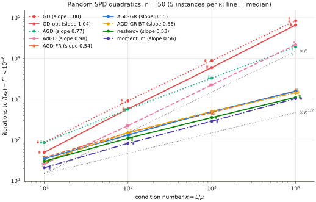
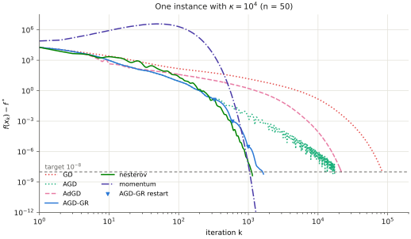
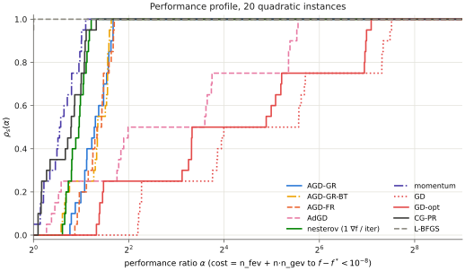
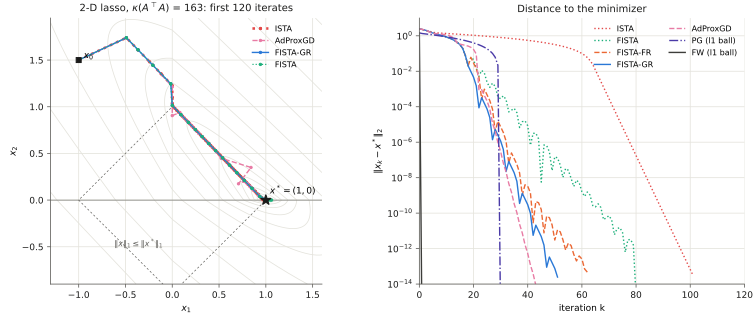
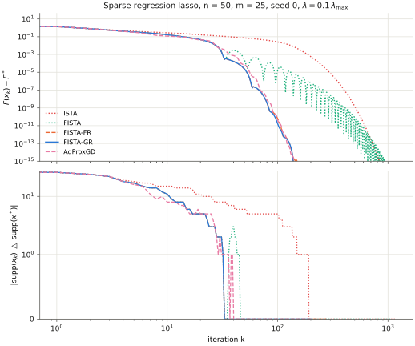
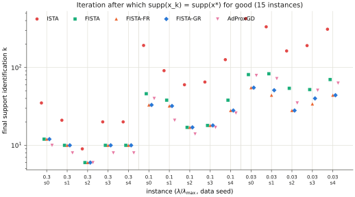

# Accelerated gradient with adaptive restart: AGD, FISTA and the lasso

Promoted to numopt as `fista` (`src/numopt/unconstrained/accelerated.py`, tests in
`tests/test_unconstrained_accelerated.py`), for smooth problems only (g ≡ 0, family
`unconstrained`). The package method uses ∇f($y_k$) directly in the stopping test and in the
gradient restart test, and it stops with `converged=False` when $x_k$ = $x_{k-1}$ = $y_{k+1}$ in floating
point. The proximal problems (`CompositeProblem`, `make_lasso`), `ista` and `adaptive_proxgd` are
not promoted.

## Question

numopt's `nesterov` uses a constant momentum μ that must be tuned with the condition number
κ = L/μ, and its registry note says that the O(1/k²) schedule is not implemented. This study
adds that schedule (FISTA/AGD) and the two adaptive restart tests of O'Donoghue and Candès, and
asks two questions.

1. On random SPD quadratics with κ ∈ {10, 10², 10³, 10⁴}, do the iterations to reach
   f − f⋆ < 10⁻⁸ grow like $\kappa^{1/2}$ for gradient-restart AGD, which takes no μ, and like κ¹ for
   gradient descent? Is the constant within 2× of numopt's `nesterov` when `nesterov` is given
   the true κ?
2. On the lasso, does FISTA's non-monotone ripple delay identification of the correct support
   relative to ISTA, and does restart remove that delay?

**Short answers.** (1) Yes. The fitted exponents are 0.549 ± 0.007 for gradient-restart AGD and
0.997 ± 0.006 for gradient descent. Restarted AGD needs at most 1.51× the iterations of the tuned
`nesterov`, with a median of 1.26×. (2) Not relative to ISTA: FISTA identifies the support before
ISTA on 15 of 15 instances. The ripple does delay FISTA's *own* final identification: on 8 of 15
instances the support is found and then lost again, for up to 39 iterations. Restart removes the
lag on 7 of the 8 affected instances and shortens it from 14 to 8 iterations on the remaining one
(FISTA-GR is lag-free on 14 of 15).

## Background

We minimize F(x) = f(x) + g(x), where f is convex with an L-Lipschitz gradient and g is convex
with a cheap proximal map. Define

$$
\begin{aligned}
p_L(y) &= \operatorname{prox}_{g/L}\!\big(y - \tfrac1L\nabla f(y)\big), \\
\operatorname{prox}_{sg}(v) &= \arg\min_u\, g(u) + \tfrac{1}{2s}\|u-v\|^2 .
\end{aligned}
$$

**ISTA** (Beck and Teboulle 2009, eq. 3.1) is the iteration $x_k = p_L(x_{k-1})$, with
$F(x_k) - F^\star \le L\|x_0 - x^\star\|^2/(2k)$ (Theorem 3.1). With g ≡ 0 this is gradient
descent with step 1/L.

**FISTA** (Beck and Teboulle 2009, eqs. 4.1–4.3) starts from $y_1 = x_0$, $t_1 = 1$:

$$
\begin{aligned}
x_k &= p_L(y_k), \\
t_{k+1} &= \frac{1 + \sqrt{1 + 4t_k^2}}{2}, \\
y_{k+1} &= x_k + \frac{t_k - 1}{t_{k+1}}\,(x_k - x_{k-1}),
\end{aligned}
$$

with $F(x_k) - F^\star \le 2L\|x_0 - x^\star\|^2/(k+1)^2$ (Theorem 4.4). With g ≡ 0 this is
Nesterov's accelerated gradient (AGD); O'Donoghue and Candès write it with $\theta_k = 1/t_k$
(their Algorithm 1 with q = 0). On a μ-strongly convex f the schedule does not give the linear
rate $(1 - \sqrt{\mu/L})^k$. The momentum grows past the critical value, and the iterates
oscillate with a period of about √κ iterations.

**Adaptive restart** (O'Donoghue and Candès 2015, §3.2) resets the momentum when one of two
cheap tests fires after $x_k$ is computed:

$$
\begin{aligned}
\text{function scheme:}\ \ & F(x_k) > F(x_{k-1}), \\
\text{gradient scheme:}\ \ & (y_k - x_k)^\top (x_k - x_{k-1}) > 0 .
\end{aligned}
$$

The gradient test is eq. (12) of the paper: $y_k - x_k = G(y_k)/L$ is the generalized gradient.
A restart takes $x_k$ as a new starting point ($y_{k+1} = x_k$, $t_{k+1} = 1$): this is the reset
of the paper's Algorithm 3 (fixed restarting), applied when a §3.2 test fires.
The paper's analysis (§4.5) gives a restart about every $\tfrac{\pi+3}{2}\sqrt{\kappa}$
iterations on a quadratic. This recovers the $O(\sqrt{\kappa}\log(1/\epsilon))$ complexity
without knowledge of μ.

**AdProxGD** (Malitsky and Mishchenko 2024, Algorithm 3) is a proximal gradient method with no
momentum. Its step size comes from observed gradient differences, so it needs no L:

$$
\begin{aligned}
\alpha_k &= \min\Big\{\sqrt{\tfrac23 + \theta_{k-1}}\;\alpha_{k-1},\;
\frac{\alpha_{k-1}}{\sqrt{[\,2\alpha_{k-1}^2 L_k^2 - 1\,]_+}}\Big\}, \\
L_k &= \frac{\|\nabla f(x_k) - \nabla f(x_{k-1})\|}{\|x_k - x_{k-1}\|}, \\
x_{k+1} &= \operatorname{prox}_{\alpha_k g}\big(x_k - \alpha_k \nabla f(x_k)\big),
\end{aligned}
$$

with $\theta_k = \alpha_k/\alpha_{k-1}$ and $\theta_0 = 1/3$.

References:

- A. Beck, M. Teboulle. A fast iterative shrinkage-thresholding algorithm for linear inverse
  problems. *SIAM J. Imaging Sciences* 2(1), 183–202, 2009.
  [doi:10.1137/080716542](https://doi.org/10.1137/080716542)
- B. O'Donoghue, E. Candès. Adaptive restart for accelerated gradient schemes. *Foundations of
  Computational Mathematics* 15, 715–732, 2015.
  [doi:10.1007/s10208-013-9150-3](https://doi.org/10.1007/s10208-013-9150-3)
- Y. Malitsky, K. Mishchenko. Adaptive proximal gradient method for convex optimization.
  *NeurIPS* 2024.
  [proceedings](https://proceedings.neurips.cc/paper_files/paper/2024/hash/b676cbd80be73a4a7af178f12035a801-Abstract.html)

## Method

`method.py` implements three methods with the numopt contract
(`fn(problem, *, x0=None, **params) -> Result`, a full trace, `Step.info` geometry, exact
counts, and the `PARAMS` ParamSpec lists for promotion):

| function | algorithm | parameters |
|---|---|---|
| `fista` | FISTA / AGD, constant step or Beck–Teboulle backtracking, `restart ∈ {none, function, gradient}` | `restart="gradient"`, `lr` (= 1/L, or 1/L₀ with backtracking), `backtracking=True`, `eta=2`, `gtol`, `max_iter` |
| `ista` | proximal gradient (eq. 3.1 / 3.3) | the same, without `restart` |
| `adaptive_proxgd` | Malitsky–Mishchenko Algorithm 3 | `lr` (= α₀), `gtol`, `max_iter` |

A `CompositeProblem` is a numopt `Problem` with two more fields, `g` and `prox(v, s)`.
`make_lasso(A, b, λ)` builds $\tfrac12\|Ax-b\|^2 + \lambda\|x\|_1$, with soft-thresholding as
the prox. A plain `Problem` is treated as g ≡ 0. All three methods stop when the
gradient-mapping norm at the point where the gradient was taken is at most `gtol`. For g ≡ 0
this norm is ‖∇f‖. Each iteration costs one ∇f and one f, so the restart tests are free.

Deviations from the papers. Each one is marked `# NOTE:` in the code.

- **Restart reset.** A restart resets to $y_{k+1} = x_k$, $t_{k+1} = 1$. This is the reset of
  O'Donoghue–Candès Algorithm 3 (fixed restarting: "set x⁰ = xᵏ, y⁰ = xᵏ, θ₀ = 1"), applied
  when a §3.2 test fires, so two momentum-free steps follow.
  The task text's "$t_k$ = 1" would give one momentum-free step. The difference is one step per
  restart.
- **Backtracking slack.** The backtracking test $F(p) \le Q_L(p, y)$ accepts a violation up to
  10⁻¹²·max(|f(y)|, |f(p)|). The exact test can reject every L near convergence because of
  rounding, and then $L_k$ → ∞.
- **Backtracking start.** Beck–Teboulle backtracking only increases $L_k$, so the method needs
  L₀ ≤ L. A start L₀ > L is never corrected. The accepted $L_k$ = 2ʲL₀ can also lie below L, so
  the results depend on L₀ (see the L₀ sweep in Results).
- **AdProxGD start.** AdProxGD takes α₀ as given. The paper's optional initial line search
  (eq. 16) is not implemented.

### Verification (`test_method.py`, 36 tests, all pass)

- **Exact equivalence.**
  - The first three FISTA iterates equal a hand computation of eqs. 4.1–4.3 (`rtol=1e-13`).
  - The first three AdProxGD iterates and the α₁, θ₂, L₁ values equal a hand computation of
    Algorithm 3.
  - AGD equals an independent θ-form implementation of O'Donoghue–Candès Algorithm 1 (q = 0)
    with §3.2 restarts that apply the reset of Algorithm 3. The test runs 150 iterations at
    κ = 10³, for each restart mode. The iterates agree to
    `assert_allclose(..., rtol=1e-9, atol=1e-11)`, and the restart iterations are identical.
- **Paper guarantees as Hypothesis properties** (1000 examples each, 0 failing, 0 invalid):
  - Theorem 4.4 for FISTA and Theorem 3.1 with monotone F (Remark 3.1) for ISTA, on random
    quadratics with κ up to 10⁴.
  - On random lasso instances, with F⋆ from the certified reference solution:
    - Theorem 4.4 holds, with α = η under backtracking.
    - Each restart flag fires exactly when its test holds, and the next step has β = 0 and
      y = $x_k$.
    - $L_k$ is non-decreasing and $L_k$ ≤ max(L₀, ηL(f)) (Remark 3.2).
  - Soft-thresholding equals the l1 prox computed by a bounded scalar minimizer.
  - The AdProxGD step bounds (eq. 30) hold.
- **Independent minimizers.**
  - For n = 50 lasso problems, `reference.py` solves the split form with SciPy L-BFGS-B, polishes
    on the support with a QR solve, and certifies the KKT conditions with strict
    complementarity.
  - All five method variants reach this x⋆ to `atol=1e-8` and have the exact certified support.
- **Contract and failure paths.**
  - `tests/conftest.py::assert_valid_result` passes on `quadratic_bowl`, `rosenbrock` and the
    lasso.
  - The `max_iter`, divergence (step 3/L), non-finite start and invalid-parameter paths are
    tested.
  - The f and ∇f counts equal those of an external counting wrapper.

## Setup

**Quadratics.** $f(x) = \tfrac12 (x-x^\star)^\top A (x-x^\star)$ with n = 50,
$A = Q\,\mathrm{diag}(\lambda)\,Q^\top$, $\lambda_i = \kappa^{i/(n-1)}$ (so $\lambda_{\min}$ = 1 and
$\lambda_{\max}$ = κ exactly), and Q Haar-random. x⋆ and x₀ are standard normal. There are 5 instances per
κ, so 20 in total, all drawn from `numopt.core.rng.Rng` with fixed seeds. The target is
f($x_k$) − f⋆ < 10⁻⁸ with f⋆ = 0. Every method gets `max_iter = 400 000` and a gradient
tolerance that guarantees the target before the method stops: 0.999·√(2·10⁻⁸) for 2-norm tests,
and the same divided by √n for the ∞-norm tests of CG-PR and L-BFGS. We report the first
iteration that meets the target. The cost is `n_fev` + n·`n_gev` at the first f evaluation below the
target (the Moré–Wild cost model of `numopt.bench`).

**Gradient count of `nesterov`.** numopt's `nesterov` evaluates ∇f at the look-ahead point
$y_{k-1}$ and also at $x_k$, and it uses ∇f($x_k$) only for its stopping test. K iterations therefore
count 2K − 1 gradients (`run.py` asserts this on every run). The method itself (Sutskever et al.
eq. 3–4) needs one gradient per iteration, the same as AGD, which tests convergence at $y_k$. We
charge `nesterov` K gradients in every cost and ratio below. The raw count is kept in
`results/quadratic_runs.json` (`ngev_at_target`), and we give its effect where it matters.

| label | method | parameters (L = κ, μ = 1 known) |
|---|---|---|
| AGD-GR | `fista`, gradient restart | lr = 1/L, constant step |
| AGD-FR | `fista`, function restart | lr = 1/L |
| AGD | `fista`, no restart | lr = 1/L |
| AGD-GR-BT | `fista`, gradient restart, backtracking | L₀ = 1, η = 2 (**no μ; needs L₀ ≤ L**, sweep below) |
| AdGD | `adaptive_proxgd` (g ≡ 0) | α₀ = 1/L |
| nesterov | numopt `nesterov` | lr = 1/L, β = (√κ − 1)/(√κ + 1) (**true κ**) |
| momentum | numopt `momentum` (heavy ball) | lr = 4/(√L + √μ)², β = ((√κ − 1)/(√κ + 1))² (**true κ**) |
| GD | numopt `gradient_descent` | fixed step lr = 1/L (the ISTA/FISTA step) |
| GD-opt | numopt `gradient_descent` | fixed step lr = 2/(L + μ), optimal for a quadratic (**true κ**) |
| CG-PR | numopt `cg_polak_ribiere` | defaults (strong Wolfe, c₂ = 0.1) |
| L-BFGS | numopt `lbfgs` | defaults (m = 10, strong Wolfe) |

**Lasso.**

- *2-D:* A = [[1, 0.95], [0, 0.15]], b = (1.2, −0.3), λ = 0.2 and x₀ = (−1, 1.5). This gives
  κ(AᵀA) = 163, L = 1.913, x⋆ = (1, 0), F⋆ = 0.265 and a KKT margin of 0.055.
- *n = 50:* m = 25 Gaussian rows scaled by 1/√m, a 5-sparse $x_{\text{true}}$ with entries
  ±(1 + |N(0, 1)|), noise 0.05·N(0, 1), and λ = r·$\lambda_{\max}$ for r ∈ {0.3, 0.1, 0.03}. There are
  5 data seeds, so 15 instances in total, with x₀ = 0. The support sizes |S⋆| are 3 to 17. The
  smallest KKT margin is 2.4·10⁻³ and the smallest |x*_i| is 4.6·10⁻³.
- *Prox methods:* ISTA, FISTA, FISTA-FR, FISTA-GR (constant step 1/L) and AdProxGD (α₀ = 1/L).
  Each runs to a gradient-mapping norm of 10⁻¹¹ or 20 000 iterations, and all 15 runs of each
  converged.
- *Baselines on the equivalent l1-ball problem:* $\min \tfrac12\|Ax-b\|^2$ s.t.
  $\|x\|_1 \le \|x^\star\|_1$, which has the same minimizer. In 2-D this is the 4-facet
  polyhedron. For n = 50 we use the lifted form x = u − v with u, v ≥ 0 and 1ᵀ(u + v) ≤ r,
  because the l1 ball in ℝ⁵⁰ has 2⁵⁰ facets. `frank_wolfe` (open-loop step, 3000 iterations)
  runs on every instance. `projected_gradient` (default Armijo along the projection arc)
  runs on one instance only, because each trial solves a 100-variable QP.

**Support identification.** supp(x) = {i : $x_i$ ≠ 0}, with exact zeros (the prox produces them).
For each run:

- *first* is the first k with supp($x_k$) = S⋆.
- *final* is the k after which the support never changes again.
- *lag* = final − first.

## Results

### 1. Quadratics: iterations to f − f⋆ < 10⁻⁸ (median of 5 instances)

| method | κ = 10 | 10² | 10³ | 10⁴ | slope of log(iters) vs log κ (± s.e., 20 points) | slope of iters/log(f(x₀)/ε) | ∇f evaluations, κ = 10⁴ |
|---|---:|---:|---:|---:|---:|---:|---:|
| AGD-GR | 35 | 133 | 500 | 1570 | 0.549 ± 0.007 | 0.517 ± 0.007 | 1570 |
| AGD-FR | 37 | 152 | 469 | 1606 | 0.536 ± 0.010 | 0.504 ± 0.009 | 1606 |
| AGD-GR-BT | 30 | 152 | 503 | 1446 | 0.556 ± 0.016 | 0.524 ± 0.016 | 1446 |
| AGD (no restart) | 87 | 570 | 3297 | 19226 | 0.769 ± 0.010 | 0.737 ± 0.010 | 19226 |
| AdGD | 26 | 225 | 2257 | 21646 | 0.984 ± 0.008 | 0.952 ± 0.009 | 21646 |
| nesterov (true κ) | 30 | 111 | 357 | 1116 | 0.527 ± 0.005 | 0.495 ± 0.005 | 1116 (raw 2231) |
| momentum (true κ) | 21 | 83 | 290 | 1041 | 0.564 ± 0.004 | 0.532 ± 0.004 | 1041 |
| GD (1/L) | 87 | 918 | 8853 | 83959 | 0.997 ± 0.006 | 0.965 ± 0.007 | 83959 |
| GD-opt (2/(L+μ)) | 50 | 580 | 6002 | 65924 | 1.038 ± 0.005 | 1.006 ± 0.004 | 65924 |
| CG-PR | 17 | 56 | 197 | 582 | 0.511 ± 0.011 | 0.479 ± 0.012 | 1112 |
| L-BFGS | 19 | 60 | 176 | 514 | 0.478 ± 0.004 | 0.446 ± 0.003 | 518 |

All 11 methods solved all 20 instances. The median f(x₀) is 122, 1.0·10³, 7.3·10³ and
4.8·10⁴ for κ = 10, 10², 10³ and 10⁴. A resampling of the 5 instances within each κ (2000
bootstrap samples) gives a 95 % interval of [0.538, 0.560] for the AGD-GR slope.

Per-instance ratios against `nesterov` with the true κ:

- **AGD-GR:** iterations median 1.26×, max 1.51×. The per-κ maxima are 1.31, 1.48, 1.51 and
  1.43. With one ∇f per `nesterov` iteration, the ∇f ratios are the same. With numopt's raw
  count (2K − 1) the median would be 0.63×, but that number measures the extra stopping-test
  gradient, not the algorithm.
- **AGD-FR:** iterations median 1.31×, max 1.72×.
- **AGD-GR-BT** (L₀ = 1, no μ): iterations median 1.29×, max 1.68×. These two numbers depend on
  L₀ (next table).

AGD-GR restarts a median of 3–4 times per run, at every κ.

**AGD-GR-BT and the start value L₀** (`results/quadratic_bt_sweep.json`; median iterations of
5 instances, and the median final $L_k$/L):

| L₀ | κ = 10 | 10² | 10³ | 10⁴ | final $L_k$/L (κ = 10 / 10² / 10³ / 10⁴) | ratio to `nesterov`, median / max |
|---|---:|---:|---:|---:|---|---:|
| 10⁻⁴ | 39 | 140 | 451 | 1822 | 1.31 / 1.05 / 0.84 / 1.34 | 1.33 / 1.67 |
| 10⁻² | 35 | 119 | 522 | 1608 | 1.02 / 0.82 / 1.31 / 1.05 | 1.32 / 1.75 |
| 1 (main table) | 30 | 152 | 503 | 1446 | 0.80 / 1.28 / 1.02 / 0.82 | 1.29 / 1.68 |
| √2 | 37 | 131 | 537 | 1691 | 1.13 / 0.91 / 1.45 / 1.16 | 1.39 / 1.83 |
| 10² | 145 ¹ | 133 | 434 | 1780 | 10 ¹ / 1.00 / 0.80 / 1.28 | 1.46 / 5.03 ¹ |
| 3L ¹ | 69 | 286 | 785 | 2741 | 3 / 3 / 3 / 3 | 2.35 / 3.02 |

¹ L₀ > L. Backtracking never decreases $L_k$, so the step stays 1/L₀ < 1/L.

With η = 2 the accepted $L_k$ is 2ʲL₀, and the test accepts values below L (down to 0.8 L here).
The iteration count follows where 2ʲL₀ lands relative to L: AGD-GR-BT with L₀ = 1 beats
AGD-GR (constant step 1/L) at κ = 10 and 10⁴ because $L_k$ = 0.8 L there, so its steps are about
1.2× longer. Over the 95 runs with L₀ ≤ L, the final $L_k$/L lies in [0.80, 1.64], and the ratio
to `nesterov` has a median of 1.32× and a max of 1.83×. So the "within 2×" result holds for
every L₀ ≤ L that we tried, but the exact constants of the AGD-GR-BT row are a property of
L₀ = 1, not of the method. A variant that may also decrease $L_k$ (for example Scheinberg,
Goldfarb and Bai 2014) would remove the L₀ > L failure; we did not implement it.



*Figure 1. The dots are instances and the lines connect the medians. The dotted gray lines are
the slopes $\kappa^{1/2}$ and κ¹.*



*Figure 2. One instance with κ = 10⁴. The triangles mark AGD-GR restarts. Plain AGD oscillates
with a slowly decaying envelope. AGD-FR is almost the same as AGD-GR and is not drawn.*



*Figure 3. Dolan–Moré profile of the cost `n_fev` + n·`n_gev`, computed with
`numopt.bench.performance_profile_from_costs`. `nesterov` is charged one ∇f per iteration
(see Setup).*

At α = 1, L-BFGS is cheapest on 0.95 of the instances and momentum on 0.05. At α = 2 the
fractions are:

| method | ρ(2) |
|---|---:|
| L-BFGS | 1.0 |
| momentum | 0.85 |
| CG-PR | 0.7 |
| nesterov (true κ) | 0.65 |
| AGD-GR-BT | 0.25 |
| AdGD | 0.25 |
| AGD-GR | 0.2 |
| AGD-FR | 0.2 |
| GD | 0.0 |
| GD-opt | 0.0 |

With numopt's raw gradient count, `nesterov` would have ρ(2) = 0.0 and rank last. That result
comes from the extra stopping-test gradient, not from the algorithm. The other rows do not
change (`profile_raw_nesterov_rho_at_2` in `results/quadratic_summary.json`).

### 2. Lasso

**2-D** (`results/lasso2d.json`):

| method | k: ‖$x_k$ − x⋆‖ < 10⁻⁶ | k: F − F⋆ < 10⁻⁸ | final support k |
|---|---:|---:|---:|
| ISTA | 78 | 71 | 64 |
| FISTA | 41 | 33 | 18 |
| FISTA-FR | 33 | 27 | 18 |
| FISTA-GR | 31 | 22 | 18 |
| AdProxGD | 29 | 26 | 22 |
| PG (l1 ball) | 30 | – | – (no exact zero) |
| FW (l1 ball) | 1 | – | 1 |



*Figure 4. Left: the iterates. All methods follow the same path until x₂ becomes exactly 0. After
that the problem is 1-D, and FISTA's ripple is an overshoot along x₁ only. Right: the distance
to x⋆.*

**n = 50, 15 instances** (`results/lasso50_summary.json`):

| method | identified | median first k | median final k | instances with lag > 0 | max lag | max support changes after first | median k: F − F⋆ < 10⁻⁸ | median restarts |
|---|---:|---:|---:|---:|---:|---:|---:|---:|
| ISTA | 15/15 | 91 | 91 | 0 | 0 | 0 | 220 | – |
| FISTA | 15/15 | 24 | 38 | 8 | 39 | 9 | 106 | – |
| FISTA-FR | 15/15 | 24 | 28 | 1 | 8 | 2 | 55 | 21 |
| FISTA-GR | 15/15 | 24 | 28 | 1 | 8 | 2 | 52 | 7 |
| AdProxGD | 15/15 | 21 | 21 | 1 | 3 | 2 | 40 | – |

Median final identification k, by λ/λ_max:

| method | 0.3 | 0.1 | 0.03 |
|---|---:|---:|---:|
| ISTA | 20 | 91 | 310 |
| FISTA | 10 | 38 | 70 |
| FISTA-FR / FISTA-GR | 10 | 28 | 44 |
| AdProxGD | 8 | 21 | 63 |

Final identification relative to the other method, per instance:

| comparison | median ratio | instances where the first method is later |
|---|---:|---:|
| FISTA vs ISTA | 0.30 | 0 of 15 |
| FISTA-GR vs FISTA | 0.84 | 0 of 15 |

The final ‖x − x⋆‖ of every prox run is at most 1.7·10⁻¹⁰.

Baselines on the l1-ball problem:

- **Frank–Wolfe** (3000 iterations): the support is identified on 4 of 15 instances. The final
  ‖x − x⋆‖ has a median of 4.7·10⁻³ (range 6.4·10⁻⁴ to 1.7·10⁻²), with a median of 11 nonzeros.
- **Projected gradient** (seed 0, λ = 0.1λ_max): it stopped after 148 iterations with
  "stalled at the rounding level" and ‖x − x⋆‖ = 1.55·10⁻⁷. All 50 coordinates of u − v are
  nonzero, and the run took 19.6 s.



*Figure 5. Seed 0, λ = 0.1λ_max. FISTA finds the support at k = 33. The ripple then adds up to 3
wrong coordinates again until k = 46. With restart the support is found at k = 33 and is kept.
FISTA-FR is identical to FISTA-GR on this plot.*



*Figure 6. The final identification k for the 15 instances, grouped by λ/λ_max.*

## Discussion

**Question 1.**

- **Scaling.** Gradient-restart AGD scales like √κ with no μ input (slope 0.549 ± 0.007), and
  so do the function scheme (0.536) and the variant with backtracking that needs no μ and only
  a start L₀ ≤ L (0.556; 0.547 to 0.558 over the four values of L₀ ≤ L in every κ). Gradient
  descent and AdGD scale like κ (0.997 and 0.984; GD with the optimal step 2/(L + μ), 1.038).
  Plain AGD without restart lies in between (0.769) and is 12× slower than AGD-GR at κ = 10⁴.
- **Constant.** The constant is within 2× of the tuned `nesterov` on every instance (max 1.51×
  in iterations), as O'Donoghue–Candès predict. The cost of the "free" μ is a median of 26 %
  more iterations, and, with one ∇f per `nesterov` iteration, 26 % more gradients. numopt's
  `nesterov` also evaluates ∇f($x_k$) for its stopping test. With that raw count, AGD-GR would
  look *cheaper* (median 0.63×) and `nesterov` would rank last in the profile (ρ(2) = 0.0
  instead of 0.65). Both effects come from the implementation, so we charge one gradient per
  iteration everywhere.
- **Dependence on L₀.** The AGD-GR-BT constants depend on the start L₀ through the power-of-2
  grid 2ʲL₀ (median 1446 to 1822 iterations at κ = 10⁴ over L₀ ≤ L). With L₀ > L the method is
  up to 5× slower than `nesterov`, because backtracking cannot decrease $L_k$.
- **Where restarted AGD loses.** Restarted AGD is not the best method on quadratics.
  - Heavy-ball momentum with the true κ (the optimal method for quadratics) needs fewer
    iterations at every κ.
  - CG-PR and L-BFGS need 2.7× and 3.1× fewer iterations than AGD-GR at κ = 10⁴ (582 and 514
    against 1570). In ∇f evaluations the factors are 1.4× and 3.0× (1112 and 518 against 1570).
  - In the performance profile, L-BFGS is the cheapest method on 0.95 of the instances
    (ρ(1) = 0.95). Every AGD variant has ρ(1) = 0. At α = 2 the tuned `nesterov` (0.65) is also
    ahead of every AGD variant (0.2 to 0.25): this is the cost of the unknown μ.
  - The advantage of AGD-GR is that it needs neither κ nor a line search, and that it extends
    directly to a nonsmooth g.
- **Slopes above 0.5.** The exponents of all √κ methods are a little above 0.5 (0.527–0.564).
  The target is absolute while f(x₀) grows with κ (median 122 at κ = 10, 4.8·10⁴ at κ = 10⁴),
  so a linear rate needs ∝ √κ·log(f(x₀)/ε) iterations. When we divide the iterations by
  log(f(x₀)/ε), every slope falls by 0.032: AGD-GR to 0.517 ± 0.007, AGD-FR to 0.504,
  `nesterov` to 0.495, and GD to 0.965. So most of the excess above 0.5 comes from f(x₀). The
  remaining 0.017 for AGD-GR is 2.4 standard errors, and we do not explain it.

**Question 2.**

- **Relative to ISTA: no delay.** FISTA's ripple does *not* delay support identification
  relative to ISTA. FISTA identifies the support earlier on 15/15 instances (median ratio 0.30),
  and the gap grows as λ decreases (median 310 vs 70 at λ = 0.03λ_max).
- **Within FISTA: a delay.** Relative to FISTA's own first identification, the ripple does
  cause a delay. On 8 of 15 instances FISTA finds S⋆, loses it again (up to 9 support changes),
  and settles up to 39 iterations later. The median final identification is at 38 against a
  first identification at 24.
- **Restart removes most of it.** Both restart schemes remove the lag on 7 of the 8 affected
  instances. On the remaining one (seed 1, λ = 0.1λ_max) the lag goes down from 14 to 8
  iterations (final identification 38 → 32). FISTA-GR and FISTA-FR are lag-free on 14 of 15
  instances and add no lag on an instance where FISTA had none. The median final
  identification drops to 28, which is never later than FISTA (0/15). The median iterations to
  F − F⋆ < 10⁻⁸ halve, from 106 to 52.
- **Restart can delay the first identification.** Gradient restart finds S⋆ *later* for the
  first time on 2 instances (seed 1, λ = 0.03λ_max: 44 → 51; seed 3, λ = 0.03λ_max: 35 → 40).
  Its final identification is earlier on both (83 → 51 and 52 → 40). Function restart never
  delays the first identification.
- **2-D.** In 2-D the effect does not appear: the support (one zero coordinate) is found at
  k = 18 for all three FISTA variants, before the momentum is large. After that the problem is
  1-D, and restart only shortens the tail.
- **AdProxGD.** AdProxGD, which has no momentum and no L, identified the support earliest
  (median 21) and reached 10⁻⁸ fastest (median 40 iterations). A probable cause is that its
  step adapts to the local curvature, which is smaller than the global L; we did not measure
  the step sizes to confirm this. At
  λ = 0.03λ_max, which has the largest supports, it identified the support later than restarted
  FISTA (63 vs 44). On quadratics with large κ it is as slow as gradient descent.

**Threats to validity.**

- **Narrow instance families.** The quadratics have one spectrum shape (log-spaced, n = 50).
  Clustered spectra favor CG and L-BFGS even more, and they can change the restart frequency.
  The lasso uses one (m, n) = (25, 50) and Gaussian designs only.
- **Tuning.** The baselines `nesterov`, `momentum` and GD-opt are given the true κ, which favors
  them. GD uses step 1/L (the ISTA/FISTA step); the optimal fixed step 2/(L + μ) makes it 1.3×
  to 1.7× faster but does not change its κ¹ scaling. AGD-GR and AGD-FR are given L. AGD-GR-BT
  is given neither, but it needs L₀ ≤ L, and its constants depend on L₀.
- **The l1-ball baselines.** These problems use the radius ‖x⋆‖₁, which is oracle information.
  In 2-D, x⋆ = (1, 0) is a vertex of that ball, so Frank–Wolfe solves it in one step. In the
  lifted form neither Frank–Wolfe (open-loop step) nor projected gradient produces exact zeros
  of u − v. Their support results are therefore not comparable to the prox methods, and
  projected gradient ran on one instance only.
- **Support identification.** Identification is measured with exact zeros. Instances with a
  small KKT margin (the smallest is 2.4·10⁻³) identify late for every method.
- **Variable runtime.** Wall-clock times depend on the machine load. The run took 75.5 s on a
  20-core machine, and the single projected-gradient run took 19.6 s of that. Earlier runs on a
  loaded machine took up to 142 s.

## Reproduce

```bash
.venv/bin/python -m pytest research/restarted-accelerated-gradient     # 36 tests
.venv/bin/python research/restarted-accelerated-gradient/run.py         # results/*.json, figures/*.svg|png
```

The run is deterministic: all data comes from `numopt.core.rng.Rng` with fixed seeds, and the
methods draw no random numbers (the slope bootstrap also uses `Rng`, seed 777). `run.py` sets the BLAS libraries to one thread, because on a
loaded machine a multithreaded BLAS made the small QP solves about 2500× slower.
